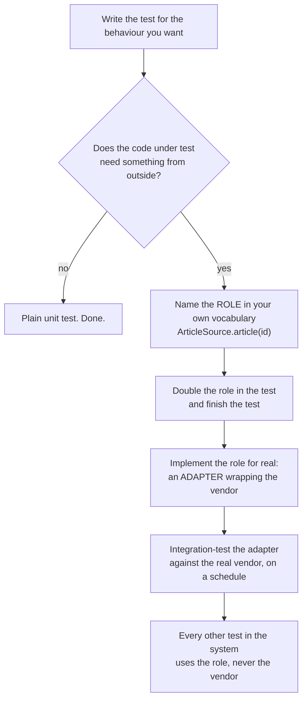

# The paper — Mock roles, not objects

**Mock roles, not objects** · `doi:10.1145/1028664.1028765` · 2004 ·
*Companion to the 19th annual ACM SIGPLAN conference on Object-Oriented Programming, Systems,
Languages, and Applications* · <https://doi.org/10.1145/1028664.1028765>

Record opened on 2026-09-04 via `api.crossref.org`; title and venue copied from it.

## One-line answer

Mock objects were being used as a way to avoid slow collaborators, and this paper argued they are
really a **design** tool: you should double the **role** a collaborator plays in your own design —
an interface you named and can change — and never a concrete class from somebody else's library.

## The story

The hardware shop keeps its orders in a big ring binder, and stapled inside the front of every order
book is a photocopy of the supplier's price list.

It is convenient. Whoever is taking an order can flip to the front, find the part, copy the code and
the price straight onto the form, and hang up. Nobody has to phone anyone. Six people can take orders
at once.

Then the supplier reprints the list. New codes, new page layout, three products discontinued.

Now every order book in the shop is wrong, and nobody knows it. The codes still look like codes. The
prices still look like prices. Orders go out for weeks, in a format the supplier stopped using, and
the first sign of trouble is a delivery that does not match what somebody thought they had ordered.

There was a version of this shop that did not have the problem. It kept **one** sheet on the wall
behind the counter, and the order books referred to *"the item as written on the sheet"*. When the
supplier reprinted, one sheet came down and one went up.

## The idea in plain language

By 2004, **mock objects** were an established testing trick. A mock is a stand-in for a collaborator
— the four kinds are laid out in
[1.4](../parts/01-where-the-line-falls/1.4-four-doubles.md) — and the usual justification was
practical: the real database is slow, the real payment gateway costs money, the real clock cannot be
made to say midnight. Substitute something cheap and the test becomes possible.

This paper's argument is that the practical justification is the least interesting thing about the
technique, and that using it that way produces bad tests. The claim, in three parts:

**Mocking is a design activity, not a testing shortcut.** When you write a test and discover you need
a stand-in for something, you are being asked a design question: *what does the thing under test
actually need from its surroundings?* Answering it produces an interface — a small, named set of
operations expressed in the vocabulary of your own problem. That interface is worth having whether or
not a test ever runs.

**Double the role, not the object.** A *role* is what a collaborator does for you: "a source of
articles", "somewhere to record an audit entry", "a way to ask for approval". A concrete class is
whatever a library happens to ship: `KbClient`, with thirty methods, a connection pool and a naming
scheme somebody else chose. A test that doubles the role is a test written in your language; a test
that doubles the library's class has copied that library's API into your test suite.

**And so: do not mock what you do not own.** This is the rule the paper is most remembered for. If
the type belongs to a third party, you cannot change it, you do not control when it changes, and a
double of it encodes assumptions about somebody else's code that nothing will ever check. The
alternative is an adapter — a thin class you *do* own, implementing your role, wrapping theirs — and
that adapter becomes the single place in the system that knows the vendor's vocabulary.

That last consequence is the price list on the wall instead of a photocopy in every book.

## Why Sutra needs it

Two of this day's parts are this paper, arrived at from opposite directions.

[3.2](../parts/03-testing-tools/3.2-the-fake-tool-context.md) built `FakeToolContext` — a double for
ADK's `Context`, which is a type Sutra emphatically does not own. By this paper's rule that is exactly
the thing you are not supposed to mock, and the part gets away with it for a specific reason worth
naming: the double stands for the **one member the tools use**, `state`, rather than for the class. It
is a role in disguise, and it stays honest only while it stays that small.

[5.2](../parts/05-failure-lab/5.2-the-fake-that-could-not-fail.md) is what happens when it stops being
honest. A plain dictionary standing in for ADK's `State` agrees with the real thing about everything
except the rule that matters, and the test is green about a value production discards. That is
precisely the failure this paper predicts for a double of a type you do not control: your assumption
about somebody else's behaviour, frozen into a test, with nothing to check it against.

And it points at the shape of the fix, which arrives properly in Phase 5. Sutra is about to wrap MCP
servers, third-party skills and provider SDKs — all of them types it does not own. Every one of those
wants the same treatment: a role named in Sutra's vocabulary, an adapter that is the only file naming
the vendor's methods, and one integration test on the adapter.

## The mechanism

The method, written out rather than summarised. It is a loop, and each turn of it produces both a
test and an interface.



Four steps, and the third and fourth are the ones people skip.

**Step one — let the test ask the question.** You are writing `summarise_article`. It needs the text of
an article. Where from? The moment you reach for a stand-in, you have found a collaborator, and the
paper's instruction is to stop and name it rather than to reach for the nearest concrete class.

**Step two — name the role in your vocabulary.** Not `KbClient`. `ArticleSource`, with one method,
`article(article_id) -> str`. The name comes from your problem, not from the vendor's product. The
method list is what your code needs, which is almost always far smaller than what the vendor offers.

**Step three — write an adapter.** A small class implementing your role by calling theirs. It is the
only file in the system that contains the string `fetch_article`. Everything else in the codebase talks
to `ArticleSource`.

**Step four — integration-test the adapter, and only the adapter.** This is the step that makes the
whole arrangement honest, and it is the one that gets left out. The doubles in every other test are
assumptions; the adapter's integration test is the one place those assumptions are checked against
reality. One test, against the real vendor, on a schedule — which is
[5.1](../parts/05-failure-lab/5.1-the-test-that-phoned-the-model.md)'s live lane, now with a purpose
rather than a habit.

The payoff is countable, and the demo below counts it: when the vendor changes, the number of places
that have to change is **one** rather than *however many call sites you have*.

## The paper in one demo

Two files. The only thing they do is turn the paper's claim on and off.

`vendor.py` is a third-party client you do not own. `run.py` holds three features that need an article,
written both ways, and reports what the suite says, what production does, and how many places name a
vendor method.

```text
days/day-23-testing-tools-and-callbacks/lab/papers/mock-roles-not-objects/
├── vendor.py    the library you cannot change; VENDOR=2 renames one method
└── run.py       both wirings, the doubles, and the count. ROLES=1 is the paper's advice
```

```python
# lab/papers/mock-roles-not-objects/vendor.py
import os

V2 = os.environ.get("VENDOR", "1") == "2"

ARTICLE = "Refunds are issued to the original payment method. Escalate after five working days."


class KbClient:
    """The vendor's client. In v1 the method is fetch_article; in v2 it is get_article."""

    ARTICLES = {"KB-104": ARTICLE}

    if V2:

        def get_article(self, article_id: str) -> str:
            return self.ARTICLES[article_id]

    else:

        def fetch_article(self, article_id: str) -> str:
            return self.ARTICLES[article_id]
```

**Line by line:**

- The `if V2:` sits **inside the class body**, so the two versions define different method names on the
  same class. That is a compressed way of simulating a library upgrade without shipping two packages,
  and it is the only trick in the file.
- The rename is the *entire* change. Same behaviour, same return value, same article. The paper's claim
  is about coupling to a **name**, so the experiment changes a name and nothing else.
- `ARTICLE` is defined here rather than in `run.py`, so the doubles in the test import the same text the
  real client returns. A double whose canned answer had drifted from the real one would be a different
  bug ([5.2](../parts/05-failure-lab/5.2-the-fake-that-could-not-fail.md)) confusing this one.

```python
# lab/papers/mock-roles-not-objects/run.py
class ArticleSource:
    """The role: the one thing this codebase needs, named in this codebase's language."""

    def article(self, article_id: str) -> str:
        raise NotImplementedError


class VendorArticleSource(ArticleSource):
    """The adapter. The only place in the system that names a vendor method."""

    def __init__(self, client: KbClient) -> None:
        self.client = client

    def article(self, article_id: str) -> str:
        return self.client.fetch_article(article_id)


class RoleDouble(ArticleSource):
    """Doubles the role. It can only be wrong about an interface this codebase owns."""

    def article(self, article_id: str) -> str:
        return ARTICLE


class ClientDouble:
    """Doubles the vendor. It hard-codes the vendor's v1 method name into the test suite."""

    def fetch_article(self, article_id: str) -> str:
        return ARTICLE


def summarise_r(article_id: str, source: ArticleSource) -> str:
    return source.article(article_id).split(".")[0] + "."


def summarise_c(article_id: str, client: KbClient) -> str:
    return client.fetch_article(article_id).split(".")[0] + "."
```

**Line by line:**

- `ArticleSource` has **one method**, and its name is `article` rather than `fetch_article`. That word
  choice is the paper: the role is named in the language of the problem — a support desk needs *an
  article* — and not in the language of the library.
- `raise NotImplementedError` rather than `pass`. A base method that returns `None` silently is a role
  that can be half-implemented; one that raises fails immediately and names the class that forgot.
- `RoleDouble(ArticleSource)` **subclasses the role**. That is not decoration: it means a change to the
  role — a renamed method, a new required one — is a change the double must follow, and the language
  will say so. `ClientDouble` subclasses nothing, because there is nothing it *could* subclass that
  would keep it honest.
- `VendorArticleSource.article` contains the only `fetch_article` on the ROLES=1 side. Everything else
  in the system talks to `source.article(...)`.
- `summarise_r` takes an `ArticleSource`; `summarise_c` takes a `KbClient`. Same logic, one word
  different, and that word is the whole experiment.
- The counting at the end of the file uses `inspect.getsource` to ask which of the **active** functions
  contain the string `fetch_article`, so the number reported is a fact about the code that ran rather
  than a claim in the prose.

**Run all four arms:**

```bash
cd days/day-23-testing-tools-and-callbacks/lab/papers/mock-roles-not-objects
ROLES=1 VENDOR=1 uv run python run.py
ROLES=1 VENDOR=2 uv run python run.py
ROLES=0 VENDOR=1 uv run python run.py
ROLES=0 VENDOR=2 uv run python run.py
```

**Line by line:**

- `ROLES` is the **ablation switch**: `1` follows the paper, `0` doubles the vendor's class directly.
- `VENDOR` is the world changing underneath you: `2` renames one method in a library you do not own.
- No model, no key, no network. The whole demo is two files of plain Python.

Measured on 2026-09-04:

```text
ROLES=1  VENDOR=1
  unit test    summarise    green 'Refunds are issued to the original payment method.'
  unit test    quote_policy green 'Escalate after five working days.'
  unit test    word_count   green '13'
  production   summarise    green 'Refunds are issued to the original payment method.'
  production   quote_policy green 'Escalate after five working days.'
  production   word_count   green '13'
  suite says 3/3 green; production is 3/3
  places that name a vendor method: 1 -> ['VendorArticleSource.article']

ROLES=1  VENDOR=2
  unit test    summarise    green 'Refunds are issued to the original payment method.'
  unit test    quote_policy green 'Escalate after five working days.'
  unit test    word_count   green '13'
  production   summarise    RED   AttributeError: 'KbClient' object has no attribute 'fetch_article'
  production   quote_policy RED   AttributeError: 'KbClient' object has no attribute 'fetch_article'
  production   word_count   RED   AttributeError: 'KbClient' object has no attribute 'fetch_article'
  suite says 3/3 green; production is 0/3
  places that name a vendor method: 1 -> ['VendorArticleSource.article']

ROLES=0  VENDOR=1
  unit test    summarise    green 'Refunds are issued to the original payment method.'
  unit test    quote_policy green 'Escalate after five working days.'
  unit test    word_count   green '13'
  production   summarise    green 'Refunds are issued to the original payment method.'
  production   quote_policy green 'Escalate after five working days.'
  production   word_count   green '13'
  suite says 3/3 green; production is 3/3
  places that name a vendor method: 4 -> ['summarise_c', 'quote_policy_c', 'word_count_c', 'ClientDouble.fetch_article']

ROLES=0  VENDOR=2
  unit test    summarise    green 'Refunds are issued to the original payment method.'
  unit test    quote_policy green 'Escalate after five working days.'
  unit test    word_count   green '13'
  production   summarise    RED   AttributeError: 'KbClient' object has no attribute 'fetch_article'
  production   quote_policy RED   AttributeError: 'KbClient' object has no attribute 'fetch_article'
  production   word_count   RED   AttributeError: 'KbClient' object has no attribute 'fetch_article'
  suite says 3/3 green; production is 0/3
  places that name a vendor method: 4 -> ['summarise_c', 'quote_policy_c', 'word_count_c', 'ClientDouble.fetch_article']
```

**Read the last line of each block, and then read the third line of each block.**

The count is **1 against 4**. That is the paper's contribution, measured: following the role rule, the
vendor's method name appears once, in the adapter. Ignoring it, the same name appears in every call
site *and* in the test double — four places, growing linearly with the size of the codebase.

And the third line of each block is the paper being honest about its own limits. Under `VENDOR=2`,
**both** arms report `suite says 3/3 green` while production is `0/3`. Mocking the role did **not**
catch the vendor's rename. Nothing in a unit test can, in either style, because a unit test by
definition does not talk to the vendor.

So the demo proves exactly one thing and it is worth stating precisely: **the role rule does not stop
the breakage, it localises it.** One file to fix instead of four, and — more importantly — one file
that an integration test can be pointed at. Step four of the mechanism is not an optional extra; the
demo is what shows why.

## When it breaks

**Where the claim does not hold, part one: the adapter is still untested.** The paper's advice moves
all the risk into one small class, and if nobody integration-tests that class the risk has been
concentrated rather than removed. The four-arm output above is the evidence — a green suite over a
broken system, in both arms. A team that adopts "mock roles, not objects" and stops there has built a
tidier version of the same problem.

**Part two: the rule assumes you can define the role.** It comes from a world of Java interfaces and
statically-typed collaborators. In Python nothing enforces that `RoleDouble` really implements
`ArticleSource`; subclassing helps, and `abc.ABC` with `@abstractmethod` helps more, but
`FakeToolContext` in [3.2](../parts/03-testing-tools/3.2-the-fake-tool-context.md) subclasses nothing
at all and works fine. The discipline has to be supplied by the writer, which means it decays exactly
where it is most needed.

**Part three: an adapter per vendor type is real work**, and it is not always worth it. A library you
call in one place, whose API is stable, and which you would replace by editing one line — wrapping that
in a role is ceremony. The paper's rule is a default, and the honest version of it has a threshold:
wrap it when more than one place calls it, or when the vendor is likely to move.

**Part four, and it is the one that dates the paper:** the world it was written in used mocks with
**expectations declared in advance** — the double itself fails the test if the calls do not match what
was declared. That style couples tests very tightly to the order and number of interactions, and a
large body of experience since has moved towards asserting on outcomes and using recorded fixtures and
contract tests instead. The role rule survived that shift; the expectation-heavy style largely did not.

## In production

**What survived.** Three things from this paper are ordinary practice today and are taught without
anyone mentioning where they came from.

*"Do not mock what you do not own"* is close to universal advice, and it is the reason mature codebases
have a thin `clients/` or `adapters/` layer wrapping every third-party SDK. The pattern outlived the
testing argument that produced it: teams keep the adapter because it makes the vendor swappable, and
testability is now the second reason given rather than the first.

*Interface discovery driven by tests* survived and grew. The idea that the difficulty of writing a test
is information about your design — rather than a problem with testing — is now a standard way of
teaching design, and dependency injection everywhere is its visible residue. ADK handing your tool a
`tool_context` parameter is that idea shipped as a framework default.

*Roles named in the domain's vocabulary* survived, and is the half people still get wrong. It is easy
to write an adapter whose interface is the vendor's interface with a different class name, which
localises nothing and adds a file.

**What did not survive.** The expectation-based mock — declare the calls you expect, let the double
fail the test — has largely lost to two alternatives. **Recorded fixtures** capture one real exchange
and replay it, which is what Sutra has been doing since Day 21 and what makes today's suite run offline.
And **contract tests** run the same assertions against the double and the real implementation, which is
the answer [5.2](../parts/05-failure-lab/5.2-the-fake-that-could-not-fail.md) arrives at independently.
Both are less brittle than declaring an expected call sequence, and both address the risk the paper
identified without the coupling it accepted.

The word itself also drifted. *Mock* in 2004 meant something specific; in 2026 it means "any test
double", and the precision the paper was arguing for has been lost in the vocabulary. Which is why
[1.4](../parts/01-where-the-line-falls/1.4-four-doubles.md) uses four words instead of one.

## Check yourself

```bash
cd days/day-23-testing-tools-and-callbacks/lab/papers/mock-roles-not-objects
ROLES=1 VENDOR=2 uv run python run.py
ROLES=0 VENDOR=2 uv run python run.py
```

Compare the last line of each. Then add a fourth feature that needs an article, and run both arms again:
watch one number stay at 1 and the other go to 5.

**Out loud:** *what did this paper actually claim, and what do we do differently now?* The claim is
that a test double should stand for a role you own, never a class you do not — and what we do
differently is that we no longer declare expected call sequences on the double. We record a real
exchange as a fixture, and we run the same assertions against the double and the real thing on a
schedule, because the paper's own advice leaves the adapter as the one untested piece and something
has to test it.

**Next:** back to [the hub](../LESSON.md) for §11 and the commit.
