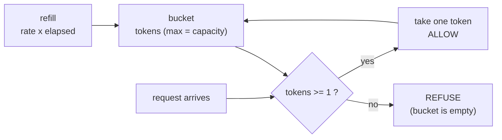

# The paper — New directions in communications, and the leaky bucket

**New directions in communications (or which way to the information age?)** ·
`doi:10.1109/MCOM.1986.1092946` · 1986 · *IEEE Communications Magazine*, volume 24, issue 10,
pages 8–15 · <https://doi.org/10.1109/MCOM.1986.1092946>

Record opened on 2026-09-04 via `api.crossref.org`; title, venue, volume, issue, pages and year
copied from it.

## One-line answer

Buried in a broad 1986 article about what the coming broadband network should look like is a small
mechanism for policing how fast a sender may send — a bucket that fills at a fixed rate and refuses
anything it cannot pay for — and that mechanism, not the network architecture around it, is what every
API rate limiter in use today descends from.

## The story

The sweet shop during the festival has no queue, it has a crowd.

Everyone is pressed up against the counter with a hand out and a note in it. The two men behind it
serve whoever is loudest and nearest, which is not whoever arrived first. A woman who has been there
twenty minutes is now further from the front than when she started, because people keep arriving at the
sides.

Nobody is behaving badly on purpose. There is simply no mechanism. The counter has a rate — two men,
so many boxes a minute — and the crowd has no rate at all, and where those two meet there is a crush.

The shop that solved it did not hire more staff or build a longer counter. It put a small machine by
the door that gives out numbered slips, and it gives them out at the speed the counter can actually
serve. You take a slip, you stand aside, and you are served when your number comes up. The crush is
gone and the counter is doing exactly as much work as before.

## The idea in plain language

By the mid-1980s the field had a problem it could see coming. Networks were moving from circuits —
where you got a dedicated line for the duration of a call — to **packets**, where everybody's data is
chopped into small pieces and interleaved on a shared link.

Sharing is far more efficient, and it introduces a failure the circuit world did not have: one sender
who sends too fast fills the buffers in the middle of the network, and **everybody else's traffic is
delayed or dropped**. The sender causing it may not be doing anything unusual — a burst is normal — but
the shared resource has no way to say no to just that sender.

You cannot solve it by making the middle bigger; a fast sender fills a bigger buffer too. You have to
police the **rate at the edge**, where the traffic enters, before it becomes everybody's problem.

The mechanism this paper contributed is the **leaky bucket**, and the picture is exactly what the name
says. Imagine a bucket with a small hole in the bottom. Traffic pours in at whatever rate the sender
produces it, and drains out of the hole at a fixed rate — the rate the network agreed to carry. If the
sender is well behaved, the bucket stays shallow and everything passes through. If the sender bursts,
the bucket fills; if it overflows, the excess is discarded or marked as violating the agreement.

Two properties come out of that picture and they are the reason the idea lasted.

**It bounds the average rate**, because the hole's size is the rate and nothing can leave faster than
the hole allows.

**And it tolerates bursts**, up to the depth of the bucket. A sender that has been quiet has room in
its bucket and can send a short burst without being punished, which matters because real traffic is
bursty and a limiter that refuses all bursts refuses most of reality.

The version everybody actually implements is the mirror image, called the **token bucket**: instead of
traffic accumulating in a bucket that drains, *permits* accumulate in a bucket that fills at a fixed
rate, up to a maximum, and each unit of traffic takes one. The arithmetic is the same and the direction
is more convenient, because "do I have a permit?" is a question you can ask before sending rather than
after. That is the sweet shop's numbered slips.

## Why Sutra needs it

Because [3.1](../parts/03-counting-before-spending/3.1-the-ledger.md) built a rate limiter out of a
list of timestamps, and this paper is the reason that list is not what a real one uses.

Sutra's ledger keeps every request of the last twenty-four hours and counts the ones inside a window
whenever it is asked. That is honest, obviously correct, and it holds a full day of history to answer a
question about the last sixty seconds. A token bucket holds **one number and one timestamp**, answers
the same question in constant time, and — the property that matters more — can be checked and taken in
a single atomic operation, which is what
[3.2](../parts/03-counting-before-spending/3.2-refusing-before-the-call.md)'s check-then-spend race
needs.

It is also where the per-minute ceiling from
[2.1](../parts/02-two-ceilings/2.1-two-ceilings-one-clears.md) comes from in the first place. When a
provider says *"five requests per minute"*, the thing enforcing it on their side is almost certainly a
token bucket, and knowing that tells you something useful: **the limit is probably not a hard count per
clock minute**, it is a refill rate with a burst allowance, which is why bursts sometimes succeed when
a naive reading of the number says they should not.

## The mechanism

The bucket has three numbers and one rule.

| | |
| --- | --- |
| **capacity** | the most permits it can hold — the largest burst allowed |
| **rate** | permits added per second — the long-run average allowed |
| **tokens** | how many permits are in it right now |

The rule, on every arrival: add the permits that have accrued since the last check, capped at capacity;
if there is at least one permit, take it and allow the request; otherwise refuse.



Two design consequences fall out of the diagram, and both are the reason this beat the obvious
alternative.

**There is no window and therefore no boundary.** The bucket does not know what a minute is. It knows a
rate and an amount, and it refills continuously, so there is no moment at which a counter resets and no
edge to exploit.

**The state is O(1) and the check is O(1).** Two numbers — how many permits and when they were last
computed — regardless of how much traffic has passed through. Compare that with a list of every
timestamp in the window, which is what
[3.1](../parts/03-counting-before-spending/3.1-the-ledger.md) built and what a production system
outgrows.

The obvious alternative is a **fixed window**: count arrivals inside each clock minute and reset on the
boundary. It is simpler, it is what almost everyone writes first, and it has a specific flaw that the
demo below measures.

## The paper in one demo

Two files. The only thing they do is turn the paper's idea on and off against traffic designed to find
the fixed window's flaw.

```text
days/day-24-token-accounting-and-budgets/lab/papers/token-bucket/
├── bucket.py    both limiters, configured for the same "five per minute"
└── run.py       ten requests straddling a window boundary, and the worst-minute count
```

```python
# lab/papers/token-bucket/bucket.py
@dataclass
class FixedWindow:
    """The obvious implementation: a counter and a reset. Used everywhere; wrong at the seam."""

    limit: int
    window: float
    count: int = 0
    window_start: float = 0.0

    def allow(self, now: float) -> bool:
        if now - self.window_start >= self.window:
            self.window_start = now - (now % self.window)
            self.count = 0
        if self.count >= self.limit:
            return False
        self.count += 1
        return True


@dataclass
class TokenBucket:
    """The paper's shape: permits accumulate at a fixed rate, up to a maximum burst."""

    capacity: int
    per_second: float
    tokens: float = 0.0
    last: float = 0.0

    def __post_init__(self) -> None:
        self.tokens = float(self.capacity)

    def allow(self, now: float) -> bool:
        self.tokens = min(self.capacity, self.tokens + (now - self.last) * self.per_second)
        self.last = now
        if self.tokens < 1.0:
            return False
        self.tokens -= 1.0
        return True
```

**Line by line:**

- `FixedWindow.window_start = now - (now % self.window)` snaps the window to the clock rather than to
  the first request, which is what "requests per calendar minute" means and is exactly the behaviour
  that creates the boundary. Snapping to the first request instead gives a sliding-ish window with a
  different, subtler flaw.
- `if self.count >= self.limit: return False` **before** incrementing, so the fifth request is allowed
  and the sixth is not. Off-by-one here is the most common bug in a hand-written limiter and is worth
  checking on paper once.
- `TokenBucket.tokens` is a **float**, not an int, because permits accrue continuously. Rounding to
  integers would mean a rate slower than one permit per second could never accumulate anything.
- `self.tokens + (now - self.last) * self.per_second` is the refill, computed **lazily** at read time.
  Nothing runs on a timer; the bucket works out how much it should have gained since it was last
  touched. That is what makes the whole thing O(1) state and no background task.
- `min(self.capacity, ...)` is the cap, and it is the burst allowance. Without it a bucket left idle
  overnight would accumulate enough permits to let through a day's traffic in one second, which is
  precisely the behaviour the paper is preventing.
- `self.last = now` is updated on **every** call, allowed or refused, so a refused request does not
  cause the next one to be credited twice for the same elapsed time.
- `__post_init__` starts the bucket **full**. That is a policy choice rather than an obvious truth: a
  full bucket allows a burst immediately at startup, which is friendly to a client that has just
  restarted and unfriendly to a server that has just restarted and now has every client bursting at
  once. Starting empty is the conservative alternative.
- Both classes expose the same one-method interface, `allow(now) -> bool`, and both take `now` as a
  parameter for the same reason the ledger does
  ([3.3](../parts/03-counting-before-spending/3.3-testing-a-ceiling-that-bites-at-midnight.md)) — the
  demo can create any moment it likes.

```python
# lab/papers/token-bucket/run.py
BUCKET = os.environ.get("BUCKET", "1") == "1"
LIMIT = 5
WINDOW = 60.0

# The classic burst: five just before the boundary, five just after.
ARRIVALS = [58.0, 58.2, 58.4, 58.6, 58.8, 60.2, 60.4, 60.6, 60.8, 61.0]


def worst_minute(times: list[float]) -> tuple[int, float]:
    """The largest number of served requests inside any sixty-second stretch, and when."""
    worst = 0
    at = 0.0
    for start in times:
        inside = sum(1 for t in times if start <= t < start + WINDOW)
        if inside > worst:
            worst, at = inside, start
    return worst, at
```

**Line by line:**

- `ARRIVALS` is the whole experiment. Five requests in the last second of one clock minute and five in
  the first second of the next — a burst of ten inside three seconds, which is what a client
  synchronised to a clock, or simply unlucky, actually produces.
- `TokenBucket(capacity=LIMIT, per_second=LIMIT / WINDOW)` in `main` configures the bucket to the same
  stated limit as the window: five permits, refilling at five per sixty seconds. The two limiters are
  told the same thing and disagree about what it means.
- `worst_minute` measures the property the limit is *supposed* to guarantee — the most requests served
  in any sixty-second stretch — rather than the property the implementation happens to enforce. That
  distinction is the point: a fixed window enforces "five per clock minute" while everyone reads it as
  "five per minute", and those are different sentences.
- It checks every served request as a candidate start, which is O(n²) and completely fine for ten
  requests. A production version would sweep once; here, obviously correct beats fast.
- `start <= t < start + WINDOW` is a half-open interval, so a request exactly `WINDOW` seconds later is
  outside. Being explicit about which end is closed is how boundary bugs get avoided rather than
  discovered.

**Run both arms:**

```bash
cd days/day-24-token-accounting-and-budgets/lab/papers/token-bucket
BUCKET=1 uv run python run.py
BUCKET=0 uv run python run.py
```

**Line by line:**

- `BUCKET` is the ablation switch: `1` is the paper's mechanism, `0` is the fixed-window counter people
  reach for instead. No model, no key, no network — the demo is two files of plain Python.

Measured on 2026-09-04:

```text
  t= 58.0s  served
  t= 58.2s  served
  t= 58.4s  served
  t= 58.6s  served
  t= 58.8s  served
  t= 60.2s  refused
  t= 60.4s  refused
  t= 60.6s  refused
  t= 60.8s  refused
  t= 61.0s  refused

BUCKET=1  limit is 5 per 60s
  served 5 of 10
  busiest 60s stretch starts at t=58.0s and holds 5
  that is within the limit
```

```text
  t= 58.0s  served
  t= 58.2s  served
  t= 58.4s  served
  t= 58.6s  served
  t= 58.8s  served
  t= 60.2s  served
  t= 60.4s  served
  t= 60.6s  served
  t= 60.8s  served
  t= 61.0s  served

BUCKET=0  limit is 5 per 60s
  served 10 of 10
  busiest 60s stretch starts at t=58.0s and holds 10
  that is 2x the limit
```

**The fixed window served all ten and reported no violation.** Every one of its own rules was obeyed:
five in the minute ending at 60, five in the minute starting at 60. And ten requests went through in
**three seconds** against a limit of five per sixty.

That is the boundary problem, and the factor is exactly two: a fixed window of any size can be made to
pass twice its limit by placing a full window's worth on each side of a boundary. It is not a rare
alignment — clients that poll on a schedule, cron jobs, and retry storms all synchronise to clocks — and
it is why a limiter that looks correct in testing lets through double in production.

**The bucket served five and refused five.** Its busiest sixty-second stretch holds exactly five,
because it never had more than five permits and they refill at five per minute rather than arriving all
at once. There is no boundary to straddle because there is no window.

**And that is the whole of the paper's contribution, made switchable.** One flag, ten requests, and the
difference between a limit that is enforced and a limit that is merely stated.

## When it breaks

**The claim is about rate, and says nothing about fairness.** One aggressive sender with its own bucket
is limited; a hundred senders each with their own bucket are collectively unlimited. The bucket is a
per-flow mechanism, and dividing a shared allowance among flows is a different problem — which is
[5.1](../parts/05-in-production/5.1-whose-budget-is-it.md), and which the fair-queueing literature
picked up afterwards rather than this paper solving it.

**It assumes one point of enforcement.** The elegance of O(1) state depends on there being one bucket.
Two servers each with a local bucket enforce twice the limit, which is the same arithmetic as the
noisy-neighbour problem in reverse. Distributed rate limiting therefore needs shared state or
coordination, and the standard answers — a Redis script, a central limiter, or accepting an approximate
limit — all cost something the single-node version did not.

**Capacity is a real decision and the paper cannot make it for you.** A deep bucket is friendly to
bursty clients and permits a longer overload; a shallow one is strict and punishes normal traffic. The
mechanism gives you the dial; choosing the number is an operational judgement about your own traffic,
and the demo above quietly assumes capacity equals the limit, which is one reasonable choice among
several.

**And the analogy to an API is not exact.** The paper is about network cells, which are all the same
size. One API request is not one cell: a request with a fifteen-thousand-token prompt and a
three-token one cost the same *permit* here, which happens to be right on Sutra's per-request free
tier ([1.3](../parts/01-what-a-request-costs/1.3-the-unit-that-gets-rationed.md)) and is wrong on a
per-token tier. The fix is to make a request take **several** permits in proportion to its size —
which the mechanism supports, and which quietly turns the bucket into a token-based cost meter.

**Finally, the honest scope of this citation.** The article is a broad piece about the direction of
communications, and the bucket is one mechanism inside a much larger argument about the network
architecture the field should build. Citing it for the bucket is standard practice and is what it is
remembered for; treating it as a paper *about* rate limiting would overstate what it set out to do.

## In production

**What survived is the mechanism, almost untouched.** The token bucket is in the standard toolkit of
every layer of the stack: API gateways, cloud provider quotas, Envoy and nginx rate limiting, the Linux
kernel's traffic control, client-side SDK throttles. It is one of the small number of ideas from
1980s networking that a web engineer uses without knowing where it came from. When a provider tells you
*"five requests per minute"*, the thing on the other end deciding is almost certainly one of these.

**What survived alongside it is the burst allowance as a product feature.** Cloud rate limits are
routinely stated as a rate *plus* a burst — exactly `per_second` and `capacity` — and that vocabulary
is this mechanism's, made public.

**What did not survive is the article around it.** The 1986 piece is arguing for a particular vision of
a coming broadband network, and the specific architecture debates of that era were settled by the
Internet's own protocols rather than by the designs discussed at the time. The rate-control primitive
outlived the network it was proposed for, which is a common pattern: the mechanism is small, general and
correct, and the architecture is a bet on the future.

**What replaced the fixed window, where anybody bothered**, is the **sliding window counter** — a cheap
approximation that weights the previous window's count by how far into the current one you are. It
costs two integers instead of one and removes most of the boundary problem, and it is what many API
gateways actually run because it is easier to shard than a bucket. So the bucket won the argument and
did not win every deployment.

**And what Sutra will do with it** is the honest smaller version: the list of timestamps in
[3.1](../parts/03-counting-before-spending/3.1-the-ledger.md) is correct and readable at twenty
requests a day, and becomes a bucket the moment either the traffic or the concurrency makes it
necessary. Reaching for the bucket first would have been the right *engineering* and the wrong
*teaching*, because the list makes the two-ceiling distinction visible and the bucket hides it inside
two numbers.

## Check yourself

```bash
cd days/day-24-token-accounting-and-budgets/lab/papers/token-bucket
BUCKET=1 uv run python run.py
BUCKET=0 uv run python run.py
```

Now change `ARRIVALS` so all ten requests land at `t=10.0` through `t=11.0` — well away from any
boundary — and run both arms again. The fixed window now behaves correctly, which is exactly why this
bug survives testing.

**Out loud:** *what did this paper actually claim, and what do we do differently now?* The claim is
that a sender's rate can be policed at the edge with a bucket that fills at a fixed rate and refuses
what it cannot pay for, bounding the average while tolerating a bounded burst. What we do differently
is that we run it in one shared place rather than per link, we often use a sliding-window counter
instead because it shards more easily, and we sometimes charge several permits for one request when
requests are not all the same size — none of which changes the mechanism, only where it sits.

**Next:** back to [the hub](../LESSON.md) for §11 and the commit.
