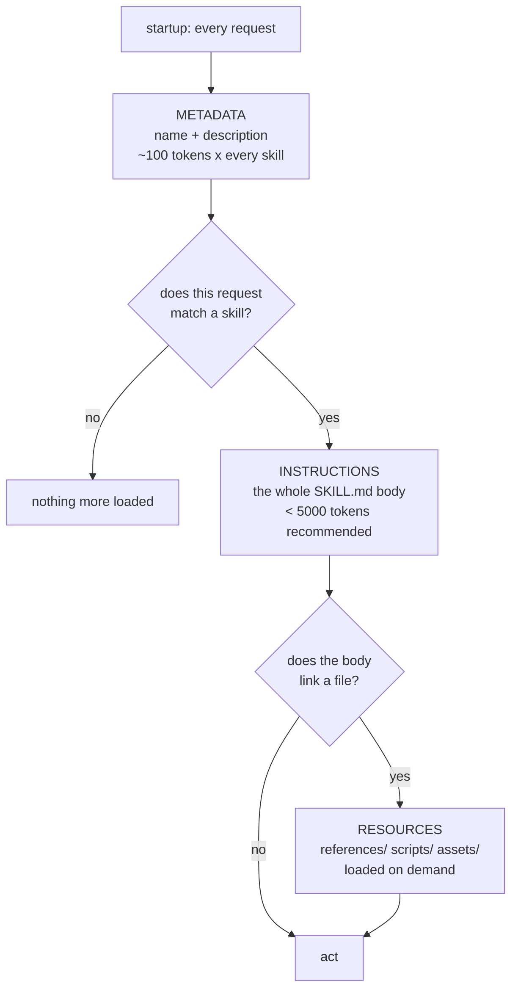

# 3.3 — Progressive disclosure: three levels, three budgets

## One-line answer

A skill enters the model's context in three stages with three budgets — **metadata** (~100 tokens,
always), **instructions** (under ~5,000, on activation) and **resources** (whatever they cost, when a
link is followed) — and `ticket-triage` measured **64** and **292**, a 4.6× ratio that is the whole
economics of the format.

## The story

The museum tells you three different amounts about the same object, and it does it deliberately.

At the entrance to the room there is a board with a sentence on it: *Bronze Age metalwork, 2000–800
BC*. That is all most people ever read, and it is enough to decide whether to walk in.

Beside the object there is a card. A hundred words: what it is, where it was found, what it was for.
You read it if the object interested you, and you read maybe one card in ten.

And on a stand by the door there is a leaflet about the excavation — pages of it, dates, a map,
photographs of the dig. Almost nobody picks it up, and the two people who do are the reason it exists.

Three levels, three lengths, and each one is read by fewer people at greater depth. Put the leaflet's
contents on the room's board and nobody would enter the room.

## The idea in plain language

**Progressive disclosure** is the design principle that you show the smallest useful amount first and
let more be requested. The skill format is built on it, and the specification states the three levels
with a token budget for each — fetched from `agentskills.io/specification` on 2026-09-04:

> **Metadata** (~100 tokens): The `name` and `description` fields are loaded at startup for all skills
>
> **Instructions** (< 5000 tokens recommended): The full `SKILL.md` body is loaded when the skill is
> activated
>
> **Resources** (as needed): Files (e.g. those in `scripts/`, `references/`, or `assets/`) are loaded
> only when required

Read the parenthesis on the first line again: **for all skills**. That is the cost that never goes
away. Every skill installed pays its metadata on every request whether or not anybody uses it, and
that is what bounds how many skills a system can carry
([5.2](../05-in-production/5.2-what-a-skill-costs.md)).

The second and third are conditional and therefore cheap in expectation. A skill activated one request
in five costs its body one time in five; a reference opened one activation in three costs its file one
time in fifteen.

Which gives the design rule the whole format turns on:

> **Put a thing at the level that matches how often it is needed.**

- Needed to *choose* the skill → the description.
- Needed *every time* the skill runs → the body.
- Needed *sometimes*, or bulky → a reference.
- Needed as *data* rather than as reading → a script or an asset.

And it gives the diagnostic: if you are paying for something on more requests than you use it, it is at
the wrong level.



Three gates, and the number of requests passing each one falls sharply. That falling is the saving.

## Why Sutra needs it

Because Sutra runs on twenty requests a day and cannot afford a fixed cost it does not use.

Put the triage procedure in the instruction ([Day 6](../../../day-06-instructions-and-personas/LESSON.md))
and it is 292 tokens on **every** request. As a skill it is 64 always and 292 when triaging. If one
request in five is a triage, the expected cost per request falls from 292 to about 110 — and the saving
grows with every procedure that moves out of the instruction, because each one adds only its card to
the fixed cost.

That is the arithmetic that makes Phase 4 worth seven days. It is also the arithmetic that limits it:
at some number of skills the accumulated cards cost more than the procedures save, and knowing where
that line is means measuring rather than assuming.

## The mechanism

Measure all three levels for a real skill.

```python
# days/day-25-skills-the-open-spec/lab/what_a_skill_costs.py
def frontmatter(text: str) -> dict[str, str]:
    """The name and description only - the two fields a client loads at startup."""
    fields: dict[str, str] = {}
    for line in text.split("---")[1].splitlines():
        key, _, value = line.partition(":")
        if key.strip() in {"name", "description"}:
            fields[key.strip()] = value.strip()
    return fields


def main() -> None:
    load_dotenv()
    client = genai.Client()

    print(f"{'skill':<20}{'startup':>9}{'activated':>11}{'ratio':>8}")
    startup_total = 0
    for skill in sorted(p for p in SKILLS.iterdir() if p.is_dir()):
        text = (skill / "SKILL.md").read_text(encoding="utf-8")
        head = frontmatter(text)
        card = f"<name>{head['name']}</name><description>{head['description']}</description>"
        at_startup = client.models.count_tokens(model=MODEL, contents=card).total_tokens
        activated = client.models.count_tokens(model=MODEL, contents=text).total_tokens
        startup_total += at_startup
        print(f"{skill.name:<20}{at_startup:>9}{activated:>11}{activated / at_startup:>8.1f}x")
```

**Line by line:**

- `frontmatter` extracts **only `name` and `description`**, because those are the only two fields the
  spec says are loaded at startup — and the `to-prompt` output in
  [1.3](../01-what-a-skill-is/1.3-an-open-spec.md) confirms this client sends exactly those plus a
  location. Counting the whole frontmatter would overstate the fixed cost.
- `card = f"<name>...</name><description>...</description>"` wraps them in the same tags the client
  uses, because the tags are tokens too. Counting the bare strings would understate it by a few tokens
  per skill, which matters once it is multiplied by two hundred.
- `text.split("---")[1]` takes the frontmatter block. Element `[0]` is the empty string before the
  first `---`, and `[2]` onwards is the body — a small, deliberate parser, for the reasons given in
  [2.3](../02-the-frontmatter/2.3-the-description-field.md).
- Two `count_tokens` calls per skill: the card and the whole file. Both on the counting endpoint, so
  the whole measurement spends **0** generations
  ([24.1.1](../../../day-24-token-accounting-and-budgets/parts/01-what-a-request-costs/1.1-a-ticket-id-costs-five-tokens.md)).
- `activated / at_startup` is the **ratio**, and it is the number worth watching. A high ratio means a
  lot of procedure available for a small permanent cost, which is the format working. A ratio near one
  means the card is nearly as long as the body — a skill that should have been a tool description.
- `startup_total` accumulates the fixed cost across all skills, which is the input to the projection
  in [5.2](../05-in-production/5.2-what-a-skill-costs.md).
- The third level — resources — is **not** counted here, deliberately. It cannot be: whether a
  reference is loaded depends on the model's behaviour at run time, not on the file. Measuring what a
  reference *would* cost is `count_tokens` on the file; measuring how often it is actually opened needs
  a log line, which is Day 22's business.

```bash
cd days/day-25-skills-the-open-spec/lab
uv run python what_a_skill_costs.py
```

**Line by line:**

- Needs `GOOGLE_API_KEY`, spends **0** generations. Six counting calls for three skills.

Measured on 2026-09-04 against `gemini-3.7-flash`:

```text
skill                 startup  activated   ratio
bad-name                   31         72     2.3x
ticket-triage              64        292     4.6x
vague-description          20         55     2.8x

3 skills cost 115 tokens at startup
   10 skills of this size would cost about    380 tokens
   50 skills of this size would cost about   1900 tokens
  200 skills of this size would cost about   7600 tokens
```

**64 and 292.** The spec's estimate for level one is *"~100 tokens"* and a well-described skill measured
64, which is close enough to trust the estimate and specific enough to plan with. Level two's
recommended ceiling is 5,000 and this body is 292 — about six percent of the budget, for a skill with
four steps, three edge cases and a linked table.

**The 4.6× ratio is the format's return on investment.** Nearly five times as much procedural knowledge
is available as is being paid for at rest. Raise that ratio — by moving detail into references, by
writing a tighter card — and the same skill gets cheaper without getting smaller.

**And the projection is the other half of the story.** Two hundred skills at this size is **7,600
tokens** on every single request, before the conversation has started. That is the fixed cost of a
large skill library, it is paid whether or not any of them is used, and it is why
[5.2](../05-in-production/5.2-what-a-skill-costs.md) exists as a production part.

## When it breaks

Nothing errors when disclosure is done badly. The three failures are all economic.

**Everything in the body.** The reference table pasted in, the FAQ appended, the changelog at the
bottom. Activation cost triples, the skill works slightly better, and nobody counts. This is the common
one, and the only way it is noticed is a measurement like the one above.

**Everything in the description.** The opposite instinct: make the card long so the model definitely
picks it. The card is paid for on **every request for the life of the system**, so a 400-token
description is 400 tokens of permanent cost — and past a certain length it stops helping selection
anyway, because the model is comparing it against every other skill's card at once.

**And a reference nobody opens.** The body links a file, the body already says enough, and the model
never follows the link. The reference is well-maintained, correct, and dead. Unlike the first two this
one costs nothing at run time — it costs the maintenance of a document that is not being read, and it
is only visible by logging which files were actually loaded.

There is one failure that does produce something you can see, and it is worth recognising: a skill
whose ratio is close to `1.0x`. That means the card and the body are nearly the same size, which almost
always means the body is a restatement of the description. A skill like that has no procedure in it and
should be a sentence in a tool's docstring.

## In production

**The ratio becomes a review metric.** Not a target — Goodhart applies here as everywhere — but a
number that starts a conversation. A skill at `1.2x` is probably not a skill; one at `40x` may have a
body doing too much and needing splitting into two skills.

**The startup budget is set explicitly.** Teams running many skills decide a ceiling for the fixed
cost — *"all skill cards together may not exceed N tokens"* — and enforce it in the lint, because the
alternative is that it grows by one card at a time until somebody notices the context is short. The
same discipline as Day 19's organ budgets, applied to a new organ.

**What changes at scale** is that level one stops being affordable and clients start selecting skills
*before* the model sees them — filtering by the current directory, the user's role, or a retrieval step
over descriptions. That is a client feature rather than a format one, and it is the reason the
description is written for machine matching
([2.3](../02-the-frontmatter/2.3-the-description-field.md)): it may be matched by something other than
a language model.

**The failure that only appears with real traffic** is a reference that is loaded far more often than
expected. The body links it in a step the model takes every time, so the "on demand" level is in
practice a second body — all the cost of putting it inline, plus a round trip. The fix is to look at
what actually got loaded, not at what the design intended, and either inline it or move the link into a
branch that fires rarely.

**The review comment a senior engineer leaves:** *"this description is 300 tokens. We pay that on every
request forever, including the ones with nothing to do with this skill. Cut it to the words that decide
selection and move the rest into the body."*

**The interview question:** *"how do skills avoid filling the context?"* The answer that shows you have
measured: *"progressive disclosure in three levels. Name and description are loaded at startup for
every skill — that's the fixed cost, about a hundred tokens each. The body is loaded only on
activation, recommended under five thousand. And references are loaded only when a link is followed. I
measured one of ours at 64 tokens available and 292 activated, so about four and a half times as much
knowledge as we pay for at rest — and the design rule is to put each thing at the level that matches
how often it's needed."*

## Check yourself

```bash
cd days/day-25-skills-the-open-spec/lab
uv run python what_a_skill_costs.py
```

Now work out, for your own system, the number of skills at which the startup total would exceed what
you are willing to spend. Write the number down. That is your skill budget, and Day 28 will need it.

**Out loud, without scrolling up:** name the three levels, say what triggers each one, and say which of
them is paid for on every request.

**Next:** [4.1 — 💥 The skill that never triggered](../04-failure-lab/4.1-the-skill-that-never-triggered.md).
