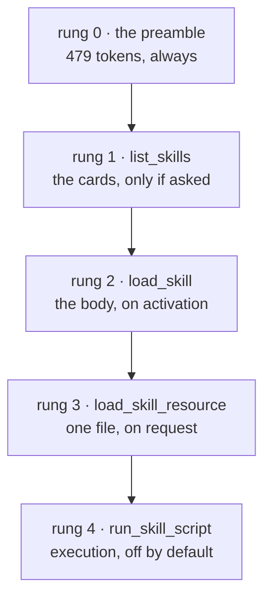

# 2.2 — `list_skills`: the index is a tool call, not a prompt

## One-line answer

In ADK 2.7.1 the list of your skills is **not** put into the system instruction — the model has to
call a tool named `list_skills` to find out what is available, which makes the shelf's cost
conditional rather than fixed.

## The story

You sit down at a small restaurant and there is no menu on the table.

There is a jug of water, a cloth, and nothing else. You look around; the other tables are the same. So
you catch the eye of the man carrying plates and ask what there is today, and he stands beside you and
tells you: two vegetable dishes, a fish, a rice, and the thing his mother makes on Thursdays.

It is a perfectly good way to run a restaurant, and it has one property that is easy to miss. If you
came in, drank a glass of water and left, nobody ever recited the list. The menu costs something to
deliver, and it is delivered only to people who ask.

A printed menu on every table is the other design. It is there whether you read it or not, and the
printing bill does not care how many customers order.

## The idea in plain language

[2.1](2.1-the-preamble-you-did-not-write.md) ended on one measured line: the 479-token preamble does
**not** contain the name of a single skill. So how does the model find out that `ticket-triage`
exists?

It asks. `SkillToolset` contributes four tools to the agent, and the first of them is `list_skills`,
whose entire job is to return the names and descriptions of the skills on the shelf.

That is worth stating plainly, because it is the opposite of what most people expect and the opposite
of what the documentation page says. In this version of ADK, **the shelf index is a tool result, not
prompt text.**

The reason is one line in the toolset's `process_llm_request`: it appends the skills index to the
system instruction *only when the toolset has no `list_skills` tool*. And the toolset always builds a
`list_skills` tool. So the branch that would put the index in the prompt never runs in the default
configuration. Read from the installed `google-adk` 2.7.1 on 2026-09-04.

That gives the day a **five-rung ladder** rather than the three rungs Day 25 described for the format:



Rung 0 is unconditional. Every rung after it is a decision the model makes, and each decision is a
tool call that appears in the event stream, can be logged, and can be refused.

Two consequences follow, and they pull in opposite directions.

**The good one:** the per-skill cost is conditional. Day 25 projected that two hundred skills would
cost about 7,600 tokens of permanent context, because the format says the cards are always loaded
([25.5.2](../../../day-25-skills-the-open-spec/parts/05-in-production/5.2-what-a-skill-costs.md)). In
this client that projection does not hold. A conversation that never asks about skills never pays for
the cards at all.

**The awkward one:** the model has to decide to ask, and it is asking with no information about what
it might find. The preamble tells it that skills exist and that it must use them if one is relevant —
but until it calls `list_skills`, it cannot know whether one is relevant. That is a chicken-and-egg
the preamble papers over with a capitalised "MUST", and section 4's failure lab is where it comes
apart.

## Why Sutra needs it

Because Sutra's cost model for skills has to be right before Day 28 designs against it.

Day 25 left the learner with a number — cards are a fixed, linear, permanent cost — and a `TODO(me)`
asking how many skills Sutra is willing to pay for at startup. In ADK that question has a different
answer, and answering the Day 25 version of it would lead to a design that rations skills for a cost
that is not being incurred.

It also changes what "the description is the selection interface" means. Day 25 measured descriptions
against realistic requests and showed that the *"use when"* half carries most of the findability
([25.2.3](../../../day-25-skills-the-open-spec/parts/02-the-frontmatter/2.3-the-description-field.md)).
All of that still holds — but it now applies **one step later**, after the model has already decided
to call `list_skills`. The first decision is not "which skill?", it is "are there skills?", and no
description influences that one at all.

## The paper behind it

> **MemGPT: Towards LLMs as Operating Systems** · `arXiv:2310.08560` · 2023 ·
> <https://arxiv.org/abs/2310.08560>

It proposed giving a language model explicit function calls to page information between a small
in-context window and a larger external store, so the model manages its own memory the way an
operating system manages virtual memory. `list_skills` and `load_skill` are that idea with skills as
the pages: the model calls a function to bring knowledge in, rather than being handed it up front.

Taught in full on Day 20 —
[MemGPT: Towards LLMs as Operating Systems](../../../day-20-context-engineering-compaction/papers/01-memgpt.md).

## The mechanism

The tool is deterministic, so it can be driven directly with no model and no quota. Day 23 built the
double for exactly this
([23.3.2](../../../day-23-testing-tools-and-callbacks/parts/03-testing-tools/3.2-the-fake-tool-context.md));
the skill tools need three members rather than two, so the double grows by three lines.

```python
# days/day-26-loading-skills-into-adk/lab/fake_skill_context.py
"""Day 23's double, extended with the three members the skill tools reach for."""


class FakeSkillContext:
    """A stub for `.state` and two flat attributes the skill tools read."""

    def __init__(self, agent_name: str = "desk", invocation_id: str = "inv-1") -> None:
        self.state: dict[str, object] = {}
        self.agent_name = agent_name
        self.invocation_id = invocation_id
```

**Line by line:**

- `state` is a plain dictionary, exactly as in Day 23. `load_skill` writes to it, and
  [3.3](../03-wiring-the-toolset/3.3-activation-is-a-line-in-state.md) is about what it writes.
- `agent_name` is read by `load_skill` to build the state key it writes under. It defaults to `"desk"`
  so that the key in the test output matches the agent Sutra actually has, which makes a printed
  dictionary readable rather than abstract.
- `invocation_id` is passed straight through to the toolset's skill lookup. Nothing in the local
  (non-registry) path uses it for anything you can observe, but the parameter is required, and a
  double that omits a required member fails with an `AttributeError` pointing at ADK rather than at
  the double.
- There is no `save_artifact` here, unlike Day 23's version. The skill tools do not save artifacts, so
  the double does not pretend to. Declaring what is touched and nothing else is the whole discipline.

Now drive the tool.

```python
# days/day-26-loading-skills-into-adk/lab/rung_one.py
"""Call list_skills the way the runtime would, and print exactly what the model gets back."""

import asyncio
import pathlib

from fake_skill_context import FakeSkillContext
from google.adk.skills import load_skill_from_dir
from google.adk.tools import skill_toolset

SHELF = pathlib.Path("days/day-26-loading-skills-into-adk/lab/skills")


async def main() -> None:
    """Build a two-skill toolset and invoke its list_skills tool directly."""
    skills = [load_skill_from_dir(SHELF / name) for name in ("ticket-triage", "vague-description")]
    toolset = skill_toolset.SkillToolset(skills=skills)

    tools = {tool.name: tool for tool in await toolset.get_tools()}
    print("tools contributed:", sorted(tools))

    result = await tools["list_skills"].run_async(args={}, tool_context=FakeSkillContext())
    print(result)


asyncio.run(main())
```

**Line by line:**

- `await toolset.get_tools()` is the method every ADK toolset implements — Day 15 met it as the one
  method a toolset must have
  ([15.1.2](../../../day-15-toolsets-and-openapi/parts/01-crate-not-list/1.2-one-method-and-the-import.md)).
  Calling it yourself is how you see what the agent will be given without building an agent.
- `{tool.name: tool for tool in ...}` — a dictionary by name, because the next line wants one tool and
  the list's order is an implementation detail.
- `run_async(args=..., tool_context=...)` is the method ADK calls on a tool. Both arguments are
  keyword-only. `args={}` because `list_skills` declares no parameters at all — its JSON schema is an
  object with an empty `properties`, which is how you say "call me with nothing".
- The result is **returned**, not printed by the tool, and it is a string. What you print here is
  byte-for-byte what would be handed back to the model as the tool result.
- Still **zero model calls**. Everything in this part is deterministic.

Run it from the repository root:

```bash
uv run python days/day-26-loading-skills-into-adk/lab/rung_one.py
```

**Line by line:**

- `rung_one.py` and `fake_skill_context.py` sit in the same folder, so the plain
  `from fake_skill_context import FakeSkillContext` works when the script is run as a file. That is
  the Day 23 lab convention and it is why the double is a module rather than a class in the script.

Measured on 2026-09-04 against `google-adk` 2.7.1:

```text
tools contributed: ['list_skills', 'load_skill', 'load_skill_resource', 'run_skill_script']
<available_skills>
<skill>
<name>
ticket-triage
</name>
<description>
Assign a severity to a support ticket and record it, using the desk&#x27;s published severity table. Use when a ticket arrives without a severity, when someone asks how urgent a ticket is, or when the words triage, severity or priority appear.
</description>
</skill>
<skill>
<name>
vague-description
</name>
<description>
Helps with tickets.
</description>
</skill>
</available_skills>
```

Four tools, not three. And the index is XML, one `<skill>` block per skill, name and description only
— no body, no resources, no licence.

Two details in that output are worth a sentence each.

`desk&#x27;s` is an HTML-escaped apostrophe. The formatter escapes the description before wrapping it
in tags, so every apostrophe in every description costs five characters instead of one. It is not
wrong and it is not free.

And the tags themselves are not free either. Measured with `count_tokens` on `gemini-3.7-flash`, the
same day: the bare card — name and description, one per line — is **55 tokens**; wrapped in this XML
it is **95**. The structure costs about 40 tokens per skill, roughly three-quarters as much again as
the content. That is the price of a format the model can parse unambiguously, and it is a price you
only pay when the model asks.

## When it breaks

**The model never asks.** There is no error, no log line, and a perfectly fluent answer that ignores
every procedure you wrote. The event stream shows a question and a final response with no tool call
between them. This is the day's central failure and it gets its own part —
[4.3](../04-failure-lab/4.3-the-manual-nobody-opened.md) — but the shape of the diagnosis belongs
here: **when a skill does not fire, look for the absence of `list_skills` before you blame the
description.** A weak description explains the model choosing the wrong skill. It does not explain the
model not looking.

**The double is missing a member.** Delete `invocation_id` from `FakeSkillContext` and call
`load_skill`:

```text
AttributeError: 'FakeSkillContext' object has no attribute 'invocation_id'
```

The message names your class, which is the good case — Day 23's warning was about doubles that fail by
being *too* accommodating rather than by raising
([23.5.2](../../../day-23-testing-tools-and-callbacks/parts/05-failure-lab/5.2-the-fake-that-could-not-fail.md)).

**Two skills with the same name never get this far.** The toolset refuses at construction:

```text
ValueError: Duplicate skill name 'ticket-triage'.
```

Which is worth appreciating: the index has no way to disambiguate two identical names, so ADK makes
the situation impossible rather than making the index confusing.

## In production

**Log the `list_skills` call and count it.** It is the cheapest signal you will ever get about whether
skills are being considered at all. Day 22's structured line has somewhere to put it
([22.2.1](../../../day-22-structured-logging/parts/02-wiring-the-run/2.1-one-line-per-happening.md)),
and the number to watch is the ratio of conversations where `list_skills` was called to conversations
where it was not. A ratio near zero means your preamble is losing an argument with your own
instruction, and no amount of description tuning will fix it.

**Descriptions are still the selection interface, one rung later.** Everything Day 25 measured applies
to the moment after the index arrives. The practical consequence is that description quality and
`list_skills` frequency are two different problems with two different fixes, and treating them as one
is how teams end up rewriting descriptions for a week to fix a preamble problem.

**What changes at scale** is that the index grows and the model reads all of it. Two hundred skills is
two hundred `<skill>` blocks in one tool result — on the measurement above, roughly nineteen thousand
tokens arriving in a single response. That is when `SkillRegistry` and its `search_skills` tool stop
being an exotic option and start being the only design that fits, because searching returns a subset
where listing returns everything. Sutra parks that at awareness level today: 🅿️ a registry is a
remote source of skills with a search tool attached, it is what Day 29's Agent Registry work will
meet, and nothing today needs it.

**The review comment a senior engineer leaves:** *"we are asserting in the runbook that skills cost us
tokens on every request. Measured, they cost 479 for the preamble and nothing more until the model
calls `list_skills`. Fix the runbook, and add the call count to the dashboard so we can see how often
that actually happens."*

**The interview question:** *"how does the model know which skills are available?"* The answer that
shows you have read the code rather than the page: *"in ADK 2.7.1 it does not, until it asks. The
toolset adds a fixed instruction block explaining that skills exist, and a `list_skills` tool that
returns the names and descriptions as XML. The index is a tool result, so the per-skill cost is only
paid on conversations that ask for it. The documentation page describes it as arriving in the system
instruction, and the code has a branch for that which does not run when a `list_skills` tool is
present — which it always is. I checked the installed package."*

## Check yourself

```bash
uv run python days/day-26-loading-skills-into-adk/lab/rung_one.py
```

Now copy a third skill onto the shelf, run it again, and watch the XML grow by one block. Then open
[2.1](2.1-the-preamble-you-did-not-write.md)'s script, run it with the same three skills, and confirm
the preamble did not grow at all.

**Out loud, without scrolling up:** say where the list of available skills lives in ADK 2.7.1, and what
has to happen before the model sees it.

**Next:** [2.3 — What activation actually costs](2.3-what-activation-actually-costs.md).
