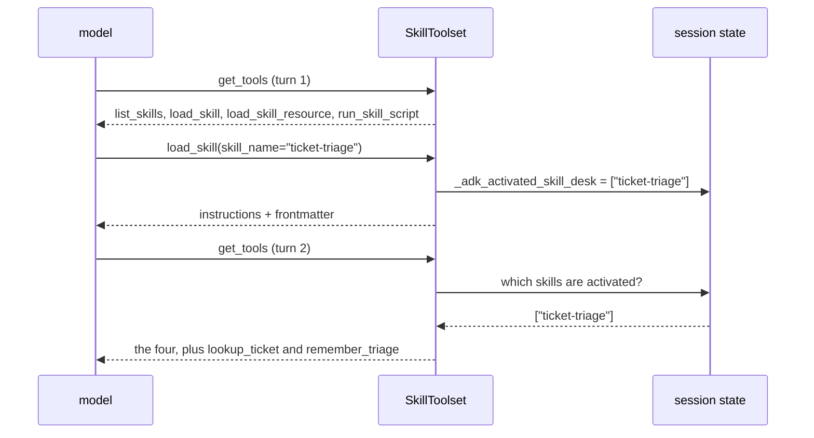

# 3.2 — `additional_tools`: capability that appears only after activation

## One-line answer

Tools passed as `additional_tools` are **not** given to the agent — they appear only after a skill has
been activated *and* only if that skill's `metadata` names them under `adk_additional_tools`, which
means the agent's tool menu grows in the middle of a conversation.

## The story

At the hotel desk they hand you a key card and tick two boxes on a form.

The card opens your room from the moment you take it. The gym does not open. You try it on the way
past, the light goes red, and you go back down to ask — and the woman at the desk says of course, the
gym is not on your rate, and would you like it added. She ticks the box, taps your card on a reader,
and the same piece of plastic now opens a door it refused thirty seconds ago.

Nothing was replaced. The card did not change. What changed is a line in a system somewhere that says
which doors this card is allowed to ask about, and it changed because you asked and somebody agreed.

## The idea in plain language

`SkillToolset` takes an `additional_tools=` argument. The obvious reading — and the one every tutorial
you will find takes — is that these tools are bundled alongside the four skill tools and handed to the
agent together.

That is not what happens. Measured on 2026-09-04 against `google-adk` 2.7.1: pass two functions in
`additional_tools`, ask the toolset for its tools, and you get **four**. The two functions are held,
not given.

They appear when **both** of these are true:

1. A skill has been **activated** — `load_skill` has run and written the activation into session state
   ([3.3](3.3-activation-is-a-line-in-state.md) is that state key in detail); and
2. That skill's frontmatter carries `metadata.adk_additional_tools`, a list naming the tools by name.

Then, on the next `get_tools` call, the toolset reads the activated skills out of state, collects the
names each one asks for, matches them against what you passed in, and returns the four core tools
**plus** the matches.



Read that diagram once more with the cost in mind. The two extra tool declarations are **not** in the
request until the skill that needs them is in play. That is progressive disclosure applied to
capability rather than to knowledge, and it is the answer to Day 19's finding that the tool menu is
often the most expensive organ of the request
([19.2.3](../../../day-19-context-engineering-selection/parts/02-anatomy/2.3-the-menu-costs-more-than-the-handbook.md)).

Three details make it usable rather than merely clever.

**`additional_tools` accepts three shapes**: a plain function (wrapped as a `FunctionTool` for you), a
`BaseTool`, or a whole `BaseToolset` — whose tools are then also candidates for matching by name.

**Matching is by tool name**, and the name of a plain function is the function's name. So
`adk_additional_tools: ["lookup_ticket"]` matches `def lookup_ticket(...)`. Rename the function and the
skill stops getting its tool, silently, which is [4.2](../04-failure-lab/4.2-the-tool-that-never-appeared.md).

**A collision with one of the four core tools is refused and logged.** A tool of yours called
`load_skill` is dropped with `Tool name collision: tool 'load_skill' already exists.` at `ERROR` level
— which you will only see if your logging is configured, which is Day 22's whole point
([22.2.3](../../../day-22-structured-logging/parts/02-wiring-the-run/2.3-adk-logs-too.md)).

## Why Sutra needs it

Because Day 25's `ticket-triage` body says *"read the ticket with `lookup_ticket`"* and Sutra's desk
agent does not have a `lookup_ticket`.

That is a real gap and it is the shape of a real design decision. There are two ways to close it:

**Give the desk every tool, always.** Simple, and it means the tool menu carries a triage tool through
every conversation about refunds, passwords and invoices — paid for on every request, and available to
be called at moments when no procedure governs its use.

**Bundle the tool with the procedure that uses it.** The skill that documents how to triage names the
tools triage needs, and those tools appear when triage begins. The pairing is expressed in the skill's
own frontmatter, which means the person who writes the procedure declares its dependencies, and the
declaration is reviewed in the same file as the steps.

The second is what `additional_tools` is for, and it is the better answer for the same reason skills
are better than a long instruction: it puts the cost where the benefit is. It is also a containment
argument, and Principle 13 cares: a tool that only exists inside an activated procedure is a tool with
a smaller window in which it can be misused.

## The mechanism

The mechanism is easiest to see by driving state directly, because then the two conditions can be
switched on one at a time.

First, the skill declares what it needs. Add one key to `metadata` in the shelf copy of
`ticket-triage`:

```yaml
metadata:
  author: sutra-desk
  version: "1.0"
  adk_additional_tools: ["lookup_ticket", "remember_triage"]
```

**Line by line:**

- The key is `adk_additional_tools`, prefixed `adk_` because `metadata` is a namespace shared with
  every other client that might read this folder
  ([1.2](../01-loading-a-folder/1.2-the-skill-object.md)). A different client ignores it, which is the
  format working as designed.
- The value is a **list of strings**, and each string is a tool *name*, not an import path. There is no
  resolution against your code here at all — the matching happens later, against whatever you passed
  to `additional_tools`.
- It sits beside `version: "1.0"`, which stays quoted for the reason Day 25 gave: unquoted, YAML turns
  `1.10` into the float `1.1`
  ([25.2.4](../../../day-25-skills-the-open-spec/parts/02-the-frontmatter/2.4-the-optional-fields.md)).

Then the probe.

```python
# days/day-26-loading-skills-into-adk/lab/tools_after_activation.py
"""Ask the toolset for its tools before and after a skill is activated."""

import asyncio
import pathlib

from fake_skill_context import FakeSkillContext
from google.adk.skills import load_skill_from_dir
from google.adk.tools import skill_toolset

SHELF = pathlib.Path("days/day-26-loading-skills-into-adk/lab/skills")


def lookup_ticket(ticket_id: str) -> dict:
    """Return the text of a support ticket."""
    return {"status": "ok", "ticket_id": ticket_id}


def remember_triage(ticket_id: str, severity: str) -> dict:
    """Record the chosen severity for a ticket."""
    return {"status": "recorded", "ticket_id": ticket_id, "severity": severity}


async def main() -> None:
    """Two get_tools calls that differ only in what is in state."""
    skill = load_skill_from_dir(SHELF / "ticket-triage")
    toolset = skill_toolset.SkillToolset(
        skills=[skill], additional_tools=[lookup_ticket, remember_triage]
    )

    cold = FakeSkillContext()
    print("before activation:", sorted(t.name for t in await toolset.get_tools(cold)))

    hot = FakeSkillContext()
    hot.state["_adk_activated_skill_desk"] = ["ticket-triage"]
    print("after activation :", sorted(t.name for t in await toolset.get_tools(hot)))


asyncio.run(main())
```

**Line by line:**

- `additional_tools=[lookup_ticket, remember_triage]` passes **bare functions**. ADK wraps each in a
  `FunctionTool`, taking the name from the function and the description from the docstring — which is
  Day 10's mechanism, unchanged
  ([10.1.2](../../../day-10-function-tools/parts/01-the-form-fills-itself/1.2-the-docstring-is-the-description.md)).
  The docstrings here are one line each because they are what the model will read.
- `get_tools(cold)` is passed a context, unlike [2.2](../02-the-four-tools/2.2-the-index-is-a-tool-call.md)'s
  bare `get_tools()`. The argument is how the toolset reads state; with no context it cannot resolve
  anything and returns the four.
- `hot.state["_adk_activated_skill_desk"] = ["ticket-triage"]` writes by hand what `load_skill` writes
  for you. Doing it by hand is what makes the two conditions separable: this line is condition 1, and
  the YAML above is condition 2.
- The key ends in `desk` because that is `FakeSkillContext`'s default `agent_name`. The key is **per
  agent**, which matters in a multi-agent system and is [3.3](3.3-activation-is-a-line-in-state.md).
- The value is a **list**, because more than one skill can be activated in a conversation and each may
  ask for tools.
- `sorted(...)` on both lines so the two are comparable at a glance.
- **Zero model calls.**

Run it from the repository root:

```bash
uv run python days/day-26-loading-skills-into-adk/lab/tools_after_activation.py
```

**Line by line:**

- Needs no key.

Measured on 2026-09-04 against `google-adk` 2.7.1:

```text
before activation: ['list_skills', 'load_skill', 'load_skill_resource', 'run_skill_script']
after activation : ['list_skills', 'load_skill', 'load_skill_resource', 'lookup_ticket', 'remember_triage', 'run_skill_script']
```

Four, then six. The only difference between the two calls is one key in a dictionary.

Now delete the `adk_additional_tools` line from the skill's `metadata` and run it again. Both lines
print four. The tools were passed to the toolset both times; without the declaration in the skill,
nothing asks for them.

## When it breaks

**Nothing appears, and nothing complains.** This is the default failure and it has three possible
causes that look identical from the outside: the skill was never activated, the metadata key is
missing or misspelled, or the tool name in the list does not match the function name. There is no
error for any of them — `get_tools` simply returns four. The diagnosis is the probe above with your
own skill: check the state key, then the metadata, then the names, in that order.

**A name that collides with a core tool.** Pass a function called `load_skill` and it is dropped:

```text
ERROR:google_adk.google.adk.tools.skill_toolset:Tool name collision: tool 'load_skill' already exists.
```

At `ERROR` level, through ADK's own logger, which means it goes wherever you configured that logger to
go and nowhere if you did not
([22.2.3](../../../day-22-structured-logging/parts/02-wiring-the-run/2.3-adk-logs-too.md)). The tool is
silently absent from the model's point of view.

**A toolset in `additional_tools` that fails.** If you pass a whole toolset and its `get_tools` raises,
ADK logs a warning naming the type and carries on without it:

```text
WARNING:google_adk.google.adk.tools.skill_toolset:Skipping toolset OpenAPIToolset while resolving skill additional tools: ...
```

Read that as a design decision you inherit: a broken additional toolset degrades the agent rather than
failing the request. That is the opposite of [1.4](../01-loading-a-folder/1.4-the-whole-shelf.md)'s
all-or-nothing loading, in the same feature, and it is worth knowing which behaviour you are getting
where.

**The tool menu changing mid-conversation.** This is not a failure, but it surprises people reading
traces: the same agent shows four tool declarations on turn one and six on turn two. If you have a
test that asserts on the tool count, it is asserting on the cold count only.

## In production

**Declare the dependency in the skill, and review it there.** The reason this mechanism is worth using
rather than working around is that `adk_additional_tools` puts a procedure's tool requirements in the
same file as its steps, where the person who owns the procedure can see them. That is a
reviewability win, not a token win. The token win is real too, and it is secondary.

**Name your tools as carefully as you name your skills.** The binding between a skill and its tools is
a string match on a tool name, so a rename in Python is a silent break in a Markdown file that no test
covers. The cheapest guard is a lint: for every skill on the shelf, every name in
`adk_additional_tools` must exist in the set of tools passed to the toolset. Twenty lines, no model,
and it belongs in the Day 31 skills lint alongside the link check from
[2.4](../02-the-four-tools/2.4-the-third-rung-and-its-fence.md).

**Do not use this to hide a dangerous tool.** A tool that only appears after activation is still a tool
the model can call once it appears, and a skill body is text — if a skill can be edited by somebody who
should not be able to grant a capability, then `adk_additional_tools` is a privilege-granting field in
a Markdown file. Sutra's answer is that first-party skills are reviewed like code and third-party
skills are audited (Day 29), and the audit now has a specific thing to look for: **which tools does
this skill's metadata ask for?**

**What changes at scale** is that the tool menu becomes dynamic and traces stop being comparable. Two
runs of the same agent with the same question can present different tool sets to the model, depending
on what was activated first. Log the tool names on each request, not just at startup, or accept that
"what could the model call at this moment?" is unanswerable after the fact.

**The review comment a senior engineer leaves:** *"`adk_additional_tools` in a skill file grants the
agent a tool. That makes `skills/` a permission surface. Add it to the audit checklist and add a lint
that fails when a skill asks for a tool we do not pass in."*

**The interview question:** *"how do you give an agent a tool that only some tasks need?"* The answer
that shows you have measured it: *"in ADK's skills toolset, you pass the tool as `additional_tools` and
the skill declares it in `metadata.adk_additional_tools`. It is not given to the agent up front — the
toolset resolves it out of session state after `load_skill` has recorded that skill as activated, so
the declaration appears in the request only from the turn after activation. It is progressive
disclosure for capability rather than for knowledge. The catch is that the binding is a name match with
no validation, so a renamed function silently removes a tool from a procedure, and that needs a lint."*

## Check yourself

```bash
uv run python days/day-26-loading-skills-into-adk/lab/tools_after_activation.py
```

Now misspell one name in `adk_additional_tools`, run it again, and see that five tools come back with
no error. Then rename `lookup_ticket` in the Python and watch it drop to four.

**Out loud, without scrolling up:** name the two conditions that have to be true before an
`additional_tools` entry reaches the model, and say which file each one lives in.

**Next:** [3.3 — Activation is a line in session state](3.3-activation-is-a-line-in-state.md).
