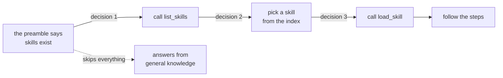

# 4.3 — 💥 The manual nobody opened

## One-line answer

The most expensive failure in this whole day produces no error, no warning and a perfectly good
answer: the model never calls `list_skills`, so the procedure you wrote is never read, and the only
evidence is a state key that is not there.

## The story

🎬 **The scene.** The washing machine manual has been in the kitchen drawer for six years, under the
takeaway menus. Nobody has opened it. The clothes come out clean, mostly, and the one cycle everybody
uses is the one somebody guessed on the first day.

😬 **The naive fix.** When a load comes out badly, you run it again on a hotter setting.

💥 **Why it fails.** There is a page in that manual about the filter, which has never been cleaned,
and a page about the setting for the clothes that keep coming out grey. Nothing is broken. The machine
never complained, the clothes were never obviously wrong, and every wash was a small quiet loss that
nobody could name. Six years of that costs more than the machine.

💡 **The insight.** A resource that is never consulted produces **no signal at all**. It does not fail
loudly, it fails as a slightly worse outcome forever — and the only way to know is to check whether it
was ever opened, not whether the result looked acceptable.

## The idea in plain language

Every other failure in this day announces itself. A bad folder raises. A missing tool changes a tool
list. This one does not.

The chain from *"a skill exists"* to *"a skill was used"* has three model decisions in it, and none of
them is guaranteed:



Day 25 studied decision 2 in detail and measured it: a good description overlapped seven words with
realistic requests where *"Helps with tickets."* overlapped one
([25.2.3](../../../day-25-skills-the-open-spec/parts/02-the-frontmatter/2.3-the-description-field.md)),
and the skill that never triggered got a whole part of its own
([25.4.1](../../../day-25-skills-the-open-spec/parts/04-failure-lab/4.1-the-skill-that-never-triggered.md)).

**Decision 1 is new today, and it is upstream of everything Day 25 measured.** In ADK 2.7.1 the index
is not in the prompt ([2.2](../02-the-four-tools/2.2-the-index-is-a-tool-call.md)), so the model has to
ask what skills exist *before* any description can influence it. A description cannot win an argument
it was never part of.

That reorders the diagnosis, and getting the order wrong is how a team spends a week on the wrong
problem:

| Symptom | Cause | Fix |
| --- | --- | --- |
| no `list_skills` call at all | decision 1 | the agent's own instruction, and the model |
| `list_skills` ran, no `load_skill` | decision 2 | the description |
| `load_skill` ran, steps ignored | decision 3 | the body |

Three different fixes. One symptom, as far as the user is concerned: an answer that did not follow the
procedure.

## Why Sutra needs it

Because Sutra has just moved its most important knowledge out of the place that is always read and
into a place that is read on request.

That is the right move, and it has a cost nobody mentions when they recommend it: the system
instruction is unconditional and a skill is not. Yesterday, the triage procedure was in the handbook
and was therefore *definitely* in front of the model on every request. Today it is a folder that the
model may or may not go and look at. The knowledge got cheaper and it also got **optional**, and
Principle 10 says you do not get to leave that unmeasured.

The detector is one line and Sutra should have written it today, which is why this part exists at the
end of the failure lab rather than as an aside in section 5.

## The mechanism

The detector first, because it is the part that outlives the day.

```python
# days/day-26-loading-skills-into-adk/lab/did_it_open.py
"""Answer 'was a skill used in this conversation?' from session state alone."""

from typing import Mapping


def skills_used(state: Mapping[str, object], agent_name: str) -> list[str]:
    """The skills this agent activated in this session, oldest first.

    Reads ADK's own record rather than searching the transcript, so it is
    unaffected by how the answer was worded.

    Example:
        >>> skills_used({"_adk_activated_skill_desk": ["ticket-triage"]}, "desk")
        ['ticket-triage']
        >>> skills_used({}, "desk")
        []
    """
    return list(state.get(f"_adk_activated_skill_{agent_name}") or [])


def opened_the_manual(state: Mapping[str, object], agent_name: str, expected: str) -> bool:
    """True when `expected` was actually activated. The assertion a test makes."""
    return expected in skills_used(state, agent_name)
```

**Line by line:**

- `Mapping[str, object]` rather than `dict` — ADK's `State` is not a `dict`, and Day 23 warned that a
  double which is a plain dictionary is close enough for unprefixed keys and wrong for anything else
  ([23.5.2](../../../day-23-testing-tools-and-callbacks/parts/05-failure-lab/5.2-the-fake-that-could-not-fail.md)).
  Typing the parameter as the read-only protocol both objects satisfy is the honest signature.
- Two functions, not one, because they answer two questions: *what happened* (for the log line) and
  *did the thing I expected happen* (for the test). A single function returning a boolean would throw
  away the information the log wants.
- The docstring carries two doctests, and the second one — the empty state — is the case this whole
  part is about. A helper whose "nothing happened" case is undocumented is a helper somebody will
  wrap in a `try`.
- `expected in skills_used(...)` rather than `== [expected]`, because more than one skill may
  legitimately have been activated in the same conversation.
- No logging inside either function. They are readers; the caller decides whether an absence is worth
  a warning, and only the caller knows what was expected.

Now the run that can go red. This one **spends quota** — it is the only thing in the day that does:

```bash
uv run python days/day-26-loading-skills-into-adk/lab/ask_the_desk.py "Triage ticket 4521."
```

**Line by line:**

- `ask_the_desk.py` is the hub's build brief: [3.1](../03-wiring-the-toolset/3.1-a-toolset-not-a-tool.md)'s
  agent, a `Runner`, one question, and a print of every function call and the final response — the
  same event-printing shape Sutra has used since Day 5's `run_once`.
- One question through a fresh session is **two to four generations** on the twenty-a-day ceiling:
  one to decide to call `list_skills`, one to decide to call `load_skill`, and one or two to answer.
  Run it once, not in a loop.
- What you are looking for is a `list_skills` call **before** anything else, then `load_skill`, then
  the answer. Print `skills_used(session.state, "desk")` at the end and it should not be empty.

**No transcript is pasted here.** On 2026-09-04 the day's twenty generations were already spent by the
time this part was written, and the run returned the `429` shown in
[3.1](../03-wiring-the-toolset/3.1-a-toolset-not-a-tool.md). Principle 10 outranks the shape of a
document: an invented transcript would be undetectable, so this is a `TODO(me)` with the exact command
rather than a fabrication. Run it tomorrow, paste your own output into your notes, and record which of
the three decisions your model actually made.

The deterministic half of the check needs no quota at all:

```python
# a test that can go red without spending anything
def test_absence_is_detected() -> None:
    """An empty session means the manual was never opened."""
    assert skills_used({}, "desk") == []
    assert not opened_the_manual({}, "desk", "ticket-triage")
    assert opened_the_manual({"_adk_activated_skill_desk": ["ticket-triage"]}, "desk", "ticket-triage")
```

**Line by line:**

- Three assertions and no model. This is the Day 23 shape: the detector is a pure function of state,
  so it is testable at the speed of the test suite
  ([23.1.2](../../../day-23-testing-tools-and-callbacks/parts/01-where-the-line-falls/1.2-fast-isolated-specific.md)).
- The **middle** assertion is the important one. A detector that only ever proves the happy case is a
  detector that will report success when the state key changes name in an ADK upgrade.

## When it breaks

**The fix that makes it worse.** The instinct, on seeing that the model does not consult skills, is to
shout in the instruction: *"ALWAYS check your skills before answering."* Two things happen. Some models
obey literally and call `list_skills` and then `load_skill` on every question including *"what time do
you close?"*, which pays 479 + 95 + 334 tokens to answer a question no skill governs. Others do not
change at all. You have made the cheap conversations expensive without making the important ones
correct.

**The instruction that argues with the preamble.** A handbook line saying *"answer concisely and avoid
unnecessary tool calls"* sits in the same field as a preamble saying *"you MUST use the skill tools"*.
Day 6 measured what a contradiction in an instruction produces
([6.1.4](../../../day-06-instructions-and-personas/parts/01-writing-the-handbook/1.4-contradictions-are-randomised-behaviour.md)):
not an error, but behaviour that varies between runs — which presents exactly as *"skills work
sometimes"*.

**Diagnosing decision 2 when the failure is decision 1.** The description is the thing you can measure,
so it is the thing people rewrite. If `list_skills` was never called, no rewrite of any description
changes anything, and a week of tuning produces a better description and identical behaviour. Check the
register before you touch a word of YAML.

**The quota running out mid-diagnosis.** Each attempt is several generations, twenty a day, and a
diagnosis loop is the fastest way to spend them. Day 24's ledger exists for this
([24.3.1](../../../day-24-token-accounting-and-budgets/parts/03-counting-before-spending/3.1-the-ledger.md)):
count before you spend, and do the zero-quota checks — the register, the metadata, the names — first.

## In production

**Put `skills_used` on the log line and watch the ratio, not the count.** The number that matters is
*conversations where any skill was activated ÷ conversations where one should have been*. The
denominator is the hard half, and the cheapest usable proxy is a keyword rule over the user's first
message — if the word "triage" or "severity" appears and `ticket-triage` was not activated, that is a
row worth looking at. It is not precise and it does not need to be; it turns an invisible failure into
a countable one.

**Alert on zero.** A skill with no activations in a week is either badly described, redundant, or was
written for a case that does not occur — and all three are worth knowing. This is the number Day 25
promised its build brief would produce, and now there is somewhere to read it from.

**Do not let a skill be the only place a critical rule lives.** This is the design consequence and it
is the one to carry into Day 28. Because activation is a model decision, anything that **must** happen
belongs in the instruction, in a callback, or in a tool's own logic — not in a skill body. A skill is
the right home for *how to do this well*; it is the wrong home for *never do this*. Sutra's refund
limit, when it exists, is a guard in code. The refund conversation's tone is a skill.

**What changes at scale** is that this failure hides inside acceptable results. Nobody escalates a
ticket because the severity was defensible instead of correct. The complaint that eventually arrives is
about something else entirely, and the skill that was never opened is found in an audit six months
later. That is why the detector is worth writing on the day the feature is adopted rather than on the
day somebody asks.

**The review comment a senior engineer leaves:** *"we have no way to tell whether the triage skill ever
runs. Add `skills_used` to the invocation log line before this ships, and put a weekly check on
activations-by-skill — a skill at zero is a skill we are paying for and not getting."*

**The interview question:** *"you shipped a skill and the agent's answers did not change — what do you
check?"* The answer that shows you have been through it: *"first whether it was ever activated, from
session state, not from the transcript. If it was never activated, I check whether the model even
listed the skills — in ADK the index is a tool call, so there is a decision upstream of the
description. Only if listing happened do I go and work on the description, and only if activation
happened do I go and work on the body. Three symptoms look identical to a user and have three different
fixes, and the cheap checks are all upstream of the expensive one."*

## Check yourself

```bash
uv run python days/day-26-loading-skills-into-adk/lab/did_it_open.py
uv run python days/day-26-loading-skills-into-adk/lab/ask_the_desk.py "Triage ticket 4521."
```

The first costs nothing and should print an empty list for an empty session. The second spends two to
four generations: run it once, read the calls in order, and write down which of the three decisions
your model made. Then run it again with the word "triage" removed from the question and see whether
anything changes.

**Out loud, without scrolling up:** name the three model decisions between "a skill exists" and "a
skill was followed", and say which one you check first when nothing happened.

**Next:** [5.1 — What a skill really costs, in this client](../05-in-production/5.1-what-a-skill-really-costs-here.md).
