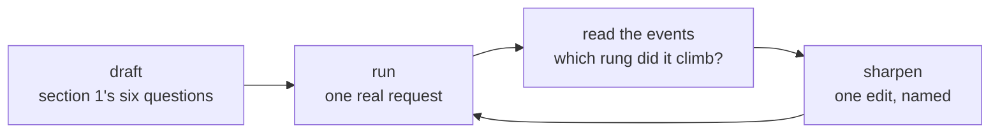

# 4.1 — Draft, run, read, sharpen: skills are tested prose

## One-line answer

A skill is not finished when it is written; it is finished when a run of it has been watched — and the
step everybody skips is the third one, reading what actually happened rather than reading the answer.

## The story

The first time you parallel park, you do it by getting out of the car.

You reverse, you stop, you feel unsure, you put the handbrake on and you get out and look. Too far
from the kerb. You get back in, come forward, try again, get out again. It takes four attempts and it
feels ridiculous, and there is a person on the pavement pretending not to watch.

What makes it work is not the trying. It is the getting out. Somebody who reverses four times without
ever looking has done the same amount of work and learned nothing, because the only information they
have is *"it still feels wrong"* — and that is not enough to know which way to move.

Two months later you do it in one go and never get out of the car again. The getting out was how the
feel was calibrated.

## The idea in plain language

Sutra has treated code this way since Day 3: write it, run it, look at what happened, change it. A
skill is prose whose runtime is a language model, and it gets the same treatment.



Four steps, and the third is the one that gets skipped, because the answer is right there and reading
it feels like enough. It is not, and the reason is precise: **the answer cannot tell you which step
went wrong.**

A fluent, wrong-ish reply is consistent with all of these:

- the model never listed the skills;
- it listed them and chose the other one;
- it activated the right one and ignored step 4;
- it followed every step and the rubric is wrong.

Four different edits, in four different files. Reading the answer distinguishes none of them; reading
the event stream distinguishes all four, and [4.2](4.2-which-rung-did-it-climb.md) is how.

The fourth step has a rule that stops the loop from becoming thrashing: **one edit per iteration, and
name it before you run.** *"I am adding the word `priority` to the description because the request said
priority and the skill did not fire."* If two things change and the behaviour changes, you have learned
that something worked.

And there is a constraint on Sutra specifically that shapes the whole loop. Each iteration costs
**three to five generations** — list, load, maybe a resource fetch, the answer, and any tool calls the
procedure makes. On twenty a day, that is **four to six iterations**, total, for both skills. A loop
you can run six times is a loop you have to aim, which is why [4.3](4.3-sharpening-without-a-model.md)
exists: everything checkable without a model gets checked first, so the six runs are spent on the
things only a model can tell you.

## Why Sutra needs it

Because both skills were written this afternoon by one person, from memory, and neither has ever been
in front of a model.

Everything in sections 1 to 3 is defensible reasoning and none of it is evidence. The description was
written to contain trigger words; whether the model reaches for it is unknown. Step 2's *"one or two
words"* rule is exactly right about the KB and may or may not be followed. The rubric link may be
fetched every time, never, or once in three.

Every one of those is a question with an answer, and the answer costs a few requests to obtain. What
would be indefensible is shipping two documents that have never been executed and calling the day
finished — the same way it would be indefensible to commit a function nobody has called.

## The mechanism

The runner for the loop, kept deliberately plain so that the output is the only thing to look at.

```python
# days/day-27-authoring-first-skills/lab/ask_the_desk.py
"""One question through the desk agent, with every event printed. Spends quota."""

import asyncio
import sys

from google.adk.runners import Runner
from google.adk.sessions import InMemorySessionService
from google.genai import types

from sutra.config import load_env
from sutra.desk.skills import build_desk

APP = "sutra"
USER = "local"


async def ask(question: str) -> None:
    """Send one question and narrate the run, then print what was activated."""
    load_env()
    service = InMemorySessionService()
    session = await service.create_session(app_name=APP, user_id=USER)
    runner = Runner(agent=build_desk(), app_name=APP, session_service=service)

    message = types.Content(role="user", parts=[types.Part(text=question)])
    async for event in runner.run_async(
        user_id=USER, session_id=session.id, new_message=message
    ):
        for call in event.get_function_calls():
            print(f"CALL  {call.name}({dict(call.args)})")
        for reply in event.get_function_responses():
            body = str(reply.response)
            print(f"REPLY {reply.name} -> {body[:100]}{'...' if len(body) > 100 else ''}")
        if event.is_final_response() and event.content:
            print("FINAL", event.content.parts[0].text)

    after = await service.get_session(app_name=APP, user_id=USER, session_id=session.id)
    print("ACTIVATED", after.state.get("_adk_activated_skill_desk", []))


if __name__ == "__main__":
    asyncio.run(ask(sys.argv[1] if len(sys.argv) > 1 else "Triage 4521."))
```

**Line by line:**

- `build_desk()` is the real agent from
  [3.2](../03-procedure-and-capability/3.2-honouring-the-contract.md), not a copy. A loop run against a
  reconstruction of your agent teaches you about the reconstruction.
- `get_function_calls()` and `get_function_responses()` are the 2.x event accessors, and they are the
  whole point of this script: the calls are the rungs. Day 5 established the runner shape and Day 7 the
  event fields — this is those two, with one extra line.
- Printing **both** the call and the reply matters more than it looks. A `load_skill` call that comes
  back with `{'error': "Skill 'x' not found."}` is a completely different situation from one that
  returns instructions, and only the reply distinguishes them
  ([26.2.3](../../../day-26-loading-skills-into-adk/parts/02-the-four-tools/2.3-what-activation-actually-costs.md)).
- The reply is truncated at a hundred characters, because `load_skill` returns the entire body plus the
  frontmatter and an untruncated print buries every other line. The truncation marker is explicit so
  you never mistake a short reply for a truncated one.
- `dict(call.args)` rather than `call.args`, so the printed form is a plain dictionary regardless of
  what the SDK hands back. It is what makes two runs comparable by eye.
- The **last two lines are the ones this script exists for.** Reading `_adk_activated_skill_desk` off
  the session afterwards
  ([26.3.3](../../../day-26-loading-skills-into-adk/parts/03-wiring-the-toolset/3.3-activation-is-a-line-in-state.md))
  answers *"was the procedure used?"* without reading a word of the answer. `service.get_session` is
  awaited because the session service is asynchronous.
- One question, one fresh session, no loop. Deliberate: this script must never be the reason quota
  disappeared.

Run one iteration:

```bash
uv run python days/day-27-authoring-first-skills/lab/ask_the_desk.py "Triage 4521."
```

**Line by line:**

- **Three to five generations of twenty.** Run it once, read the whole output, make one edit, and only
  then run it again.
- What you are looking for, in order: `CALL list_skills`, `CALL load_skill(ticket-triage)`,
  `CALL lookup_ticket(4521)`, `CALL search_kb(logout)`, possibly
  `CALL load_skill_resource(references/severity-rubric.md)`, then `FINAL`, then
  `ACTIVATED ['ticket-triage']`.

**No transcript is pasted here.** On 2026-09-04 this day's twenty generations were already spent, and
the run returned the `429` reproduced in
[26.3.1](../../../day-26-loading-skills-into-adk/parts/03-wiring-the-toolset/3.1-a-toolset-not-a-tool.md).
Principle 10 outranks the shape of a document: an invented transcript would be undetectable, so the
command is here and the output is yours to produce. Paste it into your notes with the date, and keep
each iteration's output — the diff between two runs is the actual learning.

Then the sharpening, which is a lookup rather than a judgement:

| What you saw | The edit | Where |
| --- | --- | --- |
| no `list_skills` at all | the instruction is arguing with the preamble | `sutra/desk/agent.py` |
| `list_skills`, then no `load_skill` | trigger words missing from the description | the frontmatter |
| wrong skill activated | the two descriptions overlap | both frontmatters |
| activated, then a step skipped | the step is descriptive, or buried | the body's steps |
| `search_kb` called with a sentence | step 2 is not emphatic enough | the body's step 2 |
| the rubric never fetched | step 6's link is unclear, or the rubric is not needed | the body, or the split |
| an answer with no citation | step 5 is not a separate step | the body's steps |

Seven observations, seven edits, each in one named file. That table is the whole reason for reading the
events rather than the answer.

## When it breaks

**Two edits between two runs.** The behaviour changes and the cause is unknown. It is the most common
way six iterations produce no knowledge, and it is entirely avoidable by writing the intended edit down
before making it.

**Reading the answer and calling it a run.** The answer looked good, so the skill works. Except the
model may have produced it from general knowledge without ever loading the procedure, which is exactly
the failure the `ACTIVATED` line catches and prose review does not
([26.4.3](../../../day-26-loading-skills-into-adk/parts/04-failure-lab/4.3-the-manual-nobody-opened.md)).

**Iterating on the same question until it passes.** Five runs of *"Triage 4521."* tunes the skill to one
request. Keep three or four differently-worded questions and rotate: *"how urgent is 4521?"*,
*"what's the priority on 4521"*, *"can you look at 4521"*. The third one has no trigger words at all,
which is information.

**Running out of quota mid-loop.** The refusal is unmistakable and it arrives with a per-day quota id
([24.2.2](../../../day-24-token-accounting-and-budgets/parts/02-two-ceilings/2.2-reading-the-ceiling-off-a-refusal.md)),
so the loop stops for the day rather than for eight seconds. That is the constraint
[4.3](4.3-sharpening-without-a-model.md) is designed around, and the mitigation is to spend the
zero-cost checks first.

## In production

**Keep the iterations, not just the final skill.** A file of dated transcripts beside the skill —
*"2026-09-04: did not fire on 'can you look at 4521'; added 'look at' to the description"* — is the
only record of why the description is worded the way it is. Without it, the next person deletes the
odd-looking phrase that was the entire reason the skill fires.

**Graduate the loop into tests.** Everything mechanical in the third step — was it activated, was the
tool called, was an article id cited — is assertable, and Day 30 builds exactly that. The loop stays
manual for the parts that are judgement: is the answer any good, is the tone right, would an engineer
be annoyed by it.

**Budget the loop explicitly.** On a paid tier this is a note about money and on a rate-limited one it
is a hard stop. Either way, an authoring session that plans six runs and knows what each one is testing
gets further than one that runs until the quota ends.

**What changes at scale** is that the loop needs a fixed question set. Ad-hoc questions tune a skill to
whatever you happened to type; a standing set of ten real requests, kept in a file, makes two runs a
month apart comparable and makes a regression visible. That set is also the seed of an evalset, which
is Phase 12's subject.

**The review comment a senior engineer leaves:** *"this skill has never been run. Before it merges, run
it against three differently-worded requests and paste the event streams into the pull request — I want
to see a `load_skill` call, not a good answer."*

**The interview question:** *"how do you know a skill you wrote is any good?"* The answer that shows you
have iterated: *"by running it and reading the event stream, not the answer. The answer cannot tell you
which step failed — a fluent reply is consistent with the skill never loading. So I look at the calls
in order: did it list the skills, did it activate the right one, did it call the tools the steps name,
did it fetch the reference. Each of those absences maps to a different edit in a different file. One
edit per run, named before I run it, because our free tier gives about six iterations a day and two
changes at once teaches nothing."*

## Check yourself

```bash
uv run python days/day-27-authoring-first-skills/lab/ask_the_desk.py "Triage 4521."
```

Write down, before you press enter, exactly which calls you expect and in what order. Then compare.
The gap between the two lists is the day's real finding, and it is worth more than the answer.

**Out loud, without scrolling up:** name the four steps of the loop, say which one gets skipped, and
give the rule about how many edits go between two runs.

**Next:** [4.2 — Which rung did it climb](4.2-which-rung-did-it-climb.md).
