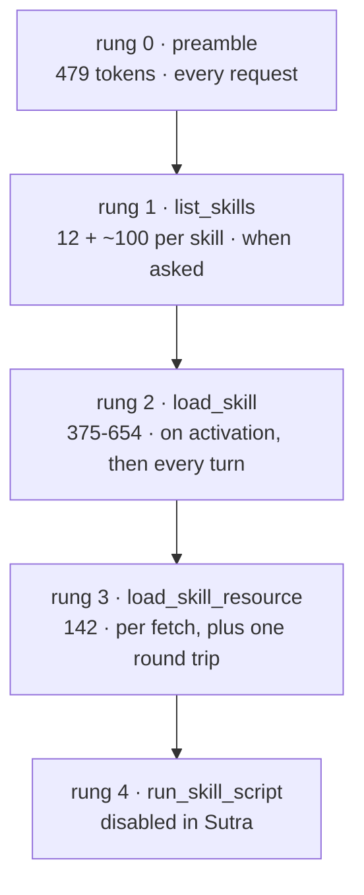

# 1.1 — Five rungs, five frequencies

## One-line answer

Progressive disclosure is not a loading order, it is five **budgets** paid at five different
frequencies — and the whole of skill design is deciding which frequency a piece of knowledge should be
paid at.

## The story

Three people pay for the same gym in three different ways.

One pays a yearly membership by standing order. It leaves her account on the fourth of every month
whether she goes or not, and in February she did not go once. Another buys a day pass at the desk when
he happens to be nearby, so the months he is busy cost him nothing. The third does both — she has the
membership, and she also buys a bottle of water from the machine inside almost every time, one at a
time, at a price that would be absurd as a monthly bill.

Nobody is being cheated. The building costs what it costs. What differs is **when** each of them
pays, and that single difference is why one of them is annoyed in February, one is annoyed on the day
he goes four times in a week, and one has never thought about it at all.

## The idea in plain language

Day 25 described three rungs from the format's point of view: the card, the body, the files
([25.3.3](../../../day-25-skills-the-open-spec/parts/03-the-body-and-the-folders/3.3-progressive-disclosure.md)).
Day 26 measured what ADK actually does and found **five**, because the framework adds one below and the
tool call is not free
([26.2.2](../../../day-26-loading-skills-into-adk/parts/02-the-four-tools/2.2-the-index-is-a-tool-call.md)).

Design happens on the frequency column, not on the token column:

| Rung | What | Tokens, measured | Paid | Frequency |
| --- | --- | --- | --- | --- |
| 0 | the toolset preamble | **479** | every request | always, whether skills are used or not |
| 1 | the index, one block per skill | **12 + 93 to 109 each** | when the model calls `list_skills` | once per conversation that asks |
| 2 | the body | **375 to 654** | on activation, and **every turn after** | per skill activated |
| 3 | one reference file | **142** | when a link is followed | per fetch |
| 4 | a script | — | never, in Sutra | disabled |

Every number in that table was measured on 2026-09-04 against `gemini-3.7-flash` and Sutra's own two
skills. Read the **Frequency** column and three design rules fall out of it, in order of how much they
matter.

**Rung 0 is not a design variable.** 479 tokens, fixed, unaffected by anything you write. You can only
decide whether to have skills at all.

**Rung 2 is the one that multiplies.** An activated body is carried on every subsequent turn of the
conversation
([24.1.2](../../../day-24-token-accounting-and-budgets/parts/01-what-a-request-costs/1.2-charged-again-every-turn.md)).
`ticket-triage`'s 654 tokens on a ten-turn conversation is about 5,900 tokens, not 654. That
multiplication is the single largest lever in skill design and it is invisible if you measure one
request.

**Rung 3 is cheap in tokens and expensive in requests.** 142 tokens for the rubric — and one whole
model round trip to fetch it, which on twenty generations a day is five per cent of the budget
([26.5.1](../../../day-26-loading-skills-into-adk/parts/05-in-production/5.1-what-a-skill-really-costs-here.md)).
On a paid tier rung 3 is nearly free; on Sutra's it is the most expensive rung per byte in the whole
table.

That last row is why this day exists rather than being a paragraph in Day 25. The advice *"move detail
into `references/`"* is correct on a token budget and can be **wrong** on a request budget, and nothing
tells you which you are on except measuring.

## Why Sutra needs it

Because Sutra now has two real skills, seven steps, one reference and a rubric that will grow — and
every future decision about them is a choice of rung.

Should the worked example be in the body or behind a link? Should the rubric come back into the body
now that it is only 142 tokens? Should the two skills be one? Every one of those is *"which frequency
should this be paid at?"*, and until today the answer has been reasoning. From here it is arithmetic
plus one judgement about how often the knowledge is needed.

There is also a limit worth knowing before designing against it. The specification recommends a body
under about **5,000 tokens** and a `SKILL.md` under **500 lines**
([25.3.1](../../../day-25-skills-the-open-spec/parts/03-the-body-and-the-folders/3.1-the-body-is-loaded-whole.md)).
`ticket-triage` is at 654 — thirteen per cent of the recommendation. Sutra is nowhere near the ceiling,
which means the constraint that actually binds is not the spec's number. It is the multiplication in
rung 2 and the round trip in rung 3.

## The mechanism

The five rungs are observable in one place: the tool calls a run makes, in order. Each call is a rung,
and each rung has a price.



And the arithmetic that turns those numbers into a decision, written out for one realistic
conversation — five turns, triage activated on turn two, rubric fetched on turn three:

```text
turn 1  preamble 479                                            = 479
turn 2  preamble 479 + index 214 + activation 654               = 1347
turn 3  preamble 479 + body 654 + rubric 142                    = 1275
turn 4  preamble 479 + body 654 + rubric 142                    = 1275
turn 5  preamble 479 + body 654 + rubric 142                    = 1275
                                                          total = 5651
```

**Line by line:**

- The index is paid **once**, on turn 2, because the model listed the skills there. It does not repeat:
  a tool result stays in the conversation the same way anything else does, but it is not re-sent as a
  new block on each turn — it is part of the history. The 214 appears once and then rides along in the
  transcript.
- The **body** appears on turns 2 through 5. That is the multiplication: 654 spent once, carried four
  times.
- The rubric behaves identically from turn 3 onward. 142 tokens fetched once, carried three times.
- The preamble is on every line, including turn 1 where no skill is involved at all. Over five turns it
  is 2,395 tokens — **more than the body** — for a feature that was not used on the first turn and was
  used on one step of the second.
- The total is about **5,650 tokens of skill machinery** for one triage conversation. Whether that is
  cheap depends entirely on what you are comparing it with, which is the point of measuring it.

Now the same conversation counted in the currency Sutra actually rations:

```text
turn 1  the answer                                    1 generation
turn 2  list_skills + load_skill + the answer         3 generations
turn 3  load_skill_resource + the answer              2 generations
turn 4  the answer                                    1 generation
turn 5  the answer                                    1 generation
                                              total = 8 of 20
```

**Line by line:**

- Each **tool call is a round trip**: the model emits the call, the runtime answers, the model is asked
  again. That is what makes rung 1 and rung 3 expensive here and nearly free on a paid tier.
- Eight of twenty for one conversation. Two such conversations and the day is over, which is the
  constraint every design decision in this day is made against
  ([24.2.3](../../../day-24-token-accounting-and-budgets/parts/02-two-ceilings/2.3-denominated-in-quota-not-dollars.md)).
- Turn 3's fetch costs a generation to deliver 142 tokens. Inlining the rubric would make turn 3 one
  generation and add 142 tokens to turns 2 through 5 — **568 tokens to save one request**. On this tier
  that is a good trade, and [1.4](1.4-moving-the-example.md) is where a similar trade turns out to be a
  bad one.

## When it breaks

**Counting one request instead of one conversation.** The most common error, and it under-reports rung
2 by a factor of however many turns follow the activation. Any statement about what a skill costs that
does not say *per conversation* is describing the cheapest possible case.

**Optimising rung 0.** It is the biggest single number in the table and it cannot be changed. Time
spent shrinking the agent's own instruction to offset it is time spent on the wrong number — although
the instruction should be short anyway, for the reasons Day 6 gave
([6.1.5](../../../day-06-instructions-and-personas/parts/01-writing-the-handbook/1.5-every-line-is-a-tax.md)).

**Designing against the spec's 5,000-token body limit.** Sutra's largest body is 654. A team that
treats 5,000 as the target will write bodies seven times larger than they need and never breach the
recommendation once. The recommendation is a ceiling, not a budget.

**Assuming a fetch is free because the file is small.** 142 tokens and one round trip. On a paid tier
that is the right instinct; on a rate-limited one it is backwards, and the same design decision has
opposite answers on the two tiers.

## In production

**Write down which currency you are optimising, at the top of the design document.** Tokens or
requests. They disagree, they disagree specifically about rung 3, and a team where two people are
optimising different currencies will argue for a week without discovering that they agree about the
facts.

**Measure per conversation, and use a realistic turn count.** The number that belongs on a dashboard is
tokens-per-conversation split by whether a skill was activated. Day 26's activation register gives you
the split for free
([26.3.3](../../../day-26-loading-skills-into-adk/parts/03-wiring-the-toolset/3.3-activation-is-a-line-in-state.md)).

**Re-measure rung 0 on every framework upgrade.** It is a string literal in the package, it is the
largest fixed cost, and nothing in your code changes when it does
([26.5.2](../../../day-26-loading-skills-into-adk/parts/05-in-production/5.2-experimental-means-experimental.md)).

**What changes at scale** is that rung 1 stops being negligible. Two skills is 214 tokens; forty
skills of the same size is about 4,000, delivered in one tool result on every conversation that asks.
At that point rung 1 joins rung 2 as a multiplying cost, and the design answer is not shorter
descriptions — it is a searchable index instead of a listed one, which is
[5.1](../05-in-production/5.1-when-the-index-outgrows-listing.md).

**The review comment a senior engineer leaves:** *"this design doc compares a 654-token body against a
142-token reference and concludes we should move more out. Both numbers are per-conversation multiples
and the fetch is also a round trip. Redo the comparison over five turns and in requests, and the
conclusion may well flip."*

**The interview question:** *"what is progressive disclosure actually buying you?"* The answer that
shows you have priced it: *"a choice of payment frequency. There are five rungs in our client and each
is paid at a different rate — a fixed 479-token preamble on every request, an index when the model
asks, a body on activation that is then carried on every subsequent turn, and a reference per fetch.
The body's multiplication across turns is the biggest lever, and the reference fetch costs a whole
model round trip, which on a rate-limited tier makes it the most expensive rung per byte. So the design
question is never 'is this big?' — it is 'how often should this be paid for?'"*

## Check yourself

Take the five-turn table above and redo it for a conversation that activates **both** skills on turn
two and never fetches a reference. Then do it for one that activates nothing at all.

**Out loud, without scrolling up:** name the five rungs and the frequency each one is paid at, and say
which rung is the most expensive per byte on Sutra's tier.

**Next:** [1.2 — Pricing your own shelf](1.2-pricing-your-own-shelf.md).
