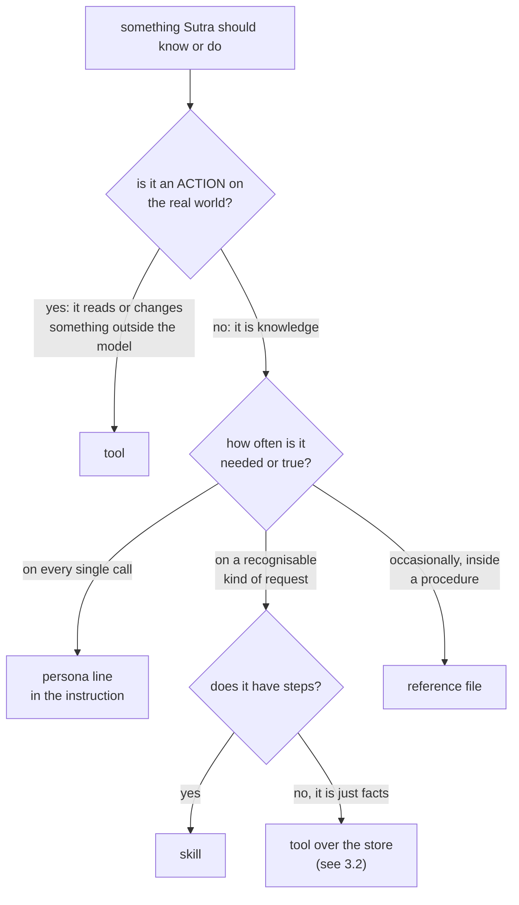

# 3.1 — Four containers, one property

## One-line answer

Anything Sutra should know or do goes into exactly one of four containers — a **tool**, a **skill**, a
**persona line**, or a **reference file** — and which one is decided by a property of the thing itself,
not by which container you happen to be building this week.

## The story

The new assistant at the chemist's shop is told four things on her first morning, and all four are
said in the same tone of voice.

*"The card machine is there, that button takes the payment."* *"When somebody brings a prescription:
check the name, check the date, check we have it, count it out, label it, and read the dose back to
them."* *"We never guess. If the handwriting is unclear we phone the clinic, every time, no
exceptions."* *"And that thick red book behind you has every drug that clashes with every other drug —
look it up when something does not sit right."*

By Friday she has them sorted, and nobody sat down and explained the difference. She sorted them
because each one **behaves** differently. One is a thing you press. One is a sequence you walk through
when a particular kind of person walks in. One is never not true. And one is a book you go and open,
maybe once a week.

The owner could not have written that distinction down. She has simply never once phoned the clinic by
pressing a button, or counted out tablets by looking something up in the red book.

## The idea in plain language

Sutra now has four places to put something, and until today the choice has been made one case at a
time, on instinct.

A **tool** is an action, executed by code. `lookup_ticket("4521")` reads a real record and returns
what is actually there. The model cannot do it by writing convincing words; it has to ask, and
something else does the work
([10.1.1](../../../day-10-function-tools/parts/01-the-form-fills-itself/1.1-the-declaration-you-no-longer-write.md)).

A **skill** is a procedure: multi-step know-how for a kind of task, written as reviewable prose and
loaded when the model decides it is relevant
([25.1.1](../../../day-25-skills-the-open-spec/parts/01-what-a-skill-is/1.1-a-skill-is-a-folder.md)).
`ticket-triage` is seven steps for one kind of request.

A **persona line** is an identity or a standing value, and it lives in the agent's instruction. It is
sent on every single request, whatever the question is
([6.1.1](../../../day-06-instructions-and-personas/parts/01-writing-the-handbook/1.1-handbook-not-a-wish.md)).
*"You work for the support engineers, not for the customer"* is true when triaging, true when drafting
a reply, and true when somebody asks what the weather is.

A **reference file** is long detail consulted occasionally from inside a procedure. It sits in the
skill's `references/` folder and is fetched by name when the model follows a link
([26.2.4](../../../day-26-loading-skills-into-adk/parts/02-the-four-tools/2.4-the-third-rung-and-its-fence.md)).
`severity-rubric.md` is Sutra's only one.

Now the part that matters. Each container is defined by **one property**, and the property is a fact
about the knowledge, not a preference of the author:

| The thing is… | Container | The property that decides it | Sutra's example |
| --- | --- | --- | --- |
| an action with typed inputs, done by code | **tool** | the model must **request** it and can never imitate it | `lookup_ticket` |
| a procedure: several steps for a kind of task | **skill** | it is needed **sometimes**, on a recognisable trigger | `ticket-triage` |
| an identity or a standing value | **persona line** | it is true on **every** call, so it must never depend on a decision | *"you work for the support engineers"* |
| long detail consulted inside a procedure | **reference file** | it is needed **occasionally**, and paying per fetch beats paying per turn | `severity-rubric.md` |

Read the third column on its own and the four rows stop looking like four kinds of file. They are four
answers to two questions: **can the model do this by writing words, or must something else do it?** and
**how often is it true or needed?**

That is the whole test, and it is why the choice is not a matter of taste. A thing that must never be
skipped cannot live somewhere that is loaded on a decision. A thing that reads a live record cannot
live in prose, because prose can be imitated and a record cannot.

## Why Sutra needs it

Because every day from here adds something, and the default place to put it is whichever container was
built most recently.

Day 27 built two skills. The next new rule, the next new fact, the next new capability will therefore
arrive as a proposal for a third skill — not because it is a procedure, but because skills are the
thing on everybody's mind. Day 29 sources skills from outside and every one of them arrives already
packaged as a skill, whether or not it is one. Day 30 tests them. By Phase 8 there are several agents
and the same question is being answered four times by four people.

There is also a specific decision waiting. Sutra's KB is two articles behind `search_kb`. Somebody will
propose pasting them into `ticket-triage`'s body so the model does not have to search — and the whole
of [3.2](3.2-the-two-boundary-cases.md) is about why the answer is no, in property words rather than
in taste words.

## The mechanism

The two questions, as a tree. Read it top to bottom and it lands on exactly one container.



The tree is not the interesting artefact, though. This is: what Sutra currently keeps in each of the
four, read out of the repository rather than out of anybody's memory.

```python
# days/day-28-progressive-disclosure-design/lab/containers.py
"""Where Sutra keeps each of the four kinds of thing, read from the repository itself."""

import pathlib

from google.adk.skills import load_skills_from_dir

from sutra.loop import TOOLS

skills = sorted(load_skills_from_dir(pathlib.Path("skills")), key=lambda s: s.name)
references = [f"{s.name}/{r}" for s in skills for r in s.resources.list_references()]

print(f"{'container':<12}{'count':>6}  where")
print(f"{'tool':<12}{len(TOOLS):>6}  sutra/loop.py TOOLS: {', '.join(sorted(TOOLS))}")
print(f"{'skill':<12}{len(skills):>6}  skills/: {', '.join(s.name for s in skills)}")
print(f"{'persona':<12}{1:>6}  sutra/desk/agent.py INSTRUCTION")
print(f"{'reference':<12}{len(references):>6}  {', '.join(references) or '(none)'}")
```

**Line by line:**

- `from sutra.loop import TOOLS` reads the **dispatch table**, which is the only honest list of Sutra's
  actions. A hand-written list in this script would be a fifth place where the truth lives, and Day 27
  spent a whole part on what that costs
  ([27.2.1](../../../day-27-authoring-first-skills/parts/02-what-leaves-the-prompt/2.1-one-fact-one-home.md)).
- `load_skills_from_dir(pathlib.Path("skills"))` is the **bulk** loader, which is all-or-nothing: one
  unreadable folder and the whole call raises
  ([26.4.1](../../../day-26-loading-skills-into-adk/parts/04-failure-lab/4.1-one-bad-folder.md)). That is
  acceptable in a report you are watching and unacceptable at startup, which is why
  `sutra/desk/skills.py`'s `load_shelf` loops with `load_skill_from_dir` instead and collects the folders
  that failed. Verified against the installed `google-adk==2.7.1` and against `https://adk.dev/skills/`
  on 2026-09-04.
- `s.resources.list_references()` returns the reference **keys**, which are bare filenames without the
  `references/` prefix — the body's link carries the prefix and the key does not, which is two spellings
  of one file
  ([26.2.4](../../../day-26-loading-skills-into-adk/parts/02-the-four-tools/2.4-the-third-rung-and-its-fence.md)).
- The persona row is hard-coded to `1`, and that is not laziness. **There is exactly one instruction, by
  construction**, and being the only one is the property that makes it the persona container: two
  competing identities would be two documents that disagree on every call
  ([6.1.4](../../../day-06-instructions-and-personas/parts/01-writing-the-handbook/1.4-contradictions-are-randomised-behaviour.md)).
- `or '(none)'` so an empty shelf prints a word rather than an empty column. A blank in a report reads
  as a bug in the report.
- **Zero model calls**, no key. Everything here is a directory listing and a dictionary.

Run it from the repository root:

```bash
uv run python days/day-28-progressive-disclosure-design/lab/containers.py
```

**Line by line:**

- Run from the root, because `skills/` is anchored there and `sutra` has to be importable. **Zero
  generations.**

Against the finished Day 27 shelf it prints:

```text
container    count  where
tool             2  sutra/loop.py TOOLS: lookup_ticket, search_kb
skill            2  skills/: kb-answer-style, ticket-triage
persona          1  sutra/desk/agent.py INSTRUCTION
reference        1  ticket-triage/severity-rubric.md
```

Six items in four containers, and every one of them is where it is for a stated reason. That is worth
saying out loud, because the same six items would fit in one container. Every tool could have been
described in prose inside a skill. Every skill could have been pasted into the instruction. The rubric
could be a section of the body. Nothing would fail to load, and nothing would go red.

The reason not to is in the third column of the table above, and [3.3](3.3-what-a-misfiling-costs.md)
prices each of those four collapses.

## When it breaks

**An action described in prose instead of given as a tool.** The body says *"look up the ticket and read
its title"* and no tool is provided. The model does the only thing it can and writes a plausible ticket:

```text
Ticket 4521: "Login issues on the web app", reported yesterday, Pro plan.
```

Every word of that is invented. Ticket 4521's real title is *"Keeps getting logged out"*, and the
difference is not detectable in the answer — it is only detectable in the event stream, where no
`lookup_ticket` call appears
([27.4.2](../../../day-27-authoring-first-skills/parts/04-the-authoring-loop/4.2-which-rung-did-it-climb.md)).
This is the most expensive container error available and it produces the most confident output.

**A standing rule written into a skill body.** It applies on the runs where the skill was activated and
nowhere else, which reads as an intermittent bug in the model rather than as a placement error. That is
[3.2](3.2-the-two-boundary-cases.md)'s first boundary case.

**Facts pushed into the description to make them findable.** The description field is validated, and it
refuses at 1024 characters:

```text
pydantic_core._pydantic_core.ValidationError: 1 validation error for Frontmatter
description
  Value error, description must be at most 1024 characters. Description length: 1104 [type=value_error, input_value='xxxxxxxxxxxxxxxxxxxxxxxx...xxxxxxxxxxxxxxxxxxxxxxx', input_type=str]
    For further information visit https://errors.pydantic.dev/2.13/v/value_error
```

Reproduced against `google-adk==2.7.1` on 2026-09-04. The limit is a courtesy, not the reason: a
description is a routing row ([2.1](../02-descriptions-as-routing/2.1-a-description-is-a-routing-row.md))
and content in it dilutes the triggers long before the validator complains.

**A reference file that is really a second procedure.** `references/` is for detail consulted from
inside one procedure. A file in there with its own numbered steps is a skill that has been hidden behind
a link, and it will only ever run when the model happens to follow that link.

## In production

**Write the container in the pull request title, not in the diff.** *"Add refund handling"* tells a
reviewer nothing; *"Add refund handling as a skill"* invites the only question worth asking, which is
whether it is one. The four-word job test catches a bad scope
([27.1.2](../../../day-27-authoring-first-skills/parts/01-extraction/1.2-one-job-four-words.md)); the
four-container test catches a bad **home**, and they are different mistakes.

**Keep the table in `skills/README.md`, with your own examples in the fourth column.** A generic
decision table is read once. A table whose examples are files in this repository is read every time
somebody is unsure, because it answers with something they can go and open.

**What changes at scale** is that the containers acquire different owners, and the boundary becomes
political rather than technical. Tools belong to engineering, skills to whoever owns the procedure,
the persona to whoever owns the product's voice, references to whoever owns the policy. A thing put in
the wrong container is now also being maintained by the wrong team, and the fix requires two teams to
agree rather than one file to move. That is why the decision is worth making explicitly on the day the
thing arrives, while it is still one file.

**The review comment a senior engineer leaves:** *"this is a skill that says 'always attach the ticket
id to the reply'. That is true on every reply we ever send, so it is not a procedure — it is a line in
the instruction, or a callback if we would call a violation an incident. As a skill it applies only on
the runs where the model happened to load it, and we will never know which those were."*

**The interview question:** *"how do you decide whether something should be a tool, a skill, or part of
the prompt?"* The answer that shows you have a test rather than a habit: *"two questions. Is it an
action on the real world — does it read or change something outside the model? If yes it is a tool,
because the model can imitate prose and cannot imitate a record. If it is knowledge, then how often is
it needed: on every call, and it goes in the instruction, because anything that must always hold cannot
sit somewhere that loads on a decision. On a recognisable kind of request, and it is a skill.
Occasionally, from inside a procedure, and it is a reference file. Size never enters that test, which is
the part people get wrong — they move things because they are long, not because of how often they are
needed."*

## Check yourself

```bash
uv run python days/day-28-progressive-disclosure-design/lab/containers.py
```

Then route these five without scrolling up, saying the property out loud for each one: *"always append
the ticket id to every reply"*; *"the fourteen-step procedure for issuing a refund"*; *"actually close a
ticket in the tracker"*; *"the three-page summary of refund law that the refund procedure cites"*;
*"never reveal another customer's data"*.

**Out loud, without scrolling up:** name the four containers and the one property that decides each,
and say which two of the five above land in the same container.

**Next:** [3.2 — The two boundary cases](3.2-the-two-boundary-cases.md).
