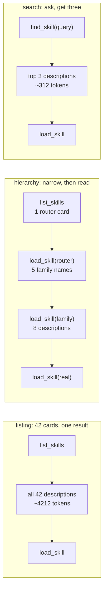

# 5.1 — When the index outgrows listing

## One-line answer

At around forty skills, listing every description stops working on three fronts at once — the index
costs about four thousand tokens, the margins collapse to zero even when every description is
individually excellent, and **the audit from section 2 starts reporting good news** — and the answers
are structural: a hierarchy, or search instead of listing.

## The story

The lending library in the town started as one room with four bookcases.

You browsed. You went in, walked along the shelves, and by the time you had done one wall you had a
reasonable idea of what was there. Nobody needed a system, and the librarian would have found one
faintly insulting.

Then the extension was built and there are four floors. Nobody browses four floors. What happens instead
is two things, and both of them appeared without anyone deciding: there are big signs at the top of each
staircase saying *Fiction*, *Reference*, *Children*, *Local history* — so you narrow before you walk —
and there is a catalogue by the door where you type a title and it tells you the shelf.

The books did not get worse. The room got bigger, and browsing is a thing that only works in a room you
can see the end of.

## The idea in plain language

Everything in this day so far assumes a shelf you can read. Two skills. Six standard requests. A margin
you can trace to a single word. That assumption expires, and this part is where three earlier parts said
it would.

The expiry has three symptoms, and only the first one is the one people expect.

**The index becomes a fixed cost.** Forty skills at the roughly hundred tokens per card that
[1.2](../01-the-price-list/1.2-pricing-your-own-shelf.md) measured is about four thousand tokens,
delivered in one tool result to every conversation that asks about skills — including the conversations
that go on to use none of them. That is more than eight times Sutra's fixed 479-token preamble
([1.1](../01-the-price-list/1.1-five-rungs-five-frequencies.md)), and it grows every time anybody adds
anything.

**The margins collapse even when nothing is badly written.**
[2.4](../02-descriptions-as-routing/2.4-the-crowded-shelf.md) crowded the shelf with four deliberately
mushy decoys and watched every margin drop. This part does the honest version: forty skills, each one
sharply scoped, each one naming a real and different job, each one written to the house shape. The
margins collapse anyway, because the domain vocabulary is finite. Forty descriptions of support-desk
work will all contain *ticket*, *customer* and *support*, and there is no way to write them so they do
not.

**And the audit starts lying.** This is the symptom nobody expects and it is the most dangerous of the
three. [2.2](../02-descriptions-as-routing/2.2-coverage-orthogonality-specificity.md) measured shared
filler as the **intersection** of every card's vocabulary, and specificity as the words a card does not
share with all the others. On a two-skill shelf both are informative. On a forty-two-skill shelf the
intersection is empty — one card with a different vocabulary empties it — so the check reports **no
shared filler at all**, and specificity goes *up* because there is nothing left to subtract. Two numbers,
both improving, on a shelf that has just become unroutable.

The way out is not better writing. It is a different shape, and there are two:

**Hierarchy.** One routing skill at the top whose body names the families; a skill per family whose body
names its members. You narrow before you read, the way the staircase signs do.

**Search instead of listing.** Replace *"here are all forty cards"* with *"here are the three cards
closest to what was asked"*. The catalogue by the door.

## Why Sutra needs it

Because three parts of this day have already promised this one, and each promise was a real debt.

[1.2](../01-the-price-list/1.2-pricing-your-own-shelf.md) said to put a ceiling on the index and fail the
build at it, and pointed here for the failure the ceiling guards against.
[2.2](../02-descriptions-as-routing/2.2-coverage-orthogonality-specificity.md) said that at forty skills
specificity stops being achievable by writing and starts requiring structure, and pointed here for the
structure. [2.4](../02-descriptions-as-routing/2.4-the-crowded-shelf.md) said the crowding stops being
fixable by curation, and pointed here for what replaces curation.

Sutra is at two skills, which is exactly why this is worth building the measurement for now. An
instrument first run on a broken shelf cannot be calibrated
([2.2](../02-descriptions-as-routing/2.2-coverage-orthogonality-specificity.md)), and a structural change
adopted before the shelf is a mess is a design decision, while the same change adopted afterwards is a
migration.

There is a dated reason too. Day 29 builds an Agent Registry endpoint, which is a searchable index over
skills that Sutra does not own. Knowing today why a searchable index beats a listed one is what stops
that endpoint being treated as a distribution detail.

## The mechanism

Forty plausible, well-scoped skills, generated rather than written, put beside Sutra's real two.

```python
# days/day-28-progressive-disclosure-design/lab/forty_skills.py
"""What a forty-skill shelf does to the index, to the margins, and to the audit itself."""

import pathlib

from google.adk.skills import load_skills_from_dir, models

from route import REQUESTS, card, report, words

CARD_TOKENS = 100  # 1.2 measured 93 and 109 for Sutra's two cards
ENVELOPE = 12  # 1.2 measured the empty <available_skills> block

SUBJECTS = [
    ("account-merge", "merging two duplicate accounts"),
    ("api-key-rotation", "rotating an API key"),
    ("billing-dispute", "a disputed charge on an invoice"),
    # ... thirty-six more, one line each, in the lab file ...
    ("webhook-debug", "a webhook that stopped firing"),
    ("accessibility-request", "a screen reader problem"),
]


def filler(name: str, subject: str) -> models.Skill:
    """A plausible, sharply-scoped desk skill, written to the house shape."""
    return models.Skill(
        frontmatter=models.Frontmatter(
            name=name,
            description=(
                f"The support desk procedure for {subject}. "
                f"Use when a ticket or a customer question is about {subject}."
            ),
        ),
        instructions=f"# {name}\n\n1. Do the first step.\n",
    )


real = sorted(load_skills_from_dir(pathlib.Path("skills")), key=lambda s: s.name)
big = sorted(real + [filler(n, s) for n, s in SUBJECTS], key=lambda s: s.name)
scored = [r for r in REQUESTS if r != "what time do you close"]

print(f"skills on the shelf  : {len(big)}")
print(f"index, if asked      : ~{ENVELOPE + CARD_TOKENS * len(big)} tokens")
print(f"pairs to review      : {len(big) * (len(big) - 1) // 2}")
print(f"cards using 'ticket' : {sum('ticket' in words(card(s)) for s in big)}")
print()
print(f"ties: {report(big, scored)}")
common = set.intersection(*(words(card(s)) for s in big))
print(f"\nshared filler across all {len(big)}: {sorted(common)}")
for skill in real:
    print(f"{skill.name:<18}{len(words(card(skill)) - common):>3} words of its own")
```

**Line by line:**

- `SUBJECTS` holds forty **real support-desk jobs** — refunds, SSO, GDPR erasure, a bouncing email
  address. This is the honest experiment and it is the opposite of
  [2.4](../02-descriptions-as-routing/2.4-the-crowded-shelf.md)'s: nothing here is mush, every name is a
  job rather than a role, and every one of them would pass the four-word test
  ([27.1.2](../../../day-27-authoring-first-skills/parts/01-extraction/1.2-one-job-four-words.md)).
- The description is **generated from a template** so all forty are written to the same shape by
  construction. That is more uniform than a real shelf and it makes the shared vocabulary starker than it
  would be in practice — the finding is directional, not a prediction of your exact numbers. It is also
  why they are generated: forty hand-written descriptions would smuggle the author's opinion into the
  result.
- `CARD_TOKENS = 100` is a **rounded measurement**, and the comment says which two numbers it is rounded
  from. The index line prints a `~` for the same reason: the true figure needs `count_tokens` and this
  script deliberately runs without a key.
- `pairs to review` is `n(n-1)/2` because reviewing descriptions for collisions is a pairwise job and
  nobody does it pairwise past about five. Printing the number is the cheapest possible argument against
  *"we will just review them carefully"*.
- `cards using 'ticket'` counts how many descriptions contain the single most central word in the domain.
  It is one line and it is the whole explanation for the margins below.
- `report` and `REQUESTS` are imported from `route.py` unchanged, so this table is directly comparable
  with the ones in [2.3](../02-descriptions-as-routing/2.3-measuring-routing-without-a-model.md),
  [2.4](../02-descriptions-as-routing/2.4-the-crowded-shelf.md) and
  [4.2](../04-the-three-axes/4.2-refactoring-the-overloaded-skill.md).
- The last three lines re-run [2.2](../02-descriptions-as-routing/2.2-coverage-orthogonality-specificity.md)'s
  audit on the big shelf **on purpose**, to see what the audit says. What it says is the third finding.
- **Zero model calls**, no key.

Run it from the lab directory:

```bash
cd days/day-28-progressive-disclosure-design/lab
uv run python forty_skills.py
cd -
```

**Line by line:**

- From the lab, so `route.py` resolves as a sibling. **Zero generations.**

Measured on 2026-09-04:

```text
skills on the shelf  : 42
index, if asked      : ~4212 tokens
pairs to review      : 861
cards using 'ticket' : 41

how urgent is this ticket                ticket-triage         2  margin  1
what priority should this ticket get     ticket-triage         2  margin  1
triage this ticket for me                ticket-triage         2  margin  1
draft a reply to the customer on this    webhook-debug         2  margin  0
how do we word an answer that cites a    kb-answer-style       4  margin  4
can you take a look at this ticket       ticket-triage         2  margin  1
ties: 1

shared filler across all 42: []
kb-answer-style    21 words of its own
ticket-triage      28 words of its own
```

Four things, and the fourth is the one to take away.

**The index is about 4,212 tokens**, against 214 for two skills. It is paid by every conversation that
asks, and 861 pairs is the number a reviewer would have to hold in their head to audit it by reading.

**Every margin on the shelf is 1 or 0**, and `kb-answer-style` has lost *"draft a reply to the customer
on this ticket"* to **`webhook-debug`** — a skill about webhooks, winning a request about writing a
reply, on a two-all tie broken by sort order. Both match `ticket` and `customer`; only one of them is
about replies, and the scorer cannot tell. Forty-one of forty-two cards contain the word `ticket`, and
that is not a writing failure. There is no honest description of a support-desk procedure that avoids the
word *ticket*.

**One request is untouched.** *"How do we word an answer that cites a KB article"* still wins by four, on
`word`, `answer`, `cites` and `article` — vocabulary none of the forty needed. That is the same row that
survived [2.4](../02-descriptions-as-routing/2.4-the-crowded-shelf.md), and it is the same lesson: what
survives crowding is a vocabulary nobody else has a reason to use. It is also a warning, because you get
about one of those per shelf.

**And the audit reports good news.** `shared filler across all 42: []` — *no shared filler*. Specificity
has risen from 17 and 24 to 21 and 28. Both of
[2.2](../02-descriptions-as-routing/2.2-coverage-orthogonality-specificity.md)'s numbers moved in the
reassuring direction on the worst shelf in this day.

The reason is that `set.intersection` needs a word in **every** card, and one card with a different
vocabulary empties the set. Count instead of intersecting and the picture is the true one:

```text
support     41 of 42 cards
procedure   41
customer    41
ticket      41
about       40
question    40
desk        40
```

Seven words in forty of forty-two cards, and the intersection metric called that zero. **The upgrade is a
frequency threshold** — words appearing in more than half the cards — and it is a two-line change that
nobody makes until the metric has already been believed once.

Now the two shapes that fix the index, side by side:



And the same three, priced on the two currencies this day has been using throughout:

| Shape | Rung 1 tokens | Extra round trips | Audited by |
| --- | --- | --- | --- |
| list all 42 | ~4,212 | 0 | 861 pairs, by reading |
| one router, five families of eight | ~1,000 across three loads | **2** | pairs within a family — 28 each |
| search, top three | ~312 | 0 | the query log |

**Search wins on both currencies**, which is unusual in this day and is why it is what large systems
actually do. Hierarchy trades about three thousand tokens for two extra model round trips, and on Sutra's
twenty-a-day budget two round trips is ten per cent of the day
([1.1](../01-the-price-list/1.1-five-rungs-five-frequencies.md)) — so on this tier hierarchy is the worse
of the two structural answers, and on a paid tier it is a reasonable one.

Two honest caveats before anybody builds either.

**`find_skill` does not exist.** ADK's toolset gives you `list_skills`, which lists
([26.2.2](../../../day-26-loading-skills-into-adk/parts/02-the-four-tools/2.2-the-index-is-a-tool-call.md)).
A searchable index is something you add beside it as an additional tool, and it needs a scorer — word
overlap to begin with, which is `route.py`, and embeddings when synonyms start mattering
([2.3](../02-descriptions-as-routing/2.3-measuring-routing-without-a-model.md)). Day 29's Agent Registry
endpoint is where a searchable index over skills Sutra does not own lands.

**A router skill is a category skill**, and
[2.4](../02-descriptions-as-routing/2.4-the-crowded-shelf.md) says never to write one. The exception is
exact and it is the only one: a router is legitimate precisely because it is the **only** thing at its
level, so it has nothing to take a margin from. That is the same mechanism that made
[4.2](../04-the-three-axes/4.2-refactoring-the-overloaded-skill.md)'s overloaded skill route perfectly —
used deliberately this time, at a level where having one entry is the design rather than the bug.

## When it breaks

**Search that returns the wrong three.** The failure is now silent and total: the right skill was not in
the result, so the model never saw it and answered without it. With listing, a bad margin still put the
right card in front of the model. This is the trade search makes, and it means the top-k scorer is now a
component that needs its own test set — the fixed request list from
[2.1](../02-descriptions-as-routing/2.1-a-description-is-a-routing-row.md), asserted on *"is the right
skill in the top three"* rather than on a margin.

**A hierarchy whose families are as vague as the decoys were.** *Tickets*, *Customers*, *Admin*, *Other*.
The router now has four categories that match everything weakly, which is exactly
[2.4](../02-descriptions-as-routing/2.4-the-crowded-shelf.md)'s failure moved up a level and made
structural. Families have to be as orthogonal as descriptions do, and there are far fewer of them, which
makes it harder rather than easier.

**The extra round trip discovered in production.** Hierarchy is adopted for the token saving and nobody
prices the round trips, and then the daily budget runs out earlier than it used to. The first line of
the refusal is the same one Day 24 recorded, and it says nothing about why it arrived sooner:

```text
429 RESOURCE_EXHAUSTED
```

The body carries `limit: 20` and the model name, and the whole of it is quoted in
[24.2.2](../../../day-24-token-accounting-and-budgets/parts/02-two-ceilings/2.2-reading-the-ceiling-off-a-refusal.md).
This is Day 24's ceiling arriving through a design decision rather than through traffic, which is the
hardest version to diagnose because nothing about the traffic changed.

**The audit believed after it stopped working.** The one in this part's output. Nothing errors, the
numbers improve, and the shelf is unroutable. The general form is worth naming: **a metric defined on a
small collection often has a degenerate value on a large one**, and an intersection over everything is
the classic case. The guard is to re-derive what each metric means whenever the collection grows by an
order of magnitude, rather than watching the number.

## In production

**Put a token ceiling on the index and fail the build at it.** This is
[1.2](../01-the-price-list/1.2-pricing-your-own-shelf.md)'s recommendation with the number attached: the
index is what every asking conversation pays, it grows with every merge, and nobody watches it. Two
thousand tokens is a reasonable place to draw the line for a listed shelf, because it is roughly where a
reviewer stops being able to read the whole index in one sitting and well before the margins are gone.

**Switch shape before the ceiling, not at it.** Adopting search at twenty skills is a scorer and a test
set. Adopting it at eighty is a scorer, a test set, eighty descriptions rewritten to be searchable, and
an argument with everybody whose skill stopped being found. The cost of the change grows faster than the
shelf does.

**Keep the fixed request list growing with the shelf.** Six requests measure a two-skill shelf. They
measure a forty-skill shelf badly — most of the forty are never exercised at all, so a regression in
`gdpr-erasure`'s routing is invisible. One or two real requests per skill, from what people actually
typed, is the maintenance cost of having forty skills and is not optional.

**What changes at scale** past this point is that skill selection becomes a retrieval problem with all of
retrieval's furniture: an index that has to be rebuilt when a description changes, a top-k that has to be
tuned, a scorer that has to be evaluated, and a store that can be stale. That is Phase 7's subject
arriving from an unexpected direction — Day 49 builds retrieval over the ticket archive, and the same
machinery is what a large skill shelf needs. The useful thing to notice now is that it is the **same
problem**, so the honest sequence is listing while it works, search when it stops, and a real retrieval
index only when search stops.

**The review comment a senior engineer leaves:** *"this pull request takes us to twenty-three skills. The
index is over two thousand tokens on every conversation that asks and the worst margin is one. Before the
next batch goes in, we need either a hierarchy or a `find_skill` tool — and I would rather it were
`find_skill`, because a hierarchy costs us a model round trip per request and we are rate-limited, not
token-limited."*

**The interview question:** *"what happens to skill selection when you have hundreds of skills?"* The
answer that shows you have measured rather than imagined it: *"listing stops working, on three fronts.
The index becomes a fixed cost on every conversation — we measured about four thousand tokens at forty
skills. The margins collapse to zero even when every description is individually good, because the domain
vocabulary is finite: forty-one of our forty-two cards contained the word 'ticket'. And the audit itself
degrades, which is the one that caught us — we measured shared filler as a set intersection, and one card
with a different vocabulary empties it, so the check reported no shared filler on a shelf where seven
words appeared in forty cards out of forty-two. The structural answers are a hierarchy or search. Search
is better on both currencies for us because a hierarchy costs an extra model round trip per request and
we are rate-limited. And the moment you adopt search, the top-k scorer becomes a component with its own
test set, because a skill missing from the result is now invisible rather than merely low-ranked."*

## Check yourself

```bash
cd days/day-28-progressive-disclosure-design/lab
uv run python forty_skills.py
cd -
```

Cut `SUBJECTS` to ten and run it again: find the shelf size at which the worst margin first reaches zero,
and the size at which the shared-filler set first empties. Those two numbers are your shelf's two
warnings, and they do not arrive together.

**Out loud, without scrolling up:** name the three things that break at forty skills, say which of them
the audit hides, and give the reason search beats hierarchy on a rate-limited tier.

**Next:** [5.2 — Splitting the audience, not the index](5.2-splitting-the-audience.md).
