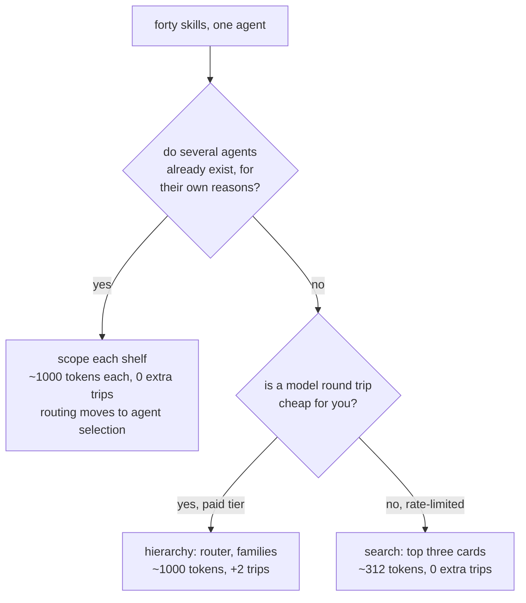

# 5.2 — Splitting the audience, not the index

## One-line answer

🅿️ The third answer to a shelf that has outgrown listing is to stop giving one agent the whole of it —
four agents with ten skills each pay a tenth of the index and audit forty-five pairs instead of eight
hundred — and it is free only if the agents exist for a reason of their own.

## The story

There are twenty-two keys on the ring in your pocket and you use four of them.

They accumulated. The front door, the gate, the meter cupboard, the terrace, the padlock on the water
tank, two from the old office, one from a bicycle that was sold, and several nobody can identify any
more. Every time you come home in the dark you go through them by feel, and you have developed a system
involving a bent one and the little rubber cover.

Somebody eventually suggests labelling them. It is a reasonable idea and it is not the fix — twenty-two
labels are as hard to read in the dark as twenty-two shapes. What actually fixes it is three small rings:
the four you use daily on one, the work ones on another, and the fifteen mystery keys in the drawer at
home where they cost you nothing.

You did not get rid of any keys. You stopped carrying all of them at once.

## The idea in plain language

[5.1](5.1-when-the-index-outgrows-listing.md) gave two answers to a forty-skill shelf: narrow before
reading, or search instead of listing. Both keep one agent facing all forty. There is a third, and it is
the one people reach for last because it does not look like a skills problem at all.

**Give each agent only the skills its requests need.** A shelf is a directory, and
`load_skills_from_dir` takes the path
([26.1.4](../../../day-26-loading-skills-into-adk/parts/01-loading-a-folder/1.4-the-whole-shelf.md)), so
a different shelf is a different argument. Four agents with ten skills each rather than one agent with
forty:

| | one shelf of 40 | four shelves of 10 |
| --- | --- | --- |
| index paid by an asking conversation | ~4,012 tokens | ~1,012 tokens |
| pairs a reviewer must compare | 780 | 45 per shelf, 180 in total |
| extra model round trips | 0 | 0 |

Both columns use [1.2](../01-the-price-list/1.2-pricing-your-own-shelf.md)'s measured hundred tokens per
card and its twelve-token envelope. The third row is the interesting one: unlike a hierarchy, splitting
the audience costs **no extra round trip**, because the narrowing happened before the request arrived
rather than during it.

And now the honest half, which is why this part is parked rather than built.

**The routing did not go away. It moved up a level.** Something still has to decide which agent handles a
request, and that something is doing exactly the job a skill index was doing, one level higher and with
four entries instead of forty. That is a genuine improvement — forty-way selection is hard and four-way
selection is not — but it is the same problem wearing a different hat, and it is Day 55's subject:
delegation, transfer and agent-as-tool.

**And it is only free if the agents already exist.** If a triage agent and a billing agent exist because
they have different owners, different tools and different escalation paths, then scoping their shelves
costs one argument to one function. If they do not exist, creating two agents to halve an index means
inheriting session boundaries, transfer logic and a whole new failure surface, in exchange for two
thousand tokens. That is a bad trade and it is the trap this part exists to name.

## Why Sutra needs it

Because Sutra will have several agents whether or not anybody plans it, and the shelves will be decided
by whoever wires the second one.

Phase 8 builds the multi-agent graph over Days 53 to 59: sequential and parallel patterns, delegation and
transfer, agent-as-tool. The moment there are two agents there are two `build_desk`-shaped calls, and the
default — because it is one line shorter — is to hand both of them `SHELF`. That default is a decision
nobody made, and it is the decision that determines whether the index problem in
[5.1](5.1-when-the-index-outgrows-listing.md) arrives at eighty skills or at twenty.

There is a nearer reason too. Day 29 installs third-party skills, and *"which agent should be able to see
this pack"* is a question the pack does not answer. Deciding it per shelf rather than per repository is
the difference between one agent gaining a sourced capability and every agent gaining somebody else's
routing collisions.

## The mechanism

Nothing is built today. What follows is the shape, so that Day 53 inherits a decision rather than an
accident.

`sutra/desk/skills.py` already takes the shelf as a defaulted argument
([27.3.2](../../../day-27-authoring-first-skills/parts/03-procedure-and-capability/3.2-honouring-the-contract.md)),
and `build_desk()` does not. One parameter closes that gap:

```python
# a sketch of sutra/desk/skills.py - NOT today's work, see the hub's TODO(me)

SHELF = pathlib.Path(__file__).resolve().parents[2] / "skills"


def build_desk(shelf: pathlib.Path = SHELF) -> Agent:
    """The desk agent, over one named shelf. The default is the whole of skills/."""
    skills, rejected = load_shelf(shelf)
    ...
```

**Line by line:**

- `shelf: pathlib.Path = SHELF` **defaults to today's behaviour**, so nothing that calls `build_desk()`
  changes. That is what makes this a one-line change rather than a migration, and it is why it is worth
  doing before there are four callers rather than after.
- The parameter is a **path**, not a list of skill names. A path means the split is visible in the file
  tree — `skills/triage/`, `skills/billing/` — and a reviewer can see which agent gets what without
  reading any Python. A list of names in code is the same split, kept somewhere nobody looks.
- `load_shelf` is unchanged and still returns `(skills, rejected)`, and `build_desk` still refuses to
  start when anything was rejected — Day 27's fail-fast decision
  ([27.3.2](../../../day-27-authoring-first-skills/parts/03-procedure-and-capability/3.2-honouring-the-contract.md)).
  Scoping the shelf narrows the **blast radius** of that refusal: today one bad folder stops the whole
  desk, and with four shelves it stops the one agent that owns it.
- The `...` is not a placeholder for something clever. The rest of the function is exactly what Day 27
  wrote, which is the point: scoping a shelf changes an argument and nothing else.
- **Not today's work.** There is one agent, two skills and no reason to split anything. Adding the
  parameter now would be future-proofing nobody asked for; knowing the shape now is what stops Day 53
  hard-coding `SHELF` in four places.

The three answers to a shelf that has outgrown listing, side by side, so the choice is made on the
situation rather than on which one was read most recently:



Read the first question carefully, because it is a question about the **system**, not about the shelf. If
the answer is no, splitting the audience is not an option that is available and expensive — it is not an
option at all, and the branch below is the real choice.

Two consequences of a split that are easy to miss, and both of them are about the same skill appearing on
two shelves.

**A skill on two shelves is one file, loaded twice.** `skills/triage/ticket-triage/` and
`skills/billing/ticket-triage/` as two copies is the store-pasted-into-a-body failure
([3.2](../03-four-containers/3.2-the-two-boundary-cases.md)) wearing different clothes: two documents,
one truth, and they will drift. A shared folder referenced by both shelves is the correct shape, and
whether that is a symlink, a build step or a third directory that both loaders read is a real decision
somebody has to make and write down.

**Each shelf gets its own routing gate run.** `routing_gate.py`
([2.3](../02-descriptions-as-routing/2.3-measuring-routing-without-a-model.md)) measures margins within
one shelf, because that is where the competition is. Four shelves is four runs with four request lists,
and a skill that moves between shelves has to be measured on both — it may have had a comfortable margin
on the shelf it left and none on the shelf it joined.

## When it breaks

**A request that needs the other agent's skill.** The billing agent is asked something that needs
`ticket-triage`, and it is simply not there. Nothing errors. The agent answers from its instruction and
the model never knew a procedure existed, which is
[26.4.3](../../../day-26-loading-skills-into-adk/parts/04-failure-lab/4.3-the-manual-nobody-opened.md)'s
failure — a manual nobody opened — with the manual now removed from the building. The activation register
shows the truth and nothing else does:

```text
ACTIVATED []
```

**Shelves split along the org chart instead of along the requests.** Support owns eight skills, billing
owns six, engineering owns four, so there are three shelves. Then a customer asks one question that
crosses two of them — which is most questions — and every such request needs a transfer. The split has
to follow what people ask, not who wrote the file, and those two rarely produce the same partition.

**The split adopted to fix an index, with no other reason.** Two agents now exist. There are two
instructions to keep consistent, two session stores, a transfer to get wrong, and one of them will
quietly drift into being the one everybody uses. The two thousand tokens saved are real and are the least
interesting thing that happened.

**The shared skill copied rather than shared.** Both shelves get their own `ticket-triage/` folder, both
are edited, and six months later the billing agent triages by an older rubric. The symptom is two
answers to the same question depending on which agent handled it, and there is no error at any layer —
the same silent divergence Day 27 measured between an instruction and a skill
([27.5.2](../../../day-27-authoring-first-skills/parts/05-failure-lab/5.2-two-notices-on-one-door.md)).

## In production

**Partition by request, then check it against the org chart.** Write down the twenty things people
actually ask, group them by which ones would be handled together by one person, and let the shelves fall
out of the grouping. If the result happens to match the teams, that is a good sign. If it does not, the
request grouping is the one to follow, and the mismatch is worth knowing about for reasons that have
nothing to do with skills.

**Make a shared skill physically shared, and say how in `skills/README.md`.** One folder, two shelves
reading it. The mechanism matters less than the fact that there is exactly one file — and the note is
what stops the next person "fixing" a confusing symlink by making a copy.

**Run the routing gate per shelf and put all of them in the pull request.** A skill that moves shelves is
a change to two shelves, and it is the arriving shelf that will be surprised. One combined number across
all shelves would hide the only case that matters.

**What changes at scale** is that the shelves become an interface between teams, and moving a skill
between them becomes a negotiation rather than a `git mv`. That is not a reason to avoid splitting; it is
a reason to split late and along the lines you expect to keep. The failure to avoid is a partition
adopted early for a token saving and then defended for years because unpicking it would touch four
agents.

**The review comment a senior engineer leaves:** *"this gives the new billing agent the whole of
`skills/`, which is nine skills, seven of which it will never use. Pass it its own shelf. And before you
do, run the routing gate on both shelves separately — `refund-approval` has a comfortable margin today
because it is the only refund skill on a support shelf, and it will be sitting next to three billing
skills that all say 'invoice'."*

**The interview question:** *"you have one agent with forty skills. What do you do?"* The answer that
shows you can tell a skills problem from an architecture problem: *"first I measure, because the three
symptoms arrive separately: the index cost, the margins collapsing, and the audit degrading. Then there
are three shapes. Search instead of listing — the model asks for the three closest cards rather than
receiving all forty — which is the cheapest on both tokens and round trips. A hierarchy, one router
leading to families, which costs an extra model round trip per request, so it is right on a paid tier and
wrong on a rate-limited one. Or scoping the shelf per agent, which costs nothing extra at request time
and only makes sense if the agents already exist for their own reasons. That last one is the trap: if you
create agents in order to shrink an index, you have taken on session boundaries and transfer logic to
save two thousand tokens, and you have moved the routing problem up a level rather than solving it."*

## Check yourself

Take the forty subjects from
[5.1](5.1-when-the-index-outgrows-listing.md)'s `forty_skills.py` and partition them into four shelves by
**what a person would ask**, not by who owns them. Then run `forty_skills.py` on one of your four
partitions and compare the worst margin with the whole-shelf run — and find the one skill whose margin got
worse rather than better, because there will be one.

**Out loud, without scrolling up:** name the three structural answers to a shelf that has outgrown
listing, say which of them costs an extra round trip, and give the condition under which splitting the
audience is a bad idea.

**Next:** back to [the hub](../../LESSON.md) for §11 and the commit. **There is no paper today** — this
is a craft day, and the one paper it leans on, *RouteLLM*, was taught on Day 9 and is cited as an address
from [2.1](../02-descriptions-as-routing/2.1-a-description-is-a-routing-row.md).
