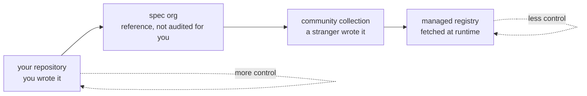

# 1.1 — The four doors skills come through

## One-line answer

A skill can reach your agent through four kinds of door — your own repository, the spec organisation's
examples, a community collection, or a managed registry — and naming which door a skill came through is
the first thing an audit records, because each door tells you something different about who wrote the
text and who can still change it.

## The story

You buy the day's vegetables, and where you buy them changes how carefully you look.

Some come from the patch behind your own house. You planted them, you watered them, and if something is
wrong with them it is your own doing — there is nobody else to ask, and nobody else to blame.

Some come from the man who sets up the same stall on the same corner every morning. You do not know him
the way you know your own garden, but you know where to find him tomorrow. If a bag of onions is bad,
you can walk back and say so, and he would rather fix it than lose a regular.

Some come from a van that parks somewhere different every day. The tomatoes might be excellent. But if
they are not, there is no corner to walk back to, and tomorrow the van is on another street.

And some come from the shop with a counter, where you ask for something and an assistant fetches it
from the storeroom while you wait. You never see the shelf it came off. You are trusting the shop's
system, not your own eyes.

Nobody in this scene is dishonest. The vegetables are just vegetables. But you would check the van's
tomatoes harder than your own, and you would look at the shop's the least of all — and you would be
right to, because the four doors differ in exactly one thing you cannot see on the vegetable itself.

## The idea in plain language

A skill, from [Day 25](../../../day-25-skills-the-open-spec/parts/01-what-a-skill-is/1.1-a-skill-is-a-folder.md),
is a folder with a `SKILL.md` file: instructions the agent will follow, plus files it may read and
scripts it may run. It does not matter to the loader where that folder came from — a folder is a
folder. It matters enormously to *you*, because "where it came from" is the only handle you have on
"who wrote the text my agent is about to obey, and can they change it after I have read it".

There are four doors, and they form a **trust gradient** — an ordering from the source you control
completely to the source you control least:

| Door | What it is | Who wrote it | Example |
| --- | --- | --- | --- |
| Your own repository | first-party skills you authored | you | `skills/ticket-triage/`, written on [Day 27](../../../day-27-authoring-first-skills/LESSON.md) |
| The spec organisation | reference examples and the validator | the people who defined the format | `agentskills` and its example skills |
| A community collection | anyone who publishes a repository or a list | a stranger, usually well-meaning | a public repository of ADK skills |
| A managed registry | a hosted, searchable catalogue you fetch from | an organisation, at runtime | ADK's registry client ([5.1](../05-the-registry/5.1-search-fetch-and-parked.md)) |

The gradient is **not** a ranking of good people and bad people. The stall-holder is not more honest
than the van; the shop is not dishonest at all. The gradient orders the doors by a single property, and
the next part ([1.2](1.2-who-can-change-the-text.md)) is entirely about that property, because it is
the one that decides how an audit has to work.

A term worth pinning now, because the rest of the day leans on it: to **vendor** a skill is to copy its
files into your own repository — your own `skills/` folder — so that from then on it is first-party
code that lives and changes only when you change it. Vendoring moves a skill from an outer door to the
innermost one. It is the move Day 29 will keep recommending, and [5.2](../05-the-registry/5.2-what-runtime-fetch-does-to-the-audit-model.md)
is where it earns its argument against the alternative.

## Why Sutra needs it

Because the economically rational move is to install, not rewrite, and Sutra is about to feel the pull.

Someone has already written a PDF-extraction skill, a changelog skill, an incident-comms skill. The
entire point of an open format ([Day 25](../../../day-25-skills-the-open-spec/parts/01-what-a-skill-is/1.3-an-open-spec.md))
is that know-how becomes shareable, and forty-odd compatible products means a large public supply of
skills you could drop into `skills/` this afternoon. The four-word scope test from
[27.1.2](../../../day-27-authoring-first-skills/parts/01-extraction/1.2-one-job-four-words.md) tells you
whether a skill is well-designed; it says nothing about whether the stranger who wrote it should be
obeyed by your agent, sitting next to your keys and your customer data.

Naming the door is where the audit starts. A skill from your own repository was reviewed when you wrote
it. A skill from the fourth door has not been read by anyone on your team at all, and — as
[1.2](1.2-who-can-change-the-text.md) shows — may not even hold still while you read it. Every skill
that is not first-party gets a row in the provenance ledger recording which door it came through, before
it runs ([4.1](../04-provenance/4.1-no-row-no-run.md)).

## The mechanism

There is no code in this part — it is the map you read before you touch anything. The mechanism is a
question asked of each door, and the answer is what the rest of the day acts on.



Reading the gradient left to right, the question *"who can change this text after I read it?"* gets a
worse answer at every step:

- **Your repository.** You can. Nobody else. A change is a commit you made.
- **The spec organisation.** A maintained project, tagged and versioned. It is *reference* material —
  read it to learn the format, but "the spec org shipped it" is not "it was audited for Sutra's threat
  model". A reference example is written to demonstrate a feature, not to be safe next to your data.
- **A community collection.** Anyone can publish. The author is usually well-meaning and the skill is
  usually fine, but there is no gate between them and you, and the branch you install from can be
  rewritten under you unless you pin it.
- **A managed registry.** The catalogue is fetched *at runtime*, which means a skill can arrive after
  your last read by construction — the shop fetching from a storeroom you never see.

That last row is a different kind of problem from the first three, and it is why the registry is parked
for Sutra ([5.1](../05-the-registry/5.1-search-fetch-and-parked.md)) rather than merely audited.

## When it breaks

**Treating the spec organisation's examples as audited.** They validate, they are written by the people
who defined the format, and it is tempting to read that as a safety endorsement. It is not. An example
exists to show a feature working; its description may be a category rather than a job
([27.1.2](../../../day-27-authoring-first-skills/parts/01-extraction/1.2-one-job-four-words.md)), and it
has never been checked against *your* tools, *your* data, or *your* routing shelf. Reference is a door,
not a seal.

**Collapsing the gradient to "trusted / untrusted".** Two buckets lose the information the audit needs.
The registry and the community repository are both "untrusted", but they fail differently: the
community repository holds still if you pin it, and the registry does not hold still at all. An audit
that treats them the same over-trusts one and over-works the other.

**Forgetting your own repository is a door.** First-party is the most trusted door, not a trust-free
zone. Sutra's own shelf carries a benign example of exactly this: `ticket-triage` declares two tools it
needs, which the audit flags as a capability to justify, not because it is hostile but because *every*
skill's capabilities get read ([2.3](../02-the-five-pass-audit/2.3-the-capability-inventory.md)). You
review your own code too; you just do it once, at authoring time.

## In production

**A real team writes the door into the ledger, not into memory.** The provenance row records the source
URL, and the URL *is* the door: a `github.com/...` URL is the community door, a first-party marker is
your own, a registry reference is the fourth. Months later, when a headline says a popular skill
repository was compromised, the difference between a five-minute check and a repository-wide
archaeology dig is whether every install recorded which door it came through
([4.1](../04-provenance/4.1-no-row-no-run.md)).

**What changes at scale** is that the middle two doors blur into a supply chain. At forty skills sourced
from a dozen repositories, "community collection" stops being one door and becomes a dependency graph:
skills that reference other skills, lists that point at lists, a repository that vendored a skill from
another repository that has since been deleted. The gradient still holds — the question is still "who
can change this after I read it" — but the answer requires tooling, which is why later phases build the
audit into `./m check` rather than leaving it to a human reading URLs.

**The review comment a senior engineer leaves:** *"this PR adds a skill from a public repo. Which door
is that, and is it pinned? 'It's on GitHub and it works' is the van, not the corner stall — I want the
commit hash it was audited at in the provenance row before this merges."*

**The interview question:** *"where do agent skills come from, and does it matter?"* The honest spoken
answer: *"Four places, and they form a trust gradient: your own repo, the spec org's examples, community
collections, and managed registries. It matters because the ordering isn't about honesty, it's about
who can change the text after you read it. Your own repo, only you. A pinned community repo, nobody
until you re-pin. An unpinned branch, the maintainer, silently, on your next fetch. A registry, by
construction, because it's fetched at runtime. So the first thing we record about any sourced skill is
which door it came through, and the default move is to vendor it — copy it into our own repo — so it
drops to the innermost door where only we can change it."*

## Check yourself

```bash
uv run python -c "import pathlib; print([p.name for p in pathlib.Path('skills').iterdir()])"
```

That lists the skills behind your own door. For each one, say which door every *other* skill you have
ever considered installing would come through, and which of the four you have no way to hold still.

**Out loud, without scrolling up:** name the four doors in order, and state the single property that
orders them — not "how trustworthy the author is", the other one.

**Next:** [1.2 — Who can change the text after you read it](1.2-who-can-change-the-text.md).
