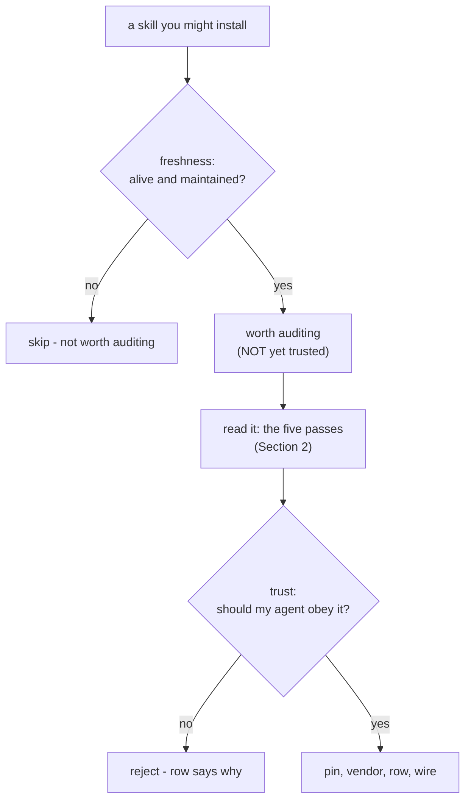

# 1.3 — Freshness is not trust

## One-line answer

Star counts, download numbers and a recent last-commit date are freshness signals — they tell you a
skill is alive and popular, which is worth knowing — but not one of them is a trust signal, because
every one of them can be manufactured and none of them survives a maintainer account being taken over.

## The story

There is a long queue outside a restaurant, and it is doing exactly what the owner hoped.

You were going to walk past, and now you are wondering what everyone else knows that you do not. The
queue is an argument. Thirty people cannot all be wrong. You join it.

But think about what the queue actually proves. It proves the place is popular right now. It does not
prove the kitchen is clean, that the chicken is fresh, or that the last person who ate here is well
this morning. A queue can be built — a discount, an opening-day crowd, a handful of friends asked to
stand outside for an hour. And a place that was spotless last year can have let its kitchen slide since,
with the same queue outside, because the queue is measuring interest, not hygiene.

The thing that actually answers your question is the hygiene inspection: someone walked into the
kitchen, looked at the surfaces, and wrote down what they found. That is a different act from counting
the people outside, and no length of queue is a substitute for it.

## The idea in plain language

When you look at a community skill repository, the numbers are right there and they are seductive:
stars, forks, downloads, "updated 3 days ago". It is natural to read them as *"lots of people trust
this, so I can too."* That is the queue argument, and it fails for the same reason.

Separate the two kinds of signal cleanly, because conflating them is the mistake this part exists to
prevent:

| Signal | What it honestly tells you | What it does **not** tell you |
| --- | --- | --- |
| Stars / likes | some people found it interesting once | that anyone read the code, or that it is safe for you |
| Download count | it has been installed a lot | that it was installed *safely*, or audited by any of them |
| Last-commit date | it is maintained, not abandoned | that the latest commit is benign |
| Open issues resolved | the maintainer is responsive | anything about what the code does to your data |

A **freshness signal** answers *"is this alive and used?"* — a real question, worth asking, because an
abandoned skill built against an old ADK will break ([Day 26](../../../day-26-loading-skills-into-adk/parts/05-in-production/5.2-experimental-means-experimental.md)).
A **trust signal** would answer *"should my agent obey this text?"* — and the only thing that answers
that is a human reading the skill the way the thing that will obey it reads it
([2.1](../02-the-five-pass-audit/2.1-read-it-like-the-thing-that-will-obey-it.md)). No count is that
reading.

Two facts make the gap unbridgeable rather than merely wide. First, **popularity is farmable**: stars
can be bought, download counts inflated, activity faked with trivial commits. Second — and worse —
**popularity does not survive a takeover**: a repository with ten thousand honest stars whose
maintainer account is compromised is a repository with ten thousand stars and a hostile latest commit,
and every unpinned install inherits it on the next fetch ([1.2](1.2-who-can-change-the-text.md)). The
stars were true; they were just never about safety.

## Why Sutra needs it

Because the crowded-shelf failure from Day 28 was a well-meant, presumably popular pack, and it still
made Sutra's routing worse ([28.2.4](../../../day-28-progressive-disclosure-design/parts/02-descriptions-as-routing/2.4-the-crowded-shelf.md)).
Popularity did not protect against that, and it will not protect against a security problem either. The
sourced pack you audit in [6.1](../06-in-production/6.1-run-the-pack-against-the-routing-gate.md) is
exactly the kind of thing that would have a healthy star count and still be wrong to install — wrong for
routing there, wrong for safety in [3.2](../03-the-poisoned-skill/3.2-the-poisoned-skill-and-the-audit.md).

The practical consequence is a rule for what the numbers are *for*: freshness signals decide whether a
skill is worth the cost of auditing, and nothing more. A skill last touched three years ago against ADK
1.x is probably not worth your reading time. A skill with a healthy pulse has earned the audit — it has
not passed it.

## The mechanism

There is no code here; the mechanism is a decision procedure you run before you spend any reading time,
and it has exactly two outputs.

The two diamonds are the whole idea, and they are answered by different acts:

- The **freshness** diamond is answered by the numbers — stars, last commit, downloads, open issues. A
  glance settles it. Its only job is to route the skill to "skip" or "worth auditing". Crucially, a
  "yes" here lands you at a box that says *not yet trusted* — freshness buys the skill an audit, not a
  pass.
- The **trust** diamond is answered by the audit in [Section 2](../02-the-five-pass-audit/2.1-read-it-like-the-thing-that-will-obey-it.md):
  a human reading every line, capabilities first. No number appears in this diamond, because no number
  can answer it.

The failure this part guards against is skipping the second diamond because the first was a strong yes —
letting a big star count stand in for the read. The diagram keeps them on separate rows precisely so
that "popular" can never be mistaken for "audited".

## When it breaks

**"Ten thousand people use it, so it's fine."** This is the queue, stated out loud. Ten thousand
installs is ten thousand people who mostly did not read it either, and if even one of them audited it,
they audited whatever revision existed then — not the one you are about to install
([1.2](1.2-who-can-change-the-text.md)). Usage is not review, and old review is not review of new code.

**"It was updated yesterday, so it's actively cared for."** A recent commit tells you the repository is
alive. It does not tell you the recent commit is benign — and "actively maintained" is precisely the
property an attacker wants you to see right before the hostile commit. Freshness and safety can point in
opposite directions at the exact moment it matters most.

**"No stars, so it must be bad."** The gradient runs the other way too. A brand-new, unstarred skill is
not untrustworthy — it is unaudited, like every other skill until you read it. Judge it by the read, not
by the absence of a crowd.

## In production

**A professional records freshness as a reason to audit and trust as the audit's verdict, in separate
fields.** The provenance row ([4.1](../04-provenance/4.1-no-row-no-run.md)) has no "stars" column,
deliberately. It has a source, a pin, a licence, an audit date and a verdict — the things a human
established by reading — because those are what answer the question the ledger exists to answer months
later, and a star count answers none of them.

**What changes at scale** is that freshness becomes automatable and trust does not. A tool can scrape
last-commit dates across forty dependencies and flag the stale ones for attention; that is useful triage
and it is worth building. No tool can scrape "should my agent obey this", which is why the audit stays a
human act even when the fleet is large, and why the automated half of `./m check` validates *shape*
while the human half judges *sense* ([3.3](../03-the-poisoned-skill/3.3-it-validated-and-was-hostile.md)).

**The failure mode that only appears with real traffic** is the trusted repository that goes bad. It had
years of stars and a spotless history, which is exactly why nobody re-audited it after the takeover — the
freshness signals were all green. The teams that survived it were the ones that pinned, so the hostile
commit was one they never fetched.

**The review comment a senior engineer leaves:** *"'it's got 4k stars' isn't in scope for this review.
Stars tell me it was worth your time to audit it, not that you did. Where's the audit — which revision,
what did you find, and is it pinned to that revision?"*

**The interview question:** *"a skill has thousands of stars and daily commits. How much does that count
toward trusting it?"* The honest spoken answer: *"Toward trust, nothing. Those are freshness signals —
they tell me it's alive and popular, which earns it an audit rather than the bin. They don't tell me
it's safe: stars are farmable, usage isn't review, and none of it survives a maintainer account
takeover, where a beloved repo ships a hostile commit and every unpinned install gets it on the next
fetch. So I use the numbers to decide whether to spend reading time, then I actually read it, then I pin
the exact revision I read. Popular buys the audit; it never replaces it."*

## Check yourself

Pick any community skill repository you have looked at and write down its star count and last-commit
date, then write down what you actually know about what its code does. Notice that the first two took a
glance and the third took nothing yet — because you have not read it.

**Out loud, without scrolling up:** give one freshness signal and one trust signal, say which act
produces each, and explain why a maintainer account takeover turns the freshest repository hostile
without changing a single star.

**Next:** [2.1 — Read it like the thing that will obey it](../02-the-five-pass-audit/2.1-read-it-like-the-thing-that-will-obey-it.md).
