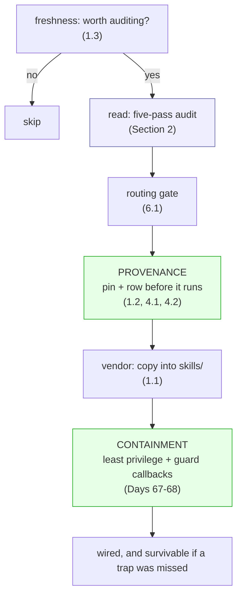

# 6.2 — Provenance plus containment, not reading alone

## One-line answer

Reading a skill catches the traps you can see, and a 1984 result proves that reading can never be
sufficient on its own — so the answer is provenance plus containment: pin what you audited so nothing
changes under you, and box in what a skill can reach so a missed trap has a small blast radius.

## The story

Where the tap water is not safe to drink, nobody makes themselves safe by staring at a glass.

You cannot tell by looking. Clear water can be dangerous and cloudy water can be fine, and no amount of
holding the glass up to the light settles it. So people do two other things instead, together. They buy
water from a sealed bottle with a brand and a batch number they can trace — that is knowing *where it
came from*. And when they are not sure, they boil it or run it through a filter before they drink — that
is *treating it* so that whatever they missed cannot hurt them.

Neither move is looking harder at the glass. One is about the water's origin; the other is about what
happens to it before it reaches you. And a household that relies on both is safe in a way that a
household squinting at glasses never is, because they have stopped trying to *see* safety and started
*arranging* it.

## The idea in plain language

This day taught a five-pass audit, and the audit is a read. Reading is necessary — it caught all three
traps in the poisoned fixture ([3.2](../03-the-poisoned-skill/3.2-the-poisoned-skill-and-the-audit.md)).
The uncomfortable fact, which the day's paper proves in the strict sense, is that reading can never be
*sufficient* on its own: what you read is turned into what runs by machinery you did not read, and a
clean read is a claim about specific bytes that says nothing about the layer beneath
([the paper](../../papers/01-reflections-on-trusting-trust.md)). Staring harder at the glass does not
help.

So Sutra's answer is not "audit harder". It is two things placed on either side of the read, the sealed
bottle and the boiling:

- **Provenance** — knowing exactly where a skill came from and that it has not changed since. That is the
  door recorded ([1.1](../01-the-doors/1.1-the-four-doors.md)), the revision pinned
  ([1.2](../01-the-doors/1.2-who-can-change-the-text.md)), the row written before it runs
  ([4.1](../04-provenance/4.1-no-row-no-run.md)), and the pin checked so drift goes red
  ([4.2](../04-provenance/4.2-the-pin-is-the-promise.md)). Provenance makes the read *stay true*: it
  guarantees the bytes you audited are the bytes that run.
- **Containment** — arranging that a skill can only reach a little, so a trap you missed does a little.
  That is least privilege — the smallest tool set that works — secrets kept out of the environment a
  script can read ([2.6](../02-the-five-pass-audit/2.6-the-scripts-read-never-run.md)), and guard
  callbacks that veto the actions that would be incidents. Containment makes a missed trap *survivable*.

Reading finds what you can see. Provenance keeps the finding valid over time. Containment covers what you
could not see at all. The three together are a system; the read alone is a household squinting at
glasses.

## Why Sutra needs it

Because [3.1](../03-the-poisoned-skill/3.1-a-skill-is-source-you-did-not-write.md) proved there is no
mid-stream defence — nothing sits between a skill's body and the model — so every control has to live
*before* the skill arrives or *after* the agent acts. Provenance is the whole set of before-controls;
containment is the whole set of after-controls. This part is where the day's five sections become one
sentence: **provenance plus containment, not reading alone.**

It is also the honest close to a day built on an audit. A weaker day would end "so audit carefully and
you'll be safe". This day ends by admitting the audit's limit and naming what covers it — which is the
posture the day's paper forced on the entire field, and the posture Sutra will carry into Day 66's tool
audits and Day 45's MCP audit.

## The paper behind it

> **Reflections on trusting trust** · `doi:10.1145/358198.358210` · 1984 ·
> `https://doi.org/10.1145/358198.358210`

It claimed you cannot trust code you did not create yourself, because the tool that turns source into a
running program can hide behaviour that no source shows — so a careful read is necessary and never
sufficient, and trust must rest on provenance rather than on reading alone.

Taught in full, with a runnable self-reproducing back door and an ablation switch, in
[01-reflections-on-trusting-trust.md](../../papers/01-reflections-on-trusting-trust.md). Read it after
the parts; it is the argument this whole day rests on.

## The mechanism

There is no new code here — the mechanism is the assembly of everything the day built into one decision
procedure. A sourced skill passes through it in order, and the diagram is the day:



The two green boxes are the sealed bottle and the boiling, on either side of the blue read. Read the
diagram as three claims, each proven earlier in the day:

- The read (box B) is real and it works — ten findings on the poisoned fixture
  ([3.2](../03-the-poisoned-skill/3.2-the-poisoned-skill-and-the-audit.md)) — and it is not enough on its
  own, which is the paper.
- Provenance (box D) makes the read durable. Without the pin, box B audited bytes that can change before
  box G runs them ([4.2](../04-provenance/4.2-the-pin-is-the-promise.md)); with it, the audited bytes are
  the bytes that run.
- Containment (box F) is what stands in for the read's blind spot. A conditional trap that fires on one
  customer next year ([3.1](../03-the-poisoned-skill/3.1-a-skill-is-source-you-did-not-write.md)) was
  never going to show up in the audit or in any test — but if the skill's agent has no mail tool and no
  access to the key, the trap that does fire reaches nothing worth reaching.

The whole day is that path, and the reason it has three stages rather than one is a 1984 proof that one
stage — reading — cannot be made sufficient however hard you push it.

## When it breaks

**Ending at the read.** *"We audited it thoroughly, so we're safe."* The audit is box B, and box B is
necessary and not sufficient — the paper's exact result. A team that stops at a thorough read has built a
household that squints at glasses very carefully. The pin and the least-privilege wiring are not extra
diligence on top of a complete defence; they are the parts that make the defence complete.

**Provenance without containment.** A perfectly pinned, fully audited skill wired to an agent that holds
the API key and an outbound mail tool is a household drinking sealed water it never treats. The pin
guarantees you run exactly what you read; it does nothing about the trap you did not see. Provenance and
containment are both required, because they cover different failures — the changed byte and the missed
line.

**Containment without provenance.** A tightly sandboxed agent running a skill from an unpinned branch is
a household boiling water of unknown origin that changes every week. Containment limits the damage of
each run, but if the skill can change under you, you are containing a different skill every time and your
audit is of none of them. The pin is what makes containment about a known thing.

## In production

**A professional writes the three-stage posture into the design document and defends it in review.** The
sentence a senior engineer wants to read is not "we audit our skills" but "we pin what we audit, record
it, and run it least-privileged" — provenance plus containment, named. That is the language of software
supply-chain security, which is this paper's problem grown into a discipline
([the paper](../../papers/01-reflections-on-trusting-trust.md)): signed artifacts and a bill of materials
are provenance; sandboxes and capability limits are containment; and nobody serious claims a code review
alone is the control.

**What changes at scale** is that containment becomes per-skill policy rather than per-agent posture. One
agent with two tools is contained by having two tools; a support agent with forty skills, database access
and a mail tool is contained only if the runtime can say *which skills may be active alongside which
tools* — the permitted-scope column ([4.1](../04-provenance/4.1-no-row-no-run.md)) grown into an enforced
policy. Provenance scales the same way, from a hand-checked pin to a lockfile checked in CI
([4.2](../04-provenance/4.2-the-pin-is-the-promise.md)). Both are the small mechanisms of this day turned
into infrastructure.

**The failure mode that only appears with real traffic** is the audited skill that was fine and the world
that changed around it. The skill did not move — the pin held — but the agent it runs on gained a mail
tool in an unrelated pull request, and now a body line that was harmless has a way out. Containment is not
a property of a skill; it is a property of the skill *and* the agent it is wired into, and it has to be
re-checked whenever either changes. That is why the last box in the diagram is "wired", not "audited": the
audit is about the skill, and the safety is about the wiring.

**The review comment a senior engineer leaves:** *"the audit's clean and it's pinned — that's provenance,
good. Now which agent does it activate on, and what can that agent reach? If it's the one with the mail
tool and the key in its environment, a body line we missed has a way out. Wire it to the least-privileged
desk and keep secrets out of the process environment — provenance without containment is half a
control."*

**The interview question:** *"if you audit every skill, why do you still need sandboxing and least
privilege?"* The honest spoken answer: *"Because a careful read is necessary and provably not sufficient —
that's the trusting-trust result: what you read is turned into what runs by machinery you didn't read, so
reading can catch what you can see and never guarantee the rest. So we put two controls on either side of
the read. Provenance — pin the exact revision, record it, check for drift — makes the read stay true, so
the bytes I audited are the bytes that run. Containment — least privilege, secrets out of the script's
environment, guard callbacks — means a trap I missed reaches something small. A conditional back door that
fires on one customer next year won't show up in any audit or test, but if the agent can't reach the mail
tool, it doesn't matter. Provenance plus containment, not reading alone — which is just software
supply-chain security applied to skills."*

## Check yourself

```bash
uv run python days/day-29-sourcing-and-auditing-skills/lab/audit.py tests/fixtures/skills/evil-helper; echo "exit: $?"
uv run python days/day-29-sourcing-and-auditing-skills/lab/pinned.py tests/fixtures/skills/evil-helper 493ea089684fd0c3
```

The first is the read, the second is the provenance half. Say what the *containment* half would be for
this exact skill if you had decided to keep it — which tool you would deny it, and which environment
variable you would keep out of its reach.

**Out loud, without scrolling up:** state the day in one sentence, name what provenance covers and what
containment covers, and explain why the paper means the read can never be the whole answer.

**Next:** the paper this whole day rests on —
[Reflections on trusting trust](../../papers/01-reflections-on-trusting-trust.md).
