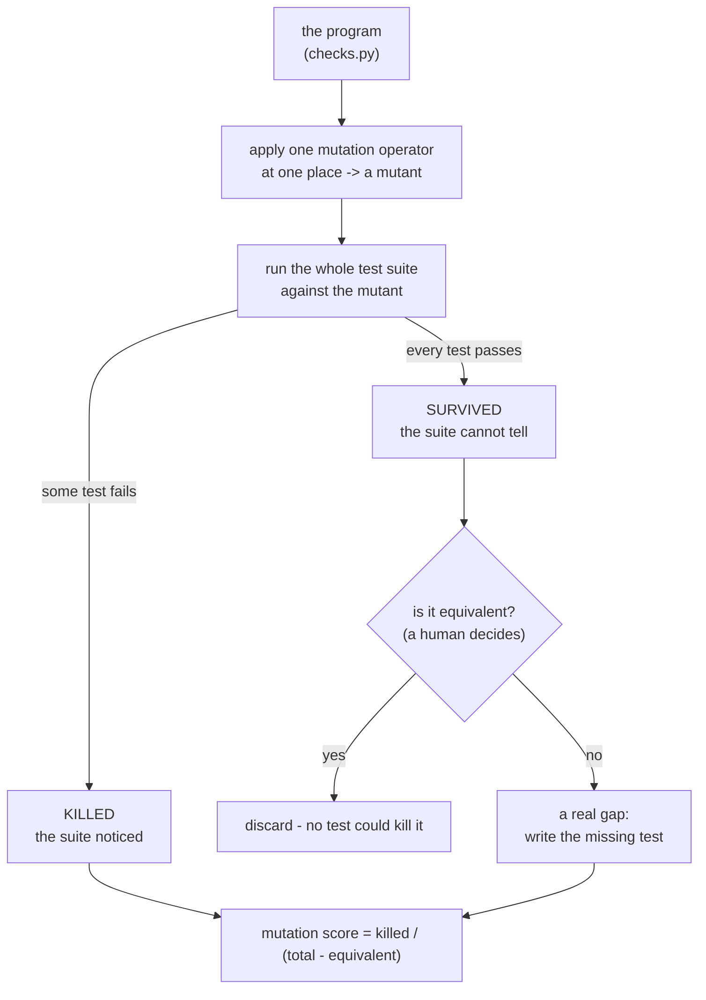

# Hints on Test Data Selection: Help for the Practicing Programmer

## One-line answer

You can measure how good a test suite is by deliberately introducing small errors into the program and
counting how many the suite notices — because a suite that cannot tell a broken program from the real
one is not testing that program, however much of it the suite runs.

## The story

The new tailor checks a finished shirt by counting the seams.

There are eleven of them and he checks all eleven, every time, and none of them is ever missed. He can
tell you with complete confidence that every seam on that shirt has been sewn, and he is right. The
shirt in his hands has had every part of it looked at.

Then a customer takes one home and cannot lift his arm.

The sleeve was set an inch too tight at the shoulder. The seam is there — it was counted, along with
the other ten. Nothing in the count could ever have found it, because counting a seam asks whether a
seam exists, and the question that mattered was whether the shirt fits a person.

The older tailor keeps a cloth dummy in the corner. Not because dummies are traditional, but because
putting the shirt on something is the only check that can *fail for a reason he did not think of in
advance*.

Before 1978, most people who wanted to know if a test suite was any good counted the seams. They
measured which parts of the program the tests had run — and a program can be run entirely and tested
by nothing.

## The idea in plain language

The paper asks a question nobody had a usable answer to: **how do you know your tests are any good?**

The measure everyone used, and still mostly uses, is **coverage** — the fraction of the program's lines
or branches that the tests execute. Coverage is a real measurement and Sutra has already said what it
is worth: it is a map of what was visited, not a score of what was checked
([Day 23, 6.1](../../day-23-testing-tools-and-callbacks/parts/06-in-production/6.1-coverage-is-a-map-not-a-score.md)).
A test that calls a function and asserts nothing gives it full coverage. The seams were counted.

The paper's answer is to ask a different question: **would the tests notice if the program were
wrong?** And the way to find out is to make it wrong, on purpose, in small ways, and see.

Take the program. Make a copy with **one** small change — a `>` where there was a `>=`, a `+` where
there was a `-`, a dropped `not`, a constant nudged by one. That copy is a **mutant**. Run your test
suite against it. If some test fails, the suite has **killed** the mutant: it could tell the difference.
If every test still passes, the mutant **survived**, and you have just found a broken version of your
program that your tests are perfectly happy with.

Do that for every small change you can make. The fraction killed is the **mutation score**, and it is
a measurement of the suite rather than of the program.

Two assumptions hold the argument up, and both are stated in the paper as hypotheses rather than
proofs:

- **The competent programmer hypothesis.** Programs written by competent people are *nearly* correct.
  Real bugs are small deviations from a correct program, not wholesale nonsense — so a set of small
  deviations is a realistic population of faults to test against, and there is no need to consider
  arbitrary programs.
- **The coupling effect.** Test data that catches all the *simple* errors will, in practice, also catch
  the complicated ones, because a complex fault is built out of simple ones and tends to be exposed by
  the same inputs. This is the load-bearing claim: it is what makes checking single-token mutants a
  reasonable proxy for checking real bugs.

One term more, because it is the practical obstacle the technique never fully escaped. Some mutants
are **equivalent**: the change is real but the program's behaviour is identical, so no test could
possibly kill them — `x < 10` and `x != 10` inside a loop that increments `x` by one from zero, for
instance. Equivalent mutants drag the score down and no amount of testing fixes them, and deciding
whether an arbitrary mutant is equivalent is not something a program can do in general.

## Why Sutra needs it

Because [3.3](../parts/03-the-suite/3.3-the-test-for-the-checker.md) made an argument that this paper
made first and made properly.

That part said: a green shelf lane means either the shelf is clean or the checks do nothing, and the
only way to tell is to hand each rule something broken and demand the finding. That is mutation
testing done by hand, one rule at a time, with the mutants chosen by a person. The paper generalises
it: do not guess which broken cases to write — generate them from the program itself, and let the
survivors tell you which parts of the suite are asleep.

It matters directly for `tools/skill_checks.py`, because that module is a **checker**, and a checker
has the specific property that its bugs make it *quieter*. A wrong comparison in `sutra/loop.py` makes
something visibly go wrong. A wrong comparison in `check_version` makes a finding not appear, and a
missing finding looks exactly like a clean shelf
([1.1](../parts/01-testing-prose/1.1-prose-with-consequences.md)'s silent-rot problem, one level up).
For code whose failure mode is silence, "would the tests notice?" is the only question worth asking.

You meet the same idea again on Day 31, when these checks become a merge gate, and in Phase 12 when
evalsets have to be judged rather than merely run.

## The mechanism

Mutation analysis is a loop, and every step of it is mechanical except the last.



The four moving parts:

**The operators.** A fixed catalogue of single, small edits: swap a relational operator, swap an
arithmetic operator, delete a statement, replace a variable with another of the same type, replace an
expression with a constant. The catalogue is what makes the population of faults reproducible rather
than a matter of imagination, and it is chosen to model the mistakes competent people actually make.

**The mutants.** One per applicable place per operator. This is where the cost lives, and the
arithmetic is unforgiving: the number of mutants grows with the size of the program multiplied by the
number of operators, and **each one requires a full run of the test suite**. A thousand mutants and a
suite that takes a minute is most of a day.

**The verdict.** A mutant is killed the moment any test fails, so a run can stop at the first failure —
the one optimisation that is free.

**The score, and the human.** Killed divided by the number of non-equivalent mutants. The
non-equivalent part is the problem: nothing decides it for you, so either somebody reads the survivors
or the score is a lower bound. In practice the *list of survivors* is more useful than the number
anyway, because each survivor is a specific sentence: *"this change to your program breaks nothing you
test for."*

## The paper in one demo

The paper's contribution, with everything else removed: a small program, a suite that passes, and a
mutation run that reveals what the passing suite never checked. **No model, no network, standard
library only.** It lands in `lab/papers/hints-on-test-data-selection/`.

The subject is deliberately the day's own material — three rules lifted out of
`tools/skill_checks.py` — so the survivors are statements about the kind of code you wrote today.

```text
lab/papers/hints-on-test-data-selection/
├── checks.py   # the program under judgement: three tiny rules
├── suite.py    # the test suite whose quality is the question
└── demo.py     # the mutation run, and the ablation switch
```

`checks.py` — the program. Read it and note that every rule has boundaries in it:

```python
"""The subject under judgement: three tiny rules from the day's skill checks.

Nothing here knows it is being tested. The demo makes small, single-token copies
of this file - mutants - and asks whether the suite can tell each copy from this
original.
"""

MAX_NAME = 64
MAX_DESC = 1024


def name_ok(name: str) -> bool:
    """A skill name is 1-64 lowercase letters, digits and single inner hyphens."""
    if not name or len(name) > MAX_NAME:
        return False
    if name.startswith("-") or name.endswith("-"):
        return False
    if "--" in name:
        return False
    return all(c.isdigit() or (c.isalpha() and c.islower()) or c == "-" for c in name)


def description_ok(desc: str) -> bool:
    """A description is 1-1024 characters and never empty."""
    return len(desc) > 0 and len(desc) <= MAX_DESC


def version_ok(version: str) -> bool:
    """A version is two or three dot-separated numbers, as a string."""
    parts = version.split(".")
    return len(parts) >= 2 and all(p.isdigit() for p in parts)
```

**Line by line:**

- These are the specification's rules from
  [4.2](../parts/04-skills-built-in-code/4.2-the-model-is-the-spec.md) and Sutra's version rule from
  [5.1](../parts/05-versioning/5.1-a-name-for-the-text-that-ran.md), reduced to plain functions with no
  framework, because the paper's idea needs a program and nothing else.
- Every line contains something a single-token mutation can move: `>` could be `>=`, `startswith`
  could be `endswith`, `"--"` could be `"---"`, `>= 2` could be `>= 1`. That is not contrivance — it
  is what boundary-checking code looks like, which is precisely why boundary-checking code is where
  suites are usually weakest.

`suite.py` — the tests. They all pass, and that is all a green run tells you:

```python
"""The test suite whose quality is the question.

Every test here passes against checks.py. That is all a green run tells you.
Each test takes the module to test as an argument, so the same suite can be
pointed at the original or at a mutant without being rewritten.
"""


def test_name_accepts_a_real_skill_name(mod) -> None:
    assert mod.name_ok("ticket-triage")


def test_name_rejects_uppercase(mod) -> None:
    assert not mod.name_ok("Ticket")


def test_description_accepts_a_real_description(mod) -> None:
    assert mod.description_ok("Triage an inbound support ticket and set a severity.")


def test_description_rejects_empty(mod) -> None:
    assert not mod.description_ok("")


def test_version_accepts_two_numbers(mod) -> None:
    assert mod.version_ok("1.1")


TESTS = [
    test_name_accepts_a_real_skill_name,
    test_name_rejects_uppercase,
    test_description_accepts_a_real_description,
    test_description_rejects_empty,
    test_version_accepts_two_numbers,
]


def run(mod) -> list[str]:
    """Run every test against `mod`. Returns the names of the tests that failed."""
    failed = []
    for test in TESTS:
        try:
            test(mod)
        except Exception:
            failed.append(test.__name__)
    return failed
```

**Line by line:**

- Every test takes `mod` — the module to test — as an argument rather than importing `checks` at the
  top. That single change is what lets the same suite be pointed at a mutant, and it is the only
  concession the demo makes to being a demo.
- The five tests are an ordinary, defensible suite. Each function has at least one test, the two
  obvious rejections are covered, and nothing here looks negligent. That is the point: the mutation run
  is about to say something uncomfortable about a suite that looks fine.
- `run` catches `Exception` because a mutant can fail in ways a test did not anticipate — a
  `TypeError`, an `AttributeError` — and for mutation analysis *any* failure counts as noticing. This
  is the one place in the curriculum where catching broadly is correct, and it is correct because the
  question is literally *did anything go wrong*.
- `run` returns the names of the failures rather than a boolean, so a reader can see which test did the
  killing.

`demo.py` — the mutation run and the ablation switch:

```python
"""Mutation analysis in one file: break the program on purpose, see if the tests notice.

    python demo.py                  # mutation ON  - the paper's idea
    MUTATION=off python demo.py     # mutation OFF - the ablation: just run the suite

No model, no network, no dependency outside the standard library.
"""

import os
import pathlib
import types

import suite

SOURCE = pathlib.Path(__file__).with_name("checks.py")

# One mutant per row: a label, the exact text to replace, and what to replace it with.
# Every one is a competent-programmer-sized slip - an off-by-one, a flipped comparison,
# a dropped negation - not a rewrite.
OPERATORS = [
    ("boundary: > MAX_NAME becomes >= MAX_NAME", "len(name) > MAX_NAME", "len(name) >= MAX_NAME"),
    ("dropped guard: empty name accepted", "if not name or len(name)", "if len(name)"),
    ("flipped: startswith becomes endswith", 'name.startswith("-")', 'name.endswith("-")'),
    ("weakened: '--' becomes '---'", '"--" in name', '"---" in name'),
    ("dropped case rule: islower removed", "(c.isalpha() and c.islower())", "c.isalpha()"),
    ("boundary: > 0 becomes >= 0", "len(desc) > 0", "len(desc) >= 0"),
    ("boundary: <= MAX_DESC becomes < MAX_DESC", "len(desc) <= MAX_DESC", "len(desc) < MAX_DESC"),
    ("boundary: >= 2 becomes >= 1", "len(parts) >= 2", "len(parts) >= 1"),
    ("dropped digit rule: isdigit removed", "all(p.isdigit() for p in parts)", "True"),
]


def load(source: str, name: str) -> types.ModuleType:
    """Turn a string of Python source into a live module object, without touching disk."""
    module = types.ModuleType(name)
    exec(compile(source, name, "exec"), module.__dict__)
    return module


def main() -> None:
    original_source = SOURCE.read_text(encoding="utf-8")
    original = load(original_source, "checks_original")

    failed = suite.run(original)
    print(
        f"suite against the real checks.py: {len(suite.TESTS) - len(failed)} passed, "
        f"{len(failed)} failed"
    )

    if os.environ.get("MUTATION") == "off":
        print("\nMUTATION=off - mutation analysis skipped.")
        print("The suite is green. That is the whole report.")
        return

    print(f"\nMUTATION=on - {len(OPERATORS)} mutants, one changed token each\n")
    survivors = []
    for number, (label, old, new) in enumerate(OPERATORS, start=1):
        if old not in original_source:
            raise SystemExit(f"mutant {number} does not apply: {old!r} is not in checks.py")
        mutant = load(original_source.replace(old, new, 1), f"checks_mutant_{number}")
        caught = suite.run(mutant)
        verdict = "KILLED  " if caught else "SURVIVED"
        print(f"  {number}. {verdict} {label}")
        if not caught:
            survivors.append(label)

    killed = len(OPERATORS) - len(survivors)
    print(f"\nmutation score: {killed}/{len(OPERATORS)} killed")
    if survivors:
        print("\nthe suite cannot tell these broken versions from the real one:")
        for label in survivors:
            print(f"  - {label}")
    raise SystemExit(1 if survivors else 0)


if __name__ == "__main__":
    main()
```

**Line by line:**

- `OPERATORS` is the paper's catalogue, written out by hand for one program. Each row is a label, the
  exact text to find, and what to replace it with. A real mutation tool derives these from the syntax
  tree; a table is the honest small version and it keeps the demo to one idea.
- Every mutation is **one token**. That is the competent programmer hypothesis made concrete: these are
  the mistakes a careful person makes at the end of a long afternoon, not sabotage.
- `types.ModuleType(name)` plus `exec(compile(...))` builds a module from a string in memory. No
  temporary files, no imports to invalidate, and each mutant gets its own namespace so they cannot
  contaminate each other. The mutant never touches disk, which matters: a mutation tool that writes
  over your source and crashes leaves you with a broken repository.
- `.replace(old, new, 1)` replaces the **first** occurrence only, so each mutant differs from the
  original in exactly one place. Replacing every occurrence would build a mutant with several faults,
  and a suite that kills it would tell you nothing about which fault it noticed.
- `if old not in original_source: raise SystemExit(...)` fails loudly when the table has drifted from
  the source. Without it, an operator whose text no longer matches would silently produce a mutant
  identical to the original, which passes every test and is scored as a survivor — a false accusation
  against the suite, which is exactly the sort of quiet wrongness this whole day is about.
- `os.environ.get("MUTATION") == "off"` is the **ablation switch**. With it set, the program does what
  a normal test run does — run the suite, report it green — and stops. That is the *before* picture,
  and it is the entire argument for the paper in one comparison.
- `raise SystemExit(1 if survivors else 0)` gives the run an exit code, so a mutation run can be a gate
  rather than a report. This is Principle 11: an eval is a test, and this one can go red.

Run the first arm — the paper's idea on:

```bash
cd days/day-30-skill-testing-and-versioning/lab/papers/hints-on-test-data-selection
python demo.py
```

**Line by line:**

- Plain `python`, not `uv run`: the demo imports nothing outside the standard library, deliberately, so
  it runs anywhere. Running it from inside its own directory is what lets `import suite` find the
  sibling file.

Its real output, on 2026-09-04:

```text
suite against the real checks.py: 5 passed, 0 failed

MUTATION=on - 9 mutants, one changed token each

  1. SURVIVED boundary: > MAX_NAME becomes >= MAX_NAME
  2. SURVIVED dropped guard: empty name accepted
  3. SURVIVED flipped: startswith becomes endswith
  4. SURVIVED weakened: '--' becomes '---'
  5. KILLED   dropped case rule: islower removed
  6. KILLED   boundary: > 0 becomes >= 0
  7. SURVIVED boundary: <= MAX_DESC becomes < MAX_DESC
  8. SURVIVED boundary: >= 2 becomes >= 1
  9. SURVIVED dropped digit rule: isdigit removed

mutation score: 2/9 killed

the suite cannot tell these broken versions from the real one:
  - boundary: > MAX_NAME becomes >= MAX_NAME
  - dropped guard: empty name accepted
  - flipped: startswith becomes endswith
  - weakened: '--' becomes '---'
  - boundary: <= MAX_DESC becomes < MAX_DESC
  - boundary: >= 2 becomes >= 1
  - dropped digit rule: isdigit removed
```

The run exits `1`, because there are survivors. Read the first line and the score together. **Five tests passed and seven out of nine broken
versions of the program passed too.** A suite that accepts a name checker with no length limit, no
empty-name guard, no consecutive-hyphen rule and a version checker that accepts anything is not a
suite that tests those rules — and nothing about running it would ever have told you.

Now the ablation, the same files, the idea switched off:

```bash
MUTATION=off python demo.py
```

**Line by line:**

- One environment variable. Nothing else changes, so every difference between the two transcripts is
  the paper's contribution and nothing else.

Its real output, on 2026-09-04:

```text
suite against the real checks.py: 5 passed, 0 failed

MUTATION=off - mutation analysis skipped.
The suite is green. That is the whole report.
```

That is the state of the world before 1978, and the state of most repositories now: a green run, and
no way to ask what it means. The two transcripts share their first line exactly. Everything the first
one knows and the second one does not came from breaking the program on purpose.

## When it breaks

**Equivalent mutants.** The technique's permanent tax. A mutant whose behaviour is identical to the
original cannot be killed by any test, so it drags the score down forever, and deciding whether an
arbitrary mutant is equivalent is undecidable in general — there is no program you can write that
answers it for every case. In practice a person reads the survivors and marks the equivalent ones,
which reintroduces exactly the manual judgement the measurement was supposed to remove. The demo above
sidesteps this by hand-picking nine operators that are all genuinely behaviour-changing, which is
honest for a demo and not available at scale.

**The cost, which is the reason this stayed in the literature.** The paper describes a technique whose
work is *mutants × the cost of a full test run*. A program of a few thousand lines yields tens of
thousands of mutants; a suite that takes a minute makes that weeks of machine time. In 1978 that was
prohibitive. It is more affordable now and it is still, for most teams, more expensive than everything
else in their pipeline combined — which is why the industry adopted coverage, a much weaker measure
that costs almost nothing.

**A high score that means little.** Mutation score is a measure of the *suite*, against a *fixed
catalogue of small faults*. It says nothing about faults the operators do not model — a missing
feature, a wrong requirement, a race between two processes, an interface misunderstood at both ends. A
suite can score highly and still test the wrong thing correctly. The coupling effect is a claim that
small-fault sensitivity generalises to complex faults, and it is an empirical claim rather than a
theorem.

**Mutants that never finish.** Change a loop bound and the mutant runs forever, so every practical
implementation needs a timeout, and a timeout counts as killed — which is defensible and is a
judgement call baked into every tool.

## In production

**What survived** is the idea, and it survived completely. Mutation testing is the accepted way to
answer *"is this suite any good?"*, and every serious argument about test quality since has been
downstream of this paper. Mature tools exist for most mainstream languages. Its two hypotheses have
held up under later empirical work well enough to still be quoted by name: real faults do tend to be
small deviations, and suites that catch small faults do tend to catch bigger ones.

More importantly, the *framing* survived and became the default way careful engineers think, whether
or not they ever run a mutation tool. **"Would my tests notice?"** replaced **"did my tests run this
line?"** as the question a good reviewer asks. Every time somebody says *"that test would pass even if
the function returned an empty list"* they are doing mutation analysis in their head, and that sentence
is the review comment in
[3.3](../parts/03-the-suite/3.3-the-test-for-the-checker.md). Sutra's whole checker lane is that
sentence turned into tests.

**What did not survive** is running the full technique on real systems. The paper's method — every
operator at every applicable place, a complete suite run for each — was unaffordable in 1978 and is
still, for most teams, unaffordable now. What the field did instead was compromise in every direction:
**selective mutation** (a small subset of operators that predicts the full score), **sampling** (a
random fraction of the mutants), **mutant schemata** (all mutants compiled into one program with a
switch, so the build cost is paid once), and — the compromise that actually put it in front of working
engineers — **applying mutation only to the lines a change touched**, so the cost scales with the
diff instead of with the codebase. The equivalent-mutant problem was never solved; it was routed
around by treating survivors as suggestions for a human rather than as a score to defend.

So the honest summary is that the field kept the question and abandoned the procedure. Coverage won on
cost, and coverage is what your continuous integration reports today — while everybody who has read
this paper knows what coverage does not mean.

**The review comment a senior engineer leaves:** *"we are at ninety per cent coverage on this module
and I can delete the body of `check_version` and only one test goes red. Coverage is telling you the
lines ran. Before you add another rule, add the cases that would fail if each existing rule stopped
working."*

**The interview question:** *"how do you know your tests are good?"* The honest spoken answer:
*"Coverage tells me which lines ran, and a test that calls a function and asserts nothing gives it full
coverage — so coverage is a map, not a score. The real question is whether the suite would notice if
the code were wrong, and the 1978 answer is mutation testing: make small single-token changes to the
program, run the suite against each, and count how many it kills. The survivors are specific — 'you
can delete this boundary check and nothing fails'. Two assumptions underneath it: real bugs are small
deviations from correct programs, and catching the small ones catches the big ones. What the field kept
is the question; what it dropped is running the full mutant set, because the cost is mutants times a
full suite run and that is unaffordable — modern practice samples operators or mutates only the lines a
change touches. On our own checker module we do the hand version: every rule has a test that hands it
something broken and asserts the specific finding, because a checker's bugs make it quieter, and a
missing finding looks exactly like a clean result."*

## Check yourself

```bash
cd days/day-30-skill-testing-and-versioning/lab/papers/hints-on-test-data-selection
python demo.py
MUTATION=off python demo.py
```

Now open `suite.py`, add one test — `assert not mod.name_ok("")` — and run the first command again.
Watch the score move and watch one named survivor disappear from the list. That single line is what a
survivor is *for*: it does not say your suite is bad, it says exactly which test is missing.

**Out loud, without scrolling up:** what did this paper actually claim, and what do we do differently
now? The two halves: it claimed you can measure a test suite by introducing small deliberate faults
and counting how many it detects, resting on the ideas that real bugs are small deviations and that
catching small ones catches large ones; and we now keep the question — *would my tests notice?* — while
almost nobody runs the full procedure, because the cost is a complete suite run per mutant, so teams
sample the operators, mutate only changed lines, or simply carry the question into code review and
settle for coverage as the number on the dashboard.

**Next:** back to the [hub](../LESSON.md) and its ledger.
