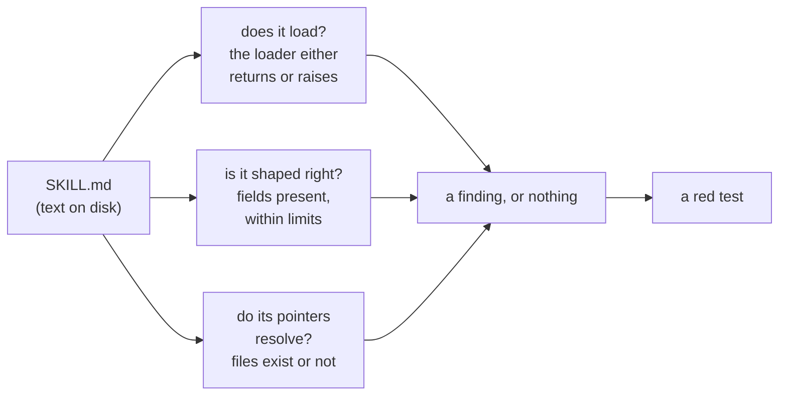

# 1.1 — Prose with consequences

## One-line answer

A skill is a Markdown file that changes what your program does, so it needs the same protection every
other file that changes what your program does already has — a test that runs on every commit and can
go red.

## The story

The rice tin in a shared kitchen has a card taped to the lid: *two cups of rice, four cups of water,
cover it, take it off when the water is gone.*

Six people cook from that card. Nobody wrote their name on it. One evening somebody who had a small
pot changed `four cups` to `three cups`, because four had boiled over on them, and they were right —
for their pot. They did not add "if you are using the small pot". They just changed the number.

The next four people cooked hard, dry rice and blamed the rice.

Here is the part that matters. Nothing broke. No pan cracked, no fuse blew, nothing made a noise. The
card still looked exactly like a card. It still had a number on it, in the same handwriting, in the
same place. The only way anyone could have caught this was if somebody had been checking the card
itself — and nobody checks a card, because a card is only a piece of paper.

## The idea in plain language

Every file in your repository falls into one of two piles: files that only people read, and files that
change what the program does. `README.md` is in the first pile. `sutra/loop.py` is in the second, and
because it is in the second, you would never dream of changing it without running the tests.

A **skill** — the folder of Markdown you first met on
[Day 25](../../../day-25-skills-the-open-spec/parts/01-what-a-skill-is/1.1-a-skill-is-a-folder.md) —
looks like the first pile and lives in the second. It is a `SKILL.md` file with some frontmatter and
some instructions, and it reads like documentation. But at runtime the model reads its `description`
to decide whether to reach for it, then reads its body and follows the steps. Change the description
and you change which tasks reach the skill. Change a step and you change what the agent does. Rename a
file the body points at and the agent asks for a file that is not there.

Two definitions you will need for the rest of the day, both from earlier parts, restated here so this
page stands alone:

- **Frontmatter** is the block at the top of `SKILL.md` between two lines of `---`. It holds the
  `name` and the `description`, and it is the only part of the skill the model sees before it decides
  whether to use the skill at all
  ([Day 25, 2.1](../../../day-25-skills-the-open-spec/parts/02-the-frontmatter/2.1-two-required-fields.md)).
- The **body** is everything after the frontmatter: the actual steps, loaded in full the moment the
  skill is activated
  ([Day 25, 3.1](../../../day-25-skills-the-open-spec/parts/03-the-body-and-the-folders/3.1-the-body-is-loaded-whole.md)).

So a skill is **prose with consequences**. And prose with consequences rots exactly the way the rice
card rotted: silently, plausibly, and edited by someone who was solving a real problem and did not
know what else the text was holding up.

Four days of skills have each added a way for that rot to hurt:

| Day | What now depends on the text being right |
| --- | --- |
| [25](../../../day-25-skills-the-open-spec/parts/02-the-frontmatter/2.2-the-name-field.md) | The `name` must match the folder, or the skill will not load at all |
| [26](../../../day-26-loading-skills-into-adk/parts/01-loading-a-folder/1.4-the-whole-shelf.md) | The whole shelf is loaded at startup; one broken folder takes the rest with it |
| [28](../../../day-28-progressive-disclosure-design/parts/02-descriptions-as-routing/2.1-a-description-is-a-routing-row.md) | The description is what routes a task to this skill instead of that one |
| [29](../../../day-29-sourcing-and-auditing-skills/parts/04-provenance/4.2-the-pin-is-the-promise.md) | An audit is only worth anything if the audited text is still the text on disk |

Every row is a property of a text file. Nothing in that table is protected by anything yet.

## Why Sutra needs it

Because Sutra's `skills/` folder is deliberately the easiest thing in the repository to change.

That was the point. [Day 27](../../../day-27-authoring-first-skills/parts/01-extraction/1.1-where-the-procedure-lives-now.md)
moved the triage procedure out of the agent's instruction and into a Markdown file precisely so that a
support lead who writes no Python can fix a severity rule. You bought editability, and the price of
editability is that changes arrive without a review, without a deploy, and without a type checker.

Today you buy the protection back. `tools/skill_checks.py` and `tests/test_skills.py` are the tests
that run whenever anyone touches the shelf. Tomorrow, Day 31 (`days/day-31-the-quality-gate/`) puts
the same checks behind `./m check` so nothing merges without them. On Day 45 the whole MCP surface
gets the same treatment for the same reason: a thing that can change without a deploy needs a check
that runs without a human remembering.

## The mechanism

Start by making the problem visible on your own shelf, with no new code at all. This is the smallest
possible version of today: load every skill and print what came back.

```bash
uv run python -c "
from pathlib import Path
from google.adk.skills import load_skills_from_dir
for skill in load_skills_from_dir(Path('skills')):
    body = skill.instructions.splitlines()
    print(f'{skill.name:<20} {len(skill.description):>4} chars of description, {len(body):>3} lines of body')
"
```

**Line by line:**

- `uv run python -c` runs a snippet inside the project's virtual environment. `uv run` is how every
  command in this curriculum reaches the pinned `google-adk==2.7.1`; plain `python` would find
  whatever interpreter is first on your `PATH`, which is how a working repository produces a
  `ModuleNotFoundError` that makes no sense.
- `load_skills_from_dir` is ADK's shelf loader, met on
  [Day 26, 1.4](../../../day-26-loading-skills-into-adk/parts/01-loading-a-folder/1.4-the-whole-shelf.md).
  It walks the directory, loads every subfolder that has a `SKILL.md`, and returns a list of `Skill`
  objects. Verified against `https://adk.dev/skills/` on 2026-09-04 and against the installed
  package's `google/adk/skills/__init__.py`, which exports it by that exact name.
- `skill.instructions` is the body — the Markdown after the frontmatter — as one string.
  `skill.description` is the frontmatter's description. Both are convenience accessors on the `Skill`
  model ([Day 26, 1.2](../../../day-26-loading-skills-into-adk/parts/01-loading-a-folder/1.2-the-skill-object.md)).
- The two numbers printed are the two things Day 28 taught you to care about: how much description the
  router has to work with, and how much body every activation pays for. Printing them is not a test —
  nothing here can fail — which is exactly the gap the rest of the day closes.

Now the shape of what a test over prose can actually be. A test needs something it can compare, and
prose gives you three comparable things:



Everything today is built out of those three questions. Notice what is not on the diagram: *is this
skill any good?* That question has no comparable thing on either side, and
[1.2](1.2-shape-and-sense.md) is about why.

## When it breaks

**The change that looks like a typo fix.** Somebody shortens a description because it reads long:

```text
- description: Triage an inbound support ticket - set a severity, name the owning
-   component, and write the first reply. Use when a ticket arrives, someone asks how
-   serious a ticket is, or a severity has to be set or changed.
+ description: Handles ticket triage.
```

Nothing errors. The skill still loads, the agent still starts, the tests you have today still pass.
What changed is that the words a task would have matched on — *severity*, *arrives*, *first reply* —
are gone, so the router stops sending tickets here
([Day 28, 2.4](../../../day-28-progressive-disclosure-design/parts/02-descriptions-as-routing/2.4-the-crowded-shelf.md)).
The failure shows up as *"the agent has stopped triaging properly"* a week later, with no error
anywhere to search for.

**The rename that leaves a pointer behind.** Somebody renames `references/severity-rubric.md` to
`references/rubric.md` and updates the two places they remembered. The body still says
`references/severity-rubric.md`. At runtime the agent asks for a file that is not there, and what you
get is not a crash but a worse answer, produced without the rubric, with no line in the log saying so.

**The one that does raise.** A `name` that no longer matches its folder is the one failure mode ADK
catches for you, and it is loud:

```text
ValueError: Skill name 'ticket-triage' does not match directory name 'triage'.
```

Read that as good news. It is the only member of this family that announces itself, and
[2.2](../02-checks-as-functions/2.2-let-the-loader-be-the-oracle.md) turns the announcement into a
finding you can assert on.

## In production

**What a professional writes instead** of "we will review skill changes carefully" is a check that
runs without anyone remembering. On a team where non-engineers edit skills — which is the whole point
of the format — the review discipline evaporates within a few merges, because the person editing does
not think of a Markdown change as a code change. The only durable answer is a gate: the checks run in
continuous integration on every pull request that touches `skills/`, and the person who edited the
card finds out before anyone eats the rice.

**What degrades at scale** is the ratio of authors to reviewers. With two skills and one author, you
know every change. With forty skills and four teams, most changes to `skills/` are made by people who
have never read the other thirty-nine, and the failure the rice card had — a correct local fix with an
invisible global cost — becomes the normal case rather than the unlucky one. The check has to be
mechanical because the knowledge is no longer in anyone's head.

**The review comment a senior engineer leaves:** *"this changes a skill description and no test moved.
That means either the description is not load-bearing, in which case delete it, or we have no coverage
on the thing that routes half our traffic. Which is it?"*

**The interview question:** *"you have agent skills as Markdown files that non-engineers edit. What
could go wrong and what did you do about it?"* The honest spoken answer: *"The files look like
documentation and behave like code. The description decides which tasks reach the skill, the body is
followed as steps, and a link in the body is a file the agent will try to read. So a well-meant edit —
shortening a description, renaming a reference file — changes behaviour with no error and no deploy.
We treated the folder as source: a set of pure check functions over a skill folder, a test that
enumerates the shelf live and fails on any finding, and the same checks wired into the merge gate. The
checks are all mechanical — does it load, is it shaped right, do its pointers resolve — because those
are the only questions with a comparable answer. Whether the description still routes well is a
different problem, and we measure it separately."*

## Check yourself

```bash
uv run python -c "
from pathlib import Path
from google.adk.skills import load_skills_from_dir
for skill in load_skills_from_dir(Path('skills')):
    print(skill.name, '|', skill.description[:60])
"
```

Run it, then open one `SKILL.md` and change a single word in its description. Run it again and watch
the printed line change while nothing anywhere complains.

**Out loud, without scrolling up:** name the two piles every file in a repository belongs to, say
which pile `SKILL.md` looks like it is in and which one it is actually in, and give one edit that
changes what the agent does without producing any error at all.

**Next:** [1.2 — Shape and sense](1.2-shape-and-sense.md).
