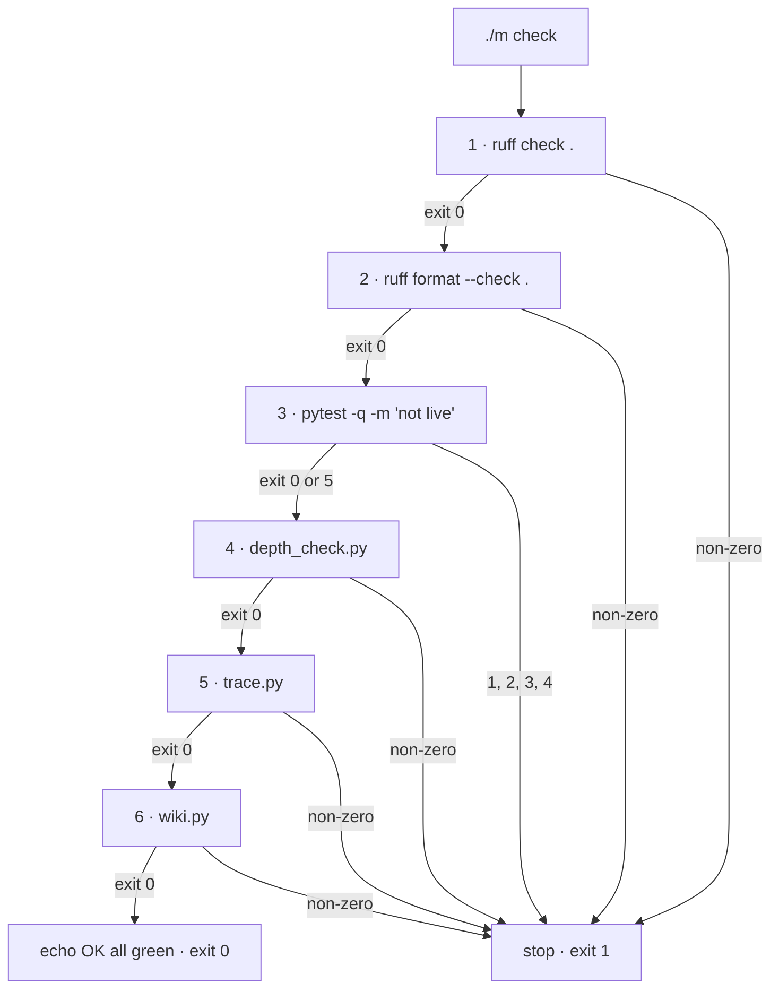

# 1.2 — Six stages, cheapest first

## One-line answer

The gate runs its stages in a fixed order — linter, formatter check, tests, then the three
documentation checks — and the order is chosen so that the cheapest check that can reject your work
runs before the most expensive one, which is what keeps a gate fast enough that people actually run
it.

## The story

At a pharmacy counter, the assistant does not go to the back for your medicine first.

She takes the prescription, turns it over, and looks at two things: is it signed, and is it in date.
That takes a moment. If either is wrong she hands it straight back, and you have lost a moment
instead of the walk to the shelves, the search through the drawer, the reach for the box that turns
out to be the wrong strength, and the walk back.

Notice that she is not checking the *important* thing first. The important thing is that you get the
right medicine at the right dose, and the signature has nothing to do with that. She is checking the
**cheap decisive** thing first: a check that costs almost nothing and that, when it fails, makes
every later step pointless.

The other half of the arrangement matters just as much. She stops. She does not fetch the box anyway
"so it is ready in case the signature turns up". If she did, the counter would fill with boxes that
nobody can hand over, and the queue behind you would be paying for work that was never going to
count.

## The idea in plain language

A gate is a sequence of **stages**. A stage is one check with its own exit code. The gate runs them
in order and stops at the first one that fails.

Two properties follow from that, and both are choices.

**Fail fast.** The gate stops at the first red. It does not run the remaining stages "to collect all
the problems". This is the pharmacy assistant not fetching the box.

**Cheapest first.** The stages are ordered by cost, not by importance, so a run that is going to fail
fails as early as possible.

Those two together buy one thing: **a gate people run.** The cost of running the gate is paid on
every commit, whether it passes or fails, and that cost is what decides whether it becomes a habit or
a chore. Ordering is not fussiness. Ordering is compliance.

There is a real trade-off in "fail fast", and it is worth naming out loud rather than pretending the
choice is free. Stopping at the first red means you fix one thing, re-run, and discover the second
thing. Running everything means you see all the problems at once but pay full cost on every red run,
and — much worse — you now need somewhere to *aggregate* the results, which is exactly where the "red
table, zero exit code" bug in [5.3](../05-the-gate-that-lied/5.3-the-swallowed-exit-code.md) breeds.
Fail-fast is chosen here because it is the version with no place for that bug to hide.

## Why Sutra needs it

Because today you are adding two stages to a gate that runs on every commit for the next sixty-five
days, and where you put them decides whether the gate stays worth running.

Both of today's linters are cheap. The skills lint reads a handful of small files under `skills/`
([2.2](../02-a-lint-is-a-test/2.2-the-cli-that-adds-no-rules.md)). The `:free` lint runs one regular
expression over the repository's text files ([3.2](../03-the-free-suffix-lint/3.2-what-the-lint-must-read.md)).
Neither starts a model, opens a socket, or imports the framework. That makes them roughly as cheap as
the linter and much cheaper than the test suite, which imports `google-adk` and pays for that import
on every run.

So they go before `pytest`. Not because they matter more — a broken agent matters more than a
misspelled model string — but because a run that is going to fail on a missing `:free` suffix should
fail before it pays for the framework import. The reasoning is in
[4.1](../04-wiring-the-gate/4.1-two-lines-in-the-driver.md), where you write the diff.

## The mechanism

The gate as it stands, with what each stage protects and roughly what it costs.

| # | Stage | What it protects | Cost |
| --- | --- | --- | --- |
| 1 | `ruff check .` | correctness and style rules `E`, `F`, `I`, `UP`, `B`, `SIM` over every `.py` file | one pass over the source; no imports |
| 2 | `ruff format --check .` | that the committed formatting is the formatting everyone agreed on | a second pass over the same files |
| 3 | `pytest -q -m "not live"` | that the code still does what the tests say, without spending quota | imports `google-adk`; the most expensive stage |
| 4 | `scripts/depth_check.py` | the §17 day format: sections, numbering, walkthroughs, no clocks | reads every day document |
| 5 | `scripts/trace.py` | that every curriculum ID is accounted for, and regenerates the traceability ledger | reads every day hub |
| 6 | `scripts/wiki.py` | that the compact index over `days/` is current | reads every day folder |

Two things about that table are worth stating rather than leaving to be noticed.

**Stages 1 and 2 look like one check and are not.** `ruff check` answers *"does this code break a
rule we selected?"* — unused imports, un-sorted import blocks, a mutable default argument.
`ruff format --check` answers *"would the formatter change this file?"* You can pass either and fail
the other, and they are separate stages so the error message tells you which question you failed.

**Stages 4, 5 and 6 are the documentation guardians**, and they come last because the code is the
thing that breaks first and hurts most. There is one wrinkle: two of the three do not only check,
they *write*. `trace.py` and `wiki.py` regenerate ledgers as a side effect of running. That works
today and it is the seam where a gate stops being a pure check — see the concurrency note in
[1.1](1.1-one-command-one-exit-code.md).

You can watch the ordering do its job. Take the repository as it is on 2026-09-04, where stage 1
fails:

```bash
./m check; echo "exit: $?"
```

**Line by line:**

- `./m check` starts the sequence at stage 1.
- `ruff check .` fails on `tests/test_persona.py` and returns 1.
- The shell aborts immediately, because of `set -e` ([1.3](1.3-the-line-that-makes-it-stop.md)).
  Stages 2 through 6 never run — no formatter pass, no test suite, no depth check.
- `echo "exit: $?"` prints `exit: 1`, which is `ruff`'s exit code travelling out through `m` unchanged.
- The saving is real and it is the point: the most expensive stage in the list, the one that imports
  the framework, was never paid for on a run that was always going to fail.

And here is the same idea in a diagram, because the stopping is what matters and a list does not show
stopping:



Note the one asymmetric edge: stage 3 continues on `0` **or** `5`. Every other stage continues only
on `0`. That exception is the subject of
[5.2](../05-the-gate-that-lied/5.2-green-because-nothing-ran.md), and it is the only place in the
gate where a non-zero exit code is deliberately forgiven.

## When it breaks

**You put an expensive stage first and the gate becomes optional.** Nobody announces this. What
happens is that the gate gets slower, then somebody adds `--no-verify` to a commit "just this once",
and a month later the team runs it before releases instead of before commits. The check did not
break; the habit did.

**You "improve" fail-fast into run-everything, and lose the exit code.** This is the single most
common way a gate stops working, and it always starts as a reasonable request: *"it is annoying to
fix one thing and re-run — can it show me all the failures?"* The rewrite collects results into a
list, prints a summary table, and — because the author was thinking about the table — returns 0.
Every human who looks at it sees two red marks. Every machine sees success. Full treatment in
[5.3](../05-the-gate-that-lied/5.3-the-swallowed-exit-code.md).

**You reorder by importance and it stops helping.** Putting the test suite first because "tests
matter most" is defensible and wrong. Importance decides what belongs in the gate. Cost decides the
order within it. A run that fails on an un-sorted import block should not have paid for the framework
import to find that out.

**You add a stage that needs the network, and the gate starts failing on a train.**

```text
httpx.ConnectError: [Errno 11001] getaddrinfo failed
```

A gate that needs the internet is a gate that is red for reasons that have nothing to do with your
change, and a gate that is red for unrelated reasons is a gate people learn to ignore — which is
precisely how this repository ended up with eight ⚠️ rows
([5.1](../05-the-gate-that-lied/5.1-red-since-day-fifteen.md)). Everything in `./m check` runs offline,
and the checks that genuinely need the network are the phase-gate freshness ritual instead
([6.2](../06-the-phase-gate/6.2-the-freshness-check-that-fired.md)).

## In production

**What a professional writes instead.** In a mature repository the ordering is explicit and
documented, usually as a comment above the stage list saying *why* this order, and there is often a
second tier: a pre-commit hook running stages 1 and 2 on changed files only, and the full gate before
a merge. The single-command property is preserved by making the fast tier a subset, never a
different set.

**What degrades at scale.** Cost ordering is only stable while the costs are stable. A test suite
that grows from a few files to a few thousand changes the arithmetic, and at that point the answer is
usually to split stage 3 into a fast unit tier and a slow integration tier rather than to move it.
Under concurrency there is a second effect worth knowing: stages that write files (`trace.py`,
`wiki.py`) are not safe to run twice at once, so a build farm running the same gate on ten branches
needs those stages to be read-only in the gate and write-only in a human's hands.

**The failure mode that only appears with real traffic** is the flaky stage. One test that fails
occasionally for timing reasons turns the gate's answer into a coin flip, and a coin flip is not a
gate. The professional response is unpopular and correct: quarantine the flaky test out of the gate
immediately, with a ticket, rather than re-running the gate until it is green. A gate you re-run
until it passes has an exit code that means nothing.

**The review comment a senior engineer leaves:** *"Why is the new lint after pytest? It reads four
small files and pytest imports the whole framework. Move it up — you're making every failing run pay
for the slowest stage before it reaches the check that would have rejected it."*

**The interview question:** *"How do you decide what order the checks in your build run in?"* The
honest spoken answer: *"Cheapest first, and stop at the first failure. The order isn't about
importance — importance decides what goes in the gate at all. Cost decides the sequence, because the
gate's real cost is paid on every run whether it passes or fails, and that cost is what decides
whether people run it before every commit or before every release. Concretely: linters and static
checks before the test suite, offline checks before anything that touches the network, and nothing in
the gate that needs the internet at all, because a gate that's red for reasons unrelated to your
change is a gate people learn to ignore."*

## Check yourself

```bash
./m check; echo "exit: $?"
```

Note which stage it stops at. Then open `m`, count the stages that would have run after it, and say
which one of them is the expensive one you did not pay for.

**Out loud, without scrolling up:** explain why the gate is ordered by cost rather than by
importance, and give the one stage in the current list where a non-zero exit code is deliberately
treated as success.

**Next:** [1.3 — The line that makes it stop](1.3-the-line-that-makes-it-stop.md).
