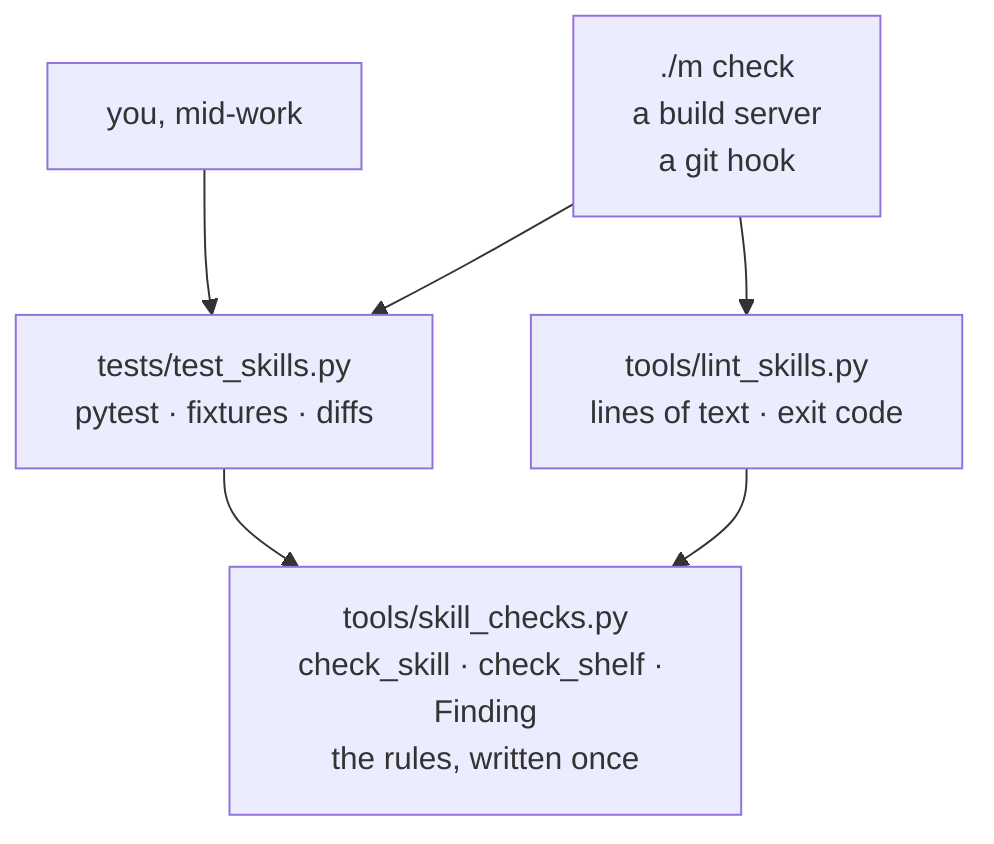

# 2.1 — Two front doors, one rulebook

## One-line answer

A lint and a test suite are two different doors onto the same rules, and the only thing that makes
having both safe is that the rules are written once, in `tools/skill_checks.py`, and both doors call
them rather than restating them.

## The story

The council office has a counter and a letterbox.

If you walk in, you queue, and a person takes your form, checks it in front of you, and tells you the
photocopy of your electricity bill is too faded to accept. You go and get a better one. It is a
conversation, and it is the right way to hand in a form if you are unsure about it.

If you post it, nobody talks to you. Two weeks later an envelope arrives with a printed slip: *form
rejected, reason code 4*. No conversation, but also no queue, and you can post a hundred forms in an
afternoon.

Two doors, two experiences, and one thing that must be identical: the rule about the electricity
bill. The moment the counter clerk and the postal clerk are working from different copies of the
guidance, the office is broken in a way neither of them can see. A form gets accepted at the counter
and rejected by post, the applicant is quite reasonably furious, and each clerk can prove they
followed the rules. What went wrong is not in either room. It is that there are two rulebooks.

So the office keeps one binder, at the back, and both clerks read from it.

## The idea in plain language

Two words first, because they get used loosely.

A **test** is a check that runs inside a test runner — here, `pytest`. It is written for a person who
is in the middle of working. It can set up temporary folders, compare structures, and print a rich
difference when something does not match. Day 30 wrote `tests/test_skills.py` for exactly this.

A **lint** is a check that runs as its own program. You type its name, it prints one line per
finding, and it exits `0` or non-zero. It is written for a machine — the gate, a hook, a build server
— and for a human who wants one greppable answer rather than a conversation.

They look like duplicates. They are not: they are two **front doors** onto the same rules, and each
door serves a caller the other one serves badly.

| | `tests/test_skills.py` | `tools/lint_skills.py` |
| --- | --- | --- |
| who calls it | you, mid-work; the gate's test stage | the gate; a hook; a build server |
| how you run it | `uv run python -m pytest tests/test_skills.py` | `uv run python -m tools.lint_skills` |
| what it gives you | fixtures, temporary folders, a rich failure diff | one line per finding, and an exit code |
| what it is bad at | being called from a shell script and read as a number | telling you *why* a structure differs |

The load-bearing decision is not that there are two doors. It is what they **share**: both import
their rules from `tools/skill_checks.py`, the module Day 30 wrote. Neither of them contains a rule.

Say why out loud, because it is the reason this part exists. If the lint restated the rules — even
correctly, even carefully — there would be two definitions of "a valid skill" in the repository. They
would agree on the day they were written. Then somebody would fix a bug in one, or add a rule to the
test suite because that is where they were working, and from that moment "green" would mean two
different things depending on which door you knocked on. Nobody would notice for a long time, because
both doors keep saying green.

That is the same disease [Day 27](../../../day-27-authoring-first-skills/parts/02-what-leaves-the-prompt/2.1-one-fact-one-home.md)
cured for facts inside a skill — one fact, one home — pointed at rules instead.

## Why Sutra needs it

Because SK-20 is not "write a linter". It is "make the skills rules enforceable by the gate", and
Day 30 already did the hard half.

Day 30 wrote the rules as **pure functions over a folder**: `check_skill(folder)` returns a list of
`Finding` records, `check_shelf(shelf)` returns the same for every folder on the shelf, and neither
of them prints anything, exits, or raises. That shape is not an accident of style. A function that
returns findings can be called by a test, by a command-line program, by a future MCP tool, or by a
report generator. A function that prints and exits can only be called by whoever was willing to be
exited.

So today's job is thin by design: forty lines that turn a returned list into printed lines and a
number. If your `lint_skills.py` starts to contain an `if` about what makes a skill valid, stop —
that `if` belongs in `skill_checks.py` where the test suite will also see it.

You will meet this shape again. Day 45 adds `tools/mcp_audit.py` as another stage in this gate, over
the MCP servers built in Phase 5, and it will be the same arrangement: the knowledge in a module, a
thin command-line wrapper, one new line in `./m check`.

## The mechanism



Both arrows point the same way: *into* the rules. Nothing points out of them, which is what makes
`skill_checks.py` safe to change — a fix there is a fix for both doors at once, and there is no third
place to remember.

The contract Day 30 defines, which today's lint consumes without altering:

```python
# tools/skill_checks.py - Day 30. Shown here for its shape only; you already wrote it.
@dataclass(frozen=True)
class Finding:
    """One rule a skill folder breaks. A value the caller decides what to do with."""

    skill: str
    rule: str
    detail: str


def check_skill(folder: Path) -> list[Finding]:
    """Every check, over one skill folder, cheapest first."""


def check_shelf(shelf: Path) -> list[Finding]:
    """Every check, over every skill folder on the shelf, enumerated live."""
```

**Line by line:**

- `Finding` is a small frozen record with three fields rather than a string, and that decision is what
  makes today's linter possible without re-implementing anything. `skill` says which folder, `rule`
  says which kind of problem, `detail` says what exactly — so a caller can group by `skill` to print
  a per-folder report, filter by `rule` to suppress a class of finding, or just print the record and
  let its `__str__` lay out the three columns.
- Frozen because a finding is evidence. Once a check records what it saw, nothing between there and
  the printout should be able to edit it.
- `check_skill(folder: Path) -> list[Finding]` takes the *folder*, not the parsed frontmatter, so that
  it can also check things the frontmatter cannot tell it — that a `SKILL.md` exists at all, that a
  referenced file resolves on disk.
- The return type is the design. A list and not a `bool`, because "invalid" without a reason is
  useless to both doors. A list and not a raised exception, because an exception stops at the first
  problem and you want all of them. And an empty list for "fine", because it is falsy and reads
  naturally at the call site: `if findings:`.
- `check_shelf(shelf: Path) -> list[Finding]` returns one **flat** list for the whole shelf rather
  than a mapping. That is simpler and it has one consequence today's linter has to handle: a healthy
  skill produces no entries at all, so the returned list cannot tell you how many folders were
  examined. An empty list is what you get from a clean shelf **and** from a shelf with nothing on it,
  and those are different facts ([2.3](2.3-the-exit-code-is-the-api.md)).
- Neither function prints. Neither exits. Neither raises. Neither knows whether it is being called
  from a test or from a command line, which is precisely why it can be called from both.

## When it breaks

**The lint grows a rule of its own.** It always starts small and reasonable — a check the test suite
does not have, added while fixing a build. Six weeks later somebody runs the tests, sees green,
commits, and the gate rejects it:

```text
FAIL kb-answer-style: description exceeds 1024 characters
```

The test suite never mentioned that rule, so the test suite is green and the gate is red on the same
tree. The fix is not to add the rule to the tests as well — that is two rulebooks again, agreeing for
now. The fix is to move the rule into `skill_checks.py` and delete it from the lint.

**The import fails because you ran the file as a script.**

```text
Traceback (most recent call last):
  File "tools/lint_skills.py", line 1, in <module>
    from tools.skill_checks import Finding, check_shelf
ModuleNotFoundError: No module named 'tools'
```

This is not a packaging problem and it is not a missing `__init__.py`. It is how Python builds its
import path when you name a file directly, and the fix is one flag. Full treatment in
[4.2](../04-wiring-the-gate/4.2-the-module-the-script-cannot-find.md).

**The rules module starts printing.** Somebody adds a helpful `print()` inside `check_skill` while
debugging and leaves it in. Now the test suite's output is noisy and, worse, the lint's output has a
line in it that no caller formatted, so anything parsing the lint's output breaks. A rules module
that prints has quietly become a third door.

## In production

**What a professional writes instead.** In a real codebase this shape has a name — the rules are a
**library**, and the test and the lint are both **adapters** over it. The library has no input or
output beyond its arguments and return values, which makes it trivially testable, and every new
caller (a report, a web endpoint, a bot comment on a pull request) is another adapter rather than
another copy. The rule of thumb professionals apply is blunt: *if it prints or exits, it is not a
rule; it is a door.*

**What degrades at scale.** Two things. First, the list returned by `check_shelf` is fine for a
handful of skills and becomes awkward at hundreds, where you want findings streamed as they are
found rather than a whole list built first — but you change that in one place, and both doors inherit
it. Second, `Finding` is already the right shape and will want more fields: a severity, so a warning
and an error can be told apart, and a rule identifier stable enough to suppress by. Day 29 built the
same three-field record for the audit
([2.1](../../../day-29-sourcing-and-auditing-skills/parts/02-the-five-pass-audit/2.1-read-it-like-the-thing-that-will-obey-it.md)),
and unifying the two is a good `TODO(me)` for whoever needs one report over both.

**The failure mode that only appears with real traffic** is the drift itself, and it is silent by
construction. Nobody gets an error when two rulebooks diverge; both doors keep reporting green
against their own copy. It surfaces as an argument — *"it passes on my machine"* — long after the
commit that caused it, which is why the discipline has to be structural rather than remembered.

**The review comment a senior engineer leaves:** *"This lint re-implements the frontmatter check
that's already in `skill_checks.py`. Import it. If the version here is better, improve the one in the
module and delete this — I don't want two answers to 'is this skill valid'."*

**The interview question:** *"Why maintain both a pytest suite and a standalone lint over the same
rules?"* The honest spoken answer: *"Different callers, same rules, one implementation. The rules live
in one module as pure functions that take a folder and return findings — no printing, no exiting.
pytest wraps them for a human mid-work, because that's where fixtures and rich diffs are worth
having; a thin command-line wrapper wraps them for machines, because the gate and CI read one integer
and want one line per finding. What I won't do is implement the rules twice, even correctly, because
duplicated rule sets always drift, and once they have, 'green' means two different things depending
on which door you came through — and nothing tells you, because both doors keep saying green."*

## Check yourself

```bash
uv run python -c "from tools.skill_checks import check_skill; print(check_skill.__doc__)"
```

Read the docstring Day 30 wrote and confirm the function returns findings rather than printing them.
Then say which of the two doors you would reach for to debug a skill that is failing for a reason you
do not understand, and why the other one would be the wrong choice.

**Out loud, without scrolling up:** explain what goes wrong when a lint restates the rules its test
suite already checks, and why the failure is silent rather than loud.

**Next:** [2.2 — The command that adds no rules](2.2-the-cli-that-adds-no-rules.md).
