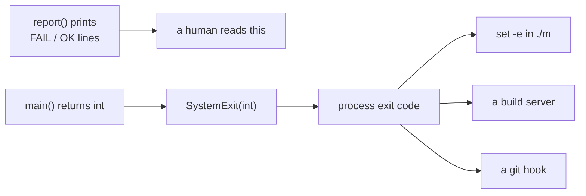

# 2.3 — The exit code is the API

## One-line answer

Everything a lint prints is commentary for a human; the only thing any other program will ever read
is the single integer it exits with, so that integer is the interface you are designing, and it has
to be right even in the cases where you have nothing interesting to print.

## The story

At the station barrier there is a beep and there is a gate.

Put a used ticket in and the machine beeps twice and shows a small red message. You look at it, you
understand, you step aside. The message is genuinely useful — it says *ticket already used* rather
than just *no* — and if the message were better you would be slightly happier.

But the message is not what stops you. What stops you is that the metal flaps stayed shut. If the
machine beeped, showed red, and opened the gate, you would walk through, and so would everyone behind
you, and the message would have been a decoration on a barrier that does not barrier.

The staff know this in a very specific way. When somebody reports a faulty gate they do not ask what
it displayed. They ask whether it opened. The display is for the passenger; the flaps are the actual
decision, and they are the only part of the machine the rest of the station is arranged around.

## The idea in plain language

Every command-line program has two outputs and they have different audiences.

**Printed text** — what you see. Rich, wordy, changeable, for a person.

**The exit code** — one small whole number handed to the operating system when the process ends.
Zero means success. Anything else means failure. That is the entire vocabulary.

The second one is the **interface**, and calling it that is not a metaphor. Look at who reads it:
the shell's `-e` flag decides whether to run the next stage from it; `&&` and `||` branch on it; a
build server marks the run red or green from it; a `git` hook decides whether the commit happens
from it. Not one of those parties reads a word of your output. They cannot. They have one integer.

Which produces the rule this part exists for: **a program that prints failures and exits zero has not
reported a failure.** It has recorded one, in a place only humans look, while telling every machine
that everything is fine. That is strictly worse than printing nothing, because now there is a
convincing-looking record that somebody will point at later.

Three consequences follow, and they are all about the boring cases.

**Zero must mean "I checked, and it was fine"**, never "I did not check". These are the two states a
naive program conflates, and the conflation is invisible: both produce a quiet, successful run.

**Every path out of the program must decide the number**, including the paths you added for tidiness
— the missing directory, the empty result, the unexpected exception.

**You must see the number with your own eyes at least once**, on a red run and on a green one,
because a wrong exit code produces no symptom whatsoever until the day something depends on it.

## Why Sutra needs it

Because from today the gate's behaviour is derived from your linter's number and from nothing else.

`./m check` runs under `set -euo pipefail` ([1.3](../01-what-a-gate-is/1.3-the-line-that-makes-it-stop.md)).
When `lint_skills` returns 1, the shell aborts and `echo "OK all green"` never runs, and the whole
day's progress row honestly says the gate was red. When it returns 0, the gate proceeds. There is no
other channel. Your `FAIL` lines are for you.

And the specific failure this part is defending against is not hypothetical here. `skills/` in the
reference checkout contains only `.gitkeep` — the two skill folders Day 27 specifies are the
learner's own work and may not exist yet
([2.2](2.2-the-cli-that-adds-no-rules.md)). A linter that returns 0 for an empty shelf would let this
repository ship with **no skills at all** and a gate that says green on every commit, which is exactly
the shape of the problem [5.2](../05-the-gate-that-lied/5.2-green-because-nothing-ran.md) finds in
`pytest`.

## The mechanism

Start with the exit-code contract itself, because it is a design decision and should be written down
before it is coded.

| Code | Means | When `lint_skills` returns it |
| --- | --- | --- |
| `0` | checked, and every skill was spec-shaped | at least one skill folder was examined and `check_shelf` returned no findings |
| `1` | something is wrong and a human must look | there is a finding, the shelf is missing, or the shelf holds no skill folders |

Two codes, not three, and that is a size choice worth defending: a finer scheme (`2` for "the tool
itself broke") is genuinely better at scale and is not worth the ceremony over one shelf of two
skills. What is *not* negotiable is that all three of the bad situations return non-zero.

Now the shape that produces those numbers, in Python:

```python
def main(argv: list[str] | None = None) -> int:
    """Every path returns a number; no path exits the process."""
    args = sys.argv[1:] if argv is None else argv
    shelf = Path(args[0]) if args else SHELF
    findings = check_shelf(shelf)
    bad = report(shelf, findings)
    examined = len(shelf_folders(shelf))
    print(f"lint_skills: {examined} skill folder(s) examined, {bad} with findings")
    if findings:
        return 1
    if examined == 0:
        print(f"lint_skills: nothing was checked - {shelf} holds no skill folders")
        return 1
    return 0


if __name__ == "__main__":
    raise SystemExit(main())
```

**Line by line:**

- `-> int` in the signature is a promise the type checker can hold you to: every branch of this
  function ends in a number. A function annotated `-> None` that occasionally calls `sys.exit` has no
  such promise, and the branch nobody thought about is always the one that matters.
- `findings = check_shelf(shelf)` is the only rule-shaped call in the file, and it is somebody
  else's. A missing shelf is handled inside it, by a `no-shelf` finding — so this function has no
  `is_dir` branch of its own, and the broken-invocation case arrives as data rather than as a
  special case.
- `bad = report(shelf, findings)` does the printing and hands back a count. Separating "how many were
  bad" from "what shall I return" keeps the number a decision you can read in one place.
- `examined = len(shelf_folders(shelf))` is the count `check_shelf` cannot give you, because it
  returns findings and a healthy skill produces none. Without this number, a clean shelf and an empty
  one are the same empty list.
- `if findings: return 1` comes first, so that a `no-shelf` finding is reported as a finding rather
  than as "nothing was checked". Two different messages for two different situations.
- `if examined == 0: return 1` is the interesting branch, and it is the empty-shelf decision from
  [2.2](2.2-the-cli-that-adds-no-rules.md), made explicit. Nothing is *broken*, and that is precisely
  the trap: the temptation is to return 0 because no rule was violated. It returns `1` because for
  this repository an empty shelf is a regression — Phase 4 exists to put skills on it, and a shelf
  that has quietly emptied is exactly the change you would want the gate to catch.
- `return 0` is the last line and the only place a healthy run can produce a zero. One statement,
  easy to find, easy to review.
- `raise SystemExit(main())` is the module boundary doing the translation. `SystemExit` carrying an
  integer sets the process exit code to that integer. Raising it rather than calling `sys.exit()`
  inside `main` is what keeps `main` a normal function — a test can call `main([...])`, get an `int`,
  and assert on it without wrapping the call in `pytest.raises(SystemExit)`.

And here is the arrangement that makes the whole thing legible — the number is what the shell sees:



Now confirm the number with your own eyes. This is the step people skip, and skipping it is how a
broken gate ships:

```bash
uv run python -m tools.lint_skills; echo "exit: $?"
uv run python -m tools.lint_skills tests/fixtures/skills/sourced-pack; echo "exit: $?"
uv run python -m tools.lint_skills no/such/place; echo "exit: $?"
```

**Line by line:**

- The first run uses the default shelf. On a checkout where Day 27's folders exist you expect `0`; on
  one where `skills/` holds only `.gitkeep` you expect `1` and the *nothing was checked* line.
- The second points at Day 29's fixture pack — four spec-shaped folders — so it exercises the
  populated path regardless of the state of `skills/`.
- The third is the deliberately broken invocation. `check_shelf` turns the missing directory into a
  `no-shelf` finding rather than raising, so what you see is a `FAIL` line naming the path and
  `exit: 1`. You are checking that a mistyped path is a failure, not a quiet success.
- `; echo "exit: $?"` after each. The semicolon runs it unconditionally, and `$?` is read
  immediately, before anything else can overwrite it
  ([1.1](../01-what-a-gate-is/1.1-one-command-one-exit-code.md)).

## When it breaks

**`sys.exit` inside `main`, and the test cannot see the number.**

```text
E   Failed: DID NOT RAISE <class 'SystemExit'>
```

or, more often, a test that passes for the wrong reason because it never asserted anything. Once
`main` exits the process instead of returning, testing it means catching an exception and reading
`.code` off it, which people do once and then stop testing exit codes at all.

**Zero for an empty shelf, and a gate that guards nothing.** Delete the `examined == 0` branch and
the symptom is that there is no symptom:

```text
lint_skills: 0 skill folder(s) examined, 0 with findings
exit: 0
```

That output is honest and the exit code is wrong. Every commit passes. It stays that way until
somebody notices, months later, that the skills lint has been green since the day a rebase dropped
the `skills/` folder.

**An unhandled exception, and a code nobody designed.**

```text
Traceback (most recent call last):
  ...
UnicodeDecodeError: 'utf-8' codec can't decode byte 0xff in position 0: invalid start byte
```

Python exits `1` for an uncaught exception, which here happens to be the right answer by accident.
It will not always be. This is the argument for the professional three-code scheme: a crash and a
finding both landing on `1` means a caller cannot tell "your skills are broken" from "my lint is
broken", and those want different responses.

**The number is right and the shell throws it away.** `lint_skills | tee lint.log` inside the gate
would report `tee`'s exit code, not the lint's — unless `pipefail` is set, which in `m` it is. That
is [5.3](../05-the-gate-that-lied/5.3-the-swallowed-exit-code.md), and it is the reason the flag is
in the script even though nothing currently pipes.

## In production

**What a professional writes instead.** A documented exit-code table in the tool's `--help` output,
and usually three codes rather than two: `0` clean, `1` findings, `2` the tool itself failed. That
third one exists because build systems want to retry or page differently for "the checker crashed"
than for "the code has problems". Alongside it, findings go to standard output and diagnostics to
standard error, so a caller can pipe one and still see the other.

**What degrades at scale.** The binary answer stops being enough once findings have severities. A
lint with warnings and errors needs a policy — does a warning fail the build? — and the policy must
be a flag rather than a hard-coded choice, because it differs between a developer's laptop and a
release branch. `--max-warnings 0` is the shape that has won across the industry, and the reason it
won is that it makes the policy visible in the invocation instead of buried in the tool.

**The failure mode that only appears with real traffic** is the silent-success regression. Somebody
refactors the tool, and a path that used to return 1 now returns 0 — a moved `return`, a swallowed
exception, a renamed variable. Nothing fails. The build goes green and stays green. The only defence
that actually works is a test that asserts the number on a known-bad input, which is why
`tests/test_skills.py` should grow one:

```python
def test_lint_returns_one_for_a_missing_shelf() -> None:
    from tools.lint_skills import main

    assert main(["no/such/place"]) == 1
```

**Line by line:**

- The import is inside the test function so that collecting the test file does not depend on the
  linter importing cleanly — a small courtesy that keeps one broken module from failing collection
  for the whole suite.
- `main(["no/such/place"])` uses the injectable-argv shape from
  [2.2](2.2-the-cli-that-adds-no-rules.md). No subprocess, no patching of `sys.argv`, no
  `SystemExit` to catch.
- `== 1` asserts the *number*, which is the interface. A test that asserted on the printed message
  would be testing the commentary and would break the next time somebody improved the wording.

**The review comment a senior engineer leaves:** *"The lint prints `FAIL` for three skills and exits
0. Whatever the output says, this stage can never fail the build. Please make the exit code match
what you're printing, and add a test that runs it against a known-bad fixture and asserts the 1."*

**The interview question:** *"Your check script prints a nice red summary. Why isn't that enough?"*
The honest spoken answer: *"Because the summary has one audience and the exit code has all the
others. The shell's `set -e`, CI, a git hook, the next stage of a pipeline — none of them read text,
they read one integer. So a tool that prints failures and exits zero passes every human inspection
and lies to every machine, which is the worst possible split, because the automation you built so
humans could stop checking is the only party being deceived. And it's silent for exactly as long as
the repo happens to be healthy — it detonates on the first real regression, which sails through a
green build. So I verify the number by hand on a red run and a green run when I write the tool, and I
keep a test that asserts the number against a known-bad input, because a wrong exit code has no other
symptom."*

## Check yourself

```bash
uv run python -m tools.lint_skills no/such/place; echo "exit: $?"
```

You should see a `FAIL` line carrying the `no-shelf` rule and `exit: 1`. Then temporarily change the
`if findings: return 1` branch to `return 0`, run it again, and notice that nothing about the output
looks different — the only thing that changed is the number. Put it back.

**Out loud, without scrolling up:** explain why an empty shelf returns 1 rather than 0 in this
repository, and name the three parties that read a lint's exit code and never read its output.

**Next:** [2.4 — What the shelf lint refuses to judge](2.4-what-the-shelf-lint-refuses-to-judge.md).
