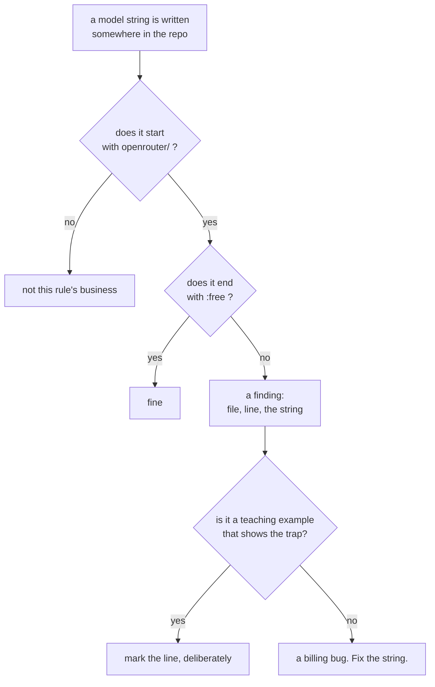

# 3.1 — Five characters that bill

## One-line answer

Addendum 02 §7 says that any `openrouter/` model string in this repository must end in `:free`,
because the same model without those five characters is the paid one, the request succeeds either
way, and nothing in your code or your output will tell you which one you used.

## The story

The daily pass and the single look identical in your hand.

Same paper, same size, same machine, printed a second apart. One says DAY across the middle in small
grey letters and the other does not, and once it is in your pocket with your keys you will not look
at it again.

You get on, you tap or you wave it, the driver nods, you sit down. That is the part that matters and
it is the part that is identical: **nothing about the journey is different.** The bus does not go a
different route. Nobody stops you. The difference is not in the ride, it is in what the machine
charged when it printed the paper, and you find that out at the end of the month when you add it up
and realise you have been buying singles all week for a route you take four times a day.

Nobody makes this mistake because they are careless with money. They make it because the feedback
that would correct them arrives long after the moment they could have acted on it, and by then the
moment has repeated thirty times.

## The idea in plain language

OpenRouter is a service that resells access to a large number of models from different vendors behind
one interface. You name a model with a string. The string is the vendor's identifier with `openrouter/`
in front of it, and — this is the whole subject of this part — the *same* model appears under **two**
identifiers.

One ends in `:free`. That routes the request to a free-tier variant, which is rate-limited and costs
nothing. The other, identical up to those five characters, is the paid variant.

Three properties of that arrangement make it a trap rather than a mistake.

**Both strings are valid.** Neither is a typo in the ordinary sense. Nothing rejects the shorter one,
because the shorter one is a real, correct, working model identifier.

**The request behaves identically.** Same response shape, same fields, same latency band. Your code
cannot tell. Your tests cannot tell. Your logs, unless you deliberately log the model string, cannot
tell.

**The feedback is delayed and aggregated.** You find out from a billing page, later, as a total —
exactly the shape of the bus ticket. By the time you know, the string is in your repository and has
been running on every request for a while.

Put those together and you have a class of bug that the ordinary defences are blind to. It is not a
crash, so error handling does not see it. It is not a wrong answer, so tests do not see it. It is not
a style issue, so review sees it only if the reviewer happens to know the rule and happens to be
looking at that line.

What it *is*, is a **syntactic invariant**: a property you can decide by looking at the text, with no
model call, no network, and no judgement. Every one of those is a candidate for mechanisation, and
this one is about twenty lines.

Here is the rule as the addendum states it, word for word — this is the sentence the next part turns
into a program:

> 🏷️ **OpenRouter: `:free` suffix or it isn't free.** Lint rule: any `openrouter/` model string in
> the repo must end in `:free` (add to `make check` on Day 31 alongside the skills lint).

One note on that quotation, because the day format demands the source be accurate rather than tidy:
the addendum says `make check`, written before `./m` existed. `make` is not installed here and the
root `Makefile` is a two-line shim that forwards to `bash ./m check`
([1.1](../01-what-a-gate-is/1.1-one-command-one-exit-code.md)). The rule is unchanged; the command's
name moved.

## Why Sutra needs it

Because this project's entire model policy is *zero budget*, and zero budget is not a preference — it
is the constraint the curriculum is designed around. Every day is planned against roughly twenty free
Gemini generations, and Addendum 02 exists so that no day can quietly require a billing account.

A missing `:free` is the one edit that breaks that policy without breaking anything else. It does not
fail a test. It does not raise. On a machine with no paid key it does not even charge — the request
is simply rejected — so it can sit in the repository looking fine for as long as nobody has a paid
key. It becomes a charge on the day somebody does, which by then is a different person on a different
machine reading code they did not write.

That delay is the argument for mechanising it now rather than remembering it. This repository has
been carrying the rule in `CLAUDE.md` since Day 0 and in the addendum since before that, and it has
been enforced by nothing since Day 9, which is when the first OpenRouter string was written down.

You are also, today, the last person who can add this cheaply. From tomorrow the repository grows MCP
servers, database tools and memory services, and every one of them is another file the rule has to
hold in. A rule mechanised while the codebase is small is a rule that never has to be retrofitted.

## The mechanism

The invariant, stated precisely enough to code against:

> For every text file in the repository that is not history, every substring matching
> `openrouter/<vendor>/<model>` must be immediately followed by `:free`.

Four things in that sentence are decisions, and each one is defended in
[3.2](3.2-what-the-lint-must-read.md): *every text file* rather than every `.py` file; *not history*,
meaning `legacy/` is excluded; *substring* rather than *whole line*, because the string appears inside
quotes, inside prose and inside tables; and *immediately followed*, because a suffix somewhere later
on the line does not count.

The two strings side by side, so the size of the difference is visible:

```text
openrouter/z-ai/glm-5.2:free     <- free tier, rate-limited, costs nothing
openrouter/z-ai/glm-5.2          <- the paid model, same weights   allow-unfree
```

The `allow-unfree` at the end of the second line is not a comment aimed at you. It is a marker that
stops today's own lint from reporting this document as a billing bug, because the lint reads day
documents too and this one has to print the wrong string in order to teach it. Why that marker has to
exist, and why the alternative is worse, is [3.3](3.3-the-alarm-that-fires-on-toast.md).

Day 9 pinned the first of those and wrote a guard for it in the lab — `free_only(model)`, which
refuses an `openrouter/` string with no `:free` suffix. That guard protects one code path at runtime.
What it cannot protect is a model string written anywhere else: in a different module, in a
configuration file, in a build brief in a day document that somebody copies into code next month.

This is the general shape and it is worth naming, because you will apply it again: **a runtime guard
defends one call site; a lint defends the repository.** They are not alternatives. The guard gives
you a good error at the moment of use; the lint tells you the string exists at all.



The last two boxes are the part that makes this a real engineering problem rather than a regular
expression. Some occurrences of the wrong string are *correct* — a lesson that teaches the trap has to
print it — and a lint with no way to say so is a lint people switch off
([3.3](3.3-the-alarm-that-fires-on-toast.md)).

## When it breaks

**The paid model answers, and everything looks perfect.** There is no error text to paste for the
success case, which is precisely the problem. The response has the same shape as the free one. This
is why the section you are reading has to reach for the *other* failures instead — the ones that do
produce text.

**No key at all, and the request is rejected:**

```text
openrouter.AuthenticationError: No auth credentials found
```

On a machine with no OpenRouter key, both strings fail this way and the missing suffix is invisible.
That is the state this repository is in, which is exactly why the string can sit here undetected.

**A free-tier key, the paid string, and a refusal that names the reason:**

```text
{"error":{"message":"This request requires more credits, or fewer max_tokens. You requested up to ... tokens, but can only afford ...","code":402}}
```

`402 Payment Required` is the honest version of this failure and the one you want, because it names
the problem. You only get it when the account has no credit. An account *with* credit gets a `200`
and a charge.

**The string is right and the model is gone.** Day 9 recorded this happening: the free roster held
seventeen models on 2026-08-27, against "~25 more" written in Addendum 02 on 2026-08-12, and
`deepseek/deepseek-r1:free` — the model the addendum named first — was no longer on it.

```text
ValueError: Model openrouter/deepseek/deepseek-r1:free not found.
```

A perfect suffix on a model that no longer offers a free tier. The lint cannot help with this; it is a
fact about the world, and it belongs to the freshness re-check
([6.2](../06-the-phase-gate/6.2-the-freshness-check-that-fired.md)). Naming that limit here matters —
the lint's claim is *the string is well-formed*, never *the model is free*.

## In production

**What a professional writes instead.** Two layers, not one, and this repository will have both. At
runtime, a guard at the single point where a model string becomes a client — Day 9's `free_only` —
so a bad string raises with a message naming the rule rather than quietly succeeding. Statically, a
repository-wide lint in the gate, so the string cannot be committed in the first place. The reason
for both is that they fail at different times: the lint fails at commit, when the author is present
and the fix is free; the guard fails at run, catching strings that arrive from configuration or an
environment variable and were never in the repository at all.

**What degrades at scale.** In a real company this rule is one of a family — allowed model
identifiers, allowed regions, allowed data classes — and they stop being greppable strings. The
mature form is a small allowlist owned by one team, and the check becomes *is this identifier in the
allowlist* rather than *does it end in five characters*. The suffix rule survives as the cheap first
line, because it needs no network and no registry, and cheap checks are the ones that run on every
commit.

**The failure mode that only appears with real traffic** is cost, and cost is measured in aggregate
after the fact, which makes it the slowest feedback loop in the system. A single wrong string on a
hot path is a small number multiplied by a large one, and nothing between the edit and the invoice
raises a flag. Teams that handle this well put the model identifier into their structured logs on
every call — the same discipline as
[Day 22](../../../day-22-structured-logging/parts/01-a-line-you-can-query/1.1-a-print-is-not-a-log.md) —
so the question *"what are we actually calling?"* is a query rather than an audit.

**The review comment a senior engineer leaves:** *"This model string is missing `:free`. That's not a
nit — on this project it's the difference between a rate limit and an invoice, and nothing in the
tests or the logs would ever tell us. Add the suffix, and while you're here, is there a lint for it
yet?"*

**The interview question:** *"Give me an example of a rule you moved out of people's heads and into a
tool, and why that one."* The honest spoken answer: *"We're on a strict zero-budget policy, and our
provider exposes the same model under two identifiers — one ending in `:free` and one not. Both are
valid, both work, the responses are identical, and the only feedback that you picked the wrong one
arrives on a billing page weeks later. So it's invisible to tests, invisible to error handling, and
visible in review only if the reviewer happens to know the rule. But it's a purely syntactic property
— you can decide it by looking at the text — and that's the signature of something that should be a
lint. It's about twenty lines, it runs in the gate on every commit, and it guards the single most
expensive typo the repository can contain. The thing I'd flag is what it doesn't prove: the suffix
being correct doesn't mean the model still has a free tier. That's a fact about the world, and we
re-check it at every phase boundary."*

## Check yourself

```bash
grep -rn "openrouter/" --include="*.py" sutra/ tests/ tools/ || echo "no openrouter string in code yet"
```

Run it and see how many model strings the rule currently has to hold in. Then say what would have to
happen for that number to grow, and why the answer is not "someone being careless".

**Out loud, without scrolling up:** explain why a missing `:free` suffix is invisible to tests, to
error handling and to logs, and name the one thing the lint proves and the one thing it does not.

**Next:** [3.2 — What the lint must read](3.2-what-the-lint-must-read.md).
