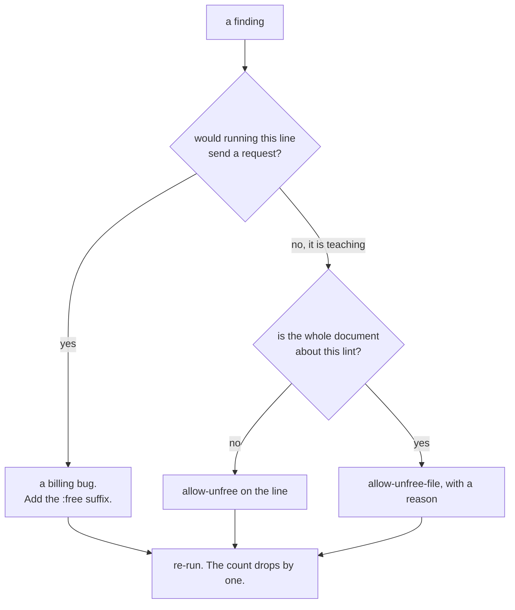

# 3.3 — The alarm that fires on toast

<!-- allow-unfree-file: this part quotes the lint's findings and shows the wrong string on purpose,
     which is exactly the situation it is about. -->

## One-line answer

The `:free` lint's first run on this repository reports ten findings and not one of them is a bug —
they are all day documents teaching the trap by printing the wrong string — and how you resolve that
decides whether the lint survives, because a check that cries wolf gets switched off long before it
gets fixed.

## The story

The smoke alarm in the hallway goes off every time somebody makes toast.

It is working correctly. There is smoke. The alarm is doing precisely what it was installed to do,
and the person on the chair waving a tea towel at the ceiling knows this and is not grateful.

What happens next is the entire subject. Nobody in the history of hallways has ever responded to this
by moving the alarm three feet further from the kitchen door. What happens is that one evening
somebody stands on the chair and takes the battery out, intending to put it back at the weekend, and
then the weekend happens.

The alarm did not fail. It was *removed*, by a reasonable person, for a reason that made sense at the
time — and the flat now has no smoke alarm at all, which is a strictly worse outcome than the alarm
that annoyed everybody. The cost of a false alarm is never the false alarm. It is the removal.

## The idea in plain language

A **false positive** is a finding that is technically correct and is not a problem.

The `:free` lint has a structural reason to produce them, and it is not a bug you can pattern your
way out of. Day 5 and Day 9 both *teach* this trap, and to teach a trap you have to show it. Day 9's
failure lab is an entire document about the model string that charges, so it prints the wrong string
seven times, deliberately, in the course of explaining why it is wrong.

Which gives a rule with a genuinely awkward shape: *this string must never appear without its
suffix — except where its appearance is the lesson.*

There are three ways to resolve that and only one of them is right.

**Narrow the rule.** Stop scanning day documents. The output goes quiet immediately, and the rule now
fails to cover the majority of text in the repository — including build briefs, which are where
strings get copied into code from. This is moving the smoke alarm out of the flat.

**Keep an allowlist of paths.** A file listing the documents that are permitted to contain the wrong
string. Better, and still wrong in a specific way: a path exemption is a **blank cheque against the
future**. It exempts lines nobody has written yet, so the day somebody adds a genuine billing bug to
`days/day-09-four-free-providers/LESSON.md`, the lint is already promising not to look.

**Mark the exemption where it lives.** A marker on the line itself. It exempts exactly that line and
nothing else, it is visible to anybody reading the line, and — the property that matters most — it
must be **added by the person writing the offending string**, at the moment they write it, which is
the only moment anyone has enough context to judge.

That is the mechanism every mature linter converged on: `# noqa`, `# nolint`, `// eslint-disable-next-line`.
The convergence is not fashion. It is the only exemption that is narrow, visible and correctly timed.

## Why Sutra needs it

Because this repository will otherwise take the battery out, and you can predict the exact commit.

Picture the alternative. The lint goes into the gate reporting ten findings that everybody knows are
fine. Every run of `./m check` is red. Within a couple of days somebody comments the stage out "until
we clean up day 9", and the comment stays. The rule is then in a worse position than before today,
because it *looks* enforced — there is a lint, it is in the repository, somebody clearly did the work
— and it is not running.

So the ten findings are not paperwork to get past. They are the day's real exercise, and they are
your `TODO(me)`: for each one, decide whether it is a lesson or a bug, and record the decision in the
line. Ten decisions, each of which is a small act of reading. That is a much better use of an
afternoon than a regular expression.

There is a second thing this buys, and it is the reason to prefer a marker over deleting the finding.
A marked line is a line somebody looked at. In a year, `git blame` on the marker tells you who
decided, and the words next to it tell you why. A path allowlist tells you nothing except that
somebody was in a hurry.

## The mechanism

Two markers, and the second one exists because the first is not sufficient.

| Marker | Scope | Use it when |
| --- | --- | --- |
| `allow-unfree` | the line it appears on | a document, a comment or a test shows the wrong string deliberately |
| `allow-unfree-file` | the whole file | the document's subject **is** this lint, so it pastes the lint's own findings |

The line marker is the default and the one you should reach for nine times out of ten. Here is how it
reads in place, in a day document that teaches the trap:

```markdown
model = "openrouter/some-org/some-model"  # 💥 the :free suffix is missing   allow-unfree
```

**Line by line:**

- The offending string is unchanged. The lesson still shows the reader exactly the wrong thing, which
  is the whole point of the line existing.
- `# 💥 the :free suffix is missing` is the original teaching comment. The marker joins it rather
  than replacing it, so the reader still gets the explanation and the lint still gets its exemption.
- `allow-unfree` at the end is the marker. It is a plain substring, not a directive with syntax, so
  it works identically inside a Python comment, a Markdown table cell, a shell script and prose. That
  simplicity is deliberate: an exemption mechanism that can itself be got subtly wrong is a second
  bug surface ([3.2](3.2-what-the-lint-must-read.md) checks it with `in`, nothing more).
- Nothing about the line's *meaning* changed. This is the property a path allowlist does not have: an
  exemption written here is visible to the next person who reads this line, in the place they are
  already looking.

The file marker is the escape hatch, and it needs a much stronger justification. There is exactly one
situation in this repository that earns it: a document whose subject is the lint, which therefore
pastes the lint's own findings verbatim. [3.2](3.2-what-the-lint-must-read.md) carries a run with ten
`FAIL` lines in it, each containing a model string with no suffix. Marking those individually would
mean editing the pasted output, which would make it no longer the output.

```markdown
<!-- allow-unfree-file: this part pastes the lint's own findings verbatim, so every model string in
     it is quoted evidence rather than a billing bug. -->
```

**Line by line:**

- It is an HTML comment, so it is invisible in the rendered document and present in the source, which
  is where the lint reads.
- It carries a **reason** in the same breath as the exemption. That is not politeness; a file-level
  exemption with no stated reason is indistinguishable from somebody silencing a real finding, and
  the reason is what a reviewer checks.
- It sits directly under the H1, so anybody opening the file meets it before the content.
- Two files in this day carry it — [3.2](3.2-what-the-lint-must-read.md) and this one — and no other
  file in the repository does. If a third appears, that is a thing to argue about in review.

Now the exercise itself. Run the lint and read the ten findings as a list of decisions:

```bash
uv run python -m tools.lint_free_suffix; echo "exit: $?"
```

**Line by line:**

- No argument, so the scan starts at the repository root.
- Read the output as ten questions, not ten errors. Each one is: *is this line teaching the trap, or
  is it a string somebody will run?*
- `echo "exit: $?"` gives `1` until every one of them is decided.

The ten, grouped by what they are, measured on 2026-09-04:

| Where | Count | What it is | The decision |
| --- | --- | --- | --- |
| `days/day-05-first-adk-agent/…/3.2-a-floating-alias-is-not-a-pin.md` | 1 | a code block showing the missing suffix, with `💥` next to it | mark the line |
| `days/day-09-four-free-providers/LESSON.md` | 1 | the eval that asserts `free_only` rejects a suffix-less string | mark the line |
| `days/day-09-four-free-providers/…/2.4-the-wholesale-market.md` | 2 | prose contrasting the two identifiers | mark the lines |
| `days/day-09-four-free-providers/…/7.1-the-free-trial-that-charges.md` | 6 | the failure lab whose entire subject is this trap | mark the lines |

Every one is a lesson. Zero are bugs. That is the honest result of the first run and it is worth
sitting with, because the instinct on seeing ten red lines is that something is broken, and nothing
is.

**These are not lines a generated day may edit.** Days 5 and 9 are committed history, and today's
document does not reach into them — the marking is your `TODO(me)`, and it is the rep, because the
judgement is the skill.



## When it breaks

**Somebody marks a real bug.** This is the cost of having an exemption mechanism at all, and it is a
real cost rather than a theoretical one:

```python
MODEL = "openrouter/some-vendor/some-model"  # allow-unfree
```

That line is now silently billing, with a marker that says a human approved it. Nothing catches this
automatically — an exemption is by construction a place where the automation stops. What catches it
is review, which is why the marker must be *visible on the line* rather than in a separate file: a
reviewer reading a diff sees the marker arrive in the same hunk as the string.

**Somebody marks the whole file because the line marker was fiddly.**

```markdown
<!-- allow-unfree-file -->
```

No reason, at the top of an ordinary document. The lint now ignores that file forever, including
lines nobody has written yet. This is the path allowlist rebuilt one file at a time, and it is why
the file marker in this day carries a sentence explaining itself. A reviewer should treat a
reason-less file marker as a change request.

**The marker gets copied along with the line.** Somebody copies the teaching line out of Day 9 into
real code, marker and all:

```python
model = "openrouter/z-ai/glm-5.2"  # allow-unfree
```

The lint stays green, in code that will bill. This is the strongest argument for keeping Day 9's
runtime guard as well as this lint: `free_only(model)` raises when the string reaches the client,
regardless of what any comment says. Static checks and runtime guards fail at different moments, and
this is the moment only the guard covers.

**The lint is switched off rather than satisfied.** The failure this whole part exists to prevent,
and its error text is a diff rather than a traceback:

```diff
     uv run python -m tools.lint_skills
-    uv run python -m tools.lint_free_suffix
+    # TODO: re-enable once day 9 is cleaned up
```

**Line by line:**

- The stage is commented out rather than deleted, which is what makes it feel temporary and
  reversible. It is neither.
- The `TODO` names a condition — *once day 9 is cleaned up* — with no owner and no date, which is the
  standard shape of a comment that outlives the person who wrote it.
- The gate is now green and the rule is unenforced, which is the exact state the repository was in
  yesterday, except that now there is a file called `lint_free_suffix.py` making it look otherwise.

## In production

**What a professional writes instead.** The same two-level scheme, with two additions. First, the
marker carries a reason as a matter of convention — `# noqa: E501  - URL, cannot wrap` — and the
convention is enforced by yet another rule, because an unexplained suppression is a suppression
nobody can review. Second, suppressions are *counted*: the build prints how many exemptions exist,
and a growing count is treated as a signal in its own right. A codebase with four hundred `noqa`
comments has a rule it has decided not to follow, and saying so out loud is more useful than
pretending otherwise.

**What degrades at scale.** False-positive rate is the number that decides a lint's survival, and it
compounds. One noisy finding per run is a nuisance; ten is a stage people stop reading; a hundred is
a stage somebody deletes. The professional discipline is to treat every false positive as a bug in
the *lint*, not in the code, and to fix the pattern where the pattern can be fixed — the leading
`[A-Za-z0-9]` in [3.2](3.2-what-the-lint-must-read.md)'s regular expression removed a whole class of
them, and that is always the first move. Exemptions are for the cases that survive a genuinely good
pattern.

**The failure mode that only appears with real traffic** is normalisation. Once a team has seen a
particular finding often enough, they stop reading it, and the day a *real* instance of it appears it
scrolls past with the others. This is the toast alarm at organisational scale, and it is why the
number that matters on a mature lint is not "how many bugs did it catch" but "what fraction of its
output is actionable". Below about eighty per cent, the check has become decoration.

**The review comment a senior engineer leaves:** *"You've added `allow-unfree-file` to the top of
this module. That's a whole file exempted forever, including code nobody has written yet, and there's
no reason next to it. Put the marker on the two lines that need it, or write the sentence saying why
the file needs it — and if the answer is 'there were a lot of them', that's an argument for fixing
the pattern, not for silencing the file."*

**The interview question:** *"Your new lint fires on twelve places and none of them are bugs. What do
you do?"* The honest spoken answer: *"First I check whether the pattern is wrong, because a false
positive is usually a bug in the lint rather than in the code — in our case tightening one character
class killed a whole family of them. For the ones that survive, I look at why they're legitimate. Ours
were documentation that teaches the trap by showing the wrong string, which is a genuine, permanent
reason. Then the exemption goes on the line, not in a path allowlist: a path exemption is a blank
cheque against lines nobody has written yet, and it's invisible to the person editing the file,
whereas a line marker is right there in the diff and has to be added by the person writing the string
— the only one with enough context to judge. And I'd resist the tempting third option, which is to
narrow what the lint scans until it goes quiet. That's how a rule silently stops applying to most of
the repository. The real risk with a noisy check isn't the noise, it's that somebody switches it off,
and then you have a file that looks like enforcement and isn't."*

## Check yourself

```bash
uv run python -m tools.lint_free_suffix; echo "exit: $?"
uv run python -m tools.lint_free_suffix days/day-31-the-quality-gate; echo "exit: $?"
```

The first is red with ten findings until you triage them. The second should already be green, because
every deliberate occurrence in today's folder carries a marker — open
[3.1](3.1-five-characters-that-bill.md) and find the one on the line, then open
[3.2](3.2-what-the-lint-must-read.md) and find the one on the file.

**Out loud, without scrolling up:** explain why a path allowlist is worse than a line marker even
though both silence the same findings, and say what the real cost of a noisy check is.

**Next:** [4.1 — Two lines in the driver](../04-wiring-the-gate/4.1-two-lines-in-the-driver.md).
