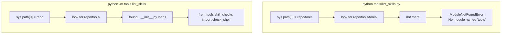

# 4.2 — The module the script cannot find

## One-line answer

`python tools/lint_skills.py` fails with `ModuleNotFoundError: No module named 'tools'` because
naming a file puts that *file's own folder* at the front of the import path, while `python -m
tools.lint_skills` puts the **working directory** there instead — which is the folder the `tools`
package actually lives in.

## The story

You are told to go to flat four, second floor.

You do. You are standing outside flat four on the second floor, and you ring, and a stranger opens
the door and has never heard of the person you came to see. You check the message again. Flat four,
second floor. That is what it says and that is where you are.

The block you are standing in is not the block. There are three of them on the road and every one has
a flat four on the second floor, because they were all built from the same drawing. The address was
never wrong — it was **relative**, and it needed one more thing in front of it that the person
sending it never thought to include, because from where they were standing there was only one block.

What makes it twenty minutes rather than a moment is that being at the wrong door does not feel like
being at the wrong door. It feels like a missing person.

## The idea in plain language

When Python runs, it keeps a list of folders to search for modules, in order, in `sys.path`. The
first entry is the one that matters here, and **it depends on how you started Python**.

| How you start it | `sys.path[0]` is | So `import tools.…` |
| --- | --- | --- |
| `python tools/lint_skills.py` | the folder holding the named file — `…/tools` | fails: there is no `tools` folder *inside* `tools/` |
| `python -m tools.lint_skills` | the current working directory — the repository root | works: `tools/` is right there |

That is the whole mechanism, and it is worth reading the first row twice. Naming a file makes Python
put *that file's own directory* at the front of the search path. Your script lives in `tools/`, so
`tools/` goes on the path — and then `import tools` looks for a folder called `tools` **inside**
`tools/`, does not find one, and raises. Flat four, second floor, wrong block.

The `-m` form is different in exactly one way that matters: it treats its argument as a module path
to be resolved, so it puts the **working directory** at the front instead. Run from the repository
root, that is the folder containing `tools/`, so `tools.skill_checks` resolves.

Two things that are *not* the explanation, and both waste an afternoon when believed:

**It is not a missing `__init__.py`.** Day 30 created `tools/__init__.py`, and it is present. Python
3 resolves namespace packages without one anyway. The file matters for other reasons; it does not
fix this.

**It is not a missing install.** `tools` is deliberately not an installed package —
`pyproject.toml` ships `sutra` and `sutra_mcp` in the wheel and nothing else, because `tools/` is
repository tooling and has no business inside the distributed package. So there is no `pip install -e`
that makes the path form work, and reaching for one would be solving the wrong problem.

## Why Sutra needs it

Because it is the most likely way today goes wrong, and the traceback points at the wrong culprit.

You will type `python tools/lint_skills.py` at least once. It is the obvious thing to type, it is
what the file looks like it wants, and everything you have run in this repository so far has been
either `uv run python -m pytest` or `uv run python scripts/something.py` — and the second of those
*works*, because `scripts/depth_check.py` imports nothing from its own package. So the habit is
established and the exception has never come up.

When it fails, the message says `No module named 'tools'` while you are standing in a directory that
visibly contains `tools/`. The natural next moves are all wrong: adding an `__init__.py` that already
exists, installing the package, or — the one that does real damage — appending to `sys.path` at the
top of the linter:

```python
sys.path.insert(0, str(Path(__file__).resolve().parents[1]))  # do not do this
```

**Line by line:**

- `Path(__file__).resolve().parents[1]` is the repository root, computed from the file's own location
  exactly as `lint_free_suffix` computes its scan root — the arithmetic is correct.
- `sys.path.insert(0, ...)` pushes that folder to the front of the import path, so the very next line
  can `import tools.skill_checks` and it resolves.
- `str(...)` because `sys.path` holds strings; a `Path` on it works on modern Python and is still not
  what the list is documented to contain.
- It works. It also has to run **before** the import it enables, which means the file now has
  statements that must appear above its own imports — something every linter will complain about and
  every future reader has to stop and reason about.
- And it spreads. The next tool starts as a copy of this one, and a repository with several modules
  each rewriting the import path at import time eventually has one that shadows a real package.
- The one-flag fix is better in every respect, which is why this block is labelled the way it is.

That mutation works, and it makes the file's behaviour depend on something performed before its own
imports. The one-flag alternative changes nothing inside the file at all.

It matters beyond today, too. Day 45 adds `tools/mcp_audit.py` to the same gate, and Phase 5's
modules under `sutra/mcp/` will import each other the same way. Knowing why `-m` is the invocation is
what keeps the next four gate stages from each rediscovering this.

## The mechanism

See it directly. Put a two-line module in `tools/` that prints the first entry of the search path:

```python
# tools/show_path.py - throwaway, delete it afterwards
import sys

print("sys.path[0] =", repr(sys.path[0]))
```

**Line by line:**

- `import sys` gives access to the interpreter's own state; `sys.path` is the live list Python
  searches, and you can read it at runtime because it is an ordinary list.
- `sys.path[0]` is the front of the queue — the first folder searched, and therefore the one that
  decides this question.
- `repr(...)` rather than plain printing, so the string appears with quotes and its separators are
  unambiguous. On Windows a path printed raw can hide whether a separator is a backslash or an escape.

Run it both ways, from the repository root:

```bash
python tools/show_path.py
python -m tools.show_path
```

**Line by line:**

- The first names a *file*. Python resolves the path, and puts the directory containing that file at
  the front.
- The second names a *module*, dotted. Python resolves it against the import path, and puts the
  current working directory at the front instead.
- Both use the same interpreter, the same directory, and the same file. The only difference is the
  form of the invocation, which is what makes this a clean experiment.

Measured on 2026-09-04, with the module in a folder called `tools/` under a project root:

```text
--- as a path ---
sys.path[0] = '...\\proto\\tools'
--- as a module ---
sys.path[0] = '...\\proto'
```

One level apart, and that one level is the entire bug. In the first case `import tools.skill_checks`
searches inside `tools/` for another `tools`. In the second it searches the project root, where
`tools/` is sitting.



There is one consequence of the `-m` form worth knowing before it surprises you: **it depends on the
working directory.** Run `uv run python -m tools.lint_skills` from inside `days/` and it fails the
same way, because the working directory no longer contains `tools/`. That is acceptable here — the
gate always runs from the repository root, and `./m` is invoked as `./m`, which only works from the
root anyway — but it is why `lint_free_suffix` computes its scan root from `__file__` rather than
from the working directory ([3.2](../03-the-free-suffix-lint/3.2-what-the-lint-must-read.md)): the
*invocation* has to happen at the root, and the *behaviour* should not silently change if it does not.

## When it breaks

**The path form, verbatim:**

```text
Traceback (most recent call last):
  File "tools/lint_skills.py", line 18, in <module>
    from tools.skill_checks import Finding, check_shelf
ModuleNotFoundError: No module named 'tools'
```

Read the two halves against each other. The `File` line says Python found and opened
`tools/lint_skills.py` without trouble — so the file exists and the path was right. The
`ModuleNotFoundError` says the *package* `tools` is not importable. Both are true at once, and that
combination is the signature of this bug: the file is reachable and the package it belongs to is not.

**The nearly-identical error that means something completely different:**

```text
ModuleNotFoundError: No module named 'tools.skill_checks'
```

Here `tools` resolved and `tools.skill_checks` did not. That is a genuinely missing file — Day 30 is
not finished — and no invocation flag will fix it. The difference is one dotted segment in the
message, and it is the first thing to look at.

**The `-m` form run from the wrong directory:**

```text
$ cd days
$ uv run python -m tools.lint_skills
No module named tools
```

Note the phrasing: `-m` reports its failure to find a module differently from an `import` statement
inside a file, and there is no traceback because nothing was executed. If you see this, check where
you are standing before you change anything.

**The fix that becomes a habit.** Somebody adds the `sys.path` insertion at the top of the file and
it works. Two days later somebody copies that file as the starting point for the next tool, and the
insertion comes with it. A year later there are six modules in the repository each mutating the
import path at import time, and one of them shadows a real package. Nothing about this is dramatic;
it is simply a mess that a one-character flag would have prevented.

## In production

**What a professional writes instead.** Two shapes, and the choice is about whether the tool is part
of the product. If it is repository tooling — this case — the invocation is `python -m package.module`
and the convention is written down once, in the gate and in the tool's docstring. If it is something
users run, it gets a **console script entry point** in `pyproject.toml`, so `pip install` puts a real
command on the `PATH` and the question disappears entirely:

```toml
[project.scripts]
sutra-lint-skills = "tools.lint_skills:main"
```

**Line by line:**

- `[project.scripts]` declares command-line entry points that the installer creates.
- The left side is the command a user types; the right side is `module:function`, and the function
  must return an integer or `None` — which is exactly the `main() -> int` shape from
  [2.3](../02-a-lint-is-a-test/2.3-the-exit-code-is-the-api.md), and a good part of why that shape is
  standard.
- The installer generates a small launcher that imports the module properly, so `sys.path` is never
  the user's problem.
- **This repository deliberately does not do this**, and the reason is worth stating: `tools/` is not
  in the wheel, an entry point would require installing the project to run its own gate, and the gate
  must work on a fresh clone with `uv run` and nothing else.

**What degrades at scale.** As a repository grows, the number of ways to invoke its tooling grows
with it, and inconsistency becomes the actual cost — a stage invoked one way in the gate, another way
in a hook, a third way in someone's editor configuration, each with different import behaviour, and
one of them broken on a machine nobody has tried. Teams that stay sane pick one form and put it in
the gate, so the gate is also the documentation.

**The failure mode that only appears with real traffic** is a working-directory assumption that holds
everywhere except one caller. A build server that checks out into a subdirectory, an editor that runs
tools from the file's own folder, a scheduled job with a different starting directory — each of them
breaks a `-m` invocation in a way that never reproduces locally. The defence is to make each tool's
*behaviour* independent of the working directory even when its *invocation* is not, which is the
`__file__`-derived root in `lint_free_suffix`.

**The review comment a senior engineer leaves:** *"There's a `sys.path.insert` at the top of this
file. Take it out and invoke it with `-m` from the repository root — the gate already does. Path
manipulation at import time is the kind of thing that works until two of them disagree, and then it
takes an afternoon to find."*

**The interview question:** *"Somebody on your team says `python myscript.py` fails with
`ModuleNotFoundError` for a package sitting right next to it. What do you tell them?"* The honest
spoken answer: *"That naming a file puts that file's own directory at the front of `sys.path`, not
the directory you're standing in — so a script inside `tools/` gets `tools/` on the path, and `import
tools.something` then looks for a `tools` inside `tools`. Running it as `python -m tools.myscript`
puts the working directory on the path instead and it resolves. The thing I'd steer them away from is
the fix that works: inserting into `sys.path` at the top of the file. It's invisible to the next
reader, it spreads by copy-paste, and eventually one of them shadows a real package. If it's a tool
users run rather than repo tooling, the right answer is a console script entry point, so the question
never comes up at all."*

## Check yourself

```bash
python tools/lint_skills.py; echo "exit: $?"
uv run python -m tools.lint_skills; echo "exit: $?"
```

Run both from the repository root. The first should fail with `No module named 'tools'`; the second
should run. Then read the traceback's `File` line and say what it proves about whether the file was
found.

**Out loud, without scrolling up:** explain what `sys.path[0]` is set to in each invocation, and give
the one-word difference between `No module named 'tools'` and `No module named 'tools.skill_checks'`.

**Next:** [5.1 — Red for eight days](../05-the-gate-that-lied/5.1-red-since-day-fifteen.md).
