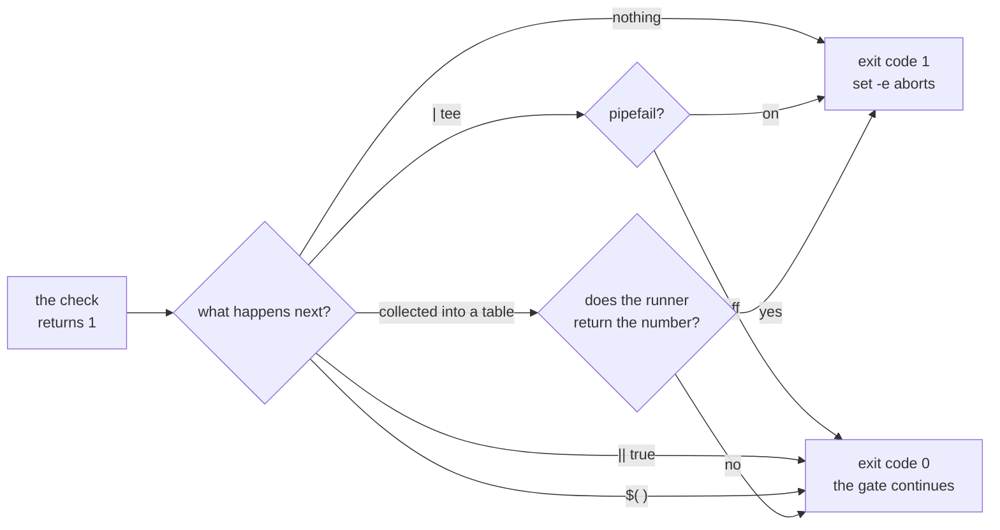

# 5.3 — 💥 The swallowed exit code

## One-line answer

A gate stage can print a perfect failure and still report success, because three ordinary shell
constructions — a pipe, a trailing forgiveness operator, and a command substitution — each replace
the exit code you care about with the exit code of something else, and `set -o pipefail` closes only
the first of them.

## The story

The card machine at the counter says DECLINED and the till prints a receipt that says APPROVED.

Not because anybody is stealing. The till and the card reader are two devices, connected by a cable
that carries the amount one way and nothing back. The till's job is to print a receipt for a sale,
and as far as the till is concerned the sale happened: it was told an amount and it printed a slip.
The word APPROVED at the bottom is on the paper roll's template, not the result of asking anything.

The person at the counter is watching the card reader, so on the day it declines they see it and stop
you. But the receipt goes in the till drawer, and at the end of the week somebody reconciles the
drawer against the card terminal's own log and finds a slip with no matching transaction. By then it
is a puzzle rather than an event, and the slip in the drawer looks exactly like every other slip in
the drawer.

The receipt was never lying. It was answering a different question from the one everybody read it as
answering.

## The idea in plain language

The shell's `$?` holds *an* exit code, and which one is not always obvious.

There are three constructions where the number you get is not the number you meant, and all three
appear naturally in gate scripts written by careful people.

**A pipe.** `a | b` runs both and, by default, the pipeline's exit code is **`b`'s**. If `a` failed
and `b` succeeded — and `tee`, `head`, `cat`, `grep -v`, `sort` nearly always succeed — the failure
vanishes. `set -o pipefail` changes this so the pipeline reports the first non-zero code instead, and
that is why the flag is in `m`'s `set -euo pipefail` even though no line in `check)` currently pipes.

**A forgiveness operator.** `a || true` runs `a`, and if it fails, runs `true`, which succeeds. The
compound's exit code is therefore always 0. People write this to stop `set -e` aborting on a stage
they consider advisory, and it is exactly how an advisory stage becomes an invisible one.

**A command substitution.** `echo "$(a)"` runs `a`, captures its output, and then runs `echo`, which
succeeds. `$?` afterwards is `echo`'s. This is the sneakiest of the three because it does not look
like a construction at all.

The pattern under all three: **the exit code belongs to the last thing that happened, and you added
something after the thing you cared about.**

And a fourth, which is not a shell construction but the same mistake in Python: a program that runs
every check, collects the results, prints a summary table with two red marks in it, and returns 0
because the author was thinking about the table.

## Why Sutra needs it

Because two of the three are one keystroke away from the gate you edited today, and the third is one
reasonable feature request away.

The keystroke: the two new stages in
[4.1](../04-wiring-the-gate/4.1-two-lines-in-the-driver.md) are bare commands. The moment somebody
wants to keep a log — `uv run python -m tools.lint_skills | tee lint.log` — the pipe arrives, and
this repository survives it only because `pipefail` was set on Day 0 by somebody who thought ahead.
That is a thin margin, and it is worth knowing you are standing on it.

The feature request: *"could the gate show me all the failures at once instead of stopping at the
first?"* It is a reasonable thing to want ([1.2](../01-what-a-gate-is/1.2-six-stages-cheapest-first.md)
weighs it), and the rewrite that grants it is the exact shape that breeds the fourth bug — collect
results, print a table, forget the number. Fail-fast was chosen here partly because it leaves that
bug nowhere to live.

And there is a specific temptation arriving today. The `:free` lint's first run is red on ten
teaching lines ([3.3](../03-the-free-suffix-lint/3.3-the-alarm-that-fires-on-toast.md)). The quickest
way to make the gate green is to append ` || true` to the stage. It takes two seconds, it works, and
the repository then contains a lint that can never fail.

## The mechanism

Watch each construction eat a failure. Write this into the day's lab:

```bash
# days/day-31-the-quality-gate/lab/exit_codes.sh
# Deliberately no `set -e` in this file: its job is to REPORT exit codes, not to abort on them.
# Each case runs in a fresh shell via `bash -c`, so `set -e` inside it behaves exactly as it does
# inside ./m.

FAIL='fail() { echo "   the check failed"; return 1; }'

echo "-- 1. bare command"
bash -c "set -euo pipefail; $FAIL; fail;              echo '   NOT REACHED'"
echo "   -> exit $?"

echo "-- 2. piped, pipefail ON"
bash -c "set -euo pipefail; $FAIL; fail | cat;        echo '   NOT REACHED'"
echo "   -> exit $?"

echo "-- 3. piped, pipefail OFF"
bash -c "set -eu; set +o pipefail; $FAIL; fail | cat; echo '   NOT REACHED'"
echo "   -> exit $?"

echo "-- 4. forgiven with a trailing true"
bash -c "set -euo pipefail; $FAIL; fail || true;      echo '   NOT REACHED'"
echo "   -> exit $?"

echo "-- 5. captured in a command substitution"
bash -c "set -euo pipefail; $FAIL; echo \"   captured:\$(fail)\"; echo '   NOT REACHED'"
echo "   -> exit $?"
```

**Line by line:**

- The file has **no** `set -e` of its own, and that is the one decision to understand before the
  rest. A script that aborts on a non-zero code cannot report non-zero codes, and reporting them is
  this script's entire job.
- `FAIL='fail() { ...; return 1; }'` holds the stand-in check as a string, so each case can be given
  its own fresh shell with the same definition. It prints a good message and returns 1, which is
  exactly what `lint_skills` does on a bad shelf.
- Each case is `bash -c "..."` — a **separate process**, not a subshell in parentheses. That is not
  fussiness, and it took a wrong first draft to find out why: `set -e` is suppressed for anything on
  the left of `||`, and a `( ... )` group written as `( ...; ) || echo $?` inherits that suppression,
  so the abort you are trying to demonstrate silently does not happen
  ([1.3](../01-what-a-gate-is/1.3-the-line-that-makes-it-stop.md) states the rule; this is the rule
  biting the person writing the demonstration of it). A separate process has its own `set -e` and
  reports its result through its exit status like any other command.
- `set -euo pipefail;` at the start of each inner shell reproduces the driver's own options.
- Case 3 needs **`set +o pipefail` explicitly**. Writing `set -eu` alone is not enough, because shell
  options are inherited by child shells and `-eu` only turns two of them *on* — it does not turn
  `pipefail` off. `+o` is the "off" form of `-o`.
- `echo '   NOT REACHED'` is the tripwire. Its presence in the output means the abort did not happen,
  which means the failure was swallowed.
- `echo "   -> exit $?"` after each `bash -c` reads the inner shell's exit status, which is the number
  a caller — the gate, `set -e`, a build server — would act on.
- Case 5's `\$(fail)` escapes the substitution so it happens inside the inner shell rather than when
  the outer one builds the string. Quoting inside `bash -c "..."` is fiddly, and that fiddliness is
  itself part of why command substitution swallows codes unnoticed.

Run it:

```bash
bash days/day-31-the-quality-gate/lab/exit_codes.sh
```

**Line by line:**

- `bash <path>` runs the file without needing it to be executable.
- No `; echo "exit: $?"` this time — each case reports its own code, which is the point of the
  script.

Measured on 2026-09-04:

```text
-- 1. bare command
   the check failed
   -> exit 1
-- 2. piped, pipefail ON
   the check failed
   -> exit 1
-- 3. piped, pipefail OFF
   the check failed
   NOT REACHED
   -> exit 0
-- 4. forgiven with a trailing true
   the check failed
   NOT REACHED
   -> exit 0
-- 5. captured in a command substitution
   captured:   the check failed
   NOT REACHED
   -> exit 0
```

| Case | `NOT REACHED` printed? | Exit code the caller sees |
| --- | --- | --- |
| 1 · bare command | no | **1** — `set -e` aborted |
| 2 · piped, `pipefail` on | no | **1** — the pipeline reported the first failure |
| 3 · piped, `pipefail` off | yes | **0** — `cat` succeeded, so the pipeline did |
| 4 · forgiven | yes | **0** — `true` succeeded |
| 5 · substituted | yes | **0** — `echo` succeeded |

Three of the five turn a failed check into a successful line, and in every one of them the message
*"the check failed"* is still printed. That is the till receipt: honest text, dishonest number.

The same failure in Python, because you will be tempted to write it when somebody asks for a summary
table:

```python
def main() -> int:
    results = [run(stage) for stage in STAGES]  # every stage runs
    for name, code in results:
        print(f"{'PASS' if code == 0 else 'FAIL'}  {name}")
    return 0  # <- the bug
```

**Line by line:**

- `[run(stage) for stage in STAGES]` runs everything and collects `(name, code)` pairs. Nothing wrong
  so far — this is what "show me all the failures" asks for.
- The loop prints a nice table, with the word `FAIL` next to the stages that failed. Every human who
  reads this output is correctly informed.
- `return 0` is the entire bug, and notice how *plausible* it is. The author's attention was on the
  table; the table is complete and correct; the function ends. Nothing about the surrounding code
  suggests a number is missing.
- The correct last line is `return 1 if any(code for _, code in results) else 0` — one expression,
  and the thing to look for in review whenever a runner grows a summary.



## When it breaks

**The stage prints a failure and the gate says green.** The signature output, and the only one you
need to recognise:

```text
FAIL ticket-triage: SKILL.md has no description
OK all green
```

Those two lines cannot both be true under `set -e`. If you see them together, one of three things has
happened: the stage was forgiven, its output was piped without `pipefail`, or `set -euo pipefail` has
been removed from the top of `m`. Check the stage line first — it is the most likely and the easiest
to see in a diff.

**A log-keeping pipe on a shell without `pipefail`.** The gate runs on your machine and in a
different context — a hook, a scheduled job, another shell — and only one of them has the flag:

```text
$ lint_skills | tee lint.log; echo "exit: $?"
FAIL kb-answer-style: name does not match folder
exit: 0
```

`tee` wrote the file successfully, so the pipeline succeeded. The failure is in `lint.log`, where
nothing will ever read it.

**The forgiveness that was meant to be temporary.**

```diff
-    uv run python -m tools.lint_free_suffix
+    uv run python -m tools.lint_free_suffix || true   # TODO: triage day 9's findings
```

**Line by line:**

- `|| true` makes the stage always succeed, so the gate is green again immediately.
- The `TODO` names the work and no owner, which is the standard shape of a comment that outlives
  everyone who understood it.
- The damage is not that the rule is unenforced today. It is that the repository now contains a stage
  that *looks* enforced, which is strictly worse than the state before today, when at least everybody
  knew the rule was only in `CLAUDE.md`.

**`grep` in a pipeline, failing for an ordinary reason.**

```text
$ ./m check | grep -v "^warning"; echo "exit: $?"
exit: 1
```

This one bites in the opposite direction and is worth knowing so you do not misdiagnose it. `grep`
returns 1 when it matches nothing, so with `pipefail` on, a perfectly green gate whose output
contained no warnings now reports a failure — because `grep`'s "no matches" and a real failure are
the same number. The lesson is not to turn `pipefail` off; it is that filters belong outside the
gate, not inside it.

## In production

**What a professional writes instead.** Stages are bare commands with nothing appended, and anything
that wants the output — a log, a filter, a formatter — is applied by the *caller*, outside the gate.
When a stage genuinely must be advisory, it is not written with a forgiveness operator; it is a
separate, named, non-gating job, so that "advisory" is a visible property of the pipeline rather than
a hidden property of one line. And when a runner does aggregate results, the return statement is the
first thing a reviewer looks at, because that is where this bug always is.

**What degrades at scale.** The larger the build, the more layers sit between a check and the thing
that reports its result — a shell script inside a container inside a job inside a workflow — and every
layer is another chance to drop a number. Real systems lose exit codes at layer boundaries constantly:
a container that exits 0 because its entrypoint was a wrapper, a job that reports success because it
only checked whether the container started. The countermeasure that works is boringly mechanical:
test the whole chain with a deliberately failing check and confirm the *outermost* thing goes red. If
nobody has ever done that, the chain is untested.

**The failure mode that only appears with real traffic** is that the bug is silent for exactly as long
as the repository is healthy. A gate that cannot fail behaves identically to a gate that is passing,
every day, for months. It detonates on the first real regression, which sails through green — and by
then the change is merged, the author has moved on, and the investigation starts by trusting the
build, which is the one thing it should not do.

**The review comment a senior engineer leaves:** *"You've added `|| true` to this stage. That makes it
a very expensive no-op — it runs, it prints, and it can never fail the build. If it's not ready to
gate, take it out of the gate and run it as a separate advisory job, so nobody thinks it's covering
us."*

**The interview question:** *"How can a build script report success when a check inside it failed?"*
The honest spoken answer: *"Several ways, and they all share one shape — the exit code you get belongs
to the last thing that ran, and somebody added something after the thing they cared about. Pipe a
check into `tee` and you get `tee`'s status unless `pipefail` is set. Append `|| true` and you get
`true`'s. Wrap it in a command substitution and you get the outer command's. And in a runner that
collects results to print a summary table, the classic is returning zero because the author's
attention was on the table. The tell is always the same: the output says FAIL and the build says
green. So I check the number by hand when I write a gate, I keep stages as bare commands with the
piping done by the caller, and I make a point of testing the whole chain with a deliberately failing
check — because a gate that can't fail looks exactly like a gate that's passing, right up until the
first real regression goes through it."*

## Check yourself

```bash
bash days/day-31-the-quality-gate/lab/exit_codes.sh
```

Read the five cases and say, without looking at the table, which three printed `NOT REACHED` or
`reached anyway` and why. Then append ` || true` to one stage in a **copy** of `m`, run the copy, and
watch a failing lint produce `OK all green`.

**Out loud, without scrolling up:** name the three shell constructions that replace an exit code with
somebody else's, say which one `set -o pipefail` fixes, and explain why the other two have no flag.

**Next:** [6.1 — Six things that must be true](../06-the-phase-gate/6.1-six-things-that-must-be-true.md).
