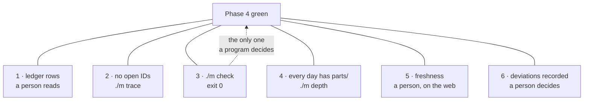

# 6.1 — Six things that must be true

## One-line answer

A phase is green only when six independent conditions all hold at once — every day has its ledger
row, no ID from this phase or an earlier one is open, `./m check` passes on the whole repository,
every day in the phase has a `parts/` directory, the freshness re-checks pass, and every deviation is
recorded — and a green command satisfies exactly one of the six.

## The story

On completion day you do not get the keys because the money arrived.

You get them because several things that have nothing to do with each other all became true at the
same time, and one person is holding a list. The money has cleared, which is not the same as having
been sent. The contracts have been exchanged, which happened last week and is a different event. The
searches came back. The meter readings were taken this morning by somebody standing in the hallway
with a phone. And the keys themselves are physically at the estate agent's office, which is the one
that goes wrong.

Nobody feels that any single item is the completion. The van is booked for the afternoon and the
whole day is spent waiting for the last of six phone calls, and until the sixth one lands you are
sitting outside a house you have bought and cannot enter.

What makes the list a list, rather than a formality, is that the items are genuinely independent. The
money clearing tells you nothing about the meter reading. You cannot infer five from one. So the list
is checked one item at a time, out loud, by somebody who writes each answer down.

## The idea in plain language

The plan's §15 says a phase is green only when six things are true. Not one thing with five
supporting details — six separate claims, each of which can be false while the other five are true.

| # | The condition | What it is actually asking |
| --- | --- | --- |
| 1 | every day in the phase has its `PROGRESS.md` row, gates green | did each day actually finish, and was that recorded honestly? |
| 2 | `./m trace` shows no open IDs from this or any earlier phase | is anything the plan promised still unbuilt? |
| 3 | `./m check` passes on the whole repository | do the automated checks pass, right now, in front of you? |
| 4 | every day in the phase has a `parts/` directory | is every day actually *written*, not just committed? |
| 5 | the freshness check passes | has the world outside the repository moved? |
| 6 | every deviation is recorded — an ADR, or a `CHANGELOG_PLAN.md` row | did anything change that the plan does not know about? |

Read condition 3 again and notice how small it is. It is one of six. The command you spent today
building and extending satisfies **one sixth** of a phase gate, and it is the only one of the six a
program can decide for you.

That proportion is the point of this part. There is a strong pull, once a repository has a good gate,
to let the gate become the definition of done — because it is the part that produces a satisfying
green line. The other five are conditions a person checks and writes down, and each of them can be
false on a day when `./m check` exits 0.

Two of them are worth separating because they look similar and are not. Condition 1 asks whether the
*ledger* is complete and honest; condition 4 asks whether the *day folders* are complete. A day can
have a `PROGRESS.md` row and no `parts/` directory — that is a day somebody committed early — and a
day can be fully written with no row, which is a day somebody forgot to finish. Both have happened in
this repository.

## Why Sutra needs it

Because today is the Phase 4 gate, Phase 4 is Days 25 to 31, and Phase 5 starts tomorrow on top of
it.

That "on top of" is not a figure of speech. Phase 5 builds MCP servers that expose the tools and
skills Phase 4 produced; Day 42 exposes the desk agent itself over MCP; Day 45 audits the lot. Every
one of those days assumes the skills phase closed properly. A phase that was declared green while
SK-19 was still open is a phase that hands Day 45 an audit target that does not exist.

There is also a live, specific reason. Right now, on 2026-09-04, **two of the six conditions are
false in this repository**, and neither of them is about today's code:

- Condition 1 is false: rows 23 to 29 of `docs/PROGRESS.md` say ⚠️, and Day 30's row does not exist
  yet ([5.1](../05-the-gate-that-lied/5.1-red-since-day-fifteen.md)).
- Condition 3 is false: `./m check` exits 1 at stage one.

And condition 2 is currently false for Phase 4 as well, because `./m trace` reports SK-17 through
SK-20 and OPS-08 as open — which is expected, since those close today and yesterday, and it is
exactly the sort of thing you check rather than assume.

So the gate ritual today is not a formality you perform on a healthy repository. It is a list you
work through on a repository that does not pass it yet, which is the only circumstance in which a
checklist teaches you anything.

## The mechanism

Each condition, with the command that answers it and what a red answer means. Work through it in
order and write each answer down — the writing is not ceremony, it is what makes the difference
between checking and assuming ([5.1](../05-the-gate-that-lied/5.1-red-since-day-fifteen.md)).

```bash
# 1 - every Phase 4 day has a row, and what its gate column says
grep -n "^| 2[5-9] \|^| 3[01] " docs/PROGRESS.md

# 2 - no open ID from this phase or earlier
./m trace
grep -n "open" docs/TRACEABILITY.md | head -20

# 3 - the gate itself
./m check; echo "exit: $?"

# 4 - every day in the phase is actually written
for n in 25 26 27 28 29 30 31; do
  d=$(ls -d days/day-$n-* 2>/dev/null | head -1)
  printf "day %s: %s parts\n" "$n" "$(find "$d/parts" -name '*.md' 2>/dev/null | wc -l)"
done

# 5 - the freshness re-checks (part 6.2)

# 6 - deviations recorded
git log --oneline -- docs/adr docs/CHANGELOG_PLAN.md | head
```

**Line by line:**

- `grep -n "^| 2[5-9] \|^| 3[01] " docs/PROGRESS.md` prints the ledger rows for days 25 to 31. `^|`
  anchors to a table row, the two character classes cover 25–29 and 30–31, and `\|` between them is
  alternation. The trailing space in each branch stops `| 3` from matching part of a larger number.
  Read the **last column**, not the row count: seven rows all saying ⚠️ is not condition 1 satisfied.
- `./m trace` regenerates `docs/TRACEABILITY.md` and prints a summary. On 2026-09-04 it printed
  `traceability: 62/199 closed, 0 problem(s); index: 199 IDs`. Note what `0 problem(s)` means and
  does not mean: it means no ID is claimed by two days or by none, **not** that no ID is open.
- `grep -n "open" docs/TRACEABILITY.md` is the question condition 2 actually asks. On 2026-09-04 it
  lists SK-17, SK-18, SK-19 (Day 30) and SK-20, OPS-08 (Day 31) as `⬜ open`. Those five closing is
  what the last two days of the phase are for.
- `./m check; echo "exit: $?"` is condition 3 and it is the only one with a machine-readable answer.
  The number is the answer; the output is commentary
  ([2.3](../02-a-lint-is-a-test/2.3-the-exit-code-is-the-api.md)).
- The `for` loop answers condition 4 by counting part documents per day. `ls -d days/day-$n-*` finds
  the folder whatever slug follows the number, which is the plan's §17.2 rule that the number is the
  identity and the slug is a label. `find ... | wc -l` counts the Markdown files under `parts/`, and
  `2>/dev/null` hides the error for a day that does not exist yet — so a missing day shows as `0
  parts`, which is the answer you wanted.
- Condition 5 has no command here because it has several, and they are the subject of
  [6.2](6.2-the-freshness-check-that-fired.md).
- `git log --oneline -- docs/adr docs/CHANGELOG_PLAN.md` lists every commit that touched an
  architecture decision record or the plan's changelog. Condition 6 is satisfied either by finding
  the deviation recorded there, or by writing down "none" — and "none" is a real answer that has to
  be given rather than assumed.

The relationship between the six, because the diagram makes the proportion obvious:



**The order matters slightly**, and it is worth doing them in the order given rather than easiest
first. Conditions 1 and 2 are about whether the work exists; 3 and 4 are about whether it is correct;
5 and 6 are about whether the ground under it has moved. Finding out at step 5 that the framework
shipped a breaking version is much less painful than finding out after you have spent the day making
step 3 green.

## When it breaks

**The command is green and the phase is not.**

```text
OK all green
```

…on a repository where `./m trace` reports SK-19 open. Phase 4 promised twenty skill IDs; nineteen
are closed. Condition 3 passed and condition 2 did not, and nothing about the green line hints at it.
This is the failure the six-item list exists to prevent, and it is why "the gate is green" is never
an answer to "is the phase done".

**A day has a row and no parts.** The count loop prints:

```text
day 30: 0 parts
```

The plan's §17.2 is blunt about this: a day with no `parts/` directory is, by definition, not
written. `./m depth` reports the same thing more loudly, and a phase containing such a day cannot be
green whatever the ledger says.

**A day is written and has no row.** The inverse, and it has happened here — `./m brief 26` refused
to run with `the last PROGRESS row is day 22`, because days 23, 24 and 25 were committed together
without their rows. The brief's guard is doing exactly its job:

```text
**STOP.** The last PROGRESS row is day 29, so N must be 30, not 31. Fix the ledger or the day number
before writing (P2).
```

That is the real output of `./m brief 31` on 2026-09-04, and it is correct: Day 30 is being written
in parallel and has not landed its row. Two days written at once is a deviation from "one day, one
commit", which makes it a **condition 6** item — something to record, not something to hide.

**`0 problem(s)` is read as "no open IDs".** The most likely misreading in the whole list.
`./m trace` reports `62/199 closed, 0 problem(s)`, and the `0 problem(s)` refers to structural
problems — an ID claimed twice, or an ID in the plan that no day claims. Sixty-two of a hundred and
ninety-nine closed means a hundred and thirty-seven are open, which is entirely correct at this point
in the curriculum and says nothing at all about condition 2. Condition 2 is about open IDs **in this
phase or an earlier one**, and answering it means reading the phase column.

## In production

**What a professional writes instead.** The equivalent of a phase gate in a company is a release
checklist, and the mature version has two properties this one already has. Every item names the
command or the person that answers it, so nobody has to invent a method under time pressure. And
every item has a written answer, including the boring ones — because "no change" recorded is
evidence that somebody looked, and a blank is evidence of nothing. Teams that skip the second
property end up with checklists where the interesting items get answered and the routine ones get
ticked, which is [5.1](../05-the-gate-that-lied/5.1-red-since-day-fifteen.md)'s register again.

**What degrades at scale.** Checklists rot in a specific direction: items get added after incidents
and are never removed, so the list grows until it is too long to do honestly, and then it gets done
dishonestly. The discipline that keeps one alive is deleting items — every item should be justified
by something that actually went wrong, and an item that has never once been red in twenty releases
is a candidate for automation or removal. Six items is a good size precisely because it is short
enough to do properly.

**The failure mode that only appears with real traffic** is the gate that becomes retrospective. Under
delivery pressure the checklist gets filled in *after* the release, from memory, to satisfy a process
rather than to make a decision — and at that point it has inverted: it costs time and provides no
information. The tell is when somebody asks "can you fill in the checklist for last week's release".
The countermeasure is to make the gate produce something the next step actually needs, which is what
condition 5's written findings do here: they are the input to tomorrow's first decision, not a record
of today's.

**The review comment a senior engineer leaves:** *"The PR says 'phase complete, CI green'. CI green is
one line of the checklist. Which of the other five did you check, and where are the answers written
down? I'd particularly like the dependency freshness one, since the next milestone builds directly on
that library."*

**The interview question:** *"What does 'this milestone is done' mean on your team, concretely?"* The
honest spoken answer: *"Six things, and only one of them is the build. Every work item has a completed
record with an honest status — including the ones where the status is 'passed with a known issue'.
Nothing the milestone promised is still open, which we check against the plan rather than against
memory. The full gate command passes, right now, in front of somebody. Every piece of work is
actually written rather than merely committed. The external dependencies get re-checked — has the
framework shipped a breaking version, has the spec revision moved, has anything we depend on changed
its terms — because none of that is visible to a program running on our machine. And any deviation
from the plan is written down as a decision record. The green build satisfies one of those six, and
the pull to let it stand for all six is strong, because it's the one that produces a satisfying
line."*

## Check yourself

```bash
grep -n "^| 2[5-9] \|^| 3[01] " docs/PROGRESS.md
./m trace && grep -c "open" docs/TRACEABILITY.md
./m check; echo "exit: $?"
```

Answer conditions 1, 2 and 3 for Phase 4 as this repository stands, and write the three answers down.
Then say which of the six a green `./m check` does **not** answer.

**Out loud, without scrolling up:** name the six conditions, and explain the difference between
condition 1 and condition 4 using a day that satisfies one and not the other.

**Next:** [6.2 — The freshness check that fired](6.2-the-freshness-check-that-fired.md).
