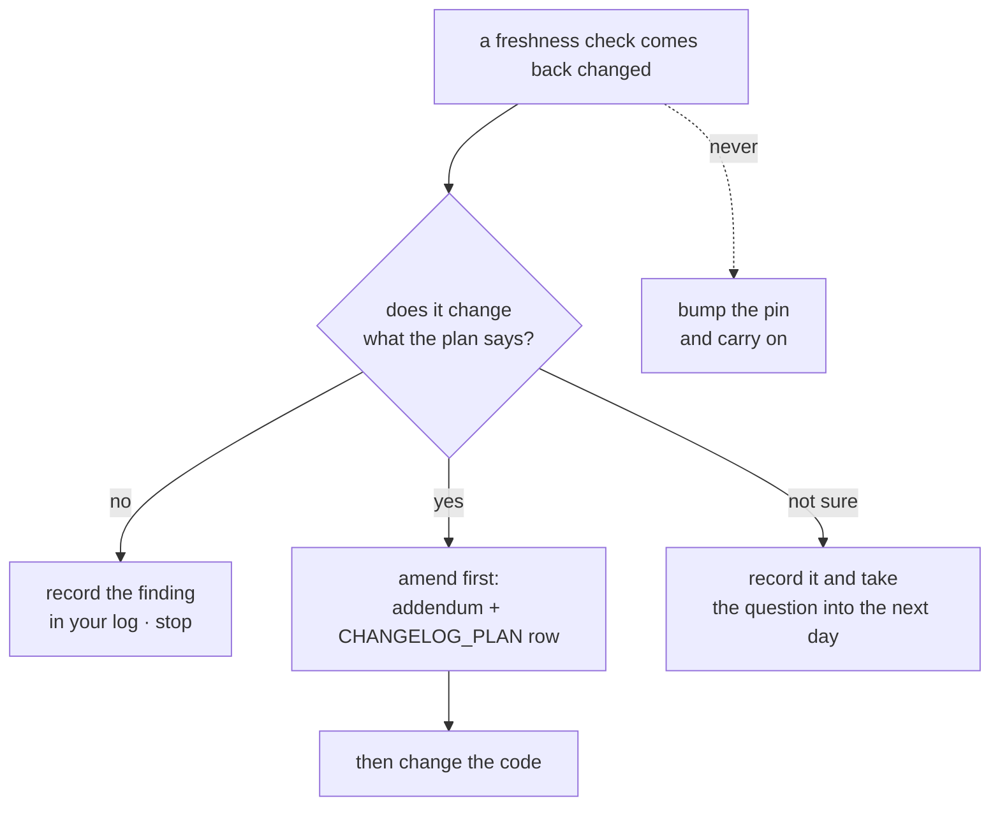

# 6.2 — The freshness check that fired

## One-line answer

Five things outside this repository get re-checked at every phase boundary — the framework's
releases, the MCP specification revision, the free-model rosters, the Agent Skills specification and
the pinned provenance of any sourced skill — and on 2026-09-04 two of them came back amber, which
under Principle 14 means the plan is amended **first** and the code moves **second**.

## The story

You check the date on the milk before you pour it, not after.

It is a small habit and it is entirely about ordering. The milk was fine on Sunday. It has been in
the same door of the same fridge ever since and nothing about it looks different. The reason you
turn the carton round is that "fine on Sunday" is a fact about Sunday, and you are about to act on it
on Thursday.

The cost of checking is a second. The cost of not checking is that you find out afterwards, in the
tea, and the tea is not the only casualty — you now also do not trust the cereal, or the thing you
made for someone else this morning, and you spend rather longer working out what else was made with
it than you would have spent turning the carton round.

Everything expensive about the mistake comes from the order. Same information, one step too late.

## The idea in plain language

Everything in `./m check` is a fact about **your repository**. Nothing in it is a fact about the
world your repository depends on.

Those facts change without touching a single file you own. A library ships a new version. A
specification publishes a new revision. A provider quietly drops a model from its free tier. Your
gate stays green through all of it, correctly, because none of it is visible from inside.

So the plan's §15 adds a fifth condition to the phase gate that is not a command but a **look**, at
five specific things:

| # | What you re-check | Where | If it moved |
| --- | --- | --- | --- |
| 1 | `google-adk` releases since the last gate | the package index and the release notes | breaking change? → amend the plan first |
| 2 | the MCP specification revision | the specification site | changed since 2026-07-28? → re-read Addendum 01 Part 2 |
| 3 | the three providers' free rosters | each provider's own page | a pinned model lost its free tier? → amend first |
| 4 | the Agent Skills specification | the spec site | fields changed? → Day 30's structural rules need updating |
| 5 | the pinned revision of any sourced skill | `docs/SKILL_PROVENANCE.md` | upstream moved? → a new pin needs a new audit |

The important word in the right-hand column is **first**. Principle 14 says that when reality moves,
the plan is amended before any code changes — a versioned addendum, a `CHANGELOG_PLAN.md` row, and
only then the edit. That ordering exists because the alternative is a silent adaptation: somebody
bumps a pin, the code works, and six weeks later nobody can say which decisions were made on purpose
and which were made by a dependency resolver.

And a freshness check has one property that makes it unlike everything else in this day: **a boring
result is a real result.** "No change" written down is evidence that somebody looked. A blank is
evidence of nothing at all, and blanks are what a checklist degrades into.

## Why Sutra needs it

Because Phase 5 starts tomorrow and is built directly on two of the five.

Day 32 is already written and teaches the MCP stateless core against revision **2026-07-28** — the
headers, the cacheable `tools/list`, state as an explicit payload handle. Days 33 to 38 build on that
document. If the specification has published a newer revision, then tomorrow's first act is not to
write code but to re-read `docs/01_MASTER_PLAN_ADDENDUM_GAPS.md` Part 2 against it, and possibly to
amend it. Checking that today, at the boundary, costs a page load. Checking it on Day 38 costs six
days of code.

The same is true of `google-adk`. Phase 5 uses `McpToolset`, `StdioConnectionParams`,
`StreamableHTTPConnectionParams` and `to_mcp_server` — all verified present in the installed 2.7.1.
A new release that renamed or removed any of them turns seven days of documents into fiction, and
Principle 8 says every one of those symbols is verified against the live documentation on the day it
is used anyway. The freshness check is the cheap version of that, done once, at the boundary.

## The mechanism

The five checks, with the exact commands, run on **2026-09-04**. Every result below was read off a
live source on that day.

```bash
# 1 - the framework, and everything else pinned in pyproject.toml
for p in google-adk google-genai mcp ruff pytest; do
  curl -s "https://pypi.org/pypi/$p/json" \
    | python -c "import json,sys; print('$p', json.load(sys.stdin)['info']['version'])"
done
```

**Line by line:**

- `for p in ...` iterates the five packages this repository pins. Reading them in one loop rather than
  one at a time is what makes the check short enough to actually run.
- `curl -s` fetches quietly; the URL is the package index's own metadata endpoint, which returns JSON
  and needs no account.
- The backslash continues the line, keeping it under the width the rest of the repository uses.
- `python -c "import json,sys; print(...)"` reads the JSON from standard input and prints the current
  version. `info.version` is the index's own answer to "what is the latest release", which is the
  question — not "what does my lockfile say", which you already know.
- What this does **not** tell you is whether the delta matters. That needs the release notes, which
  is the next step and is a read rather than a command.

Result:

```text
google-adk   pinned 2.7.1     latest 2.8.0      AMBER
google-genai pinned 2.19.0    latest 2.22.0     AMBER
mcp          pinned 1.29.1    latest 2.1.1      AMBER - a major version
ruff         pinned 0.16.4    latest 0.16.6     amber - patch only
pytest       pinned 9.1.1     latest 9.1.1      GREEN
```

Then read the release notes, because a version number is a fact and a breaking change is a judgement:

```text
https://github.com/google/adk-python/releases      <- read the notes, do not guess
```

Read on 2026-09-04: the releases page lists `v2.8.0` above `v2.7.1`, and **2.8.0 documents no
breaking change**. The one removal in the range is from `v2.7.0`, which moved `pyarrow` out of the
`gcp` extra into a new `bigquery-analytics` extra — irrelevant here, because this repository installs
neither extra and everything Vertex- or BigQuery-shaped is parked under Addendum 02 for needing a
billing account.

**Finding: amber, not red.** The pin stays at 2.7.1 today. Bumping it is a decision, and a decision
made the day before a new phase opens is a bad one — Principle 14 wants the amendment written before
the change, and there is no amendment.

```text
2 - the MCP specification revision
https://modelcontextprotocol.io/specification/latest
```

Read on 2026-09-04: the page states that the specification is based on the TypeScript schema at
`schema/2026-07-28/schema.ts`, and every card at the foot of the page links into
`/specification/2026-07-28/`. **The revision is unchanged.**

**Finding: green**, and this is the load-bearing one today. Addendum 01 Part 2 stands, Day 32's
stateless-core teaching stands, and Phase 5 may open tomorrow as planned. Had this come back with a
newer date, the correct next action would have been to stop, re-read Part 2 against the new revision,
and amend it — not to start Day 33.

```text
3 - the free-model rosters
https://ai.google.dev/gemini-api/docs/rate-limits
```

Read on 2026-09-04: the page gives rate-limit tables for the paid tiers and **publishes no free-tier
table at all**, directing you to your own account's limits page instead. That is itself the finding,
and it confirms what Day 2 recorded: there is no public quota table for the free tier, and the ~20
requests-per-day figure in `docs/PACKAGES.md` was read off a live 429 rather than a document.

**Finding: green, with a caveat worth writing down.** `gemini-3.7-flash` is still the pinned model
and nothing indicates it has lost its free tier — but the only measurement that would prove it is a
live call, and this day spends zero generations. The honest record is *"no evidence of change; not
independently re-measured"*, which is a better sentence than a tick.

```text
4 - the Agent Skills specification
https://agentskills.io/specification
```

Read on 2026-09-04: the `SKILL.md` frontmatter is `name` and `description` required, with optional
`license`, `compatibility`, `metadata` and the experimental `allowed-tools`. The `scripts/`,
`references/` and `assets/` conventions are unchanged, as is the "keep file references one level
deep" rule.

**Finding: green, with one small drift.** The page's validation section now shows `skills-ref
validate ./my-skill`, where Day 29 used `agentskills validate` from the same package. Both may work;
this day did not run either, so it is recorded as a `TODO(me)` rather than as a fact.

```bash
# 5 - the pinned provenance of any sourced skill
cat docs/SKILL_PROVENANCE.md
```

**Line by line:**

- `cat` because this is a read, not a check. There is no command that can tell you whether an upstream
  repository force-pushed; what you have is a ledger of what you pinned and when.
- The columns are skill, source, version, licence, audited on, audited by, permitted scope. The
  *version* column is the pin, and re-checking means fetching that revision and comparing the digest
  ([Day 29's](../../../day-29-sourcing-and-auditing-skills/parts/04-provenance/4.2-the-pin-is-the-promise.md)
  drift check does exactly this).

Read on 2026-09-04: the ledger holds its header and its column row and **no accepted third-party
skill at all**. Nothing external is pinned, so nothing can have drifted.

**Finding: green, trivially** — and it is worth writing down precisely because it is trivial today. The
first time this row is not trivial, the difference will be obvious.

The five findings, as they should appear in your own log:

| # | Check | Finding on 2026-09-04 |
| --- | --- | --- |
| 1 | `google-adk` releases | 2.8.0 available against a 2.7.1 pin; no documented breaking change in 2.8.0. **Amber — pin unchanged, no amendment written** |
| 2 | MCP spec revision | still 2026-07-28. **Green — Addendum 01 Part 2 stands, Phase 5 may open** |
| 3 | free-model roster | no public free-tier table; `gemini-3.7-flash` unchanged. **Green, not independently re-measured** |
| 4 | Agent Skills spec | frontmatter fields unchanged; validator command name may have moved. **Green, one `TODO(me)`** |
| 5 | provenance pins | no third-party skill vendored. **Green, trivially** |

And the two ambers that are not `google-adk`: `mcp` has moved from 1.29.1 to **2.1.1**, a major
version, and `google-genai` from 2.19.0 to 2.22.0. The `mcp` one is the interesting one, because
Phase 5 is the phase that uses it, and it arrives the day before. It is still not a reason to bump
anything today. It is a reason to write down that the delta exists, so that Day 33 opens with the
question in front of it rather than discovering it halfway through.



## When it breaks

**You bump the pin because the check told you to.** The check told you a number. It did not tell you
to act, and acting on it silently is the exact failure Principle 14 names:

```text
$ uv add google-adk==2.8.0
Resolved 84 packages in 1.20s
```

Two seconds, no error, and the repository now runs a version no document mentions, while seven days
of Phase 5 documents say *"verified against 2.7.1"*. Nothing is broken and nothing is recorded, which
is the worst combination — a change that cannot be traced back to a decision.

**A major version arrives and gets treated as routine.** `mcp` 1.29.1 to 2.1.1 is a major bump, which
by convention means the authors expect something to break. Reading it as "we are a bit behind" is how
a phase built on a protocol library discovers, on day four, that a class was renamed.

**The freshness check is skipped because nothing ever changes.** The commonest failure, and it has no
error text at all — it is a blank row in a log. It survives for many gates because the answer is
usually "no change", right up to the gate where it is not, and by then the habit of checking has been
gone for months.

**A pinned model is gone and the lint is still green.**

```text
ValueError: Model openrouter/some-vendor/some-model:free not found.
```

A perfect `:free` suffix on a model that no longer exists. Day 9 recorded exactly this happening: the
roster held seventeen free models on 2026-08-27, against "~25 more" written in Addendum 02 on
2026-08-12, and the model that addendum named first was gone. The lint checks a string
([3.1](../03-the-free-suffix-lint/3.1-five-characters-that-bill.md)); the roster is a fact about the
world; this row of the checklist is the only thing that connects them.

**The spec revision moved and you found out from a failing test.**

```text
jsonrpc error -32602: unknown parameter 'sessionId'
```

The expensive version of check 2. By the time a protocol change reaches you as an error, you have
built against the old revision and the work is done. That is the milk in the tea.

## In production

**What a professional writes instead.** Two mechanisms, and they are complements rather than
alternatives. Dependency updates are automated — a bot opens a pull request per version bump, the
gate runs against it, and a human decides — which turns "did anything move" from a ritual into a
queue. And a periodic **dependency review** covers what the bot cannot see: a licence change, a
maintainer handover, a specification revision, a provider's terms. The bot handles the numbers; the
review handles the meaning, and teams that only have the bot are the ones surprised by the things
that are not version numbers.

**What degrades at scale.** The number of things to re-check grows with the dependency tree, and past
a certain size nobody can look at all of them. The response that works is to classify: a short list
of dependencies that are *load-bearing* — the framework, the protocol, the model provider — get
re-read by a person at every boundary, and everything else is left to automation and the gate. The
response that does not work is to keep the long list and do it badly, which is how a check becomes a
tick.

**The failure mode that only appears with real traffic** is the change that is not a release at all.
A provider narrows a free tier, a rate limit drops, a specification working group publishes an
extension that changes what "supported" means — none of which produces a version number, a
changelog entry, or a failing test. It surfaces as a `429` at an unusual hour, or a partner reporting
that something used to work. That is precisely why check 3 is on the list even though it has no
command and no clean answer: the things with no command attached are the ones nothing else will catch.

**The review comment a senior engineer leaves:** *"The gate write-up says 'freshness: OK'. Which five
things, checked where, and what did each say? 'No change' is a finding and I want it written down —
otherwise in three months we can't tell whether we looked and it was fine, or nobody looked."*

**The interview question:** *"Your dependencies moved. What is your process?"* The honest spoken
answer: *"We re-check a short list of load-bearing dependencies at every milestone boundary rather
than continuously — the framework, the protocol specification revision, the model provider's free
tier, the skill format, and the pinned revision of anything we vendored. Each one gets a written
finding, including the boring ones, because 'no change' recorded is evidence somebody looked and a
blank is evidence of nothing. The rule I'd defend hardest is the ordering: if reality moved, we amend
the plan first — a versioned addendum and a changelog row — and change the code second. Bumping a pin
because a checker told you a newer number exists is how a codebase ends up full of decisions nobody
made. The last time we ran it, our framework was a minor version ahead of our pin with no documented
breaking change and the protocol library was a whole major ahead — so we recorded both, changed
nothing, and opened the next phase with the question in front of us instead of discovering it four
days in."*

## Check yourself

```bash
for p in google-adk mcp; do
  curl -s "https://pypi.org/pypi/$p/json" \
    | python -c "import json,sys; print('$p', json.load(sys.stdin)['info']['version'])"
done
grep -n "google-adk\|mcp==" pyproject.toml
```

Compare the two numbers for each package and write the delta down. Then open
`https://modelcontextprotocol.io/specification/latest` and say what revision date it shows, and what
you would do first if it were not 2026-07-28.

**Out loud, without scrolling up:** name the five freshness checks, and explain why a newer version
number is a finding rather than an instruction.

**Next:** back to the hub, [`LESSON.md`](../../LESSON.md), for §10 and §11 — the checklist, the
ledger rows and the commit.
