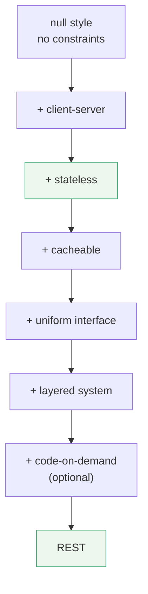

# Principled design of the modern Web architecture

> **Read this after the parts.** You have now watched a protocol delete its own handshake, measured
> what a held session costs behind three instances, and seen list results grow a freshness label. This
> is the paper that argued for all three as **constraints with named trade-offs**, in 2002, about the
> web — and it is the document MCP's 2026-07-28 revision is quietly re-deriving.

## One-line answer

It argued that the web scaled because of what its architecture **forbids** rather than what it offers:
a named set of constraints — client-server, **stateless**, cacheable, uniform interface, layered
system, optional code-on-demand — each one buying a property and charging a stated price.

## The story

The house started as two rooms and a courtyard, and it has been added to for thirty years.

A kitchen went on the back when the family grew. A staircase was cut in when the first floor was
built, and the room above the kitchen came later, and then a bathroom, and then a wall was moved
because a bathroom needs a door. Every one of those decisions was sensible on the day it was made, and
every one of them was made by whichever mason was available that year.

Now they want to add a second floor, and the question on the table is whether the walls will take it.

Nobody can answer. Not because anyone was careless, but because there was never a plan that said *this
wall is load-bearing and must stay*. Thirty years of good local decisions have produced a building
whose properties nobody can state, and the only way to find out what it can bear is to load it and
watch.

The house two streets over is plainer. It was drawn before it was built, and the drawing says which
walls carry weight. It is not a nicer house. It is a house you can add a floor to on a Tuesday, because
somebody wrote down which constraints were not to be broken and why.

## The idea in plain language

By the late 1990s the web worked and nobody could say why. It had grown from a document-sharing tool
into global infrastructure through good local decisions, and the practical question had become the
one about the second floor: which parts of the design were load-bearing, and which changes would bring
it down?

That question is what this paper answers, and the abstract states the errand plainly — the exact text,
from the record:

> *"The World Wide Web has succeeded in large part because its software architecture has been designed
> to meet the needs of an Internet-scale distributed hypermedia application. The modern Web
> architecture emphasizes scalability of component interactions, generality of interfaces, independent
> deployment of components, and intermediary components to reduce interaction latency, enforce
> security, and encapsulate legacy systems. In this article we introduce the Representational State
> Transfer (REST) architectural style, developed as an abstract model of the Web architecture and used
> to guide our redesign and definition of the Hypertext Transfer Protocol and Uniform Resource
> Identifiers. We describe the software engineering principles guiding REST and the interaction
> constraints chosen to retain those principles, contrasting them to the constraints of other
> architectural styles. We then compare the abstract model to the currently deployed Web architecture
> in order to elicit mismatches between the existing protocols and the applications they are intended
> to support."*

Four terms in that paragraph carry the whole paper, and each is worth defining before going further.

An **architectural style** is a named set of constraints on how components may interact. Not a
design, not a technology, not a diagram of one system — a set of rules that many different systems can
obey. "Client-server" is a style. So is "pipe and filter". A style says what you may *not* do.

A **constraint** is one of those rules, and the paper's central move is that a constraint is chosen
**for the property it induces**. Forbid something, and every system that obeys the rule gains a
guarantee. That is the opposite of the usual instinct, which is to reach for a feature.

**REST** — Representational State Transfer — is the name the paper gives to the particular set of
constraints it derives. The name describes the mechanism: a client transfers a **representation** of a
resource's state, rather than operating on the resource directly.

**Internet-scale distributed hypermedia** is the requirement all of it is aimed at: many independent
parties, no single administrator, components deployed and upgraded on nobody's schedule, and links
that cross organisational boundaries. Most architectures are not trying to survive that, which is why
most architectures make different trades.

The claim that follows is the one worth carrying: **the web's properties are consequences of its
restrictions.** Anything can be reached by anything because everything obeys the same small interface.
Any server can answer any request because no server may remember you. Intermediaries can help because
messages describe themselves. Each of those is a restriction first and a benefit second.

📌 A note on which document to cite. There is an earlier and shorter conference version of the same
title from 2000, `doi:10.1145/337180.337228`, in the *Proceedings of the 22nd International Conference
on Software Engineering*, pages 407 to 416. **Cite the 2002 journal version**, `doi:10.1145/514183.514185`
in *ACM Transactions on Internet Technology* volume 2, issue 2, pages 115 to 150: it is the extended
article, and it is the one that carries the full derivation of the constraints and the comparison
between the abstract model and what was actually deployed. The 2000 paper is not wrong; it is a
summary of the argument you actually want to read.

## Why Sutra needs it

Because Phase 5 spends fourteen days inside one of this paper's constraints, and the constraint is
easier to hold onto as an argument than as a rule somebody imposed.

[2.2](../parts/02-the-reframe/2.2-three-instances-one-url.md) measured what a held session costs
behind three instances: two of four requests refused, on the happy path, with nothing broken. That
number is a rediscovery. The paper argued the same thing in 2002 as a property — **visibility,
reliability and scalability** — and it also named the price, which the measurement does not show and
which [2.3](../parts/02-the-reframe/2.3-every-request-introduces-itself.md) had to measure separately:
184 bytes of envelope, on every request, forever.

[3.3](../parts/03-headers-and-caches/3.3-lists-you-may-keep.md) watched 60 requests become 3 and then
1. That is the **cacheable** constraint, and the paper is honest that it is the constraint that
sometimes serves you data that is no longer true.

[6.1](../parts/06-in-production/6.1-routing-without-reading.md) built a gateway that routes without
parsing. That is **layered system** plus **self-descriptive messages**, and the reason it works is
that the request says what it is on the outside.

And [1.4](../parts/01-the-socket/1.4-not-just-another-api.md) argued that MCP's fixed vocabulary is
what lets one client work against a server written later. That is the **uniform interface**
constraint, which is the one the paper is most insistent about and the one the field most thoroughly
abandoned.

The forward reference is **Day 43**, which deploys `sutra-mcp` as interchangeable containers behind one
URL. That day cites this paper rather than re-teaching it, because a paper is taught once in this
curriculum.

## The mechanism

The paper does not present REST as a list to memorise. It **derives** it: start with the null style —
no constraints, anything may do anything — and add one constraint at a time, saying what each buys and
what it costs.



Each arrow is a decision, and each decision has a bill:

| Constraint | What it forbids | The property it buys | The price it charges |
| --- | --- | --- | --- |
| **client-server** | one component doing both jobs | the two evolve independently; the interface is the contract | a network hop, and a version story |
| **stateless** | the server remembering anything between requests | any server answers any request; a request is visible, and recoverable by retry | the same context repeated on every request |
| **cacheable** | responses that do not say whether they may be reused | interactions removed entirely, not merely made faster | a window in which a client holds data that is no longer true |
| **uniform interface** | per-service vocabularies | one client works against components it has never met | efficiency lost, because a general form fits no case perfectly |
| **layered system** | a component seeing past its immediate neighbour | proxies, gateways, caches and firewalls can be inserted | added latency at each hop |
| **code-on-demand** *(optional)* | nothing; it is the only optional one | clients extended after deployment | visibility lost — an intermediary cannot see what the code will do |

Two rows deserve more than a table cell.

**Stateless** is the row this whole day is about, and the paper's argument has three parts rather than
one. *Visibility*: a monitoring system can understand a request by looking at that request alone,
because there is no earlier context it is missing. *Reliability*: recovery from partial failure is
easier, because a failed request can simply be re-issued. *Scalability*: the server can free resources
between requests and does not have to manage state across them — which is the property
[2.2](../parts/02-the-reframe/2.2-three-instances-one-url.md) measured as `4/4` against `2/4`. And the
cost is stated in the same breath: repetitive data in every request, and the server loses control over
consistent behaviour, because the application's state is now held by a client the server cannot
inspect.

**Uniform interface** is the constraint the paper treats as central, and it decomposes into four
sub-constraints. *Identification of resources* — everything you care about has a name, a URI.
*Manipulation through representations* — you send and receive a representation of a resource's state,
not the resource. *Self-descriptive messages* — a message carries enough to be understood on its own,
including how to process it, which is what makes intermediaries possible. And **hypermedia as the
engine of application state** — the responses carry the links that tell a client what it may do next,
so the client does not need out-of-band knowledge of the service's structure. The last one is the one
to remember, because it is the one that did not survive.

Now map MCP's 2026-07-28 revision onto that table, and the correspondence is not loose:

| REST constraint | The MCP mechanism | Taught in |
| --- | --- | --- |
| client-server | host, client, server as separate roles | [1.2](../parts/01-the-socket/1.2-host-client-server.md) |
| stateless | `initialize` and `Mcp-Session-Id` removed; `_meta` on every request | [2.1](../parts/02-the-reframe/2.1-the-call-that-remembered-you.md), [2.3](../parts/02-the-reframe/2.3-every-request-introduces-itself.md) |
| cacheable | `ttlMs` and `cacheScope` required on list results | [3.3](../parts/03-headers-and-caches/3.3-lists-you-may-keep.md) |
| uniform interface | the same seven methods on every server | [1.4](../parts/01-the-socket/1.4-not-just-another-api.md) |
| layered system | gateways routing on `Mcp-Method` and `Mcp-Name` | [3.1](../parts/03-headers-and-caches/3.1-the-label-on-the-envelope.md), [6.1](../parts/06-in-production/6.1-routing-without-reading.md) |
| code-on-demand | MCP Apps: sandboxed HTML shipped by a tool | Day 41 |

The one MCP does **not** adopt is hypermedia as the engine of application state. An MCP client learns
what it may do from `tools/list`, not from links inside results — which is a listing, not hypermedia.
That is a real and deliberate difference, and it is the same half of the paper the rest of the industry
also declined.

## The paper in one demo

The claim to prove is exactly one: **a self-contained request can be answered by any instance, and a
request that depends on a held session cannot.** Everything else in the paper is out of scope for this
demo, and there is deliberately no model, no framework and no MCP in it — two files, three real HTTP
servers, one round-robin dispatcher, one switch.

```text
days/day-32-mcp-stateless-core/lab/papers/modern-web-architecture/
├── instance.py   # one server, in the two shapes the paper contrasts
└── client.py     # three of them behind a round-robin dispatcher; STATELESS=0 turns the constraint off
```

```python
# days/day-32-mcp-stateless-core/lab/papers/modern-web-architecture/instance.py
"""One server instance, in the two shapes the paper contrasts: session-holding, or self-contained.

Nothing here is MCP. It is the smallest thing that can hold a session or refuse to, so that the
stateless constraint is the only variable in the experiment.
"""

import json
import threading
from http.server import BaseHTTPRequestHandler, ThreadingHTTPServer

PROTOCOL = "demo/1"

TICKETS = {
    "4521": "Safari 17 on iPad; user cannot log out",
    "4522": "CSV export truncated at 1000 rows",
}


class Instance:
    """One process behind the load balancer. Its memory is its own and nobody else's."""

    def __init__(self, name: str, stateless: bool) -> None:
        self.name = name
        self.stateless = stateless
        self.sessions: dict[str, str] = {}
        self.handled = 0


def answer(instance: Instance, request: dict) -> tuple[int, dict]:
    """Answer one request, or refuse it, and say which instance did so."""
    instance.handled += 1
    method = request.get("method")

    if not instance.stateless:
        if method == "initialize":
            session_id = f"{instance.name}-session-1"
            instance.sessions[session_id] = request["protocolVersion"]
            return 200, {"instance": instance.name, "sessionId": session_id}
        session_id = request.get("sessionId")
        if session_id not in instance.sessions:
            return 409, {
                "instance": instance.name,
                "error": f"unknown session {session_id!r}: this instance never did a handshake",
            }
        version = instance.sessions[session_id]
    else:
        version = request.get("protocolVersion")

    if version != PROTOCOL:
        return 400, {"instance": instance.name, "error": f"unsupported version {version!r}"}
    if method != "lookup_ticket":
        return 404, {"instance": instance.name, "error": f"no method {method!r}"}
    ticket = request.get("ticket")
    return 200, {"instance": instance.name, "ticket": ticket, "text": TICKETS.get(ticket, "?")}


def make_handler(instance: Instance) -> type[BaseHTTPRequestHandler]:
    """An HTTP handler class bound to one instance's memory."""

    class Handler(BaseHTTPRequestHandler):
        def do_POST(self) -> None:  # noqa: N802 - the name http.server dispatches to
            length = int(self.headers.get("Content-Length", "0"))
            request = json.loads(self.rfile.read(length) or b"{}")
            status, payload = answer(instance, request)
            body = json.dumps(payload).encode()
            self.send_response(status)
            self.send_header("Content-Type", "application/json")
            self.send_header("Content-Length", str(len(body)))
            self.end_headers()
            self.wfile.write(body)

        def log_message(self, *args: object) -> None:
            """Silence the default access log so the demo's own output is the only output."""

    return Handler


def start(instance: Instance, port: int) -> ThreadingHTTPServer:
    """Serve one instance on one port, in a background thread."""
    server = ThreadingHTTPServer(("127.0.0.1", port), make_handler(instance))
    threading.Thread(target=server.serve_forever, daemon=True).start()
    return server
```

**Line by line:**

- `Instance` holds `sessions` **and** `handled` in both modes, but `sessions` is only ever written in
  the stateful branch. Keeping the field in both shapes is deliberate: the two arms differ in
  behaviour, not in class definition, so nobody can claim the stateless arm won by being a simpler
  program.
- `answer` is a **free function taking the instance**, not a method. That keeps the decision logic
  readable in one place and makes the branch on `instance.stateless` the visible fork of the whole
  experiment.
- The stateful branch mints `f"{instance.name}-session-1"` — the instance's name is *inside* the
  session identifier. That is a confession in a string: the memory is not somewhere, it is *there*,
  and the identifier admits it.
- `if session_id not in instance.sessions: return 409` is the entire failure the paper predicts. Not
  a crash, not a timeout — a correct, well-formed refusal from a healthy server that simply was not
  the one you introduced yourself to.
- `409 Conflict` rather than `400`, because the request is not malformed; it is fine and it arrived at
  the wrong place. Choosing the status honestly is part of the demonstration.
- The stateless branch reads `request.get("protocolVersion")` straight off the request. No lookup, no
  store, nothing to miss — which is why there is no failure branch to write.
- `TICKETS` is a dict on every instance, identical in all three, standing in for shared data every
  replica can read. It is *not* per-request state, and the distinction is the one Day 34 will need:
  read-only data replicated everywhere is fine; per-caller memory is not.
- `make_handler` returns a **class** built around one instance, because `http.server` instantiates the
  handler per request and gives no way to pass arguments in. The closure is how the handler reaches
  its instance.
- `log_message` is overridden to do nothing, so the default `127.0.0.1 - - [...] "POST /mcp"` access
  lines do not drown the six lines the demo actually prints.
- `ThreadingHTTPServer` and a daemon thread per instance, so one command can run all three. Daemon
  threads die with the process, which is why the script needs no cleanup beyond `shutdown()`.
- **No dependencies, no model, no key.** Everything here is the standard library.

```python
# days/day-32-mcp-stateless-core/lab/papers/modern-web-architecture/client.py
"""Three instances behind one round-robin dispatcher. STATELESS=0 turns the constraint off."""

import json
import os
import urllib.error
import urllib.request

from instance import PROTOCOL, Instance, start

STATELESS = os.environ.get("STATELESS", "1") == "1"
PORTS = (8801, 8802, 8803)
ASKS = ["4521", "4522", "4521", "4522"]


def post(port: int, payload: dict) -> tuple[int, dict]:
    """Send one request to one instance and read the answer back."""
    body = json.dumps(payload).encode()
    request = urllib.request.Request(
        f"http://127.0.0.1:{port}/mcp",
        data=body,
        headers={"Content-Type": "application/json"},
    )
    try:
        with urllib.request.urlopen(request, timeout=5) as response:
            return response.status, json.loads(response.read())
    except urllib.error.HTTPError as failure:
        return failure.code, json.loads(failure.read())


instances = [Instance(f"i{n}", stateless=STATELESS) for n in (1, 2, 3)]
servers = [start(instance, port) for instance, port in zip(instances, PORTS, strict=True)]

shape = "self-contained" if STATELESS else "held session"
print(f"STATELESS={'1' if STATELESS else '0'}  ({shape})")

session_id = None
if not STATELESS:
    status, result = post(PORTS[0], {"method": "initialize", "protocolVersion": PROTOCOL})
    session_id = result.get("sessionId")
    print(f"  handshake -> {PORTS[0]} {status} {result}")

served, refused = 0, 0
for turn, ticket in enumerate(ASKS):
    port = PORTS[turn % len(PORTS)]
    call = {"method": "lookup_ticket", "ticket": ticket}
    call |= {"protocolVersion": PROTOCOL} if STATELESS else {"sessionId": session_id}
    status, result = post(port, call)
    if status == 200:
        served += 1
        print(f"  ask {ticket} -> :{port} 200 {result['instance']} {result['text']!r}")
    else:
        refused += 1
        print(f"  ask {ticket} -> :{port} {status} {result['instance']} {result['error']!r}")

print(f"  served {served}/{len(ASKS)}, refused {refused}/{len(ASKS)}")
print(f"  requests handled per instance: {[i.handled for i in instances]}")

for server in servers:
    server.shutdown()
```

**Line by line:**

- `STATELESS = os.environ.get("STATELESS", "1") == "1"` is the **ablation switch**, and it defaults to
  the paper's constraint being **on**. One environment variable is the only difference between the two
  runs; the ports, the dispatcher, the questions and the data are identical.
- `PORTS = (8801, 8802, 8803)` — three real listening sockets, not three objects. The demo could have
  been done with plain function calls and it would have proved less: the request genuinely crosses a
  socket and genuinely arrives at a different process-level server.
- `ASKS` has **four** entries against three ports, so the round-robin wraps and the fourth request
  returns to instance 1. That fourth request is what makes the stateful arm score 2 rather than 1 —
  the demo shows partial success, which is far more like production than total failure.
- `PORTS[turn % len(PORTS)]` is the whole load balancer. Round-robin is the simplest policy and the
  most common default, and using anything cleverer would invite the objection that the policy caused
  the failure.
- `call |= {...} if STATELESS else {...}` is the only place the two arms build a different request:
  one carries its own `protocolVersion`, the other carries a `sessionId`. Everything else about the
  request is the same bytes.
- `except urllib.error.HTTPError` returns the status and the parsed body rather than raising, because
  a 409 here is a **result** of the experiment and not an error in it.
- `zip(..., strict=True)` so a mismatch between the instance list and the port list fails loudly
  instead of silently starting two servers.
- `served`/`refused` counted and printed as a fraction, because a fraction is the claim. `handled per
  instance` is printed alongside it because load distribution is the second finding and it is invisible
  in the served count.
- `server.shutdown()` at the end so two consecutive runs do not collide on the ports.
- **Zero model calls. No network beyond `127.0.0.1`, no key, no dependency.** Addendum 02's 429
  handling has nothing to handle here, and saying so is more honest than bolting a model on to satisfy
  a template.

The one command, from the demo folder:

```bash
cd days/day-32-mcp-stateless-core/lab/papers/modern-web-architecture
STATELESS=1 uv run python client.py
STATELESS=0 uv run python client.py
```

**Line by line:**

- `cd` first, because `client.py` imports `instance` by bare name.
- `STATELESS=1` is the paper's constraint applied; `STATELESS=0` is the ablation. Two runs, one
  variable. **Zero generations.**

Both runs, measured on 2026-09-04:

```text
STATELESS=1  (self-contained)
  ask 4521 -> :8801 200 i1 'Safari 17 on iPad; user cannot log out'
  ask 4522 -> :8802 200 i2 'CSV export truncated at 1000 rows'
  ask 4521 -> :8803 200 i3 'Safari 17 on iPad; user cannot log out'
  ask 4522 -> :8801 200 i1 'CSV export truncated at 1000 rows'
  served 4/4, refused 0/4
  requests handled per instance: [2, 1, 1]

STATELESS=0  (held session)
  handshake -> 8801 200 {'instance': 'i1', 'sessionId': 'i1-session-1'}
  ask 4521 -> :8801 200 i1 'Safari 17 on iPad; user cannot log out'
  ask 4522 -> :8802 409 i2 "unknown session 'i1-session-1': this instance never did a handshake"
  ask 4521 -> :8803 409 i3 "unknown session 'i1-session-1': this instance never did a handshake"
  ask 4522 -> :8801 200 i1 'CSV export truncated at 1000 rows'
  served 2/4, refused 2/4
  requests handled per instance: [3, 1, 1]
```

Four things in those two blocks, and the second is the one to keep.

**`4/4` against `2/4`.** Same servers, same dispatcher, same four questions, same data. The only
difference is whether a request carries what it needs.

**Nothing failed.** All three instances were healthy in both runs. The dispatcher did precisely what it
was configured to do. The requests were well formed. Half of them were refused because the memory
needed to interpret them lived in one of three places — which is the paper's argument stated as an
outcome instead of as a principle.

**`[3, 1, 1]` against `[2, 1, 1]`.** In the stateful arm, instance 1 handled the handshake and both
requests that survived. Work followed the conversation rather than spreading, which is what session
affinity does to a load curve even when nothing goes wrong.

**The extra line at the top of the second run.** `handshake -> 8801` is the introduction the protocol
used to require — one request before any useful work, which the first arm does not need at all.

## When it breaks

The paper is not a manifesto and it says where its own constraints hurt. Two of those places matter to
Sutra, and a third is the honest limit of applying a 2002 web paper to a 2026 agent protocol at all.

**Statelessness makes you repeat yourself.** The paper names this cost directly: per-interaction
overhead, because the same data is sent again and again. MCP pays it as the `_meta` envelope on every
request, measured at 184 bytes in
[2.3](../parts/02-the-reframe/2.3-every-request-introduces-itself.md). At Sutra's volume that is
nothing. At a hundred million calls a day it is about eighteen gigabytes of introductions, and the
answer is compression rather than a session — but the cost is real, it does not go away, and pretending
otherwise is how a principle becomes a slogan.

**Statelessness moves consistency out of the server's reach.** This is the subtler half of the same
cost and the paper states it: the server loses control over consistent application behaviour, because
the state now lives in the client. A client that holds a stale handle, or an old protocol version, or a
cached tool list, is a client the server cannot correct — it can only reject. Every one of MCP's new
error codes is that rejection: `-32020`, `-32021`, `-32022` exist because the server can no longer fix
the client's state, only refuse it.

**Some interactions really are conversations.** Not everything decomposes into independent requests. A
transaction that must hold a lock, a stream that must stay open, an operation whose intermediate state
is genuinely too large to send back and forth — these fight the constraint, and the honest engineering
answer is not to pretend they do not. MCP's answer is
[3.4](../parts/03-headers-and-caches/3.4-state-that-travels-in-the-payload.md): the state moves to
shared storage behind an opaque handle. That is a real answer and it is not free — you have swapped
process memory for a network read, and you have acquired an expiry policy that a session used to give
you for nothing.

**And the paper is about hypermedia, not about tool calls.** It was written for a system of documents
and links, aimed at human-driven navigation across organisational boundaries. MCP is a machine talking
to a machine about functions, and the client is a language model. Nothing in the paper was measured on
that. The constraints transfer because the *forces* transfer — many independent parties, independent
deployment, intermediaries, scale — and where the forces differ the constraints should be expected to
differ too. The clearest example is the one already named: MCP does not do hypermedia, and it is not
obviously wrong not to.

## In production

**What survived: statelessness, completely and without argument.** It is now simply how services are
built. Every autoscaler, every container platform, every serverless runtime assumes a request can go
anywhere, and the assumption is so deep that holding state in a process reads as a bug rather than as a
design choice. MCP's 2026-07-28 revision is a late convert, not a pioneer, and the interesting thing
about it is that the protocol shipped a session model in 2024 and had to remove it — which is evidence
that the argument still has to be re-made every generation.

**What survived: caching and layering, doing more work than anyone planned.** CDNs, reverse proxies,
API gateways, service meshes — the entire middle of the modern internet is the layered-system
constraint plus the cacheable one, cashed in. `ttlMs` and `cacheScope` on an MCP list result are a
small, direct descendant of `Cache-Control`.

**What survived in a form the paper did not intend: code-on-demand.** It is the one optional constraint,
and it became the largest thing on the web — every page ships a program now. MCP has just re-invented
it as MCP Apps, with a sandboxed iframe standing in for the browser's sandbox. Worth noticing that the
paper's stated cost of code-on-demand, *lost visibility*, is exactly why MCP Apps requires templates to
be declared up front so clients can review them before running anything.

**What did not survive: hypermedia as the engine of application state.** This is the famous one. The
paper's uniform interface has four sub-constraints and almost nothing anybody calls REST implements the
fourth. Services publish an OpenAPI document instead of links, clients are generated from it at build
time, and the client's knowledge of what it may do next comes from out-of-band documentation rather
than from the last response. MCP does the same thing with `tools/list`. That is a listing, and a
listing is not hypermedia.

**What did not survive: the word.** *REST* today means "JSON over HTTP with plural nouns in the path",
which is a naming convention rather than an architectural style. The paper describes a set of
constraints; the industry kept the ones that were already how the web worked, dropped the one that
required real work, and kept the name. The practical consequence is that *"we built a REST API"* tells
you almost nothing, and this is exactly why MCP is interesting as a case study: it specifies the
constraint, gives it error codes, and makes servers reject requests that break it. A constraint with an
enforcement mechanism is a different thing from a constraint with a name.

**And what changed underneath all of it: the intermediary got clever.** The paper's layered system
assumed intermediaries that forward, cache and translate. Today they authorise, rate limit, retry,
observe and route by tenant — which is what
[6.1](../parts/06-in-production/6.1-routing-without-reading.md) builds. That is far more function in
the middle than a 2002 reading would suggest, and it is possible only because messages are
self-descriptive. The constraint held; what people did with the space it opened up did not stay small.

## Check yourself

```bash
cd days/day-32-mcp-stateless-core/lab/papers/modern-web-architecture
STATELESS=0 uv run python client.py
```

Now set `PORTS = (8801,)` — a single instance — and run the stateful arm again. It serves `4/4`, and
that is exactly why this class of bug never appears on a laptop. Put the three ports back, then add a
fifth entry to `ASKS` and predict the served count for both arms before you run them.

**Out loud:** what did this paper actually claim, and what do we do differently now? The two halves: it
claimed that an architecture's useful properties come from the constraints it accepts, and it named the
price of each — and we now take statelessness, caching and layering for granted while having quietly
dropped the hypermedia constraint that the paper considered central, keeping the name REST for whatever
is left.
