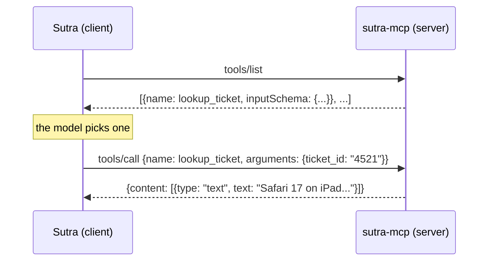

# 1.1 — The plug that fits

## One-line answer

The Model Context Protocol (MCP) is an agreed message format for asking a separate program for
tools, data and prompt templates, so that a tool written once can be used by every AI application
that speaks it, instead of being rewritten for each one.

## The story

You buy a fan in one city and carry it to a flat in another.

You do not think about it on the journey. When you get there you push the plug into the wall and it
works. Nobody phoned ahead. The shop that sold you the fan has never heard of your landlord, and the
electrician who wired that flat has never heard of the fan.

That only works because the shape of the pin and the hole was agreed a long time ago by people who
were not thinking about your fan. The agreement is boring, it is written down, and nobody owns it.
Because of it, the fan maker can build fans without knowing about buildings, and the builder can wire
buildings without knowing about fans.

Now imagine the opposite. Every appliance company designs its own pin shape. Your fan comes with a
letter explaining that you must call an electrician to cut a new hole in the wall. When you replace
the fan next year, you cut another hole. Ten appliances, ten holes, and a wall nobody can safely
change.

That second world is not hypothetical. It is exactly where AI tooling was, and it lasted about two
years.

## The idea in plain language

On [Day 4](../../../day-04-tools-by-hand/parts/01-the-schema/1.2-declaring-a-tool.md) you declared a
tool by hand: a **name**, a **description**, and a **JSON Schema** saying which arguments it takes.
You handed that declaration to a model, the model asked for the tool by name with some arguments, and
your code ran a Python function and handed the answer back.

Everything in that sentence happened **inside one process**. The declaration was a Python dictionary.
The function was a Python function. The dispatch table was `TOOLS` in `sutra/loop.py`. If somebody
else wanted `lookup_ticket`, the only way to give it to them was to give them your source code.

**MCP is that same shape, spoken between two programs instead of inside one.**

Three words, defined now and used for the rest of the phase:

- A **protocol** is an agreed format for messages plus agreed rules about when each message is
  allowed. Not a library, not a product — a written agreement. Two programs written in different
  languages by people who have never met can talk if both follow it.
- **JSON-RPC 2.0** is the message format MCP uses. A request is a JSON object with a `method` (what
  you want), `params` (the details), and an `id` (so the answer can be matched to the question). A
  response carries the same `id` and either a `result` or an `error`. It is old, small, and boring,
  which is what you want underneath something else.
- **Context** is the material a model needs in order to answer: the ticket text, the knowledge-base
  article, the house style for a reply. MCP's own name says what it is for — a protocol for moving
  *context* to a *model*.

So an MCP **server** is a program that says *"here are the tools I can run, here is the data I can
read out, here are the prompt templates I keep"*, in that agreed format. An MCP **client** is the
program that asks. The next part
([1.2](1.2-host-client-server.md)) pulls those two words apart properly, because the third word —
*host* — is the one people get wrong.

The comparison that makes it concrete:

| | Day 4, inside one process | MCP, between two programs |
| --- | --- | --- |
| Where the tool is declared | a Python dict in your file | a JSON message the server sends |
| How it is called | `TOOLS[name](**args)` | a `tools/call` request over stdin or HTTP |
| Who can use it | code that imports your module | any program that speaks the protocol |
| What breaks when it changes | your import | nothing, if the declaration is unchanged |
| Who can write it | you, in Python | anyone, in any language |

The last row is the whole point. The wall socket does not care that the fan is made of plastic.

## Why Sutra needs it

Because right now Sutra's data cannot leave the building, and nobody else's data can get in.

`sutra/loop.py` holds `TICKETS` and `KB` as Python dictionaries. That was the right call on Day 4 —
you cannot learn tool calling and a database at the same time — but it means the support desk's
entire world is a literal in a source file. No other program can read a ticket. No ticket can come
from a real system. And the "vendor status page" from
[Day 15](../../../day-15-toolsets-and-openapi/parts/04-machine-packed/4.1-the-manual-the-service-publishes.md)
is a stub you wrote yourself, standing in for a service that does not exist.

Phase 5 replaces every one of those with a socket. On **Day 34** you write `sutra_mcp`, a server that
offers Sutra's tools over the wire. On **Day 39** the ticket store becomes a database behind that
same socket, and no agent code changes. On **Day 42** the whole triage agent becomes a server that
somebody else's application can call.

None of that is possible without an agreed shape for the plug, and the agreement is what this part
names.

## The mechanism

The smallest complete exchange in MCP is two messages: *what have you got*, and *run this one*.



Written out as the actual JSON, this is a `tools/call` request. It is copied from the 2026-07-28
transport specification's own example and edited to use Sutra's tool
(`https://modelcontextprotocol.io/specification/2026-07-28/basic/transports/streamable-http`, read
2026-09-04):

```json
{
  "jsonrpc": "2.0",
  "id": 1,
  "method": "tools/call",
  "params": {
    "name": "lookup_ticket",
    "arguments": { "ticket_id": "4521" },
    "_meta": {
      "io.modelcontextprotocol/protocolVersion": "2026-07-28",
      "io.modelcontextprotocol/clientInfo": { "name": "sutra", "version": "0.1.0" },
      "io.modelcontextprotocol/clientCapabilities": {}
    }
  }
}
```

Read it as five ordinary things:

- `"jsonrpc": "2.0"` — which message format this is. It never changes.
- `"id": 1` — the question number, so a reply can be matched to it. Answers may come back out of
  order; the `id` is how you know which is which.
- `"method": "tools/call"` — what you are asking for. MCP's method names are a small fixed list:
  `tools/list`, `tools/call`, `resources/list`, `resources/read`, `prompts/list`, `prompts/get`,
  `server/discover`.
- `"params"` — the details. For `tools/call` that is the tool's `name` and its `arguments`, and the
  arguments must fit the JSON Schema the server published in `tools/list`. That schema is the same
  kind of object you wrote by hand on
  [Day 4](../../../day-04-tools-by-hand/parts/01-the-schema/1.2-declaring-a-tool.md).
- `"_meta"` — the envelope. Everything the server needs to know about *who is asking and what they
  can handle*, carried inside this one request rather than remembered from an earlier one. That block
  is the 2026 revision in miniature, and section 2 is entirely about it.

Notice what is **absent**: there is no session identifier, no "as we agreed earlier", no reference to
a previous message. This request is complete. Hand it to any copy of the server and you get the same
answer. That absence is the subject of [2.1](../02-the-reframe/2.1-the-call-that-remembered-you.md).

## When it breaks

The first thing that breaks is not the protocol. It is the assumption that a tool over MCP behaves
like a Python function.

A local function call either returns or raises, and it does so in microseconds. A `tools/call` can
also: hang, return HTTP 502 because a proxy in between gave up, return a perfectly valid JSON-RPC
error, succeed while returning nonsense because the server on the other end is a different version
than you expected, or succeed twice because your client retried and the server was not idempotent.

A real one, from the JSON-RPC layer, when the method name is misspelt:

```text
{"jsonrpc": "2.0", "id": 1, "error": {"code": -32601, "message": "Method not found"}}
```

`-32601` is the standard JSON-RPC code for *method not found*, and under the 2026-07-28 Streamable
HTTP transport the server returns it with HTTP `404 Not Found`. The reason a JSON body accompanies
the 404 is a compatibility rule you will meet again in
[5.1](../05-failure-lab/5.1-the-tutorial-from-four-months-ago.md): a bare 404 could equally mean *this
server does not host an MCP endpoint at all*, so the modern server puts a recognisable JSON-RPC error
in the body to say *I am here, I just do not have that method*.

The smallest fix is to stop guessing method names and read `tools/list`. The list is the contract; a
name you typed from memory is not.

## In production

**What a professional writes instead:** nobody hand-builds these JSON objects. A client library does
it, and the interesting question becomes *which revision does your library speak* — a question with a
surprising answer on this machine, which
[5.1](../05-failure-lab/5.1-the-tutorial-from-four-months-ago.md) measures.

**What changes at scale:** the socket stops being a convenience and becomes a boundary with an owner.
Once four teams' agents call your MCP server, the tool descriptions are a public API. Renaming
`lookup_ticket` is now a breaking change for people you have never met, and the JSON Schema you wrote
carelessly on a Tuesday is the thing four teams' models are prompt-engineering against.

**The failure mode that only appears with real traffic:** the server becomes the slowest thing in the
loop. A local dict lookup is free; an HTTP round trip to a service that itself queries a database is
not, and a model that calls three tools per turn has just added three round trips to every turn. This
is why Day 44 is a whole day about client timeouts and retries, and why
[6.1](../06-in-production/6.1-routing-without-reading.md) treats the hop as infrastructure with a
price, rather than as a detail.

**The review comment a senior engineer leaves:** *"this is an internal tool used by one agent. Why is
it an MCP server and not a function? Give me the second consumer, or the second implementation you
expect to swap in, otherwise you have added a network hop and a deployment to save nothing."* That is
a fair comment and it has an answer for Sutra — the second consumer is Day 42's external host, and the
second implementation is Day 39's database — but the answer has to be said out loud, not assumed.

**The interview question:** *"why would you put a protocol between your agent and your own tools?"*
The honest answer names a cost first: *"it adds a hop and a deployment, so it is not free. You do it
when the tool has more than one consumer or more than one implementation. For us the tool store moves
from an in-process dict to a database, and the same tools get exposed to an external host later — so
the boundary buys us the freedom to change either side without touching the other, and it gives
security exactly one place to sit."*

## Check yourself

```bash
uv run python -c "from sutra.loop import TOOLS; print(sorted(TOOLS))"
```

That prints the tools Sutra can reach today, and the list is the answer to *what is currently trapped
inside one process*. Now say, out loud and without scrolling up: what does an MCP server actually
offer, and what makes it different from importing somebody's Python module?

**Next:** [1.2 — Host, client, server](1.2-host-client-server.md).
