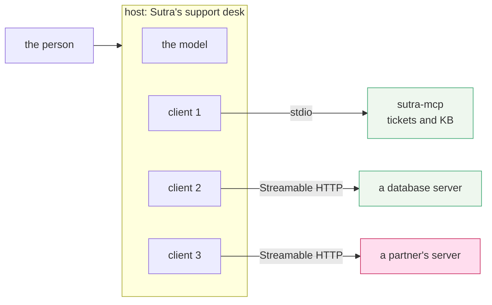
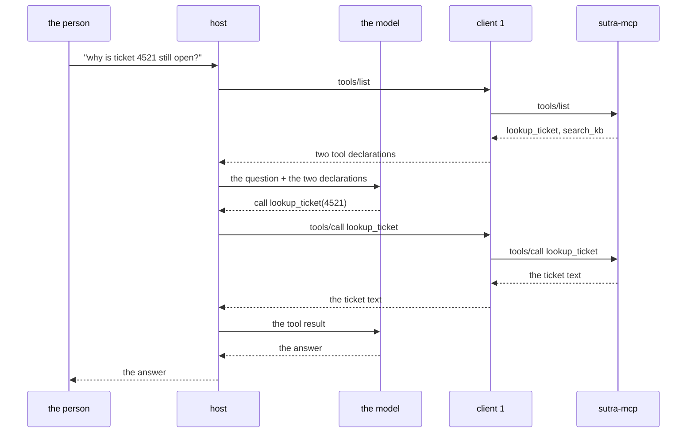

# 1.2 — Host, client, server

## One-line answer

Three words for three different jobs: the **host** is the application a person is using, the
**server** is the program offering tools and data, and the **client** is the one-per-server connector
inside the host that talks to exactly one server and nothing else.

## The story

You walk into a small office and ask the woman at the front desk to get a parcel sent, arrange lunch
for eight people, and find out why the lights on the second floor keep tripping.

She does not do any of those things. She has three numbers on a card taped to her desk: the courier,
the caterer, the electrician. She rings the courier and speaks courier-language — weight, pickup
window, address. She rings the caterer and speaks caterer-language — headcount, dietary notes, time.
She rings the electrician and describes the floor and the fault.

Three separate calls, three separate conversations, three separate vocabularies. None of the three
knows the other two exist. The caterer does not learn your parcel's address, and the electrician
never hears the headcount.

You spoke to one person. That is the only reason it felt like one errand.

Now notice the thing that is easy to miss. The front desk is not a middleman passing your words
along. She decides *which* number to ring. If she rings the caterer about the lights, nothing about
the electrician's phone was wrong.

## The idea in plain language

MCP uses three words, and the specification defines them precisely
(`https://modelcontextprotocol.io/specification`, read 2026-09-04):

> **Hosts**: LLM applications that initiate connections
> **Clients**: Connectors within the host application
> **Servers**: Services that provide context and capabilities

In plainer words:

- The **host** is the whole application a person actually uses. Sutra's support desk is a host. So is
  a chat app, so is a code editor with an AI panel. The host holds the model, the conversation, the
  user's consent, and the decision about which server to ask.
- A **server** is a separate program that offers capabilities. It has no idea who is calling. It does
  not hold your conversation, it does not talk to your model, and it has no opinion about your user.
- A **client** is the piece *inside the host* that speaks to exactly one server. One server, one
  client. Four servers means four clients living in the same host.

The rule that catches people out is **one client per server**. It is not an implementation detail; it
is the isolation boundary. Because each client talks to one server only, a server cannot see the
traffic going to another server, cannot see the conversation, and cannot see what the user typed
except for the arguments the host chose to send. The front desk rings each number separately, and
nobody is on a conference call.

Two words that are *not* on the list, and are the usual source of confusion:

- The **model** is not any of the three. It sits in the host, and it never speaks MCP. It emits a
  request to call a tool by name, exactly as it did on
  [Day 4](../../../day-04-tools-by-hand/parts/02-the-round-trip/2.2-the-call-comes-back-parsed.md);
  the host is what turns that into a `tools/call` on the wire.
- The **transport** is not a role either. stdio and Streamable HTTP are two ways a client and a
  server can be connected, and Day 33 is about choosing between them. The three roles are the same
  whichever you pick.

## Why Sutra needs it

Because these three words are about to describe two different pieces of Sutra at once, and if you
have them muddled the phase will not make sense.

On **Day 33** Sutra becomes a *host*: it grows clients and connects out to somebody else's server. On
**Day 34** Sutra also becomes a *server*: `sutra_mcp` offers `lookup_ticket` and `search_kb` to
anyone who asks. On **Day 42** the whole triage agent is served over MCP, so an external host — an
editor, a partner's application — is the client and Sutra is the far end.

The same repository plays every role in the diagram before this phase ends. Keeping the words
straight is what stops "the client" from meaning four things in one design review.

It also decides where security lives, which is
[1.5](1.5-one-gate-to-guard.md)'s subject: the host is the only party that can ask the user for
consent, because the host is the only party the user is actually looking at.

## The mechanism

One host, three servers, three clients:



Three things the diagram is making explicit.

**The model has no arrow to any server.** It only talks to the host. Every tool result reaches the
model because the host put it there. That is why a callback or a plugin
([Day 13](../../../day-13-callbacks-four-doors/LESSON.md),
[Day 14](../../../day-14-plugins-one-layer-up/LESSON.md)) can still see and stop every tool call in
Phase 5 — MCP moves the tool's *implementation* out of the process, not the *decision* to call it.

**The clients do not talk to each other.** There is no line between `client 1` and `client 2`. A
server cannot learn what another server returned unless the host tells it, and the host should not.

**The pink server is somebody else's.** Trust is per-server, and it is a property of the client that
holds it, not of the protocol. Day 40 makes that concrete with allowlists and filtering; today it is
enough to see that the boundary is drawn in exactly the right place to hang a policy on.

Now the same picture as a sequence, because the ordering is what people get wrong:



The model appears twice and the server appears twice, and they never appear in the same exchange.
Every arrow that crosses the process boundary is a client-to-server arrow, and every arrow that
touches the model is a host-to-model arrow. That is the whole architecture.

## When it breaks

The common break is a host that opens one client and points it at several servers, usually by putting
a "which server?" argument in the tool call. It looks like a saving — one connection, less code — and
it removes the only isolation the design has.

What goes wrong is not visible on the happy path. It appears the first time a server misbehaves:

```text
ValueError: tool 'search_docs' is offered by both 'partner-server' and 'sutra-mcp';
refusing to dispatch
```

That is the *good* outcome, and it is the same collision Day 15 hit with two toolsets exporting one
name ([15.2.3](../../../day-15-toolsets-and-openapi/parts/02-when-asked/2.3-two-crates-one-name.md)).
The bad outcome is the version with no check, where the second server's tool silently shadows the
first and a support question starts being answered by a partner's search index. With one client per
server, the host always knows which server a name came from, because the name arrived through a
connector that talks to exactly one place.

The smallest fix is not to write the check. It is to keep the clients separate so the check is
trivial.

## In production

**What a professional writes instead:** a registry of connections in configuration, one entry per
server, each with its own credentials, its own timeout and its own allowlist. Not a single client
object with a `server=` parameter.

**What changes at scale:** the host becomes the interesting program and the servers become boring.
Consent, budget, logging, redaction and audit all live in the host, because it is the only place that
can see the whole picture. Sutra already has that shape — the plugin from
[Day 14](../../../day-14-plugins-one-layer-up/LESSON.md) and the structured log from
[Day 22](../../../day-22-structured-logging/parts/02-wiring-the-run/2.2-the-correlation-id.md) both
sit in the host, and both keep working when the tools move out of the process.

**The failure mode that only appears with real traffic:** connection count. One client per server is
correct, and it also means a host serving many users can be holding many connections. Under the
2026-07-28 revision this is much less painful than it used to be, because there is no session to keep
warm and a client may simply post a request and forget the connection — which is the subject of
section 2 and, on the client side, of Day 44.

**The review comment a senior engineer leaves:** *"the diagram shows the model calling the MCP server.
It does not. Redraw it: the model asks the host, the host asks the client, the client asks the server.
That is not pedantry — the reason your consent gate works is that there is a host in between, and the
diagram as drawn suggests there is not."*

**The interview question:** *"in MCP, what is the difference between a host and a client?"* A short,
confident answer: *"the host is the application — it owns the model, the conversation and the user's
consent. A client is a connector inside the host that speaks to exactly one server. It is one client
per server on purpose: that is what keeps two servers from seeing each other's traffic, and it is what
makes 'which server did this tool come from?' a question with an answer."*

## Check yourself

```bash
uv run python -c "import sutra_mcp; print(sutra_mcp.__file__)"
```

That is the empty package Phase 5 fills — the server half of the picture, currently a stub. Now say
out loud, without scrolling up: which of the three roles holds the model, which one asks the user for
permission, and how many clients a host with four servers has.

**Next:** [1.3 — Tools, resources, prompts](1.3-tools-resources-prompts.md).
