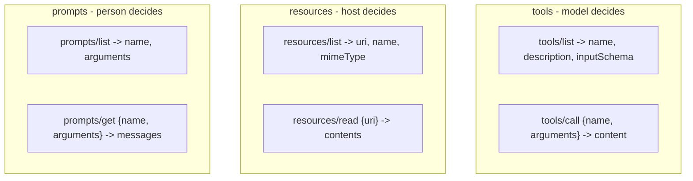

# 1.3 — Tools, resources, prompts

## One-line answer

A server offers three different kinds of thing and they are distinguished by **who decides to use
them**: a **tool** is chosen by the model, a **resource** is data the host reads and places in
context, and a **prompt** is a template the person picks.

## The story

At the municipal office there are three windows and you need all three.

At the first, a clerk stamps and files your application. You hand over the paper, she does something
you cannot do yourself, and the thing is now done — a record has changed. You cannot undo it by
walking away.

At the second, there is a thick register chained to the counter. You may read it. Nobody stamps
anything, nothing changes, and if you read the same page twice you see the same words. You copy out
what you need.

At the third, a stack of blank forms sits in a tray. Form 7B is the one for a change of address, and
it has the right boxes in the right order with the tricky bits already worded. Taking one changes
nothing. It just means you will not have to invent the wording yourself.

Three windows, three completely different kinds of transaction, and the difference is not about the
subject — all three are about your address. The difference is **who acts and what changes**.

## The idea in plain language

The specification lists the three server features
(`https://modelcontextprotocol.io/specification`, read 2026-09-04):

> **Resources**: Context and data, for the user or the AI model to use
> **Prompts**: Templated messages and workflows for users
> **Tools**: Functions for the AI model to execute

The distinction people miss is that these are separated by **control**, not by content. The same
ticket can appear as all three.

| | Who decides to use it | What it does | Sutra's example |
| --- | --- | --- | --- |
| **Tool** | the model, mid-turn | runs a function, may change something | `lookup_ticket("4521")`, and later `close_ticket` |
| **Resource** | the host or the person | returns data at a URI, read-only | `ticket://4521`, `kb://KB-104` |
| **Prompt** | the person, usually from a menu | fills a template with arguments | *"Draft a reply to this ticket"* |

Three terms defined properly, because each carries a rule:

**A tool is model-controlled.** The server publishes a name, a description and a JSON Schema; the
model reads them and decides. This is exactly the shape of Day 4's declaration
([4.1.2](../../../day-04-tools-by-hand/parts/01-the-schema/1.2-declaring-a-tool.md)), and it inherits
Day 4's hardest lesson: the description *is* the prompt
([4.1.3](../../../day-04-tools-by-hand/parts/01-the-schema/1.3-the-description-is-the-prompt.md)). A
tool may have side effects, which is why the specification insists hosts *"must obtain explicit user
consent before invoking any tool"*.

**A resource is application-controlled.** It is identified by a **URI** — a string that names a thing,
like `ticket://4521` — and reading it should not change anything. The host chooses what to read and
when to put it in context. A model does not "call" a resource; the host hands it over. This is the
same distinction Sutra already draws between a tool call and the material the instruction includes.

**A prompt is user-controlled.** It is a template the server publishes so that the host can offer it
as a menu item or a slash command. The person picks it; the model does not. If you have used a `/`
command in a chat application, that is the shape.

The reason the split matters is **consent**. A read is cheap and safe; a tool call may spend money or
close a ticket. Collapsing all three into "the model can call anything" is exactly the design that
makes an approval gate impossible, because there is no longer a category of thing that is safe by
construction.

One more term, because Phase 5 uses it constantly: a **capability** is a server saying which of the
three it offers at all. A server with tools and no resources says so, and the host does not go asking
for what is not there. Day 41 is the whole day on capabilities; today the word just needs to exist.

## Why Sutra needs it

Because Sutra currently has only one of the three, and the day it gains the other two it will have to
decide what belongs where.

Today everything is a tool. `lookup_ticket` is a tool. `search_kb` is a tool. The knowledge-base
article that the answer quotes arrives as a *tool result*, which means the model had to decide to
fetch it, which means it sometimes does not, and which is why
[Day 27's](../../../day-27-authoring-first-skills/parts/01-extraction/1.4-steps-for-a-competent-stranger.md)
triage procedure has a step whose entire job is *remember to search the knowledge base*.

**Day 35** gives Sutra resources and prompts. When it does, the interesting question is not how to
write them — it is which of today's tools should stop being tools:

- `lookup_ticket` is arguably a **resource**. Reading a ticket changes nothing, and if the host can
  attach `ticket://4521` before the turn begins, the model never has to decide to fetch it.
- the reply house style from `kb-answer-style` is arguably a **prompt** rather than a skill body.
- a future `close_ticket` is unambiguously a **tool**, and it is the one that needs the approval gate.

That is a real design argument with a real cost on either side, and it cannot even be stated until
the three words are distinct.

## The mechanism

The three live at different method names, and the shape of each pair is worth seeing together:



Every one of the six has the same two-step shape: **list**, then **use**. That symmetry is not an
accident, and it is what makes the caching rule in
[3.3](../03-headers-and-caches/3.3-lists-you-may-keep.md) apply to all three lists at once.

A concrete `resources/read`, copied from the transport specification's own example
(`https://modelcontextprotocol.io/specification/2026-07-28/basic/transports/streamable-http`, read
2026-09-04):

```json
{
  "jsonrpc": "2.0",
  "id": 2,
  "method": "resources/read",
  "params": {
    "uri": "file:///projects/myapp/config.json",
    "_meta": {
      "io.modelcontextprotocol/protocolVersion": "2026-07-28",
      "io.modelcontextprotocol/clientInfo": { "name": "ExampleClient", "version": "1.0.0" },
      "io.modelcontextprotocol/clientCapabilities": {}
    }
  }
}
```

Compare it with the `tools/call` in [1.1](1.1-the-plug-that-fits.md) and exactly one thing differs
below `params`: a tool call carries `name` plus `arguments`, a resource read carries `uri`. The
envelope is identical. That is deliberate, and it is the reason
[3.1](../03-headers-and-caches/3.1-the-label-on-the-envelope.md)'s `Mcp-Name` header can carry either
one.

## When it breaks

The break is making everything a tool because tools are the ones you already understand.

It works. It is also how you end up with a model that must decide to read its own configuration, and
a support desk where whether the knowledge base was consulted depends on whether the model felt like
it that turn. Sutra has already measured this exact failure once: the skill body in
[Day 27](../../../day-27-authoring-first-skills/parts/04-the-authoring-loop/4.2-which-rung-did-it-climb.md)
can be perfectly written and still not be followed, because a request is not a rule.

The other break is the opposite: making something a resource that has side effects. Nothing in the
protocol stops you. A server can implement `resources/read` as *"charge the customer and return a
receipt"*, and the host — which treats reads as safe and may cache them, prefetch them, or read them
twice — will do exactly the wrong thing. The specification is explicit that annotations and
descriptions from a server *"should be considered untrusted, unless obtained from a trusted server"*,
and this is one of the sharpest examples of why.

The error you get is not a protocol error. It is a support ticket:

```text
customer charged twice for one invoice; agent transcript shows a single tool call
```

The smallest fix is a rule you enforce in your own server rather than hope for in others: **a
`resources/read` handler may not write**. Day 40's allowlists are how you defend against the servers
you did not write.

## In production

**What a professional writes instead:** resources for everything readable and stable, tools only for
actions and for searches whose arguments the model must choose. The rule of thumb is *if the host
could have known to fetch it, it is a resource* — because a resource costs zero model decisions,
while a tool costs a decision that can go the wrong way.

**What changes at scale:** the resource list gets long, and `resources/list` becomes a listing problem
rather than a data problem. Templates (`resources/templates/list`) exist for exactly this — you
publish the *shape* `ticket://{id}` rather than a hundred thousand tickets. Day 35 builds it.

**The failure mode that only appears with real traffic:** prompts drift out of sync with the tools
they assume. A prompt template that says *"use the ticket lookup tool"* is the same unenforced
contract Sutra already found between a skill and a tool name
([27.3.1](../../../day-27-authoring-first-skills/parts/03-procedure-and-capability/3.1-a-named-tool-is-a-contract.md)),
and nothing in MCP checks it either.

**The review comment a senior engineer leaves:** *"`get_current_config` is a tool. Why? Nothing about
it needs the model to choose arguments and nothing about it can fail in an interesting way. Make it a
resource and attach it, and you get one fewer decision per turn and one fewer thing to get wrong."*

**The interview question:** *"MCP has tools, resources and prompts. Why three?"* The answer that shows
you have used it: *"they are split by who is in control, and that is what makes consent possible.
Tools are model-controlled and can have side effects, so they are the ones that need a gate. Resources
are application-controlled and read-only, so the host can prefetch them and the model never has to
remember. Prompts are user-controlled templates. If you make everything a tool you have not simplified
anything — you have just moved every decision into the model and thrown away the category that was
safe by construction."*

## Check yourself

```bash
uv run python -c "from sutra.loop import TOOLS; print({k: TOOLS[k].__doc__.splitlines()[0] for k in sorted(TOOLS)})"
```

Look at each of Sutra's two tools and decide, out loud, whether it would be better as a resource once
Day 35 makes that possible — and say what the cost of the change would be, not just the benefit.

**Next:** [1.4 — Not just another API](1.4-not-just-another-api.md).
