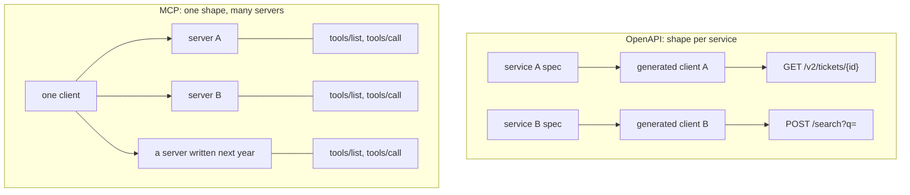

# 1.4 — Not just another API

## One-line answer

MCP is not a better HTTP API; it is a **fixed** one — every server exposes the same seven methods, so
a client written once works against every server ever written, which an OpenAPI toolset can never
promise.

## The story

The lift in the building stops between floors and the panel goes dark.

The building manager has the number of the company that installed it. Not *a* lift company — *the*
lift company, because the controller board takes a key that only their engineers carry, and the
diagnostic port is a connector nobody else's laptop has. The maintenance contract is not really about
the lift. It is about the connector.

Two floors up there is a fire door with a standard closer on it. When that fails, any of four local
firms can fix it before lunch, and the building manager picks whichever answers the phone.

Both devices work. Both were installed by professionals. One of them made the building's owner a
permanent customer of one supplier, and the other did not, and the difference was decided years
earlier by whether the part was standard.

## The idea in plain language

Sutra has already consumed a remote service without MCP. On
[Day 15](../../../day-15-toolsets-and-openapi/parts/04-machine-packed/4.2-spec-in-tools-out.md) you
pointed a toolset at an **OpenAPI** specification — a machine-readable description of one service's
HTTP endpoints — and got tools out of it automatically. That works, and it is genuinely useful. So it
is worth being precise about what MCP adds, because *"we already have OpenAPI"* is the first
objection anybody raises.

The difference is **who chooses the shape**.

An OpenAPI document describes *one service's own* endpoints. Every service invents its own: paths,
verbs, pagination style, error format, auth scheme, and its own answer to *how do I list what you
can do*. A generic client is impossible, so the tooling generates a bespoke client per service. That
generation step is real work, it happens at build time, and it breaks when the service changes.

MCP fixes the vocabulary instead. Every MCP server, without exception, answers the same short list
of methods:

| Method | What it does |
| --- | --- |
| `server/discover` | which protocol versions and capabilities do you have |
| `tools/list` · `tools/call` | what functions, and run one |
| `resources/list` · `resources/read` | what data, and read one |
| `prompts/list` · `prompts/get` | what templates, and fill one |

Those seven are the surface a client needs in order to be useful. The core adds a few more —
`resources/templates/list` for URI patterns, and `subscriptions/listen` for change notifications —
and the extensions add their own, but the list stays short enough to hold in your head. The *content*
varies wildly between servers; the *shape* does not.
So a client written once talks to a server written later by somebody who has never heard of it — at
runtime, with no code generation and no build step.

Three consequences worth naming:

- **Discovery is part of the protocol.** With OpenAPI you must be given a specification document out
  of band. With MCP the server tells you what it has, in the same channel, at runtime. That is what
  makes an agent able to use a tool that did not exist when the agent was written.
- **The description field is aimed at a model.** An OpenAPI `summary` is written for a developer
  reading documentation. An MCP tool `description` is read by a language model at decision time,
  which is Day 4's lesson again
  ([4.1.3](../../../day-04-tools-by-hand/parts/01-the-schema/1.3-the-description-is-the-prompt.md)) —
  the description is not documentation, it is prompt.
- **It is deliberately small.** Seven methods is not a limitation that was worked around; it is the
  feature. A standard survives by being boring enough that everyone implements all of it.

MCP does not replace OpenAPI. Underneath, an MCP server frequently *calls* an OpenAPI service. The
protocol is a lid on top of whatever the server actually does.

## Why Sutra needs it

Because Sutra has two remote-data stories in flight and needs to know which one it is telling.

Day 15's OpenAPI toolset stays. It is the right tool for *"this specific vendor publishes a
specification and I want its endpoints as tools"*, and Sutra's vendor status page is exactly that
case.

MCP is the answer to a different question: *"I want a boundary that outlives the thing behind it."*
On **Day 39** the ticket store moves from a Python dict to a database. If the tools were generated
from a database service's OpenAPI document, the agent's tool list would change shape when the
database did. Behind an MCP server, `lookup_ticket` keeps its name, its schema and its description
while everything behind it is replaced.

And on **Day 42** Sutra becomes the server. Nobody is going to generate a client from Sutra's OpenAPI
document; they are going to point an MCP host at a URL and get tools. That is only possible because
the shape was fixed by somebody else.

## The paper behind it

> **Implementing remote procedure calls** · `doi:10.1145/2080.357392` · 1984 ·
> `https://doi.org/10.1145/2080.357392`

It argued that a call to another machine can be made to look like an ordinary procedure call, and it
was honest about the price: the argument and result types have to be described in a way both sides
agree on, and the failures — a lost request, a dead server, a duplicated call — have no equivalent in
a local call and cannot be hidden.

MCP is that same bargain with the interface description standardised instead of generated. The paper
is taught in full on Day 15, at
[`../../../day-15-toolsets-and-openapi/papers/01-implementing-remote-procedure-calls.md`](../../../day-15-toolsets-and-openapi/papers/01-implementing-remote-procedure-calls.md).

## The mechanism

The difference is easiest to see as *what the client had to know in advance*.



In the top half, every arrow required a build step and a specification document obtained beforehand.
In the bottom half, the client knows seven method names and finds out the rest by asking.

Here is the same claim as something you can execute. It is not MCP — it is the *idea* of a fixed
vocabulary, in ten lines, so you can see what "one client, many servers" costs:

```python
# a fixed vocabulary means one caller works against servers it has never seen
def use(server: dict) -> list[str]:
    """Ask any server what it has, then call the first thing it offers."""
    names = [tool["name"] for tool in server["tools/list"]()]
    first = server["tools/call"](names[0])
    return [*names, first]


tickets = {"tools/list": lambda: [{"name": "lookup_ticket"}], "tools/call": lambda n: f"{n} ran"}
weather = {"tools/list": lambda: [{"name": "forecast"}], "tools/call": lambda n: f"{n} ran"}

print(use(tickets))
print(use(weather))
```

**Line by line:**

- `use` takes a `server` and never mentions `lookup_ticket` or `forecast`. That is the property being
  demonstrated: the caller is written before the servers exist, and it does not change when a third
  one arrives.
- `server["tools/list"]()` is the discovery step. In real MCP it is a JSON-RPC request over stdio or
  HTTP; here it is a dict lookup, because the transport is not what is being taught.
- `names[0]` is deliberately crude — a real host hands the names to a model and lets it choose. The
  point is only that the *names came from the server*, not from the caller's source code.
- The two dicts are two servers with completely different subjects and byte-identical interfaces.
  Swap them, add a third, delete one: `use` is untouched. With generated OpenAPI clients, each new
  service is a new generated module and a new import.
- **Zero model calls and no network.** This runs on nothing.

## When it breaks

MCP's fixed vocabulary does not make servers interchangeable, and assuming it does is the break.

Two servers both answer `tools/list`. One returns four well-described tools with tight schemas; the
other returns one tool called `run` whose single argument is a free-text string. Both are valid MCP.
Your client works against both, and the second one is useless to a model, because the protocol
standardises the envelope and not the judgement inside it.

The error, when it comes, is not a protocol error at all:

```text
tools/call {"name": "run", "arguments": {"command": "get all tickets from last week"}}
-> {"content": [{"type": "text", "text": "Error: could not parse command"}]}
```

The protocol worked perfectly. The tool design was the problem, and this is precisely the *"validated
is not correct"* lesson from
[Day 4](../../../day-04-tools-by-hand/parts/04-the-limits/4.1-validated-is-not-correct.md), now
arriving from a server you do not control.

The smallest fix is to stop treating "it speaks MCP" as a quality signal. It is a compatibility
signal. Day 40 turns that into a policy — a tool filter and an allowlist — and Day 45 turns it into an
audit.

## In production

**What a professional writes instead:** both. An MCP server in front of an OpenAPI client is the
normal shape — the vendor publishes a specification, your server consumes it, and your agents see a
small hand-curated tool surface instead of a hundred generated endpoints. The lid is the product; the
generated client is plumbing.

**What changes at scale:** the fixed vocabulary starts paying compound interest. A gateway can rate
limit `tools/call` across every server in the company without knowing what any of them do, because
the method name is the same everywhere. That is the argument
[3.1](../03-headers-and-caches/3.1-the-label-on-the-envelope.md) takes to its conclusion, and it is
simply not available when every service has its own paths.

**The failure mode that only appears with real traffic:** the generated surface. Point an MCP server
straight at a large OpenAPI document and you get two hundred tools, an unusable tool list and a model
that picks wrong. Sutra measured that shape on Day 28 with skills
([28.2.4](../../../day-28-progressive-disclosure-design/parts/02-descriptions-as-routing/2.4-the-crowded-shelf.md)),
and the arithmetic does not change because the things are tools now.

**The review comment a senior engineer leaves:** *"this wraps our internal REST service in an MCP
server and exposes every endpoint. Which of these does an agent actually need? Ship four tools with
descriptions written for a model, not forty generated from route names."*

**The interview question:** *"we already expose an OpenAPI spec. Why would we add MCP?"* An honest
answer, cost first: *"you would not, for a single service consumed by code. MCP earns its place when
the consumer is a model and the set of servers is open-ended — the method names are fixed, so one
client works against servers written after it, discovery happens at runtime instead of at build time,
and the descriptions are written to be read by a model rather than by a developer. If your only
consumer is your own backend, OpenAPI is less machinery for the same result."*

## Check yourself

Run the ten-line demo above by pasting it into a file and executing it, then add a third server dict
with a completely different tool name and confirm `use` needs no edit.

**Out loud, without scrolling up:** name the seven methods in the table above, and say what an MCP
client can do that a generated OpenAPI client cannot.

**Next:** [1.5 — One gate to guard](1.5-one-gate-to-guard.md).
