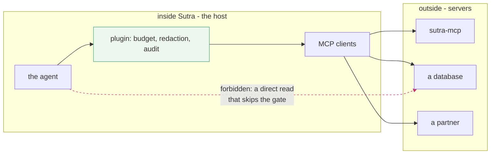

# 1.5 — One gate to guard

## One-line answer

Sutra bets its **data boundary** on MCP because a boundary you can point at is a boundary you can
guard, measure and replace — and a Python import is none of those three.

## The story

The water for the whole building arrives through one pipe, and the pipe passes through one cupboard
on the ground floor.

In that cupboard there is a meter and a valve. When a tap upstairs will not stop running, somebody
goes to the cupboard and turns the valve, and the whole building goes quiet. When the bill looks
wrong, somebody reads the meter. When the flats are re-plumbed next year, the work happens on the
other side of that cupboard and the meter does not move.

The building next door was extended twice by different builders. Its water comes in through three
pipes at three corners, and nobody is completely sure where the third one goes. There is no cupboard.
When a tap will not stop running there, the answer is *"try turning this one and see what goes
quiet"*.

Both buildings have water. Only one of them can be shut off, measured, or re-plumbed on purpose.

## The idea in plain language

A **data boundary** is the line every piece of outside information must cross to get in, and every
piece of internal information must cross to get out. It is a design decision, not a technology: you
decide where the line is, and then you make sure there is no second way through.

Sutra's plan has said since Day 1 that the boundary is MCP. That sentence buys three concrete things.

**One: you can point at it.** *"Where does Sutra get ticket data?"* has one answer — through an MCP
client. Not *"mostly through the client, and also there is a function in `helpers.py` that reads a
CSV, and a script somebody wrote"*. A boundary with exceptions is not a boundary; it is a habit.

**Two: you can guard it.** Every allowlist, every redaction rule, every approval gate has exactly one
place to live. This is the same argument Sutra already made about error policy on
[Day 21](../../../day-21-errors-surface-not-swallow/parts/05-in-production/5.1-one-policy-not-a-hundred.md):
one policy in one place beats the same policy in eleven tools, because the eleventh tool is the one
that will be written by somebody in a hurry.

**Three: you can replace what is behind it.** The dictionary becomes a database on Day 39, and
nothing on Sutra's side of the line changes. That is only true because the line is a protocol and not
a function signature.

The word to be careful with is **decoupling**, because it is usually said as a virtue and rarely as a
trade. Decoupling means the two sides can change independently. It also means the two sides *will*
change independently, so you now need a version story, a compatibility story and a way to find out
which side broke. Phase 5 spends three days on exactly those (Day 38's migration lab, Day 44's client
hardening, Day 45's audit). You do not get the freedom without the bookkeeping.

## Why Sutra needs it

Because today Sutra has the second building.

`TICKETS` and `KB` are dictionaries inside `sutra/loop.py`. `sutra/desk/skills.py` reads Markdown off
the local disk. The instruction in `sutra/desk/agent.py` carries facts about the desk in prose. There
is no line: data enters Sutra in at least three unrelated ways, and none of them can be audited from
one place.

That is fine at Sutra's current size and it stops being fine at the exact moment something real is on
the other side. The moment a tool reaches a customer database, three questions become urgent and
none of them have answers today:

- **What can this agent reach?** Currently: whatever any module imports.
- **What did it reach, on this run?** Currently: whatever the log happened to record.
- **What must it never reach?** Currently: nothing enforced.

Day 34 puts the tools behind a server. Day 40 hangs a filter and an allowlist on the client side of
that boundary. Day 45 audits every server Sutra talks to. All three of those are only writable
because Day 32 decided there is a single line and named it.

## The paper behind it

> **End-to-end arguments in system design** · `doi:10.1145/357401.357402` · 1984 ·
> `https://doi.org/10.1145/357401.357402`

It argued that a function belongs at the layer that has enough knowledge to complete it, and that
lower-level versions of the same function are justified as performance improvements rather than as
correctness.

That is the argument for putting the guard in the host rather than in each server: only the host knows
who the user is, what this run is allowed to spend and what has already been read. The paper is taught
in full on Day 21, at
[`../../../day-21-errors-surface-not-swallow/papers/01-end-to-end-arguments.md`](../../../day-21-errors-surface-not-swallow/papers/01-end-to-end-arguments.md).

## The mechanism

The boundary is not a component you install. It is a rule about which arrows are allowed to exist:



The green box is the gate. The red dashed arrow is the thing that must not exist, and it is the arrow
that gets added at 6pm on a Friday because the proper route was one import away and the shortcut was
zero.

You cannot enforce that with documentation. You enforce it with a test, and the test is dull:

```python
# a boundary is only real if something fails when you cross it
import ast
import pathlib

FORBIDDEN = {"psycopg", "sqlite3", "requests", "httpx"}


def imports(path: pathlib.Path) -> set[str]:
    """Top-level module names imported anywhere in one file."""
    tree = ast.parse(path.read_text(encoding="utf-8"))
    found = set()
    for node in ast.walk(tree):
        if isinstance(node, ast.Import):
            found |= {alias.name.split(".")[0] for alias in node.names}
        elif isinstance(node, ast.ImportFrom) and node.module:
            found.add(node.module.split(".")[0])
    return found


offenders = {
    str(path): sorted(imports(path) & FORBIDDEN)
    for path in pathlib.Path("sutra").rglob("*.py")
    if imports(path) & FORBIDDEN
}
print(f"agent-side modules reaching past the boundary: {offenders or 'none'}")
```

**Line by line:**

- `FORBIDDEN` is the list of ways to reach outside data *without* going through a client. A database
  driver or an HTTP library imported under `sutra/` means somebody built a second pipe.
- `ast.parse` rather than a grep, because a grep finds the word `requests` in a comment and in a
  docstring and reports both. The syntax tree only sees real imports, which is the difference between
  a check people trust and a check people disable.
- `ast.walk` visits every node, so an import inside a function body — the classic way a shortcut hides
  from a reviewer skimming the top of a file — is caught too.
- `alias.name.split(".")[0]` reduces `sqlite3.dbapi2` to `sqlite3`, so the rule is written once per
  library rather than once per submodule.
- `pathlib.Path("sutra").rglob` scopes the rule to the **agent side only**. `sutra_mcp/` is expected
  to import a database driver — that is its job. A boundary check that fails on the server would be
  saying the boundary is in the wrong place.
- It prints rather than asserts, because on Day 32 this is a measurement and not yet a gate. Turning
  it into a test with an `assert` is Day 45's work, and the `TODO(me)` in the hub asks you to decide
  what the list should contain first.
- **Zero model calls, no network.** It reads files.

## When it breaks

The boundary breaks quietly, and the way it breaks is almost never a protocol failure.

It breaks when someone needs one field that the MCP tool does not return, the deadline is today, and
there is a perfectly good database connection string in the environment already. The result compiles,
the tests pass, and the audit on Day 45 finds this:

```text
agent-side modules reaching past the boundary: {'sutra/desk/quick_lookup.py': ['sqlite3']}
```

One file. It is not a security incident yet, and that is exactly why it survives review — the person
who added it was right that it worked. What it costs is the property, not the query: from that
commit onward, *"what can this agent reach?"* has two answers, and every later guarantee has to be
checked in two places.

The second break is subtler and it is worth naming because it looks like good engineering: a helper
in the host that wraps three MCP calls and caches the results. Now the gate is bypassed for cached
reads, the audit log has holes in it, and nobody wrote the word "cache" in the design document.

The smallest fix for both is the same: make the check run in `./m check` so the second pipe cannot be
added silently. A boundary nothing tests is a preference.

## In production

**What a professional writes instead:** the boundary is enforced by packaging as well as by tests.
The agent package does not *depend* on a database driver at all, so importing one fails at install
time rather than at review time. Sutra already has the shape for this — `pyproject.toml` lists the
whole dependency set in one place — and Day 45 is where the rule gets written down.

**What changes at scale:** the boundary becomes a place where money is spent and therefore a place
somebody wants to bypass. Every hop costs latency, and a team under a latency target will propose a
direct read *"just for this one path"*. The counter-argument is not architectural purity; it is that
the direct read is invisible to the budget accounting from
[Day 24](../../../day-24-token-accounting-and-budgets/LESSON.md) and to the audit log, so the first
time it misbehaves nobody can see it.

**The failure mode that only appears with real traffic:** the gate becomes a bottleneck and someone
adds a second one *"for reads"*. Two gates is zero gates, because a policy applied at one of them is
not applied at the other, and which one a given call took is now a runtime question.

**The review comment a senior engineer leaves:** *"this adds `httpx` to the agent package to fetch one
status page. That page is a server, or it is a tool on an existing server. Right now it is a hole in
the only line we have, and the next person will widen it because you set the precedent."*

**The interview question:** *"why route your own tools through a protocol instead of calling them
directly?"* An answer with a number in it: *"because a boundary you can point at is one you can guard.
Our agent has one way to reach data, so the allowlist, the redaction and the audit log all live in one
place rather than in every tool. It cost us a network hop per call and a version story we did not have
before. What we got is that the ticket store moved from an in-process dict to a database without an
agent-side change, and that 'what can this agent reach' is a question with a single answer we can
test in CI."*

## Check yourself

```bash
uv run python days/day-32-mcp-stateless-core/lab/boundary_check.py
```

Then add `import sqlite3` to any file under `sutra/`, run it again, watch the offender appear, and
take it out. Decide what else belongs in `FORBIDDEN` for Sutra specifically.

**Out loud, without scrolling up:** name the three things a single data boundary buys, and name the
price you pay for each of them.

**Next:** [2.1 — The call that remembered you](../02-the-reframe/2.1-the-call-that-remembered-you.md).
