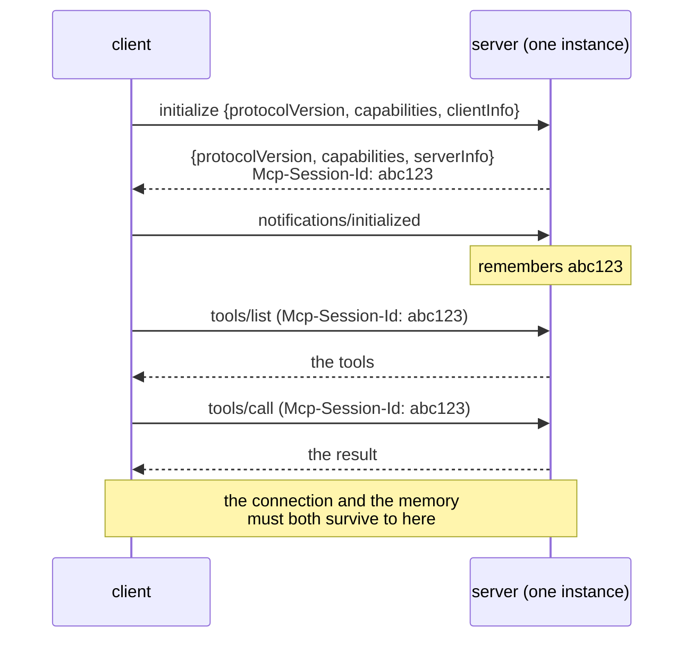
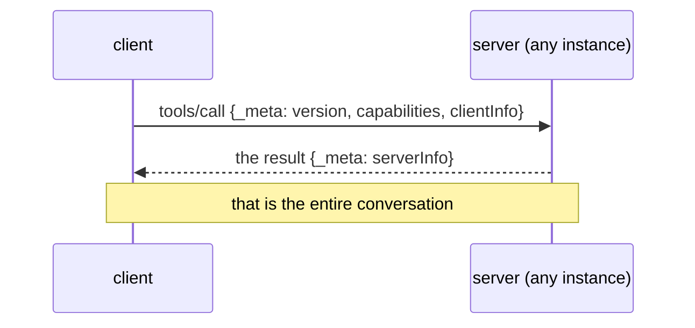

# 2.1 — The call that remembered you

## One-line answer

Until 2026-07-28, an MCP conversation began with an `initialize` handshake and every later message
depended on the server still remembering it — a **session** — and the 2026-07-28 revision deleted both
the handshake and the memory.

## The story

You ring the helpline about your electricity bill.

Somebody answers, and the first two minutes are introductions. Your consumer number. Your name. Which
of the three bills you are calling about. She writes it on a sticky note beside her keyboard. Then
you can finally ask the question, and she answers it, and you ask a follow-up, and she answers that
too, because the note is still there.

Then the line drops.

You ring again. Somebody else answers. There is no note. You give the consumer number, your name and
which bill, and only then can you ask the follow-up — which, on its own, made no sense to say out
loud.

Nothing was wrong with the first operator. The note was doing real work: it is what let your second
sentence be short. But it existed in one place, it belonged to one call, and the moment the call
ended it was gone, along with everything short you had learned to say.

## The idea in plain language

Two words, defined properly, because the rest of the section leans on them.

A **handshake** is an exchange at the start of a conversation whose only job is to agree how the rest
of the conversation will go: which version each side speaks, and what each side can do. Nothing
useful happens during it. It is the introduction.

A **session** is memory on the server that outlives one message and is tied to one client. After the
handshake, the server keeps a record — *this caller speaks version X, has capability Y* — and every
later message from that caller is interpreted against it.

Under the revisions up to and including `2025-11-25`, MCP worked exactly like the helpline:

1. The client sends `initialize` with its protocol version, its capabilities and its name.
2. The server replies with its own version, capabilities and name.
3. The client sends `notifications/initialized`, meaning *ready*.
4. Over HTTP, the server may hand back an `Mcp-Session-Id` header, and the client must put it on
   every later request.
5. Now — and only now — `tools/list` and `tools/call` are allowed.

Steps 1 to 4 carry no ticket data, no tool, no answer. They are the introductions.

**The 2026-07-28 revision deletes all four.** The changelog is unusually blunt about it
(`https://modelcontextprotocol.io/specification/2026-07-28/changelog`, read 2026-09-04):

> *"Make MCP stateless: remove the `initialize`/`notifications/initialized` handshake. Every request
> now carries its protocol version and client capabilities in `_meta`."*

and, separately:

> *"Remove protocol-level sessions and the `Mcp-Session-Id` header from the Streamable HTTP
> transport."*

So the introduction does not happen once at the start. It happens on **every single message**, inside
the message. Your second sentence is never short, and in exchange it never stops making sense.

That is the whole reframe, and it is worth having the one-sentence version by heart: **old MCP was a
phone call — you dial, you stay connected, you hang up. New MCP is the web — every request is
self-contained, any server can answer it, and nothing depends on a held connection.**

## Why Sutra needs it

Because Sutra is about to write a server, and the internet is full of correct instructions for
writing the wrong one.

The revision landed on 2026-07-28. Every tutorial, every blog post and every example written before
that date opens with `initialize`, and they are not wrong — they were right, for the revision they
were written against. Following one now means hand-building machinery the protocol has removed, which
is the failure [5.1](../05-failure-lab/5.1-the-tutorial-from-four-months-ago.md) makes concrete with a
real measurement from this machine.

It also settles the shape of Day 43 before Day 43 arrives. The plan used to describe a *"stateless
mode"* you could switch on for deployment. There is no mode. Statelessness is the protocol, and Day
43's job shrinks from *enable and test a mode* to *do not accidentally reintroduce state*.

And it explains why this day writes no server code. The mechanism you are learning is what is
**absent** from the wire, and you cannot see an absence in a library that hides it.

## The mechanism

The two eras, side by side. First the old one:



Then the current one:



Four messages became one. Nothing is remembered between them, so nothing has to survive.

The cost is visible in the same picture and should be said plainly: the `_meta` block is repeated on
every request forever. That repetition is the price of the property, it is measured in
[2.3](2.3-every-request-introduces-itself.md), and it is the exact trade the paper behind this phase
names as the cost of statelessness
([`../../papers/01-modern-web-architecture.md`](../../papers/01-modern-web-architecture.md)).

## When it breaks

It breaks when a modern client meets a server from the previous era, and the interesting part is that
the failure is not obvious from the status code alone.

A modern client posts a `tools/call` straight in. A `2025-11-25` server has no idea what to do with a
request that arrives before `initialize`, and answers with something like:

```text
HTTP/1.1 400 Bad Request

{"jsonrpc": "2.0", "id": null, "error": {"code": -32600, "message": "Received request before initialization was complete"}}
```

The trap is that `400 Bad Request` is *also* what a modern server returns for three of its own
errors — an unsupported protocol version, a missing required client capability, and a header mismatch.
So the status code cannot tell you which era you are talking to. The specification's backward
compatibility rule reads the **body** instead
(`https://modelcontextprotocol.io/specification/2026-07-28/basic/transports/streamable-http`, read
2026-09-04):

> *"If the body contains a recognized modern JSON-RPC error, the server speaks a modern version of
> MCP — retry using the advertised `supported` versions or correct the request, rather than falling
> back. If the body is empty or is not a recognized modern JSON-RPC error, fall back to `initialize`
> and continue with the legacy version for subsequent requests."*

The smallest fix, therefore, is not a retry. It is *read the body before you decide what the 400
meant.* A client that falls back on the status code alone will keep re-handshaking against a modern
server that was simply telling it the version was wrong.

On stdio there is no status code at all, which is why `server/discover` exists as an explicit probe —
[2.4](2.4-server-discover-the-optional-question.md).

## In production

**What a professional writes instead:** nothing, on the happy path. A modern client sends its request
and handles two named errors. The compatibility ladder is written once, in the client library, and
tested against a deliberately old server — which is Day 38's migration lab.

**What changes at scale:** the disappearance of the handshake removes a per-connection cost that used
to be invisible until it was not. Under the old model, a host serving many concurrent conversations
paid four messages before the first useful one, and a load balancer had to keep each conversation on
the instance that had answered its handshake. Both of those costs are now zero, and the first is worth
saying out loud because it is the one nobody measured: a short-lived agent run used to spend most of
its protocol traffic on introductions.

**The failure mode that only appears with real traffic:** a half-migrated fleet. Some servers modern,
some not, and a client that caches *"this host is legacy"* against a hostname that is actually three
different deployments behind one DNS name. The cached era is then wrong for a third of requests, and
the symptom is intermittent 400s that nobody can reproduce.

**The review comment a senior engineer leaves:** *"this client falls back to `initialize` whenever it
sees a 400. Read the body first — a modern server returns 400 for an unsupported version too, and you
will handshake in a loop against a server that was telling you exactly what was wrong."*

**The interview question:** *"what did the 2026-07-28 MCP revision change?"* Answer with the mechanism,
not the adjective: *"it removed the `initialize` handshake and protocol-level sessions. Every request
now carries its protocol version, capabilities and client identity in a `_meta` block, so there is
nothing for the server to remember between calls and no `Mcp-Session-Id` header. The one-line version
is that MCP stopped being a phone call and became the web. The reason was horizontal scaling — a
session pinned to whichever instance answered your handshake forces sticky routing, and autoscalers
punish that."*

## Check yourself

```bash
uv run python days/day-32-mcp-stateless-core/lab/letter.py
```

Count the messages in each era in the output above. Then, out loud and without scrolling up: name the
four messages the old protocol spent before the first useful one, and say what the server had to
remember afterwards.

**Next:** [2.2 — Three instances, one URL](2.2-three-instances-one-url.md).
