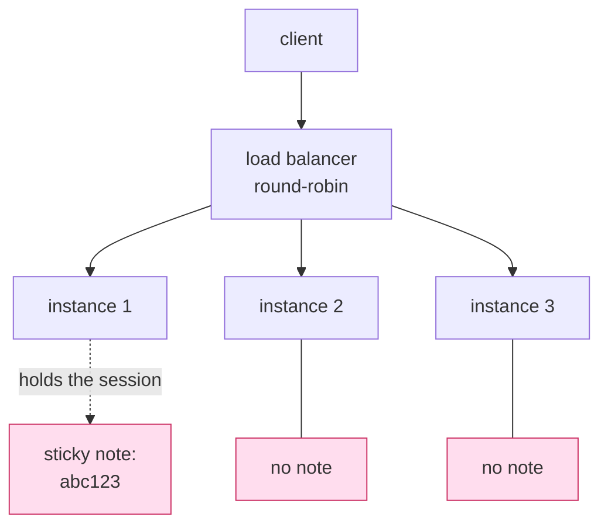

# 2.2 — Three instances, one URL

## One-line answer

The reason the handshake had to go is arithmetic: with three interchangeable copies of a server
behind one address, a session held by one copy makes two thirds of your requests fail — measured
here as **2 of 4 served** with a session against **4 of 4** without one.

## The story

The clinic has three doctors and one waiting room.

Last month you saw the one in the middle room. She listened, examined you, decided it was probably
the medicine you started in March, and told you to come back in three weeks. Today you come back, the
receptionist sends you to the first room, and the doctor there says *"tell me from the beginning"*.
You start explaining, and halfway through you realise you cannot remember the name of the March
medicine, which is the one fact the whole visit turns on.

The clinic across the road has three doctors too, and a rule: **the patient keeps the file**. A paper
folder, yours, carried in and out. Prescriptions go in it, test results go in it, the last visit's
note goes in it. Whichever door you are sent through, the doctor reads the folder and knows
everything the last one knew.

The second clinic is not better staffed. It is arranged so that the room you happen to be sent to
does not matter.

## The idea in plain language

Three words first, because the rest is arithmetic on top of them.

An **instance** — also called a replica — is one running copy of your server. You run several so that
the service survives one of them dying and so that busy periods are spread out.

A **load balancer** is the thing in front of them holding the single address the world uses. A
request arrives, and it picks an instance. The simplest policy is **round-robin**: first request to
instance 1, second to instance 2, third to instance 3, fourth back to instance 1.

**Sticky sessions** — also called session affinity — is the workaround for servers that remember
things: the load balancer is told to keep sending the same caller to the same instance. It works, and
it costs you everything horizontal scaling was for. An instance cannot be replaced without dropping
its callers. A new instance receives no traffic from existing callers. Load spreads unevenly, because
it follows conversations rather than work. And on a platform that scales to zero when idle, the
instance holding your session may simply cease to exist between two of your requests.

Now the arithmetic. With three instances, round-robin, and one caller that did its handshake against
instance 1:

| Request | Goes to | Old protocol (session on instance 1) | New protocol |
| --- | --- | --- | --- |
| 1 | instance 1 | works | works |
| 2 | instance 2 | *unknown session* | works |
| 3 | instance 3 | *unknown session* | works |
| 4 | instance 1 | works | works |

Two of four. Not a rare edge case, not a race condition — the *expected* behaviour, on the happy path,
with everything working correctly. That is the number that ended the handshake.

## Why Sutra needs it

Because the phase gate says `sutra-mcp` serves tools statelessly, and Day 43 deploys it in exactly
this shape: several interchangeable containers behind one URL, scaled by the platform.

Under the old protocol that deployment needed session affinity configured in the load balancer,
inspected in the health check, and reasoned about every time a container was replaced. Under the
current protocol it needs nothing at all, and Day 43's job changes from *turn on stateless mode* to
*make sure you did not put state back*.

It also decides something for **Day 34**, which is much closer. When you write `sutra_mcp`, the
temptation will be to keep a dictionary at module level — a cache, a connection, a partly-built
draft — because it is one line and it works on your laptop where there is exactly one instance. Every
one of those is a sticky note. [3.4](../03-headers-and-caches/3.4-state-that-travels-in-the-payload.md)
is the protocol's answer for the cases where cross-call memory is genuinely needed.

## The paper behind it

> **Principled design of the modern Web architecture** · `doi:10.1145/514183.514185` · 2002 ·
> `https://doi.org/10.1145/514183.514185`

It argued that the web's ability to grow came from a small set of deliberately chosen constraints
rather than from its features, and that **statelessness** — each request containing everything needed
to understand it — is what lets any server answer any request, with visibility and recoverability
thrown in and repeated data as the price.

MCP's 2026-07-28 revision is that argument applied to a protocol that had chosen otherwise and then
met a load balancer. The paper is taught in this day's
[`../../papers/01-modern-web-architecture.md`](../../papers/01-modern-web-architecture.md), and it is
the document to read after the parts.

## The mechanism

Three instances, one dispatcher, and the same four requests sent twice:



This is not a thought experiment. The day's paper demo runs three real HTTP servers on three ports
behind a round-robin dispatcher, with one environment variable choosing whether the servers hold a
session or take their state in the request:

```bash
cd days/day-32-mcp-stateless-core/lab/papers/modern-web-architecture
STATELESS=1 uv run python client.py
STATELESS=0 uv run python client.py
```

**Line by line:**

- `cd` into the demo folder first, because `client.py` imports `instance` by bare name.
- `STATELESS=1` is the current protocol: every request states its own version, and nothing is
  remembered.
- `STATELESS=0` is the old protocol: one handshake against whichever instance answers first, then a
  session identifier on every later request.
- One variable, two runs, and everything else — the ports, the dispatcher, the four questions — held
  identical. **Zero model calls; three local HTTP servers and nothing else.**

Measured on 2026-09-04, the last two lines of each run:

```text
STATELESS=1  served 4/4, refused 0/4   requests handled per instance: [2, 1, 1]
STATELESS=0  served 2/4, refused 2/4   requests handled per instance: [3, 1, 1]
```

The full transcript, with the refusal text, is in the paper part
([`../../papers/01-modern-web-architecture.md`](../../papers/01-modern-web-architecture.md)). Two
things in those two lines are worth stopping on.

**`served 2/4` is the honest cost of a session**, and it is not caused by anything failing. All three
instances were healthy. The dispatcher did exactly what it was configured to do. The requests were
well formed. The only reason half of them were refused is that memory lived in one of three places.

**`[3, 1, 1]` against `[2, 1, 1]`** is the second cost, and it is the one people forget. In the
stateful run, instance 1 handled the handshake *and* both requests that survived. The work did not
spread out, because the work followed the conversation. That is what sticky sessions do to a load
curve even when nothing fails.

## When it breaks

The exact error, from the stateful arm of the demo run on 2026-09-04:

```text
  ask 4522 -> :8802 409 i2 "unknown session 'i1-session-1': this instance never did a handshake"
```

Against a real `2025-11-25` MCP server the wording differs and the shape does not — a 4xx and a
complaint about a session the server has never heard of. The reason it is hard to diagnose in
production is that it is **intermittent by construction**. One request in three works. Retry the
failing one and it may succeed, because the retry may land on the instance that does have the note.
So the bug reproduces about a third of the time, disappears entirely on a developer laptop running a
single instance, and comes back the moment the service is deployed.

The classic wrong fix is a retry loop, and it half-works, which is worse than not working: the retry
eventually lands on the right instance, so the symptom fades and the load imbalance gets worse.

The right fix under the old protocol was sticky sessions. The fix under the current one is that there
is nothing to fix, because there is nothing to remember.

## In production

**What a professional writes instead:** a server with no module-level mutable state at all. If
something must survive between calls it goes into shared storage — a database, a cache — behind an
explicit handle, and the handle travels with the client
([3.4](../03-headers-and-caches/3.4-state-that-travels-in-the-payload.md)). The test for this is
brutal and cheap: **kill an instance mid-conversation and see whether anything notices.**

**What changes at scale:** scale-to-zero becomes usable. A platform that shuts your containers down
when idle is impossible to combine with in-memory sessions, because idle is exactly when a session is
waiting. A stateless server can be scaled to zero, scaled to fifty, deployed mid-conversation and
rolled back mid-conversation, and no client sees anything but latency.

**The failure mode that only appears with real traffic:** the *nearly* stateless server. One cache
that is only a performance optimisation, until a code path starts assuming it is populated. The
symptom is a small percentage of requests behaving differently, correlated with nothing the logs
record — because the correlating variable is which container answered, and nobody logged that. Sutra
already has the fix for the visibility half of that problem: the correlation identifier from
[Day 22](../../../day-22-structured-logging/parts/02-wiring-the-run/2.2-the-correlation-id.md), plus
an instance identifier on every line.

**The review comment a senior engineer leaves:** *"this server keeps a `_clients` dict at module
level. On one instance that is a cache; on three it is a coin flip. Either move it behind a handle or
prove to me that every entry can be rebuilt from the request that reads it."*

**The interview question:** *"why did MCP drop sessions?"* Answer with the number: *"horizontal
scaling. With three instances behind a round-robin balancer and one held session, two out of every
four requests hit an instance that never did your handshake. The old workaround was sticky sessions,
which pins conversations to instances and takes away the point of running three. Statelessness is the
same trade the web made — you repeat the envelope on every request, and in exchange any server can
answer any request, so you can deploy, scale and roll back without anybody noticing."*

## Check yourself

```bash
cd days/day-32-mcp-stateless-core/lab/papers/modern-web-architecture
STATELESS=0 uv run python client.py
```

Now change `PORTS` in `client.py` to a single port and run the stateful arm again. It passes 4/4 —
which is exactly why this bug never appears on a laptop. Then put the three ports back.

**Out loud, without scrolling up:** say what sticky sessions cost you, and give the served-count for
both arms of the demo.

**Next:** [2.3 — Every request introduces itself](2.3-every-request-introduces-itself.md).
