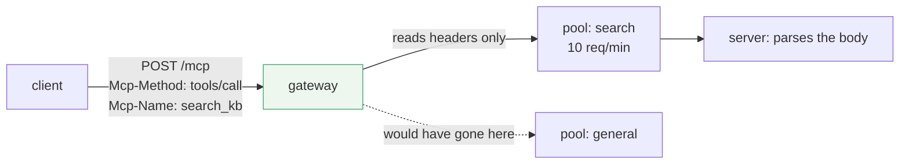

# 3.1 — The label on the envelope

## One-line answer

Streamable HTTP now **requires** three headers — `MCP-Protocol-Version`, `Mcp-Method` and, for calls
and reads, `Mcp-Name` — that copy fields out of the JSON body onto the outside of the request, so
that a load balancer or gateway can route on them without parsing the body.

## The story

A letter goes into a post box in one town and comes out of a slot in a door in another.

Between those two moments it is handled by people who never open it. It is dropped into a sack for
the right region, taken off a van, tipped onto a belt, read by a machine, put into a tray for one
postman's round, and finally carried down your street. Every one of those decisions was made by
looking at a few lines written on the outside.

Nobody in that chain knows whether the letter is a wedding invitation or a bill. They do not need to.
The information required to *move* the letter was deliberately put somewhere different from the
information inside it, and the whole sorting system exists because of that separation.

Now imagine the postcode had to be inside the envelope. Every sorting office would have to open every
letter, read it, and seal it again. It would still work. It would just be a different kind of
business — slower, more expensive, and one where every person in the chain has read your post.

## The idea in plain language

Three words first.

An **HTTP header** is a name and a value sent before the body of a request: `Content-Type:
application/json`. Headers are small, they arrive first, and every piece of network infrastructure
already knows how to read them.

An **intermediary** is anything between the client and the server that touches the request without
being either: a load balancer, an API gateway, a reverse proxy, a rate limiter, a service mesh
sidecar, an observability agent.

**Routing** is deciding which server to send a request to, and it is only one of the jobs an
intermediary does. Rate limiting, authorisation, metrics and logging are the others, and all four
need the same thing: *some idea of what this request is*, cheaply.

Before this revision, an MCP request over HTTP was a POST to one URL with an opaque JSON body. Every
request looked identical from outside: same path, same method, same content type. An intermediary
that wanted to treat `tools/call` differently from `tools/list` — or to send one expensive tool to a
bigger pool — had to parse the JSON. That means buffering the whole body, deserialising untrusted
input, and rebuilding the request, on every hop, at the most latency-sensitive layer of the stack.

The 2026-07-28 revision mirrors the two fields that matter onto headers. From the changelog:

> *"Require standard MCP request headers (`Mcp-Method`, `Mcp-Name`) on Streamable HTTP POST requests,
> and add support for custom headers from tool parameters via `x-mcp-header`."*

And the transport page states the mapping exactly
(`https://modelcontextprotocol.io/specification/2026-07-28/basic/transports/streamable-http`, read
2026-09-04):

| Header | Copied from | Required for |
| --- | --- | --- |
| `MCP-Protocol-Version` | `params._meta['io.modelcontextprotocol/protocolVersion']` | every POST |
| `Mcp-Method` | `method` | all requests |
| `Mcp-Name` | `params.name`, or `params.uri` for `resources/read` | `tools/call`, `resources/read`, `prompts/get` |

The transport page calls these **REQUIRED for compliance**. Not a hint, not an optimisation a client
may skip.

This only works because of section 2. When a request was meaningless without a session, no header
could make it routable — an intermediary could read `Mcp-Method: tools/call` and still not be able to
send it anywhere, because only one instance could answer it. Self-contained requests are what make
the labels worth writing.

## Why Sutra needs it

Because the headers are the reason Sutra's deployment story on Day 43 has an edge layer at all, and
because Day 34 must write them or be rejected.

Concretely, three things become possible at the gateway, none of which require the gateway to
understand Sutra:

- **Rate limit per tool.** `Mcp-Name: search_kb` is expensive because it hits an index;
  `Mcp-Name: lookup_ticket` is a primary-key read. One header, two limits, and no code in Sutra.
- **Route by cost.** Send every `tools/call` to instances with more memory, and every `tools/list` to
  a small cheap pool that mostly serves cached answers
  ([3.3](3.3-lists-you-may-keep.md)).
- **Count without instrumenting.** Metrics by method and tool name, from the proxy's existing access
  log, on day one — before Sutra emits a single custom metric.

There is a fourth that matters more for a support desk holding customer data: an intermediary that
routes on headers **never sees the arguments**. `lookup_ticket`'s ticket identifier stays in the body.
An intermediary that had to parse JSON to route would be reading customer data in order to make a
routing decision, and every one of those is a place a log line can leak it — which is the exact
failure Sutra already built a redaction rule for on
[Day 22](../../../day-22-structured-logging/parts/03-failure-lab/3.1-the-log-that-leaked.md).

## The mechanism

The same request, seen by the two parties that handle it:



The gateway made a decision and never touched the body. The server is the first thing in the chain
that deserialises JSON.

Written out, a complete request. This is the transport specification's own example with Sutra's tool
substituted:

```http
POST /mcp HTTP/1.1
Content-Type: application/json
Accept: application/json, text/event-stream
MCP-Protocol-Version: 2026-07-28
Mcp-Method: tools/call
Mcp-Name: lookup_ticket

{"jsonrpc":"2.0","id":1,"method":"tools/call","params":{"name":"lookup_ticket",
 "arguments":{"ticket_id":"4521"},
 "_meta":{"io.modelcontextprotocol/protocolVersion":"2026-07-28"}}}
```

**Line by line:**

- `POST /mcp` — one endpoint path for everything. There is no `/tools/call` URL, which is why the
  method has to be a header: the path carries no information at all.
- `Accept: application/json, text/event-stream` — the client **MUST** list both, because the server
  chooses per request whether to answer with one JSON object or with an SSE stream carrying progress
  notifications before the result. A client that accepts only JSON has forbidden the server from
  streaming.
- `MCP-Protocol-Version: 2026-07-28` — the same string that is inside `_meta`, hoisted so an
  intermediary can reject an era it will not handle without opening anything.
- `Mcp-Method: tools/call` — a copy of the body's `method`. This is the field a gateway routes and
  rate limits on.
- `Mcp-Name: lookup_ticket` — a copy of `params.name`. For `resources/read` it would be `params.uri`
  instead, which is why one header serves both: the question *"which thing is this request about"* has
  one answer per method.
- The body is unchanged and still authoritative. Nothing was moved out of it; two values were
  **copied**, and [3.2](3.2-the-header-that-must-match.md) is entirely about what happens when the
  copy and the original disagree.

Deriving the headers from the body is mechanical, and writing it as code is how you avoid getting it
wrong at forty call sites:

```python
# days/day-32-mcp-stateless-core/lab/headers.py  (extract)
VERSION_KEY = "io.modelcontextprotocol/protocolVersion"

NAMED_BY_NAME = {"tools/call", "prompts/get"}
NAMED_BY_URI = {"resources/read"}


def derive(body: dict) -> dict[str, str]:
    """The headers a conforming client must put on this body."""
    params = body.get("params", {})
    headers = {
        "MCP-Protocol-Version": params.get("_meta", {}).get(VERSION_KEY, ""),
        "Mcp-Method": body.get("method", ""),
    }
    method = body.get("method")
    if method in NAMED_BY_NAME:
        headers["Mcp-Name"] = params.get("name", "")
    elif method in NAMED_BY_URI:
        headers["Mcp-Name"] = params.get("uri", "")
    return headers
```

**Line by line:**

- `derive` takes the **body** and returns the headers. That direction is the whole discipline: the
  body is the source of truth and the headers are computed from it, so they cannot drift. A client
  that builds headers separately from the body has created two sources of truth and will eventually
  ship the mismatch of [3.2](3.2-the-header-that-must-match.md).
- Two sets rather than one, because the source field differs: `tools/call` and `prompts/get` name a
  thing with `params.name`, while `resources/read` names it with `params.uri`. Collapsing them into
  one lookup would need a special case anyway.
- `if / elif` and **no else**: a method not in either set gets no `Mcp-Name`, which is correct.
  `tools/list` has nothing to name, and sending an empty `Mcp-Name` on it would be a header that does
  not match a body value — rejected.
- `.get(..., "")` rather than `[...]` at every step so a malformed body produces an empty header
  rather than a `KeyError` deep inside a client library. The empty header then fails validation
  loudly at the server, which is where you want the failure: at a named protocol error rather than a
  Python traceback.
- The function is pure and takes no transport, no socket and no configuration, which is what makes it
  testable without a server. Day 34's tests will call it directly.
- **Zero model calls, no network.**

## When it breaks

The break is a client that does not send the headers at all, which is the default state of anything
built from a pre-2026 example or an older SDK.

The specification lists a missing required standard header as a validation failure, handled exactly
like a mismatch:

```text
HTTP/1.1 400 Bad Request

{"jsonrpc": "2.0", "id": 1, "error": {"code": -32020, "message": "Header mismatch: required header Mcp-Method is missing"}}
```

That message is produced by this day's own validator, run on 2026-09-04
([3.2](3.2-the-header-that-must-match.md) shows the run). The confusing part for the developer is the
word *mismatch* on a header that was never sent — the error code covers both cases, so "mismatch" here
means *the headers and the body do not agree*, and a missing header disagrees with a body that has a
value.

There is a second, quieter break: an intermediary that trusts the headers when it should not. The
specification is direct about this
(`https://modelcontextprotocol.io/specification/2026-07-28/basic/transports/streamable-http`, read
2026-09-04):

> *"Intermediaries that enforce policy based on mirrored headers (e.g., routing or rate-limiting by
> tenant) **SHOULD** verify that the `MCP-Protocol-Version` header indicates a version that requires
> header–body validation. If the version is older or the header is absent, the intermediary
> **SHOULD** reject the request rather than trusting unvalidated header values."*

In plain words: headers are only trustworthy because a 2026-07-28 server promises to reject a lie. A
request claiming an older version carries no such promise, so a gateway that routes it on headers is
routing on something nobody will check. That is [5.2](../05-failure-lab/5.2-the-header-that-lied.md)'s
whole subject.

## In production

**What a professional writes instead:** the headers are never typed by hand. A single client function
derives them from the body immediately before sending, and a single test asserts `derive(body)`
against the body for every method the client uses.

**What changes at scale:** the gateway becomes the cheapest observability you have. Requests per
method, per tool, per client, latency by tool name — all of it out of an access log, with no
application change. The first time a tool starts timing out, the person who finds out is whoever
watches the proxy dashboard, and they find out by tool name.

**The failure mode that only appears with real traffic:** header size and header stripping. Some
intermediaries drop unknown headers by default; some corporate proxies strip anything not on a list.
An MCP request that arrives at the server without `Mcp-Method` is rejected, and the client author has
no way to see that a proxy removed it. The specification requires intermediaries to forward
`Mcp-Param-*` headers they do not recognise, and requirements are not configuration — this one is
worth testing from outside your own network before you blame the client.

**The review comment a senior engineer leaves:** *"you build the headers in the request factory and
the body in the call site. Those are two sources of truth for the same value. Derive the headers from
the body at the moment you send it, and delete the parameters that let a caller set them."*

**The interview question:** *"why does MCP duplicate the method name into an HTTP header when it is
already in the body?"* The answer: *"so infrastructure can route, rate limit and measure without
parsing the body. One endpoint path means the URL carries no information, so before this revision a
gateway had to buffer and deserialise untrusted JSON on every hop just to tell a list from a call.
Now it reads two headers. It also means the intermediary never sees the arguments, which is a privacy
win as much as a performance one — and the server is required to reject a request whose headers
disagree with its body, which is what makes the headers trustworthy in the first place."*

## Check yourself

```bash
uv run python days/day-32-mcp-stateless-core/lab/headers.py
```

The first three lines are the derived headers for a `lookup_ticket` call. Now change `CALL`'s
`method` to `tools/list` and remove `name` from `params`, and confirm `Mcp-Name` disappears rather
than becoming empty.

**Out loud, without scrolling up:** name the three required headers and say where each one is copied
from, then say why `tools/list` has only two.

**Next:** [3.2 — The header that must match](3.2-the-header-that-must-match.md).
