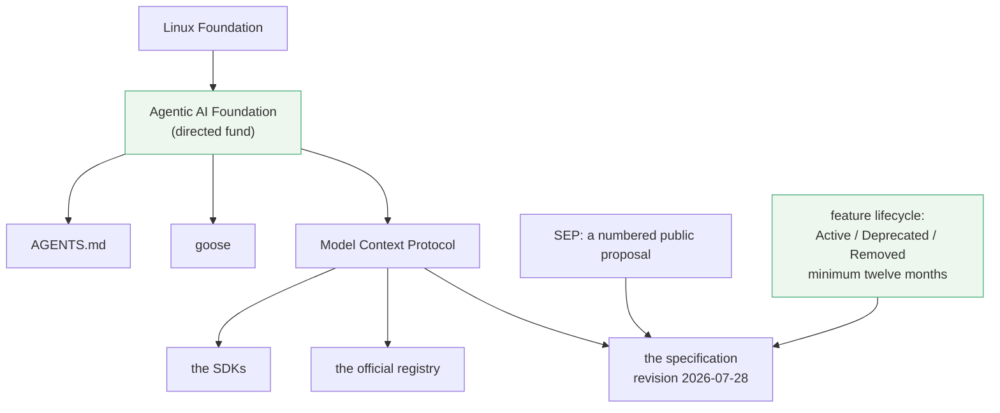

# 4.1 — A standard nobody owns

## One-line answer

On 2025-12-09 MCP was donated to the **Agentic AI Foundation**, a directed fund under the Linux
Foundation, co-founded by three companies and supported by five more — which is what makes it
defensible to put a company's data boundary on it.

## The story

The row of shops shares a strip of dirt in front of them, and every monsoon it turns into a channel
of water that customers have to jump.

One year the man who runs the biggest shop pays to have it paved. He does a proper job — a slope, a
drain at the end, a decent surface. Everybody benefits, everybody is grateful, and for two years
nobody thinks about it again.

Then he falls out with the shop at the far end and puts a chain across the paving in front of it.

He is not a villain. He paid for it, he maintained it, and there is nothing written down anywhere
saying he could not. The problem was never his character. It was that eight businesses had come to
depend on a surface owned by one of them, and none of them noticed until the day it mattered.

The other row of shops, two streets over, has paving laid by the municipality. It is slightly worse
paving. Nobody can chain it.

## The idea in plain language

A protocol is a promise about the future: *this shape will still work next year, so build on it.*
Whether that promise is worth anything depends on **who can break it** and **how changes are made** —
two separate questions with two separate answers.

**Who can break it.** MCP was created and published by one company. That is how almost every good
protocol starts, and it is also a single point of failure that no amount of goodwill removes: a
licence can change, a company can be sold, priorities can move. On 2025-12-09 that was fixed by
donation, and the announcement is specific
(`https://blog.modelcontextprotocol.io/posts/2025-12-09-mcp-joins-agentic-ai-foundation/`, read
2026-09-04): MCP was donated by Anthropic to the **Agentic AI Foundation (AAIF)**, described as *"a
directed fund under the Linux Foundation"*. It joins *"goose by Block and AGENTS.md by OpenAI as
founding projects"*, and the foundation itself was *"co-founded by Anthropic, Block and OpenAI, with
support from Google, Microsoft, AWS, Cloudflare and Bloomberg"*.

Read the list again and notice what it is: direct competitors, several of whom sell rival models,
funding one protocol together. That is the point of a neutral foundation. None of them can withdraw
it, relicense it, or steer it alone, because none of them owns it any more. The Linux Foundation is
the same neutral home that holds Kubernetes, and the reason it keeps being chosen is that this exact
pattern has already been tested there.

**How changes are made.** Neutral ownership without a published process is still a room you are not
in. So the 2026-07-28 revision also shipped governance, listed in the changelog under its own heading:

> *"Adopt a specification feature lifecycle and deprecation policy defining the Active, Deprecated,
> and Removed feature states, a minimum twelve-month deprecation window, and a registry of deprecated
> features."*

and

> *"Formalize PR-based SEP workflow with markdown files in `seps/` directory, PR-derived numbering,
> sponsor responsibilities, and status management via PR labels."*

Two terms defined:

- A **SEP** is a Specification Enhancement Proposal — a numbered, public document proposing a change,
  which is how every mechanism in this day arrived. `SEP-2575` removed the handshake, `SEP-2243` added
  the headers, `SEP-2549` made lists cacheable, `SEP-2567` introduced handles. You can read the
  argument for each, including the objections.
- The **feature lifecycle** is a promise about removal. A feature marked *Deprecated* stays in the
  specification for at least twelve months, documents a migration path, and only then becomes eligible
  for removal. Roots, Sampling and Logging are deprecated right now under exactly this policy — they
  still work, and you have a year's warning.

That combination — a neutral owner, a numbered public proposal process, and a written deprecation
window — is what turns *"a protocol changed underneath us"* from a surprise into a scheduled event.

📌 **One recorded difference (Principle 14).** Addendum 01, written 2026-08-12, describes AAIF as
*"Anthropic, OpenAI, Block as co-founders; AWS, Google, Microsoft supporting."* The live announcement
read on 2026-09-04 gives the same three co-founders and a longer support list that also names
Cloudflare and Bloomberg. Same story, two more names. No plan change is needed and the addendum's
interview line survives unchanged; it is noted here because a curriculum that quietly corrects its
own sources is a curriculum you cannot audit.

## Why Sutra needs it

Because the plan committed Sutra's **data boundary** to MCP
([1.5](../01-the-socket/1.5-one-gate-to-guard.md)), and a boundary is a bet with a term of years.

Every day from 32 to 45 makes that bet larger. Day 34 writes a server. Day 39 puts the ticket database
behind one. Day 42 exposes the whole agent. By Day 45 the audit is auditing MCP servers, because there
is nothing else to audit. If the protocol were owned by a single vendor, that commitment would be a
commercial relationship dressed as an architecture, and the honest answer to *"what if they change the
licence?"* would be *"we rewrite the data layer."*

It is also the answer to a question that will be asked in a design review by somebody senior, and it
is a fair question: *"why are we betting on this and not on the thing that came before it?"* The answer
is not that MCP is better designed. It is that MCP is governed, has a public change process with
numbered proposals, and has a written minimum deprecation window — three properties you can point at
rather than three adjectives.

And it changes how Sutra reads a change. Because the deprecation policy exists, the correct reaction
to *"Roots, Sampling and Logging are deprecated"* is not panic; it is a note in
[5.1](../05-failure-lab/5.1-the-tutorial-from-four-months-ago.md)'s reading habit and a Day 38
migration task.

## The mechanism

Governance is not code, but it does have a shape, and the shape is what tells you where to look when
something changes:



Three practical consequences follow from that diagram, and they are the reason it is worth drawing
rather than just asserting neutrality.

**The specification and the SDKs are different artefacts with different release cycles.** They hang
off the same project and they move at different speeds, which is not a scandal and is exactly what
[5.1](../05-failure-lab/5.1-the-tutorial-from-four-months-ago.md) measures on this machine. Reading
the diagram, you can see why: nothing in the governance model requires an SDK to ship on the day a
revision does.

**The registry is a project artefact, not a marketplace somebody runs.** That is what makes
[4.2](4.2-the-registry-queried-live.md) worth querying rather than merely browsing.

**Changes arrive through a numbered document you can read.** When something in Phase 5 surprises you,
the SEP number in the changelog is the primary source. `SEP-2575` is not a citation for decoration —
it is where the argument for removing the handshake, and the objections to it, are written down.

## When it breaks

Neutral governance does not stop a protocol from moving fast, and assuming otherwise is the break.

The 2026-07-28 revision removed a handshake, deleted `ping` and `logging/setLevel`, replaced
server-initiated requests with a new pattern, moved tasks into an extension, and dropped SSE stream
resumability. That is not a gentle revision, and it happened *after* the donation. Governance changed
who decides and how the decision is recorded. It did not promise stability.

What you actually get is a published process and a deprecation window, and the honest way to read the
window is that it applies to *deprecations* rather than to everything. The handshake was not
deprecated for twelve months and then removed; the protocol version changed, and the previous revision
remains available for implementers who need it. Those are different mechanisms and the difference is
easy to miss:

```text
version change  -> old revision still exists, both eras coexist, clients negotiate
deprecation     -> feature stays in the current revision, marked, for at least twelve months
removal         -> only after the deprecation window, in a later revision
```

The second break is treating a foundation as an endorsement of quality. It is not. AAIF hosts the
protocol; it does not review the servers people publish against it, and the registry says so
explicitly about its own contents ([4.3](4.3-a-name-that-proves-its-publisher.md)). *Vendor-neutral*
and *safe* are different words.

## In production

**What a professional writes instead:** a dependency policy that treats the specification revision as
a pinned version, exactly like a package. Sutra should record which revision it targets, where it read
it and on what date — which is why the hub's §8 exists and why this day's first act was to check that
the revision had not moved.

**What changes at scale:** governance becomes a procurement question. A large organisation adopting an
agent stack will ask who owns the protocol, what the change process is, and what the deprecation
guarantee is — and *"a Linux Foundation project with a published SEP process and a twelve-month
deprecation window"* is an answer that passes review, while *"a specification published by one
company"* usually requires an exception.

**The failure mode that only appears with real traffic:** the fleet that cannot move. Once a hundred
teams inside a company speak MCP, a revision is not something you adopt — it is something you migrate,
in an order, with both eras running. The deprecation window exists precisely so that migration can be
planned, and the organisations that suffer are the ones who were not reading the changelog because
nothing had broken yet.

**The review comment a senior engineer leaves:** *"the design document says 'MCP is an open standard'.
Say which revision, who governs it, and what the deprecation policy is. 'Open' is what everybody
claims; the reason we can build on this one is that it is a Linux Foundation project with numbered
public proposals and a written minimum window before anything is removed."*

**The interview question:** *"why would you build a product boundary on MCP rather than on a vendor's
own tool protocol?"* The answer with the facts in it: *"because since December 2025 it has not been a
vendor's protocol. It was donated to the Agentic AI Foundation under the Linux Foundation, co-founded
by Anthropic, Block and OpenAI with support from Google, Microsoft, AWS, Cloudflare and Bloomberg — so
direct competitors are funding one standard and none of them can withdraw it. On top of that there is
a numbered public proposal process and a minimum twelve-month deprecation window, which means changes
arrive as scheduled events with a migration path rather than as surprises. That is what makes it
reasonable to put the data boundary there."*

## Check yourself

```bash
curl -s -o /dev/null -w "%{http_code}\n" https://modelcontextprotocol.io/specification/versioning
```

Open that page and confirm for yourself which revision is marked **current** today. Then find one SEP
number in this day's parts, search for it in the changelog, and read what it proposed.

**Out loud, without scrolling up:** name the foundation, its parent, and the two other founding
projects — then say the two things governance gives you that neutral ownership alone does not.

**Next:** [4.2 — The registry, queried live](4.2-the-registry-queried-live.md).
