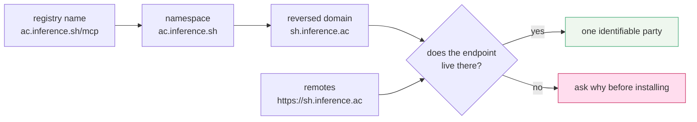

# 4.3 — A name that proves its publisher

## One-line answer

Registry names are reverse-DNS — `io.github.someone/their-server`, `com.example/tickets` — and the
namespace is not a convention but a **claim the publisher had to prove**, by controlling that domain
or that account; it proves authorship and nothing else.

## The story

Two men arrive at the door on the same afternoon, both saying they are from the gas company.

The first has a laminated card on a lanyard: a photograph, an employee number, the company's own
logo, and a helpline printed on the back that you can ring to check the number. The second has a
visiting card — good quality, nicely printed, the same logo, a mobile number.

The visiting card is not evidence of anything. Anybody can have five hundred printed for very little
money, and the logo on it was copied off the internet in a minute. The laminated card is evidence of
exactly one thing: **the company issued it.** It does not tell you the man is competent, honest, or
still employed there this week. It tells you which organisation he came from, and therefore who you
complain to.

That is a smaller guarantee than most people hear, and it is the only one worth having at a door.

## The idea in plain language

A registry name looks like this:

```text
io.github.someone/their-server
com.example/tickets
ac.tandem/docs-mcp
```

The part before the slash is the **namespace**. It is written in **reverse DNS** — a domain name with
its labels reversed, so `example.com` becomes `com.example`. The convention is borrowed from Java
package names and it exists for one reason: domain names are already globally unique and already have
an owner, so reusing them means nobody has to invent a new authority to hand out names.

The part after the slash is whatever the publisher wants to call the server, within their own
namespace.

What makes this more than a naming convention is that the registry **checks it**
(`https://modelcontextprotocol.io/registry`, read 2026-09-04):

> *"The MCP Registry uses namespace authentication to ensure that servers come from their claimed
> sources. Server names follow a reverse DNS format (like `io.github.username/server` or
> `com.example/server`) that ties them to verified GitHub accounts or domains."*

and, on spam:

> *"Publishers must verify ownership of their namespace through GitHub, DNS, or HTTP challenges,
> preventing arbitrary spam submissions."*

So `io.github.someone/…` means somebody proved control of that GitHub account. `com.example/…` means
somebody proved control of `example.com`, by publishing a DNS record or serving a challenge over HTTP
from it. Neither is a formality — you cannot claim a namespace you do not control.

Now the hard part, which is what it does **not** prove:

| Proved | Not proved |
| --- | --- |
| this name belongs to whoever controls that domain or account | that the code is safe |
| there is an identifiable party behind it | that it is maintained |
| a squatter cannot take a well-known company's namespace | that it does what the description says |
| a takedown has someone to aim at | that the package the metadata points at is unchanged |

The registry says the last one itself: it *"delegates security scanning"* to the package registries
and downstream aggregators, and focuses on namespace authentication and metadata hosting. That is a
narrow, honest promise. **Identity is not safety.** What identity buys is accountability — somebody to
name, somebody to notify, and a namespace to distrust as a unit if it turns out badly.

There is one more property worth noticing, because it is what makes the convention useful in a review
rather than only at install time: a namespace is **comparable**. Two servers in `com.acme` are the same
publisher. A server in `io.github.acme-corp-official` is not obviously the same publisher as one in
`com.acme`, and the gap between those two strings is exactly where impersonation lives.

## Why Sutra needs it

Because Sutra has already built this discipline for skills, and Phase 5 needs the same ledger for
servers.

`docs/SKILL_PROVENANCE.md` has a row per skill: what it is, where it came from, its licence, the date
and the day that added it. Day 27 filled the first two rows and marked them `(first-party)`. The
reason that ledger exists is that a skill is prose that steers an agent, and prose from a stranger
steers it in ways you did not choose.

A server is worse. A skill can only suggest; a server *runs code* and *returns data the model will
believe*. So the same question — *where did this come from and who published it?* — needs a better
answer than a URL, and the namespace is it.

**Day 40** builds the allowlist, and an allowlist keyed on namespaces is a much more useful object
than one keyed on URLs: *"anything under `com.ourcompany`, plus these three specific servers"* is a
policy a person can read. **Day 45** audits, and the audit's provenance column has somewhere to point.

And there is a Sutra-shaped trap waiting on Day 42. When Sutra publishes its own server, it needs a
namespace it controls. Picking one it does not — because the string looked nice — is the same failure
as the visiting card, committed by the honest party.

## The mechanism

Extracting the namespace is one line, and the interesting part is what you do with it:

```python
# days/day-32-mcp-stateless-core/lab/registry.py  (extract)
def namespace(name: str) -> str:
    """Everything before the first slash - the part a publisher had to prove they control."""
    return name.split("/", 1)[0]
```

**Line by line:**

- `split("/", 1)` with `maxsplit=1` rather than a bare `split("/")`, because the server part may itself
  contain slashes and only the **first** boundary separates the verified namespace from the free-text
  name. Getting this wrong makes `io.github.a/b/c` look like it lives in namespace `io.github.a` with
  name `b` — which is right — while a naive `[0]`/`[1]` pair silently drops `c`.
- It returns a string rather than a parsed structure on purpose. The namespace is compared, grouped and
  matched against an allowlist; it is never interpreted, because the registry may add namespace forms
  this code has never seen.
- No validation and no network. This is a string operation on data the registry already verified —
  re-checking DNS here would be re-doing work that has an owner, badly.
- **Zero model calls.**

Read against a real listing, the namespaces are what the entries are *for*. From the run on
2026-09-04:

```text
  ac.inference.sh/mcp
      namespace : ac.inference.sh
  ac.tandem/docs-mcp
      namespace : ac.tandem
```

`ac.inference.sh` reverses to `sh.inference.ac`, and the run's `remotes` field lists
`https://sh.inference.ac` — the namespace and the endpoint are the same organisation, and you can see
it without being told. That correspondence is the check you can perform by eye in a review:



A mismatch is not proof of anything bad — plenty of legitimate servers are published under a GitHub
namespace and hosted on a different domain. It is a question worth asking out loud before an
allowlist entry is written.

## When it breaks

The break is a namespace that is *nearly* the one you meant, and it breaks a human rather than a
program.

```text
io.github.acme/tickets            <- the real one
io.github.acme-mcp/tickets        <- somebody else entirely
io.github.acmecorp/tickets        <- also somebody else
com.acme-tools/tickets            <- also somebody else
```

Every one of those is a **correctly verified** namespace. Nobody forged anything; each publisher
genuinely controls the account or the domain in their own name. The registry's guarantee held
perfectly, and the guarantee was never *"this is the publisher you were thinking of"* — it was *"this
publisher is who they say they are."*

The error, when it comes, is not an error at all:

```text
$ your agent, answering a customer
"According to the ticket system, ticket 4521 was closed last week."
```

Wrong data, confidently delivered, from a server that installed cleanly and whose name looked right in
a pull request. There is no traceback. This is the supply-chain failure Day 29 taught for skills, in a
worse position — the server is inside the data boundary, so everything it returns is treated as fact.

The smallest fix is a rule rather than a tool: an allowlist entry names an **exact** namespace, is
added by a human, and the human types the domain into a browser once before typing it into
configuration. Day 40 turns that into code.

The second break is assuming the check keeps holding. Namespace verification happened when the server
was published. A GitHub account can be transferred, and a domain can expire and be re-registered by
somebody else. The name in your configuration does not re-verify itself, which is why Day 45's audit
is periodic rather than one-off.

## In production

**What a professional writes instead:** an allowlist of exact namespaces in configuration, reviewed
like any other access grant, plus a provenance row per server recording the name, the version, the
namespace, the date and who approved it. Never a hostname pasted into a connection string.

**What changes at scale:** the namespace becomes the unit of trust, and that is genuinely useful. When
a publisher turns out to be compromised you revoke a namespace, not eleven URLs, and you can answer
*"what else did we install from them?"* with a grep. A URL-keyed allowlist cannot answer that question
at all.

**The failure mode that only appears with real traffic:** internal servers with no namespace at all.
The registry explicitly does not host private servers — a server on `mcp.acme-corp.internal` is out of
scope, and the project recommends running your own private registry for those. So the tidy naming
discipline covers your third-party servers and stops exactly where your own infrastructure begins,
unless somebody decides to apply the same convention internally on purpose.

**The review comment a senior engineer leaves:** *"the allowlist has `io.github.acme-mcp`. Our vendor
publishes under `io.github.acme`. Those are two different accounts and one of them is not our vendor.
Open the GitHub account in a browser and tell me which one is right before this merges."*

**The interview question:** *"what does it prove that an MCP server is in the official registry under
its own namespace?"* The answer that shows you know the limit: *"it proves authorship, not safety.
Names are reverse-DNS, and to publish under one you must verify control of the domain or the GitHub
account through a DNS, GitHub or HTTP challenge — so there is an identifiable party and a squatter
cannot take a well-known name. What it does not prove is that the code is safe, maintained or honest;
the registry says outright that it delegates security scanning elsewhere. So we use the namespace as
the unit in our allowlist and in our provenance ledger, and we still review the server ourselves."*

## Check yourself

```bash
uv run python days/day-32-mcp-stateless-core/lab/registry.py
```

Take one entry, reverse its namespace back into a domain, and check whether the `remotes` URL lives
there. Then write the provenance row you would add for it — name, version, namespace, date — and decide
what would have to be true before you put it in an allowlist.

**Out loud, without scrolling up:** say what a verified namespace proves and name two things it does
not, then say why an allowlist keyed on namespaces is better than one keyed on URLs.

**Next:** [5.1 — The tutorial from four months ago](../05-failure-lab/5.1-the-tutorial-from-four-months-ago.md).
