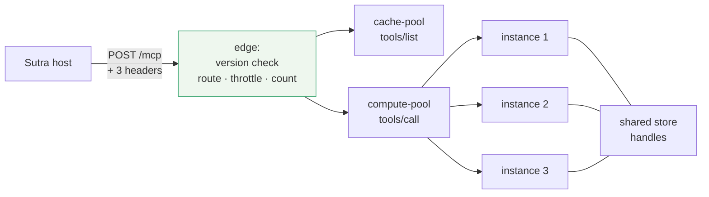

# 6.1 — Routing without reading

## One-line answer

Put the two properties together — self-contained requests and labelled envelopes — and you can run an
edge layer that routes, throttles and measures every MCP call **without parsing a single body**, which
is the deployment `sutra-mcp` gets on Day 43.

## The story

The toll plaza has eight lanes and a queue at every one of them except two.

In the cash lanes a person leans out, hands over notes, waits for change and a receipt, and the
barrier lifts. It takes as long as it takes, and the queue behind reflects that.

In the sticker lanes nobody stops. A reader on the gantry sees the tag on the windscreen, the barrier
is already up by the time the car reaches it, and the car does not slow below walking pace. Nobody in
that lane spoke to anybody. Nobody opened a wallet.

The sticker does not say who is in the car, where they are going, or what is in the boot. It says
which account to charge and whether that account is in credit — the two facts the barrier needs, and
nothing else. Somebody decided years ago to put exactly those two facts on the outside of the
windscreen, and the whole difference between the two kinds of lane follows from that decision.

## The idea in plain language

An **edge layer** is whatever sits between the internet and your servers: a load balancer, an API
gateway, a reverse proxy, a service mesh ingress. Its job is to make cheap decisions quickly — where
this goes, whether it is allowed, whether there has been too much of it — and to get out of the way.

Before this revision, an MCP edge could do almost none of that. Every request was a POST to the same
path with an opaque JSON body, so the only things the edge could distinguish were the client's IP
address and its credentials. Everything interesting was inside the body, and reading the body means
buffering it, deserialising untrusted input, and doing so on every hop.

Two changes from earlier in this day remove that constraint together, and neither is sufficient alone:

- **Requests are self-contained** ([2.2](../02-the-reframe/2.2-three-instances-one-url.md)), so any
  instance can answer any request. Routing is now a free choice rather than a constraint imposed by
  which instance holds a session.
- **The method and the target are on the envelope**
  ([3.1](../03-headers-and-caches/3.1-the-label-on-the-envelope.md)), so the edge can tell a listing
  from a call, and one tool from another, by reading two headers.

What that buys, concretely:

| Decision | Reads | Was previously |
| --- | --- | --- |
| send `tools/call` to a bigger pool | `Mcp-Method` | impossible without parsing |
| rate limit `search_kb` separately | `Mcp-Name` | impossible without parsing |
| require a scope for one tool | `Mcp-Name` | impossible without parsing |
| count calls per tool for billing | `Mcp-Name` | application metrics only |
| refuse an era you will not support | `MCP-Protocol-Version` | impossible |

And one rule that governs all five, which is the part people skip. The headers are trustworthy only
because a 2026-07-28 server promises to reject a request whose headers disagree with its body
([3.2](../03-headers-and-caches/3.2-the-header-that-must-match.md)). A request claiming an older
revision carries no such promise, so the specification tells intermediaries to check the version
before trusting anything else:

> *"Intermediaries that enforce policy based on mirrored headers (e.g., routing or rate-limiting by
> tenant) **SHOULD** verify that the `MCP-Protocol-Version` header indicates a version that requires
> header–body validation. If the version is older or the header is absent, the intermediary
> **SHOULD** reject the request rather than trusting unvalidated header values."*

That is the toll gantry checking that the sticker is a current-issue sticker before charging the
account behind it.

## Why Sutra needs it

Because Day 43 deploys `sutra-mcp` in exactly this shape, and the decisions are cheaper to make now
than then.

Sutra's two tools have genuinely different profiles. `lookup_ticket` is a primary-key read and will
stay one when Day 39 moves the store into a database. `search_kb` is a scan today and will be an index
query later, and it is the one that will fall over first under load. Those two want different limits,
and after this revision that is a gateway rule rather than an application feature — which matters,
because an application-level rate limit runs *after* the request has already occupied a worker.

It also matters for the free tier. Sutra runs on twenty generations a day
([Day 24](../../../day-24-token-accounting-and-budgets/LESSON.md)), and every one of them may drive
several tool calls. The per-tool call counts an edge gives you for free are the numbers that make
Day 45's audit quantitative rather than descriptive.

And there is a Sutra-specific privacy consequence worth stating plainly. `lookup_ticket`'s argument is
a customer's ticket identifier. An edge that routed by parsing bodies would be reading customer data
in order to make a routing decision, and every place that happens is a place it can be logged. Sutra
already built a redaction rule after exactly that failure on
[Day 22](../../../day-22-structured-logging/parts/03-failure-lab/3.1-the-log-that-leaked.md). Header
routing means the arguments never leave the body.

## The mechanism

A gateway with no parser in it at all:

```python
# days/day-32-mcp-stateless-core/lab/gateway.py  (extract)
HEADER_VALIDATING_VERSIONS = {"2026-07-28"}

POOLS = {"tools/call": "compute-pool", "tools/list": "cache-pool"}
LIMITS = {"search_kb": 10, "lookup_ticket": 1000}
DEFAULT_LIMIT = 100

seen: dict[str, int] = {}


def route(headers: dict[str, str], body: bytes) -> tuple[str, str]:
    """Decide where this request goes, without opening `body`. Returns (decision, reason)."""
    version = headers.get("MCP-Protocol-Version", "")
    if version not in HEADER_VALIDATING_VERSIONS:
        return "reject", f"version {version or 'absent'} does not promise header-body validation"

    method = headers.get("Mcp-Method")
    if method is None:
        return "reject", "no Mcp-Method to route on"

    name = headers.get("Mcp-Name", "")
    seen[name] = seen.get(name, 0) + 1
    limit = LIMITS.get(name, DEFAULT_LIMIT)
    if seen[name] > limit:
        return "throttle", f"{name} over its limit of {limit}"

    return POOLS.get(method, "general-pool"), f"{method} {name}".strip()
```

**Line by line:**

- `route` takes `body: bytes` and **never touches it**. That parameter exists to make the point
  visible: the bytes are present, they are opaque, and the entire function runs without them. Delete
  the parameter and the function still works, which is the property.
- The version check is **first**, before routing and before counting. Order matters here: a request
  from an era that does not validate headers must not be counted against a tool's limit either, or a
  client can exhaust another tool's budget with headers nobody checks.
- `version or 'absent'` distinguishes *"claimed an old revision"* from *"sent nothing"* in the reason
  string. Both are rejected, and they mean different things to whoever reads the log — one is a legacy
  client, the other is usually a proxy that stripped the header.
- `HEADER_VALIDATING_VERSIONS` is a set rather than a comparison against a date string. Protocol
  revisions look like dates and are not ordered scalars — a future identifier need not be date-shaped
  — so membership is the correct test and `>=` is a bug waiting for the next revision.
- `LIMITS` keys on the **tool name**, not the method, because `tools/call` is not one kind of work.
  `search_kb` gets ten and `lookup_ticket` gets a thousand, which is the whole argument for
  `Mcp-Name` existing.
- `DEFAULT_LIMIT` covers a tool the gateway has never heard of. A gateway that only limits names it
  knows has no limit at all on the day a new tool ships.
- `seen` is a plain dict standing in for a shared counter. In production this is a token bucket in
  Redis or the proxy's own limiter — and note that it is **state at the edge**, which is allowed
  precisely because it is approximate and rebuildable, unlike the session that section 2 deleted.
- `POOLS.get(method, "general-pool")` sends listings to a small pool that mostly serves cached answers
  ([3.3](../03-headers-and-caches/3.3-lists-you-may-keep.md)) and calls to a bigger one.
- **Zero model calls, no network.** Dictionaries and string comparisons.

Run it:

```bash
uv run python days/day-32-mcp-stateless-core/lab/gateway.py
```

**Line by line:**

- From the repository root. **Zero generations.**

Measured on 2026-09-04:

```text
  cache-pool     tools/list
  compute-pool   tools/call lookup_ticket
  compute-pool   tools/call search_kb
  reject         version 2025-11-25 does not promise header-body validation
  reject         version absent does not promise header-body validation
  throttle       search_kb over its limit of 10

  bodies parsed by the gateway: 0
```

Six decisions and a zero. The two rejections are the specification's intermediary rule doing its job:
a perfectly valid `2025-11-25` request is turned away not because it is malformed but because *this
gateway's policies are only meaningful when somebody downstream validates the headers.* A gateway that
accepted it would be applying `lookup_ticket`'s generous limit to a request that might be calling
anything.

The deployment picture this enables is the one Day 43 builds:



Every arrow out of the edge is a free choice, because every request is answerable anywhere. The shared
store at the bottom is where the state went
([3.4](../03-headers-and-caches/3.4-state-that-travels-in-the-payload.md)) — the diagram is honest that
statelessness moved the state rather than abolishing it.

## When it breaks

The break is a policy applied at the edge that the server disagrees with, and the symptom is a number
nobody can reconcile.

The gateway counts `search_kb` calls. The application counts `search_kb` calls. They differ, because
the gateway counted requests it then throttled, or because a retry counted twice at the edge and once
in the application, or because some requests reached the server by another route entirely. The person
looking at the dashboard cannot tell which:

```text
edge:        search_kb  1,204 requests   (14 throttled)
application: search_kb  1,190 invocations
```

Fourteen is the throttled count and the numbers happen to line up here, which is the good case. When
they do not line up, the honest answer is usually that there is a second path to the server — a health
check, an internal client, a developer's laptop through a tunnel — and the edge is not the only door.
A boundary with two doors is the failure [1.5](../01-the-socket/1.5-one-gate-to-guard.md) warned about,
arriving as a metrics discrepancy rather than as a security finding.

The second break is the edge that becomes an application. A rule about `Mcp-Name` grows a rule about
which client may call which tool, then a rule about arguments — and the moment somebody needs an
argument, the gateway starts parsing bodies. Now it is a second implementation of your authorisation
logic, in a configuration language, maintained by a different team. The line to hold is that the edge
decides on the **envelope** and the server decides on the **contents**, and a rule that needs the
contents belongs in the server.

## In production

**What a professional writes instead:** none of this in Python. The version check, the routing and the
limits are configuration in whatever proxy the platform already runs, and the Python above exists to
show what the configuration will say. What *is* written in code is the server-side validation from
[3.2](../03-headers-and-caches/3.2-the-header-that-must-match.md), because that is the half the edge
depends on.

**What changes at scale:** the edge becomes the place outages are diagnosed, because it is the only
component that sees every request and knows what each one was for. Per-tool latency and error rate
from an access log, on day one, with no application instrumentation — and when a tool starts timing
out, the first person to know is whoever watches that dashboard, by name.

**The failure mode that only appears with real traffic:** throttling the wrong thing. A limit keyed on
`Mcp-Name` counts calls, and calls are not cost. One `search_kb` over a small knowledge base and one
over a large tenant's index are the same header and wildly different work. Rate limits by call count
are a blunt instrument that works until one caller's data grows, and the fix is per-tenant limits —
which is exactly what the `x-mcp-header` mechanism exists for, mirroring a chosen tool parameter such
as a region or a tenant into `Mcp-Param-{Name}` so the edge can see it without seeing the rest.

**The review comment a senior engineer leaves:** *"the gateway rules trust `Mcp-Name` and there is no
`MCP-Protocol-Version` check. Add it and reject anything that is not the current revision. Right now a
client can claim `2025-11-25`, and on that revision nobody downstream is obliged to check the header
against the body — so every rule below this line is advisory."*

**The interview question:** *"what does statelessness buy you operationally?"* An answer that goes past
the slogan: *"two things, and they compound. Any instance can answer any request, so you can deploy,
scale and roll back without draining conversations. And because the method and tool name are mirrored
into headers, the edge can route, throttle and measure per tool without parsing bodies — which is
cheaper, and it also means the proxy never sees the arguments, so customer identifiers stay inside the
body. The catch is that headers are only trustworthy while a current-revision server is validating
them against the body, so the gateway has to check the protocol version first and reject anything
older."*

## Check yourself

```bash
uv run python days/day-32-mcp-stateless-core/lab/gateway.py
```

Now remove the version check from `route` and re-run: the `2025-11-25` request is routed and counted
like any other. Say out loud what a client could do with that, and then decide what `LIMITS` should
actually be for Sutra's two tools.

**Out loud, without scrolling up:** name the two properties that together make header routing possible,
and say why an intermediary must check the protocol version before trusting any other header.

**Next:** [6.2 — Before you depend on a server](6.2-before-you-depend-on-a-server.md).
