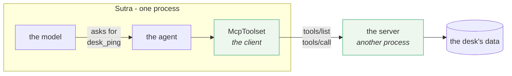

# 1.1 — The tool that lives somewhere else

## One-line answer

`McpToolset` is Sutra's MCP **client** wearing a toolset's clothes: it holds the connection to
exactly one server, and everything on Sutra's side of it — the agent, the model, the callbacks —
goes on treating those tools exactly like the local Python functions from Day 10.

## The story

You click Print.

The document is in front of you on the screen, and the machine that will put it on paper is down the
corridor, past the kitchen, in a room you have been in twice. It is a different make from the one at
home. It has a screen you have never used and a paper tray you would not know how to open. Somebody
in facilities decided which one to buy.

None of that reached you. You clicked Print, in the same place in the same menu as always, and a
minute later there were four warm pages in a tray down the corridor.

Now think about the day it stops working. You click Print and nothing comes out. Everything on your
screen says the job went fine — no red text, no dialog, the job even appears in the queue and then
disappears. You walk down the corridor and find the answer immediately: the paper tray is empty.

Two things were true at the same time, and both of them mattered. On a good day the corridor was
invisible and that was the whole point. On a bad day the corridor was where the problem was, and the
thing on your screen could not tell you, because it never knew.

## The idea in plain language

Since [Day 10](../../../day-10-function-tools/parts/01-the-form-fills-itself/1.1-the-declaration-you-no-longer-write.md),
a **tool** in Sutra has been a Python function in Sutra's own process. The model asks for it by name,
ADK looks it up, calls it, and puts the return value back in front of the model. Everything happens
inside one running program.

An **MCP tool** is the same idea with a process boundary in the middle. The function body lives in a
different program — possibly written in a different language, started by a different runtime,
maintained by somebody you have never met — and the two programs talk over MCP.

The piece that spans that boundary is the **client**. Day 32's
[1.2](../../../day-32-mcp-stateless-core/parts/01-the-socket/1.2-host-client-server.md) named the
three roles: the **host** is the application a person uses, the **server** is the program offering
tools, and the **client** is the connector inside the host that speaks to exactly one server. Today
that client stops being a word on a diagram and becomes an object you construct.

In ADK the object is **`McpToolset`**, and its shape is the interesting part. It is not a new kind of
thing to learn. It is a **toolset**, the same abstraction
[Day 15](../../../day-15-toolsets-and-openapi/parts/01-crate-not-list/1.1-one-line-many-tools.md)
introduced: one object you put in `tools=[...]` that answers "what tools do you have?" with a list
that can be more than one. `OpenAPIToolset` was a crate of tools generated from a specification.
`McpToolset` is a crate of tools that live in another process.

So the whole client side of MCP arrives disguised as something you already know how to use. That is
deliberate and it is the value: **the socket disappears into the toolset.** An agent's code does not
change when a tool moves out of the process. A callback that logs every tool call still logs it. A
plugin that counts tokens still counts them. Only the toolset knows there is a corridor.

Three things follow from that, and all three are easy to forget precisely because the disguise works
so well:

- **A remote failure arrives as a tool failure.** The server being down, the network being slow, the
  child process having died — all of it reaches your agent as a tool that did not return what you
  expected. The paper tray is empty and the screen says the job went fine.
- **A remote call costs a round trip.** A local function call is nanoseconds. A `tools/call` over a
  network is milliseconds at best, and it is a place where a timeout can happen.
- **The tool list is not yours.** You wrote the local tools. You did not write these, and their
  names, descriptions and schemas can change under you between one run and the next.

## Why Sutra needs it

Because every remaining phase of this curriculum runs through this one object.

Day 34 builds `sutra_mcp` and the first thing you will do with it is point an `McpToolset` at it, so
today's client is tomorrow's test harness. Day 39 replaces the ticket dictionary with a database
behind an MCP server, and the agent-side code does not change — which is only true because the tool
was already on the far side of a toolset. Day 40 adds `sutra/mcp/filtering.py` and hangs a policy on
the same constructor. Day 44 adds `sutra/mcp/hardening.py` and wraps retries and timeouts around the
same calls.

More immediately: [Day 32's 1.5](../../../day-32-mcp-stateless-core/parts/01-the-socket/1.5-one-gate-to-guard.md)
argued that Sutra's data boundary is MCP, and that a boundary you can point at is one you can guard.
`McpToolset` is the thing you point at. Today it becomes a real object at a real address —
`sutra/mcp/client.py` — so that every later day has somewhere to put a rule.

## The paper behind it

> **Implementing remote procedure calls** · `doi:10.1145/2080.357392` · 1984 ·
> `https://doi.org/10.1145/2080.357392`

It argued that a call to a procedure on another machine can be made to look, at the call site, like a
call to a local one — and then spent most of its length on the ways in which that resemblance is a
useful lie.

That is exactly the bargain `McpToolset` makes, and the reason this part spends as much time on the
corridor as on the Print button. The paper is taught in full on Day 15, at
[`../../../day-15-toolsets-and-openapi/papers/01-implementing-remote-procedure-calls.md`](../../../day-15-toolsets-and-openapi/papers/01-implementing-remote-procedure-calls.md).

## The mechanism

Where the object sits, and what it hides:



Everything left of the dividing line is code you already know. The green box on the left is the only
new object, and this is all it takes to build one:

```python
from google.adk.tools.mcp_tool import McpToolset, StdioConnectionParams
from mcp import StdioServerParameters

toolset = McpToolset(
    connection_params=StdioConnectionParams(
        server_params=StdioServerParameters(
            command=sys.executable,
            args=[str(SERVER)],
        ),
        timeout=10.0,
    ),
)
```

**Line by line:**

- `from google.adk.tools.mcp_tool import McpToolset, StdioConnectionParams` — both names come from
  the same package. The ADK also exports the aliases `MCPToolset` and `MCPTool` with a capital
  `MCP`; they are the same classes under two spellings, so pick one and be consistent rather than
  wondering which is newer. Verified in `.venv/Lib/site-packages/google/adk/tools/mcp_tool/__init__.py`
  and against `https://adk.dev/tools-custom/mcp-tools/` on 2026-09-04.
- `from mcp import StdioServerParameters` — this one comes from the **MCP SDK**, not from the ADK.
  The split is not arbitrary: `StdioServerParameters` describes a subprocess and belongs to the
  protocol library, while `StdioConnectionParams` is ADK's wrapper that adds the connection
  `timeout`. Two libraries, one line apart, and mixing them up is the most common import error on
  this day.
- `connection_params=` is keyword-only. `McpToolset.__init__` starts with a bare `*`, so
  `McpToolset(params)` is a `TypeError` and not a silent misfire.
- `command=sys.executable` runs *this* interpreter rather than the string `"python"`, which may point
  at a different install or at nothing at all. Part
  [5.2](../05-failure-lab/5.2-the-spanner-not-in-the-boot.md) is what happens when it points at
  nothing.
- `timeout=10.0` is how long ADK waits to establish the connection, and it is a `float` of seconds.
  Its default is `5.0`. Ten is generous for a local script and mean for a server that has to download
  itself first.
- There is no `await` anywhere in this block, and no `async with`. That is the subject of
  [1.2](1.2-constructing-is-not-connecting.md), and it is the single most surprising thing about this
  object.

Now ask it what it has. This is the whole client side of MCP-02 in one call, and it spends no model
quota at all:

```python
tools = await toolset.get_tools()
print("tools the model would see:", [tool.name for tool in tools])
```

**Line by line:**

- `get_tools()` is the `BaseToolset` method from Day 15 — the same one `OpenAPIToolset` answers. ADK
  calls it when it assembles the tool list for a turn; here you call it yourself, which is how you
  inspect a server without involving a model.
- It is `async`, so it needs an `await` and therefore a running event loop. `asyncio.run(main())`
  around your own `async def main()` is the smallest thing that provides one.
- Behind that one call: launch or contact the server, send `tools/list`, receive the list, build one
  `McpTool` per entry, apply the filter, sort by name. Part
  [1.3](1.3-before-the-model-sees-a-tool.md) walks that sequence.
- `tool.name` is the **MCP tool's** name, taken from the server's advertisement. You did not choose
  it and you cannot rename it here — `tool_name_prefix` can only put something in front of it.

Run it against the day's local fake server:

```bash
uv run python days/day-33-client-and-transports/lab/list_tools.py
```

**Line by line:**

- `uv run` puts the project's `.venv` on the path, so the `google-adk==2.7.1` and `mcp==1.29.1` this
  day was written against are the ones that run.
- `lab/list_tools.py` builds the toolset above and prints the names. `lab/fake_desk_server.py` is the
  far end: about eighty lines of hand-written JSON-RPC with no MCP SDK in it at all. It is a **fake**
  and it is labelled one — Day 34 writes Sutra's real server.

It prints:

```text
[fake-desk] initialize
[fake-desk] initialized
[fake-desk] tools/list
[fake-desk] stdin closed, exiting
constructed: McpToolset  filtered=False  ttl=None
tools the model would see: ['desk_ping', 'desk_ticket_count', 'desk_wipe_tickets']
```

The four `[fake-desk]` lines are the server talking on **stderr**, which is why they can be
interleaved with your own output without breaking anything —
[2.3](../02-stdio/2.3-the-only-place-left-to-talk.md) is why that channel exists. The last line is
three tools that exist in a different process, listed by name, with no model involved and no quota
spent.

## When it breaks

The break that costs the most time on this day is not a runtime error. It is this one, at import:

```text
ImportError: cannot import name 'McpToolset' from 'google.adk.tools.mcp_tool'
```

Read the ADK's own `mcp_tool/__init__.py` and you can see why it says that rather than something
useful:

```python
__all__ = []

try:
    from ._agent_to_mcp import to_mcp_server
    from .mcp_session_manager import StdioConnectionParams
    from .mcp_toolset import McpToolset

    __all__.extend(["to_mcp_server", "StdioConnectionParams", "McpToolset"])
except ImportError as e:
    import logging

    logger = logging.getLogger("google_adk." + __name__)
    logger.debug("MCP Tool is not installed")
    logger.debug(e)
```

**Line by line:**

- The whole export block sits inside a `try`. If any import in it fails, the package still imports
  successfully and `__all__` stays empty. That is a deliberate choice: `google-adk` can be installed
  without the `mcp` extra, and the framework should not refuse to start over an optional integration.
- The `except` logs at **`debug`** level. Python's default logging level is `WARNING`, so on a normal
  run those two lines go nowhere at all. The message *"MCP Tool is not installed"* exists, and you
  will not see it.
- What you see instead is the `ImportError` above, from your own import line, naming a symbol that
  the package genuinely does not export right now.
- The fix is `uv sync` — `mcp==1.29.1` is already in `pyproject.toml` for this repository. To see the
  hidden reason, turn the level down first:
  `logging.basicConfig(level=logging.DEBUG)` before the import, and the real cause appears.
- This is the shape of the trap, not just an instance of it: **an optional dependency guarded by a
  bare `try/except ImportError` turns a clear failure into a confusing one.** Sutra does the opposite
  under Principle 10 — errors surface, they are not swallowed
  ([Day 21](../../../day-21-errors-surface-not-swallow/parts/04-failure-lab/4.1-the-swallowed-exception.md)).

## In production

**What a professional writes instead:** not a bare toolset at module scope, but a small factory in
one module — this day's `sutra/mcp/client.py` — that takes the server's identity as configuration and
returns the toolset. One place decides the timeout, the filter and the transport, so the next four
days have one file to change instead of every agent. The adk.dev page adds a hard constraint on top:
when you deploy, *"the agent and its McpToolset must be defined **synchronously** in your `agent.py`
file"* (read 2026-09-04), so the factory must be a plain `def` and not a coroutine.

**What degrades at scale:** the disguise. When every tool looks local, nothing in the code review
distinguishes a call that takes a microsecond from one that takes a second and can time out. Teams
notice this first as latency they cannot explain, and the fix is boring: name the toolset after the
server it talks to, so a stack trace says which corridor the request went down.

**The failure mode that only appears with real traffic:** the tool list drifts. A server you do not
own renames a tool, and the model — which was told about that name in its context — starts asking for
something that no longer exists. Nothing crashed; the agent just quietly stopped being able to do one
thing. Part [1.3](1.3-before-the-model-sees-a-tool.md) is where the listing happens, and Day 45's
audit is where the drift gets caught.

**The review comment a senior engineer leaves:** *"this reads as though `desk_ticket_count` is a
function in this repository. It is a network call into a process we do not own. Put it behind our own
named wrapper so the next person editing this file can see the boundary, and so there is somewhere to
put a timeout when we need one."*

**The interview question:** *"what actually changes in your agent code when a tool moves out of
process?"* The honest answer is **nothing in the agent, and everything in the failure modes**:
*"Structurally it is one object in `tools=[...]` instead of a function, because the MCP client is
packaged as an ADK toolset — the model still just asks for a name. What changes is the set of ways it
can go wrong. A local tool cannot time out, cannot have its process die, cannot rename itself between
two runs, and cannot be down. We started treating every MCP tool result as a call that could have
crossed a network, because it did."*

## Check yourself

```bash
uv run python days/day-33-client-and-transports/lab/list_tools.py
```

Then open `days/day-33-client-and-transports/lab/fake_desk_server.py` and find the list the three
names came from. Nothing in `list_tools.py` mentions any of them.

**Out loud, without scrolling up:** which of the three MCP roles is `McpToolset`, and name two things
that can go wrong with an MCP tool that cannot go wrong with a local Python function.

**Next:** [1.2 — Constructing is not connecting](1.2-constructing-is-not-connecting.md).
