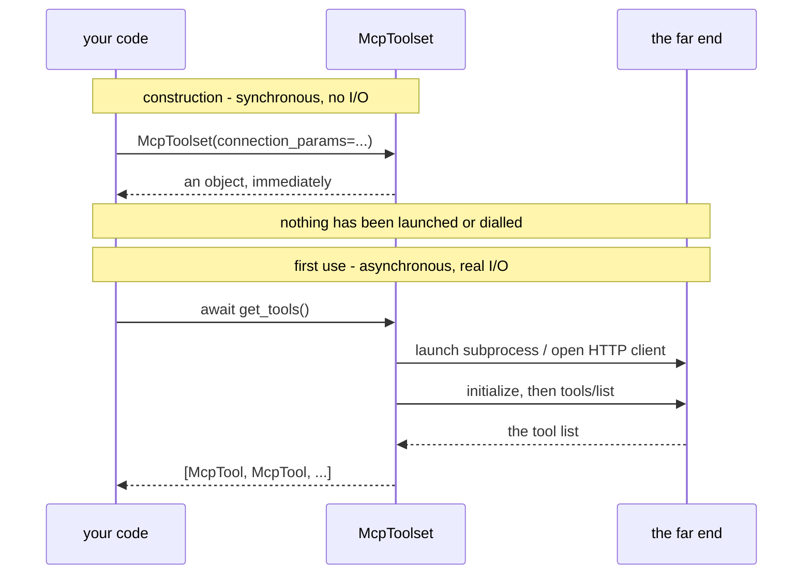

# 1.2 — Constructing is not connecting

## One-line answer

`McpToolset(...)` builds a description of how to reach a server and connects to nothing; the first
network traffic — or the first child process — happens inside the first `await get_tools()`, which is
why a wrong address is silent until much later.

## The story

Somebody gives you the address of a shop that sells the exact part you need. You write it on the back
of a receipt and put it in your pocket.

The receipt is now a real thing with real writing on it. You could hand it to someone. You could copy
it into your phone. You have, in an ordinary sense, *got the shop*.

You have not got the part. You find out what the address is worth on Saturday morning, standing on a
pavement, holding the receipt. Perhaps the shop is there and open, and the whole thing works. Perhaps
the shop is there and shut. Perhaps the number is right and the street is wrong. Perhaps that street
has never had a number 14.

Every one of those is discovered at the same moment: the moment you go. Writing the address down
tested nothing, and nothing about the receipt looked any different in the four cases.

## The idea in plain language

`StdioConnectionParams`, `StreamableHTTPConnectionParams` and `StdioServerParameters` are **data**.
They are Pydantic models — the same kind of typed record Sutra has used since
[Day 12](../../../day-12-structured-output/LESSON.md) — holding a command, an argument list, a URL, a
timeout. Constructing one validates its *types* and nothing else. It does not check that the command
exists, that the URL resolves, that anything is listening, or that the thing listening speaks MCP.

`McpToolset(connection_params=...)` is barely more than that. It stores the parameters, creates an
internal session manager, sets up an empty cache, and returns. Reading the constructor in
`.venv/Lib/site-packages/google/adk/tools/mcp_tool/mcp_toolset.py` (google-adk 2.7.1, read
2026-09-04), the only things it can raise are two `ValueError`s: one if `connection_params` is
falsy, one if `tool_list_cache_ttl_seconds` is present and not positive. Neither of them involves the
server.

This is called **lazy connection**, and it is the normal design for anything that owns an expensive
resource. The alternative — connecting in the constructor — sounds friendlier and is worse in three
ways:

- **Constructors cannot be `async`.** Python's `__init__` returns a value, not a coroutine, so a
  constructor that wanted to open a connection would have to block the event loop or start a thread.
- **You would connect to servers you never use.** An agent with four toolsets attached would launch
  four subprocesses at import time, even on a turn that used none of them.
- **Deployment would break.** The adk.dev page requires the toolset to be defined **synchronously**
  in `agent.py` (read 2026-09-04). A connecting constructor and that requirement cannot both be
  satisfied.

So the price of a design that is right on all three counts is the one thing that surprises everybody:
**a completely wrong configuration constructs perfectly.** The error you eventually get comes from a
different line, in a different file, at a different time, and it does not mention your typo.

## Why Sutra needs it

Because `sutra/mcp/client.py` is about to have a function called `connect_stdio` in it, and the name
is a small lie you should tell deliberately rather than by accident.

The function will build and return a toolset. Nothing will be connected when it returns. If the
server binary is missing, `connect_stdio` will still succeed and the failure will surface at the
first turn, inside ADK, possibly in front of a user. Knowing that decides where the preflight check
goes: not inside the constructor, but as its own explicit call —
`shutil.which(command)` for stdio, a `server/discover` probe for HTTP — that you run when *you*
choose, at startup or in a health check, and not when the model happens to want a tool.

It also decides how the tests in Day 38's `tests/test_mcp_failures.py` are written. A test that only
constructs a toolset has tested nothing at all.

## The mechanism

Two timelines for the same object:



The lab script prints exactly this boundary. From `lab/missing_command.py`:

```python
print(f"command       : {command}")
print(f"shutil.which  : {shutil.which(command)}")

toolset = McpToolset(
    connection_params=StdioConnectionParams(
        server_params=StdioServerParameters(command=command, args=args),
        timeout=10.0,
    ),
)
print("constructed   : ok, nothing has been launched yet")
tools = await toolset.get_tools()
```

**Line by line:**

- `shutil.which(command)` is the preflight. It asks the operating system to resolve the name against
  `PATH` exactly as a shell would, and returns `None` when it cannot. `os.path.exists` is the wrong
  tool here: a server command is usually a bare name like `npx` rather than a path, and
  `os.path.exists("npx")` is `False` on a machine where `npx` works perfectly.
- The `print` before `get_tools()` is not decoration — it is the assertion. It runs, every time, even
  when `command` is a name that has never existed on any machine.
- `await toolset.get_tools()` is the line that goes to the shop. Every kind of wrongness in the
  parameters above surfaces here, from a missing binary to a server that starts and then exits.
- Note that the toolset is built the same way in both arms of the script. The only difference is the
  contents of a string, which is precisely why the constructor cannot help you.

Run both arms:

```bash
uv run python days/day-33-client-and-transports/lab/missing_command.py --real
uv run python days/day-33-client-and-transports/lab/missing_command.py
```

**Line by line:**

- `--real` uses `sys.executable` and the day's fake server, so the address is good.
- With no flag it uses `"sutra-desk-mcp"`, a command this repository has never shipped. It is not a
  typo of anything; it is the kind of name a stale `README` gives you.
- Run them in this order on purpose. Seeing the good arm first means you know the script itself
  works, so the second run's failure is unambiguously about the command.

The good arm prints:

```text
command       : C:\Users\...\sutra\.venv\Scripts\python.exe
shutil.which  : C:\Users\...\sutra\.venv\Scripts\python.exe
constructed   : ok, nothing has been launched yet
tools         : ['desk_ping', 'desk_ticket_count', 'desk_wipe_tickets']
```

The bad arm prints the first three lines almost identically — including `constructed   : ok` — and
then fails. That is the entire lesson in four lines of output.

## When it breaks

Here is the bad arm, trimmed to the parts that matter:

```text
command       : sutra-desk-mcp
shutil.which  : None
constructed   : ok, nothing has been launched yet
Traceback (most recent call last):
  File "...\mcp\os\win32\utilities.py", line 169, in create_windows_process
    process = await anyio.open_process(
...
ConnectionError: Failed to create MCP session: Failed to create MCP session: [WinError 2] The system cannot find the file specified
```

Four things to notice, because between them they are why this costs an evening.

**`constructed   : ok` is printed by a program that is about to fail.** No warning, no exception, no
return value to check. Construction is not a test.

**The exception type is `ConnectionError`.** It is not a `FileNotFoundError`, even though a file was
not found. ADK wraps whatever the transport raised, so the exception class tells you *which layer
gave up*, not *what was wrong*. Catching `FileNotFoundError` around `get_tools()` catches nothing.

**The message says the file cannot be found and never says which file.** `[WinError 2]` is the raw
operating system code for a missing executable — on Linux the same situation reads
`FileNotFoundError: [Errno 2] No such file or directory: 'sutra-desk-mcp'`, which at least names it.
On Windows you get the number and no name, and the name is the only thing you wanted.

**The message is doubled.** *"Failed to create MCP session: Failed to create MCP session:"* is not a
copy-and-paste slip in this document; it is what the library prints, because one wrapper wrapped
another wrapper's message. It is a small thing and it tells you something real: you are reading an
error that has been through several hands, so the wording is furthest from the cause exactly where it
is loudest.

The smallest fix is the `shutil.which` line you already have. It turns an eight-frame traceback at
turn time into one printed `None` at startup.

## In production

**What a professional writes instead:** a `preflight()` on the client module that runs every check
the constructor cannot — `shutil.which` for a stdio command, a cheap HEAD or `server/discover` for a
URL — and is called from application startup and from the health endpoint. The point is not that the
checks are clever. The point is that they run at a **time you chose**, so a misconfiguration is a
startup failure rather than a user-visible one.

**What degrades at scale:** lazy connection means the first request after a deployment pays for
every connection. With one server that is invisible. With ten, the first user of a fresh instance
waits for ten subprocess launches or ten TLS handshakes, and your latency graph grows a spike at
every deploy. The usual answer is a warm-up call at startup that lists tools once and throws the
result away — which is also, conveniently, a preflight.

**The failure mode that only appears with real traffic:** the address is right at deploy time and
wrong later. A container image updates and drops the binary; a DNS name is repointed; a URL starts
returning a login page. Nothing re-runs your startup check, so the system stays "healthy" and
individual turns fail. This is why the health check has to actually connect rather than assert that
a configuration string is non-empty.

**The review comment a senior engineer leaves:** *"`connect_stdio` returns without connecting, so
this `try/except` around it catches nothing and the log line saying 'connected to the desk server' is
false. Either rename it `build_stdio_toolset`, or make it do one `get_tools()` and mean what it
says."*

**The interview question:** *"your MCP config points at a server that does not exist. When do you
find out?"* The answer that shows you have done it: *"Not at construction — the connection
parameters are a Pydantic model, so a nonexistent command validates fine. You find out at the first
`get_tools()`, which in a real agent is mid-turn, and the exception is a `ConnectionError` wrapping
an OS error that on Windows does not even name the missing command. So we put an explicit preflight
in the client module and call it from startup and from the health check. It is one `shutil.which`
call, and it moved the failure from a user's request to a deployment log."*

## Check yourself

```bash
uv run python days/day-33-client-and-transports/lab/missing_command.py 2>&1 | head -4
```

Change `GHOST` to `"npx"` — which does exist on this machine — and run it again. `shutil.which` now
prints a path, the process really starts, and the failure moves to the far end:

```text
ConnectionError: Failed to create MCP session: Failed to create MCP session: timed out after 10.0s waiting for the session to become ready
```

`npx --stdio` is a real program that is not an MCP server, so it never answers `initialize` and the
connection dies of the `timeout` instead of of a missing file. Two wrong addresses, two completely
different tracebacks, and only one of them names a file.

**Out loud, without scrolling up:** name the three things `McpToolset.__init__` actually validates,
and say where the first byte of network traffic happens.

**Next:** [1.3 — Before the model sees a tool](1.3-before-the-model-sees-a-tool.md).
