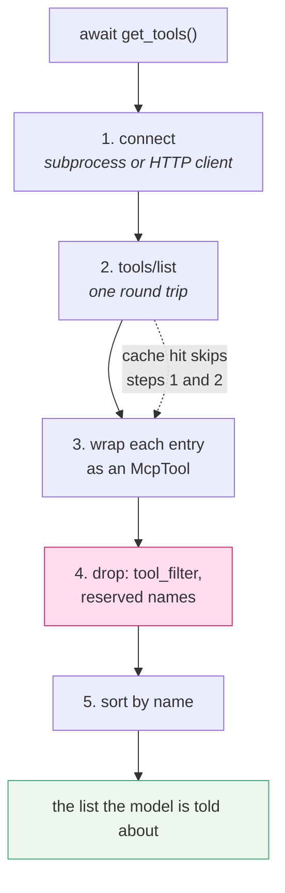

# 1.3 — Before the model sees a tool

## One-line answer

`get_tools()` is five steps, not one — connect, list, convert, filter, sort — and every one of them
changes what the model is told exists, which is why a tool can be on the server and invisible to the
agent with nothing broken anywhere.

## The story

The van comes on Tuesday morning and the crate goes on the floor behind the counter.

Nobody puts a crate on a shelf. What happens next is four separate jobs, done in order, by somebody
who has done them a hundred times. The crate is opened and checked against the order, because
suppliers send substitutions. Anything that arrived but is not sold here — the wrong size, the brand
that never moves, a case of something ordered by mistake — goes back in the crate and stays behind
the counter. What is left goes onto the shelf. And it goes onto the shelf in the **same arrangement
as last week**, because half the people who come in do not read the labels, they reach for the place.

Only after those four jobs does a customer see anything. What is on the shelf is not what the
supplier sent. It is what the supplier sent, minus what does not belong here, arranged the way the
shop always arranges it.

If you asked the customer what the shop stocks, they would tell you about the shelf. They have never
seen the crate.

## The idea in plain language

When ADK builds the prompt for a turn, it asks each toolset in `tools=[...]` for its tools. For an
`McpToolset` that call does five things, in this order, and this is the whole of the client side of
MCP-02:

1. **Connect.** Launch the subprocess, or open the HTTP client, and complete whatever lifecycle the
   far end requires. This is the step [1.2](1.2-constructing-is-not-connecting.md) said happens here
   and not in the constructor.
2. **List.** Send `tools/list` and receive an array of tool definitions: name, description,
   `inputSchema`.
3. **Convert.** Wrap each definition in an `McpTool`, which is an ADK `BaseTool` — so from this point
   on it is the same type as the `FunctionTool` from
   [Day 10](../../../day-10-function-tools/parts/01-the-form-fills-itself/1.4-the-wrapper-that-arrives-late.md).
4. **Filter.** Drop anything `tool_filter` excludes, and anything whose name collides with a reserved
   ADK framework name. [1.4](1.4-the-allowlist-is-an-argument.md) is about the first of those.
5. **Sort.** Order the surviving tools by name, always, regardless of what order the server sent
   them in.

Steps 4 and 5 are where the crate stops being the shelf. **The model is told about the output of step
5 and never learns that steps 2 and 4 happened.** There is no message anywhere saying "the server
also offers three tools you are not being told about". A tool can be perfectly present, perfectly
documented, perfectly working, and completely invisible.

Step 5 deserves a sentence of its own, because it looks like tidiness and is not. ADK's own comment on
it, read in `mcp_toolset.py` on 2026-09-04, says why:

> *"Sort by name for a stable order across turns. The MCP server's `list_tools()` order is not
> contractual; an unstable order would invalidate the context cache every turn."*

That is [Day 32's 3.3](../../../day-32-mcp-stateless-core/parts/03-headers-and-caches/3.3-lists-you-may-keep.md)
arriving as a line of framework code. A tool list is text in the prompt. If the text is byte-identical
between turns, the model provider's prompt cache can reuse the work of processing it; if the same
tools arrive in a different order, it is a different prefix and the cache misses. A shuffled list
costs money and latency and produces identical answers, which is the hardest kind of waste to notice.

## Why Sutra needs it

Because `list_tools` is one of the three public symbols this day puts in `sutra/mcp/client.py`, and
what it returns is a security-relevant fact about the system.

"What can this agent reach?" — the question
[Day 32's 1.5](../../../day-32-mcp-stateless-core/parts/01-the-socket/1.5-one-gate-to-guard.md) said
a data boundary exists to answer — is answered by the output of step 5, not by the contents of the
server. Sutra needs a way to print both, because Day 40's allowlist and Day 45's audit are both
comparisons between the two lists. An audit that reads only the filtered list is auditing its own
configuration.

It also matters immediately, on Day 34. When you write `sutra_mcp` tomorrow and a tool does not show
up in the agent, this five-step sequence is the fault tree: the server never advertised it, or the
filter dropped it, or the name collided. Those are three different bugs in three different files.

## The mechanism



The dotted arrow is the one optional part, and it is a constructor argument:

```python
toolset = McpToolset(
    connection_params=StdioConnectionParams(
        server_params=StdioServerParameters(command=sys.executable, args=[str(SERVER)]),
        timeout=10.0,
    ),
    tool_filter=None,
    tool_list_cache_ttl_seconds=30.0,
)
```

**Line by line:**

- `tool_filter=None` means step 4 drops nothing except reserved names. It is the default, and
  [1.4](1.4-the-allowlist-is-an-argument.md) argues it is the wrong default for anything you did not
  write.
- `tool_list_cache_ttl_seconds=30.0` makes the toolset reuse the previous `tools/list` response for
  that many seconds instead of asking again on every `get_tools()`. This is Day 32's cacheable list
  as an actual argument. It is a `float` and its unit is **seconds**, not the `ttlMs` milliseconds of
  the protocol field — two layers, two units, and nothing will warn you.
- The cache is keyed the way sessions are pooled, so a per-request `header_provider` gets its own
  entry. There is a hard ceiling of 64 entries in the source, so a provider minting a fresh value
  every request cannot grow it without bound.
- The cache lives **on this toolset instance**. Two `McpToolset` objects pointing at the same server
  do not share it, so caching only pays off if you also share the object.
- The honest caveat is in ADK's own docstring: *"ADK does not subscribe to
  `notifications/tools/list_changed`, so a tool the server adds or removes goes unnoticed until the
  entry expires."* Your TTL is therefore also the length of time your agent may keep offering a tool
  that was deleted.

Run the ablation. The same three `get_tools()` calls, once without the cache and once with it:

```bash
uv run python days/day-33-client-and-transports/lab/list_tools.py --repeat
uv run python days/day-33-client-and-transports/lab/list_tools.py --repeat --ttl
```

**Line by line:**

- `--repeat` calls `get_tools()` three times in a row on one toolset, which is what three turns of a
  conversation do.
- `--ttl` adds `tool_list_cache_ttl_seconds=30.0` and changes nothing else.
- The evidence is on **stderr**, from the fake server: it logs one `[fake-desk] tools/list` line per
  request it actually receives. Counting those lines is counting round trips, without any
  instrumentation on the client at all.

Without the cache, three requests:

```text
[fake-desk] initialize
[fake-desk] initialized
[fake-desk] tools/list
[fake-desk] tools/list
[fake-desk] tools/list
tools the model would see: ['desk_ping', 'desk_ticket_count', 'desk_wipe_tickets']
tools the model would see: ['desk_ping', 'desk_ticket_count', 'desk_wipe_tickets']
tools the model would see: ['desk_ping', 'desk_ticket_count', 'desk_wipe_tickets']
```

With it, one:

```text
[fake-desk] initialize
[fake-desk] initialized
[fake-desk] tools/list
tools the model would see: ['desk_ping', 'desk_ticket_count', 'desk_wipe_tickets']
tools the model would see: ['desk_ping', 'desk_ticket_count', 'desk_wipe_tickets']
tools the model would see: ['desk_ping', 'desk_ticket_count', 'desk_wipe_tickets']
```

Three to one, with identical output on the left-hand side. Notice what is *not* skipped: steps 3, 4
and 5 still run on every call. ADK's comment is explicit that the filter re-runs on a cache hit —
*"This runs on every call even on a cache hit, so only the round trip is skipped"* — which matters,
because a `tool_filter` that is a function of the current context must keep being asked.

## When it breaks

The break that produces no error at all is a name collision. ADK reserves exactly four names for its
own framework tools — `adk_request_confirmation`, `adk_request_credential`, `adk_request_input` and
`transfer_to_agent` — and an MCP tool that claims one is dropped in step 4. Rename `desk_ping` to
`transfer_to_agent` in the fake server, run the listing again, and this is what you get:

```text
Skipping MCP tool 'transfer_to_agent' because it collides with a reserved ADK framework tool name.
tools the model would see: ['desk_ticket_count', 'desk_wipe_tickets']
```

That message is logged at `WARNING`, so with default logging you will see it. What you will not see
is anything at all in the agent's behaviour: the tool is simply not there, the model was never told
about it, and it will never be called. The comment beside the code says why it is a skip rather than
an error — *"one reserved name would otherwise fail the whole listing and take the server's honest
tools down with it"* — which is the right trade and still means one tool vanished quietly.

The second break has no message whatsoever. A server that advertises tools in a different order on
every listing — because it iterates a Python `set`, or reads a directory, or joins a table without an
`ORDER BY` — is completely invisible from the client side, because step 5 sorts them anyway. Your
agent works. Your bill goes up, because the *server's* own downstream caches, and any intermediary
caching that listing, keep missing. You find this by hashing the raw listing over several calls, not
by reading agent output.

The third one produces the most confusing bug report on this day. A tool is deleted from the server,
the deployment is green, and one agent instance keeps offering it for as long as its TTL says. The
model calls it, and the server answers with a JSON-RPC error for an unknown tool. From the agent's
side that reads as "the tool is broken", not "the tool is gone", and restarting the process fixes it
— which sends everybody looking in the wrong place.

## In production

**What a professional writes instead:** a `list_tools` helper that returns the **unfiltered** list
alongside the filtered one, and logs the difference once at startup as a structured line
([Day 22](../../../day-22-structured-logging/parts/02-wiring-the-run/2.1-one-line-per-happening.md)):
server name, tools advertised, tools exposed, tools dropped. That single line is the entire input to
Day 45's audit, and it is what turns "why can't the agent do X" into a lookup instead of an
investigation.

**What degrades at scale:** with no TTL, `tools/list` runs on every turn of every conversation. At one
server that is one extra round trip per turn; at six servers on a busy desk it is six, all of them on
the critical path before the model has been asked anything. This is the arithmetic Day 32's 3.3 did
with a spec field, met again as a constructor argument: the cost is real, the fix is one number, and
the number has a staleness window attached to it.

**The failure mode that only appears with real traffic:** two instances of the agent, two TTLs
started at different moments, and therefore two different tool lists live at once. A user retries a
failing request, lands on the other instance, and it works. Nothing is wrong with either instance.
Anything that assumes "the tools" is a single global fact is now subtly false, which is why removing
a tool is two deployments — announce first, delete after the longest TTL has passed.

**The review comment a senior engineer leaves:** *"you set the cache TTL to an hour to cut round
trips. That is also how long we will keep advertising a tool after we delete it, and how long a
mis-deployed server keeps being believed. Pick the number from the deployment cadence, not from the
latency graph, and write the reason next to it."*

**The interview question:** *"how does your agent find out what an MCP server can do, and how often?"*
An answer with the mechanism in it: *"One `tools/list` per listing, converted into framework tools,
filtered, then sorted by name — the sort is not tidiness, it keeps the prompt prefix byte-identical
so the provider's prompt cache still hits. By default that listing happens every turn. We set a TTL
so it happens once per window instead, and the thing to be honest about is that the TTL is also the
window in which we can be advertising a tool the server has already removed. So deleting a tool
became a two-step deployment."*

## Check yourself

```bash
uv run python days/day-33-client-and-transports/lab/list_tools.py --repeat 2>&1 | grep -c "tools/list"
uv run python days/day-33-client-and-transports/lab/list_tools.py --repeat --ttl 2>&1 | grep -c "tools/list"
```

Then reverse the `TOOLS` list in `lab/fake_desk_server.py` and run either command again. The server
now advertises them backwards; the printed list is unchanged. That is step 5, and you have just
watched it hide a real difference on purpose.

**Out loud, without scrolling up:** name the five steps in order, and say which two of them can make
a tool that exists on the server invisible to the model.

**Next:** [1.4 — The allowlist is a constructor argument](1.4-the-allowlist-is-an-argument.md).
