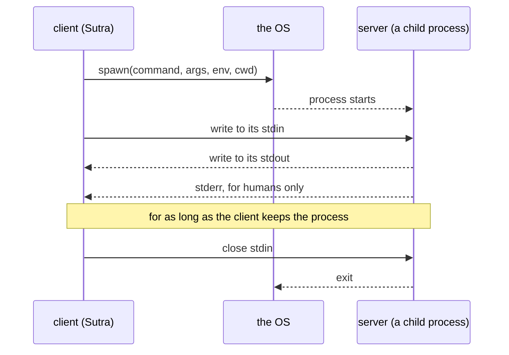

# 2.1 — Connecting is launching

## One-line answer

On the stdio transport there is nothing to connect *to* until the client starts it: the client
launches the server as a child process and talks to it through that process's own standard input and
output, so the connection and the server's whole lifetime are the same thing.

## The story

The power goes at half past seven and the building has a generator in the basement.

It is not on. It has never been on while the mains were working, and it does not switch itself on
now. Somebody has to go down, check the fuel, open the valve, and press the button. Then the lights
come back, and they stay on for exactly as long as somebody keeps the generator running.

Nobody else in the building can use that generator. It is not on a network and there is no way to
share it. If the flat upstairs wants power, they need their own, and they will have to start it
themselves.

And when the mains come back and you switch the generator off, everything it was powering goes dark
at that instant. There is no "leaving it running for later". The generator existed because you
started it, and it stops existing as a source of power the moment you stop.

## The idea in plain language

A **transport** is a binding: it says how messages are framed and delivered, and nothing about what
they mean. The specification is explicit about this
(`https://modelcontextprotocol.io/specification/2026-07-28/basic/transports`, read 2026-09-04):

> *"Protocol semantics are identical on every transport. A transport is a **binding**: it defines how
> messages are framed and delivered, how request metadata is carried, and how cancellation and
> termination are signaled. It does not define what the messages mean."*

There are two standard bindings. **stdio** is the local one, and its first sentence is the whole
shape of it:

> *"In the **stdio** transport, the client launches the MCP server as a subprocess. The two ends
> communicate over the subprocess's standard streams."*

Three words in that sentence are doing all the work.

**Launches.** Not "connects to a running server". There is no server before the client starts one. The
connection parameters do not contain a host or a port; they contain a **command line**. Connecting
*is* launching, which is why `StdioServerParameters` holds `command`, `args`, `env` and `cwd` — the
four things you would need to type at a shell prompt.

**Subprocess.** The server is a child of your process. It inherits nothing you did not give it, it
dies when you close its input, and it is visible in the process list under your program's tree. One
client, one process; a second client to the same server is a second process, with its own memory and
its own view of the world.

**Standard streams.** Every program gets three: stdin to read from, stdout to write to, stderr for
everything else. The stdio binding uses stdin and stdout as the wire and leaves stderr for humans
([2.3](2.3-the-only-place-left-to-talk.md)). There is no socket, no port and no listener anywhere.

What follows from that shape is a list of things stdio simply does not have. No port to bind, so no
port conflicts. No TLS, so no certificates. No `Origin` header to validate, so none of the browser
attacks that [3.4](../03-streamable-http/3.4-what-a-url-costs.md) is about. No authentication either
— and that is not an omission, it is the design: the client already had the right to run programs on
this machine, so a program it launched has exactly the client's own authority and nothing more.

## Why Sutra needs it

Because stdio is the transport `connect_stdio` in `sutra/mcp/client.py` uses, and it is the one Day
34 will spend all day inside.

When you write `sutra_mcp` tomorrow, the development loop is: edit the server file, run the agent,
and the agent starts a fresh copy of your server every time. No daemon to restart, no port to
remember, no stale process serving yesterday's code. That is the single best property stdio has and
it is why every MCP tutorial starts here.

It also decides something about Sutra's own deployment, which Day 43 will make explicit: stdio cannot
be the transport for a server that runs somewhere else. A subprocess is on the same machine by
definition. The moment `sutra-mcp` needs to serve two agents on two machines, the transport becomes
Streamable HTTP and everything in [section 3](../03-streamable-http/3.1-one-endpoint-one-trip.md)
applies. The protocol does not change; only the truck does
([4.1](../04-choosing-a-wire/4.1-the-same-errand-two-ways.md)).

## The mechanism



The parameters that describe the launch:

```python
from google.adk.tools.mcp_tool import StdioConnectionParams
from mcp import StdioServerParameters

params = StdioConnectionParams(
    server_params=StdioServerParameters(
        command=sys.executable,
        args=[str(SERVER)],
        env=None,
        cwd=None,
    ),
    timeout=10.0,
)
```

**Line by line:**

- `StdioServerParameters` is the MCP SDK's record and it is exactly a command line.
  `command="npx"` with `args=["-y", "@modelcontextprotocol/server-filesystem", "/some/folder"]` is
  the same idea for a Node server; `command="uvx"` with a package name is the same idea for a Python
  one.
- `command=sys.executable` is the absolute path to the interpreter currently running. It is worth
  preferring over the string `"python"`, which on this machine resolves to a different install and on
  a machine with no `python` on `PATH` resolves to nothing at all
  ([5.2](../05-failure-lab/5.2-the-spanner-not-in-the-boot.md)).
- `args` is a **list**, not a string. There is no shell involved, so nothing is split on spaces,
  nothing is glob-expanded, and a path containing a space needs no quoting. That is a security
  property as much as a convenience: there is no shell to inject into.
- `env=None` is the important default and it does not mean "inherit my environment". The SDK builds a
  small allowlist with `get_default_environment()` and passes that instead — on Windows `APPDATA`,
  `HOMEDRIVE`, `HOMEPATH`, `LOCALAPPDATA`, `PATH`, `PATHEXT`, `PROCESSOR_ARCHITECTURE`,
  `SYSTEMDRIVE`, `SYSTEMROOT`, `TEMP`, `USERNAME`, `USERPROFILE`; on other platforms `HOME`,
  `LOGNAME`, `PATH`, `SHELL`, `TERM`, `USER`. Anything else you set in your shell **does not reach
  the child**, and it also skips any variable whose value starts with `()`, because that is how
  exported shell functions look and they are a known escalation path.
- Passing your own `env` **merges over** those defaults rather than replacing them, so
  `env={"API_KEY": ...}` keeps `PATH` and adds one key. That is the right way to give a server a
  credential, and it is what `lab/noisy_stdout.py` does to switch the fake server's behaviour.
- `cwd=None` means the child inherits your working directory. Setting it is worth doing when the
  server resolves relative paths, because "wherever the agent happened to be started from" is not a
  stable answer.
- `timeout=10.0` belongs to ADK's wrapper, not to the SDK record, and it is seconds to establish the
  connection. Its default is `5.0` — fine for a local script, tight for `npx -y`, which may download
  a package before it starts.

## When it breaks

The break specific to this transport is that **you cannot see the server**. It has no port to probe
and no log file, and it prints nothing anywhere you are looking. When the launch goes wrong you get a
failure from the client with no server-side evidence at all:

```text
ConnectionError: Failed to create MCP session: Failed to create MCP session: timed out after 10.0s waiting for the session to become ready
```

That is the message from a command that **exists and started and never spoke MCP** — in the lab, from
pointing `command` at `npx` with nonsense arguments. The process ran. It may still have been running
when the timeout fired. Nothing about the text tells you whether the problem was the command, the
arguments, the working directory, or a server that started and immediately crashed.

The way through it is to stop using MCP to debug MCP. Take the exact `command` and `args` from your
connection parameters and run them in a terminal by hand. A server that is going to work sits there
silently waiting for input on stdin; a server that is broken prints its complaint on stderr where you
can finally read it. This is the single most useful habit on the stdio transport, and it takes one
line:

```bash
uv run python days/day-33-client-and-transports/lab/fake_desk_server.py
```

**Line by line:**

- No arguments, no client. This is the child process, started by you instead of by ADK.
- It prints nothing and does not exit. That is correct: it is blocked reading stdin, which is what a
  healthy stdio server looks like from the outside.
- Type `{"jsonrpc":"2.0","id":1,"method":"tools/list","params":{}}` and press Enter, and it answers
  with its tool list on stdout — you are now the client.
- Press `Ctrl-D` (or `Ctrl-Z` then Enter on Windows) to close its stdin and it prints
  `[fake-desk] stdin closed, exiting`. That is the shutdown sequence of
  [2.4](2.4-closing-up.md), performed by hand.

The second break is `cwd`. A server started from your editor's working directory and from your
terminal's working directory resolves relative paths differently, so "it works when I run it and not
when the agent runs it" is usually this, and it is usually not investigated for an hour first.

## In production

**What a professional writes instead:** the command and arguments are configuration, never literals
in the middle of an agent file, and the configuration is validated at startup — `shutil.which` on the
command, `Path.is_dir` on the `cwd`, and a named error listing what was wrong. `connect_stdio` in
`sutra/mcp/client.py` is the natural home for all of it.

**What degrades at scale:** processes. Every conversation that builds its own toolset launches its
own server, so a service handling forty concurrent conversations is running forty copies of a Node or
Python process, each with its own interpreter startup and its own memory. That is fine for a
developer's machine and it is the reason stdio is not how you serve anything shared. The fix is not a
bigger machine; it is Streamable HTTP and one server process for everybody.

**The failure mode that only appears with real traffic:** the server that starts slowly. `npx -y`
downloads on first use, a Python server imports a large library, a container is cold. Under load,
enough launches happen at once that some of them exceed `timeout` and the user sees a tool that
"sometimes does not exist". Raising the timeout hides it; the real answer is to launch fewer servers,
which again means a different transport.

**The review comment a senior engineer leaves:** *"this launches the server with the default
`timeout=5.0` and `npx -y`, which on a cold cache has to fetch a package first. That is a flaky agent
on every fresh container. Pin the server as a real dependency so the launch is local, or move it
behind HTTP so the launch happens once instead of once per conversation."*

**The interview question:** *"when would you use stdio for MCP and when would you not?"* Answer with
the property, not the preference: *"stdio when the server is local and personal — the client launches
it as a child process and pipes newline-delimited JSON-RPC over its stdin and stdout. There is no
port, no TLS and no auth story, because the server has exactly the authority of the process that
started it. That makes it the right development loop and the right shape for a desktop host. I would
not use it for anything shared, because a subprocess is one per client by construction: forty
conversations means forty server processes on the same machine. That is the point where you move to
Streamable HTTP, and the useful part is that nothing about the messages changes when you do."*

## Check yourself

```bash
uv run python days/day-33-client-and-transports/lab/fake_desk_server.py
```

It will sit there. Paste `{"jsonrpc":"2.0","id":1,"method":"tools/list","params":{}}`, press Enter,
and read the reply. You have just been an MCP client with a keyboard.

**Out loud, without scrolling up:** say what the "address" of a stdio server is, and name two things
stdio does not need because of it.

**Next:** [2.2 — One message per line](2.2-one-message-per-line.md).
