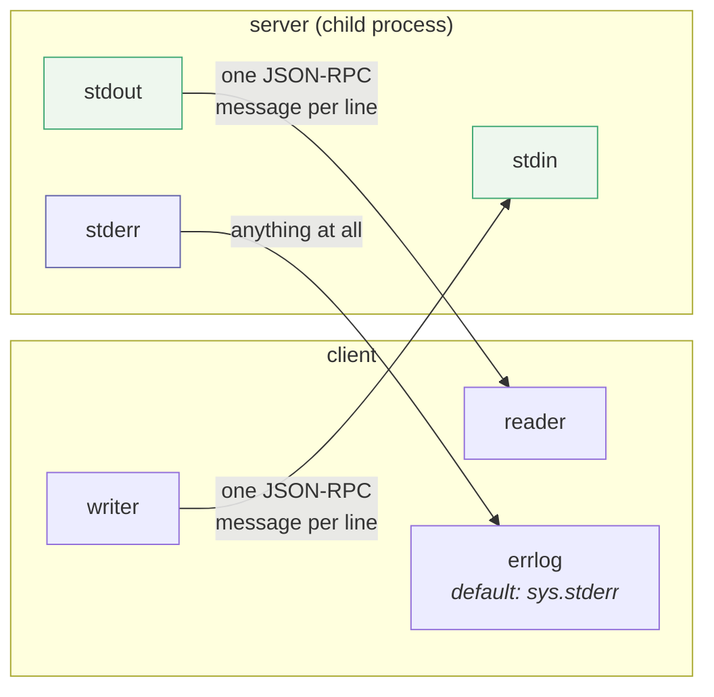

# 2.3 — The only place left to talk

## One-line answer

Because stdout is the wire, **stderr is the only channel a stdio server has for humans** — the
specification lets a server write anything it likes there, and requires the client not to treat any
of it as an error.

## The story

The man fixing the leak under the kitchen sink talks the entire time he is under there.

*"Hmm."* A pause. *"That's not right."* Some scraping. *"Who put this in, then."* A long silence, then
*"ah, there we go."*

You are at the table trying to work and every one of those noises makes you look up. The *"that's not
right"* in particular sounds like the beginning of a large bill. You do not ask, because asking will
slow him down, and by half past ten the tap runs and he wants a cup of tea.

Nothing he said was a report. He was thinking out loud in a room where you happened to be sitting.
The actual report — what was wrong, what he replaced, what it costs — came at the end, in a sentence
addressed to you, and it bore no resemblance to the running commentary.

If you had treated *"that's not right"* as the answer, you would have been wrong all morning about a
job that went fine.

## The idea in plain language

[2.2](2.2-one-message-per-line.md) established that stdout is the wire and that anything on it which
is not a message breaks the framing. That leaves an obvious question: **where does a server print
things?**

Every process gets a third stream. **stderr** — standard error — is the one that is not the wire, and
the specification hands it to the server with two rules, one for each side
(`https://modelcontextprotocol.io/specification/2026-07-28/basic/transports/stdio`, read
2026-09-04):

> *"The server **MAY** write UTF-8 strings to `stderr` for any logging purposes including
> informational, debug, and error messages."*
> *"The client **MAY** capture, forward, or ignore the server's `stderr` output and **SHOULD NOT**
> assume `stderr` output indicates error conditions."*

The name is forty years old and it is misleading. `stderr` is not "the error stream"; it is "the
stream that is not the output". A program's *output* is what it produces for whatever comes next in a
pipeline, and everything else — progress, warnings, notes, complaints — goes to the other one so that
the pipeline is not polluted. That distinction exists precisely so that `grep something file.txt |
sort` still works while `grep` is free to say `grep: no such file`.

The **SHOULD NOT** in the second rule is the part that catches people. It is very tempting to write a
client that surfaces anything on the server's stderr as a warning to the user, or worse, as a failure.
Do not: a healthy server writes to stderr constantly. Startup banners, "listening", "loaded 14 tools",
a deprecation notice from a library it imports. Treating that traffic as errors produces an agent
that reports a problem on every single successful call.

There is one more thing this section quietly settles, and it is a change from earlier revisions of
MCP. There used to be a protocol-level way for a server to send log messages to the client, and it
is now deprecated. The deprecated-features registry
(`https://modelcontextprotocol.io/specification/2026-07-28/deprecated`, read 2026-09-04) gives the
migration path in six words:

> *"Log to `stderr` for stdio transports; use OpenTelemetry for observability."*

So stderr is not a fallback for servers that have not got around to proper logging. As of the
2026-07-28 revision it **is** the logging story for stdio, and the protocol has stepped out of the
way.

## Why Sutra needs it

Because tomorrow's `sutra_mcp` will want to log, and Sutra already has strong opinions about logging
that now have to be pointed at a specific file descriptor.

[Day 22](../../../day-22-structured-logging/parts/01-a-line-you-can-query/1.1-a-print-is-not-a-log.md)
argued that a `print` is not a log: a log line has a level, a timestamp, a correlation id, and a shape
you can query. Everything in that argument still holds. What today adds is a destination. Inside a
stdio MCP server, a correctly structured JSON log line written to **stdout** is worse than no logging
at all, because it is indistinguishable from a protocol message until the parser rejects it.

`logging.basicConfig()` in Python defaults to a `StreamHandler` writing to `sys.stderr`, so the
default is right — and it is right by luck rather than by decision, which is exactly the kind of thing
that changes when somebody adds a handler later. Day 34's server writes it down explicitly.

There is a second reason, and it is about today rather than tomorrow. Every transcript in this day's
lab shows `[fake-desk]` lines interleaved with the client's own output. Those are the fake server's
stderr, and they are why you can see what the far end is doing at all. A stdio server with no stderr
output is a black box; the day's whole debugging story
([2.1](2.1-connecting-is-launching.md)'s *When it breaks*) depends on servers being talkative on the
right channel.

## The mechanism

Three streams, two of which are the protocol:



The server side is one function, and the whole discipline is in its signature:

```python
def log(message: str) -> None:
    """Write a human-readable line to stderr, which is never the protocol channel."""
    print(f"[fake-desk] {message}", file=sys.stderr, flush=True)


def reply(request_id: object, result: dict) -> None:
    """Write one JSON-RPC result to stdout as a single line."""
    body = {"jsonrpc": "2.0", "id": request_id, "result": result}
    sys.stdout.write(json.dumps(body) + "\n")
    sys.stdout.flush()
```

**Line by line:**

- Two functions, two destinations, and **no third way to write anything anywhere**. That is the point
  of the pair: a server with exactly two output functions cannot accidentally put a log line on the
  wire, because there is nowhere to type it.
- `file=sys.stderr` is the one argument that matters in `log`. Without it, `print` goes to stdout and
  this becomes [5.1](../05-failure-lab/5.1-the-log-line-that-ate-the-reply.md).
- `[fake-desk]` is a prefix naming the source. When several servers and a client are all writing to
  the same terminal, a line with no prefix is a line you cannot attribute.
- `flush=True` on the log, and `sys.stdout.flush()` after the reply. Both matter and for different
  reasons. Python block-buffers a stream that is not a terminal, and both of a child process's streams
  are pipes — so without flushing, replies sit in a buffer while the client waits for them, and the
  client's `timeout` fires on a server that has already answered.
- `json.dumps(body) + "\n"` is [2.2](2.2-one-message-per-line.md)'s rule, written once, in the only
  function that writes to stdout.
- `sys.stdout.write` rather than `print`, deliberately: `print` appends its own `end="\n"`, so mixing
  the two styles is how you get a double newline, an empty line on the wire, and an afternoon.

On the client side, where that stderr goes is a parameter you can see in the ADK source:

```python
toolset = McpToolset(connection_params=params, errlog=sys.stderr)
```

**Line by line:**

- `errlog` is an `McpToolset` argument with a default of `sys.stderr`, which is why the `[fake-desk]`
  lines appear in your terminal without you asking. It is a `TextIO`, so any writable text stream
  works.
- Pointing it at an open file is how a service captures a server's chatter into its own log
  directory. Pointing it at `io.StringIO()` is how a test captures it and asserts on it.
- Pointing it at `open(os.devnull, "w")` is how you throw it away, and it is the option to think
  hardest about: it makes every failure in
  [2.1](2.1-connecting-is-launching.md)'s *When it breaks* section undiagnosable, because the
  server's own explanation of why it died is the thing you just discarded.

Watch the separation directly. The two streams can be split at the shell:

```bash
uv run python days/day-33-client-and-transports/lab/list_tools.py 2>/dev/null
```

**Line by line:**

- `2>` redirects file descriptor 2, which is stderr. `/dev/null` discards it. In Git Bash on Windows
  this works exactly as it does on Linux.
- What remains on the terminal is the client's own stdout — the two `constructed:` and `tools the
  model would see:` lines — with every `[fake-desk]` line gone.
- Swap it for `1>/dev/null` and you get the mirror image: only the server's commentary, and nothing
  from your own program.

## When it breaks

The break is a stdio server that says nothing at all. Point `errlog` at `devnull`, or write a server
that logs nowhere, and a launch failure looks like this and only like this:

```text
ConnectionError: Failed to create MCP session: Failed to create MCP session: timed out after 10.0s waiting for the session to become ready
```

The server started. It printed its reason for giving up — a missing config file, a bad credential, a
port already in use — onto the one stream you discarded, and then it exited. The client waited the
full timeout for a process that had already been dead for most of it, and the only thing it can
honestly report is that nobody answered.

The second break is the opposite mistake, and it is the one the specification's **SHOULD NOT** exists
to prevent. A client that raises, or warns the user, on any stderr output will do so on this
completely healthy startup:

```text
[fake-desk] initialize
[fake-desk] initialized
[fake-desk] tools/list
```

Three lines, nothing wrong, and a client built on the assumption that stderr means trouble now reports
three problems per conversation. Real servers are worse: an `npx`-launched server prints npm's own
notices, and a Python one prints every `DeprecationWarning` from every import.

The third one is the buffering trap, and it is nasty because the code is correct and the behaviour is
not. Drop `flush=True` from `log` and the server's lines stop appearing in real time; they arrive in
a clump when the process exits, which reorders your whole transcript and makes the timeline useless
exactly when you are trying to work out what happened first. `lab/leak.py` in
[1.5](../01-the-connector/1.5-somebody-has-to-give-it-back.md) is unreadable without flushing, and
that is not a property of the lab — it is a property of pipes.

## In production

**What a professional writes instead:** the server configures `logging` explicitly at startup with a
`StreamHandler(sys.stderr)`, and a comment saying why. The client sets `errlog` to a real destination
— a file, or a handler that forwards each line into the host's own structured log with the server's
name attached, so a stderr line from the ticket server and one from the database server are
distinguishable a week later.

**What degrades at scale:** volume and blocking. A chatty server under load can produce more stderr
than a pipe buffer holds, and a client that is not draining that pipe will eventually cause the
**server** to block on a write — a deadlock in which the server is stuck logging and the client is
stuck waiting for a reply. This is a genuine, well-known failure of naive subprocess handling, and it
is why the SDK reads stderr continuously rather than at the end.

**The failure mode that only appears with real traffic:** secrets. stderr is the path of least
resistance, so a server that logs its full incoming request for debugging is putting customer data
and, sooner or later, a credential into the host's log aggregator. Day 22's
[3.1](../../../day-22-structured-logging/parts/03-failure-lab/3.1-the-log-that-leaked.md) is the same
lesson from the other side, and it applies here with an extra hop: the leak crosses a process
boundary you do not own.

**The review comment a senior engineer leaves:** *"you set `errlog` to devnull because the npm banner
was noisy in the test output. That is the channel the server uses to tell us why it failed to start.
Send it to a file, or filter it, but do not delete it — the next person to debug a launch will have
nothing."*

**The interview question:** *"an MCP stdio server needs to log. Where does it log, and why?"* The
answer is short and the reason is the interesting half: *"stderr, always, because stdout is the
protocol channel and anything that is not a JSON-RPC message on it corrupts the framing. The spec
says the server MAY write anything to stderr and, importantly, that the client SHOULD NOT treat
stderr output as errors — healthy servers are noisy there. That is also the official migration path
now that protocol-level logging is deprecated. Two practical things I would add: flush it, because
both streams are pipes and block-buffered, and capture it rather than discarding it, because when a
launch fails the client can only say 'timed out' and the actual reason is on stderr."*

## Check yourself

```bash
uv run python days/day-33-client-and-transports/lab/list_tools.py 2>/dev/null
uv run python days/day-33-client-and-transports/lab/list_tools.py 1>/dev/null
```

Two runs of the same command, two disjoint halves of the same transcript. Then open
`lab/fake_desk_server.py` and confirm that exactly one function writes to stdout.

**Out loud, without scrolling up:** say what the client is required *not* to conclude from a server's
stderr output, and say what breaks first if a server forgets to flush.

**Next:** [2.4 — Closing up](2.4-closing-up.md).
