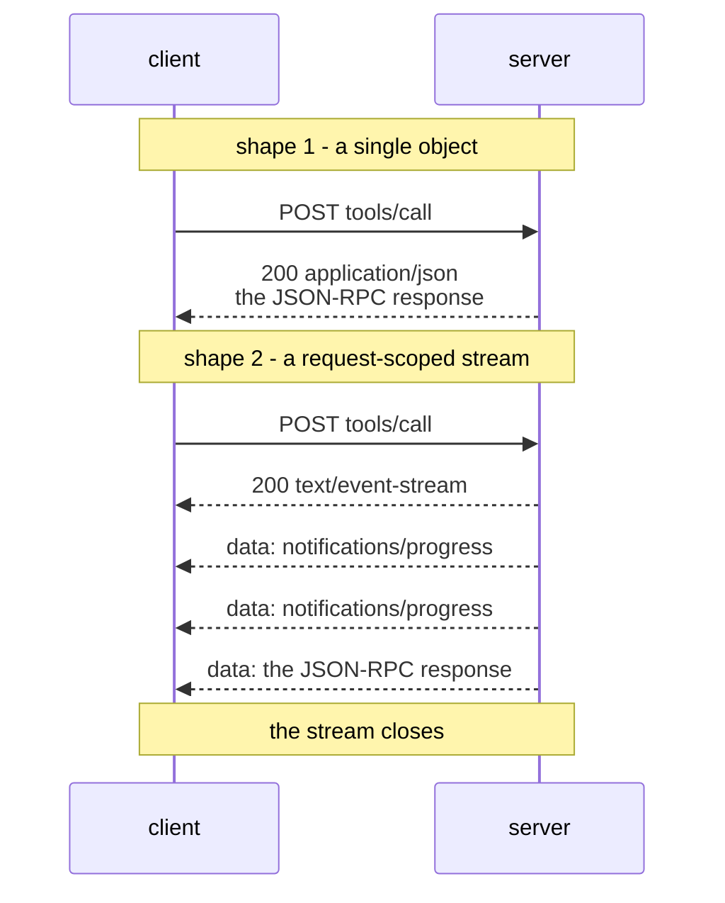

# 3.2 — Handed over, or told to wait

## One-line answer

The server decides, per request, whether to answer with a single JSON object or with an SSE stream
that carries progress notifications before the final response — which is why an MCP client over HTTP
must be able to read both, and why "streaming" here means one request's own updates and nothing else.

## The story

You hand the prescription over at the pharmacy counter.

Sometimes the answer is immediate. The woman turns round, takes a box off the shelf behind her, rings
it up, and you are out of the shop in under a minute. One transaction, one answer, done.

Other times she looks at the paper, says *"give me a moment, two of these are in the back"*, and
disappears. You stay at the counter. Every so often she calls something out — *"got the first one"*,
*"the tablets are here, still looking for the syrup"* — and eventually she comes back with the bag and
tells you the total.

You did not choose which of those happened. You handed over the same piece of paper both times. She
chose, based on what was on the shelf, and you had to be ready for either — because if you had walked
off after ten seconds assuming it was the quick kind, you would have gone home without the medicine.

The updates she called out were not separate errands. They were all about your prescription, and they
stopped when your prescription was done.

## The idea in plain language

Every POST to the MCP endpoint gets one of two reply shapes, and the specification puts the choice on
the server
(`https://modelcontextprotocol.io/specification/2026-07-28/basic/transports/streamable-http`, read
2026-09-04):

> *"If the body is a JSON-RPC *request*, the server **MUST** return either
> `Content-Type: application/json` (a single JSON object) or `Content-Type: text/event-stream` (an
> SSE response stream). The client **MUST** support both."*

**Server-Sent Events (SSE)** needs a definition before anything else, because the name sounds heavier
than the thing. SSE is a plain-text format for sending a sequence of messages over one HTTP response
that stays open. Each message is a line beginning `data: `, and a blank line ends it. That is
genuinely all it is: a response body that arrives in pieces, with a delimiter. There is no
handshake, no framing library and no second protocol.

The stream is **scoped to the request that caused it**:

> *"The server **MAY** send JSON-RPC *notifications* — for example, `notifications/progress` or
> `notifications/message` — before the final response. These notifications **MUST** relate to the
> originating client request."*
> *"The final JSON-RPC *response* **SHOULD** terminate the stream."*

So the stream is not a channel. It is one reply that happens to be delivered in instalments, all of
them about the one thing you asked, ending when that thing is finished. When the response arrives the
stream closes, and there is nothing left over to reuse.

That is the sentence that separates this revision from every tutorial written before it. The word
"stream" in older MCP material meant a long-lived channel a client opened once with GET and kept for
everything the server wanted to say. That is gone
([3.1](3.1-one-endpoint-one-trip.md)). What replaced it, for genuinely long-lived notifications like
"the tool list changed", is a `subscriptions/listen` request whose *response* stream stays open —
still one request, still one stream, just a request whose answer takes a long time. Sutra meets that
properly on Day 36.

One more piece of the specification is worth carrying, because it is the kind of thing that costs a
day when you meet it in production:

> *"When initiating an SSE stream, servers **SHOULD** include the `X-Accel-Buffering: no` header in
> the HTTP response."*

A reverse proxy in front of the server will happily buffer a response body until it is complete,
which turns a stream of progress updates into one long silence followed by everything at once. The
header asks it not to. Nothing about your code is wrong when this happens, and nothing in the
transcript tells you a proxy did it.

## Why Sutra needs it

Because Sutra's tools are about to include slow ones, and the difference between a tool that takes a
while and a tool that has hung is entirely made of progress notifications.

Day 36 builds long jobs — `sutra_mcp/tasks.py`, `start_task`, `get_task`, `cancel_task` — and
`McpToolset` already has the client-side hook for this: `progress_callback`, a
constructor argument taking either one `ProgressFnT` receiving `(progress, total, message)` for the
whole toolset, or a `ProgressCallbackFactory` that makes a different callback per tool. Reading the
ADK source for it on 2026-09-04 is what tells you that the streaming shape is not theoretical — it
already has a place to land.

There is also a smaller, more immediate reason. `connect_http` in `sutra/mcp/client.py` must not
assume the fast shape. A client written and tested against a server that always answers
`application/json` will work perfectly until it meets a server that streams, and then it fails on the
first slow tool — in production, because slow tools are what production has.

## The mechanism



Both shapes, written out. From `lab/http_shape.py`:

```python
def _json(self, request_id: object, result: dict) -> None:
    """The single-object reply shape: one JSON body, then the request is over."""
    raw = json.dumps({"jsonrpc": "2.0", "id": request_id, "result": result}).encode()
    self.send_response(200)
    self.send_header("Content-Type", "application/json")
    self.send_header("Content-Length", str(len(raw)))
    self.end_headers()
    self.wfile.write(raw)
```

**Line by line:**

- `Content-Type: application/json` is the whole signal. The client reads it and knows the body is one
  object with the answer in it.
- `Content-Length` is possible here precisely because the body is finished before it is sent. That is
  the structural difference between the two shapes, and it is why a streaming reply cannot have one.
- One `write`, and the request is over. There is nothing to close and nothing to cancel.

```python
def _stream(self, request_id: object) -> None:
    """The SSE reply shape: progress notifications, then the response, then close."""
    self.send_response(200)
    self.send_header("Content-Type", "text/event-stream")
    self.send_header("X-Accel-Buffering", "no")
    self.send_header("Connection", "close")
    self.end_headers()
    for done in (1, 2):
        note = {
            "jsonrpc": "2.0",
            "method": "notifications/progress",
            "params": {"progress": done, "total": 2},
        }
        self.wfile.write(f"data: {json.dumps(note)}\n\n".encode())
        self.wfile.flush()
    final = {
        "jsonrpc": "2.0",
        "id": request_id,
        "result": {"content": [{"type": "text", "text": "pong"}]},
    }
    self.wfile.write(f"data: {json.dumps(final)}\n\n".encode())
    self.wfile.flush()
    self.close_connection = True
```

**Line by line:**

- `Content-Type: text/event-stream` is the other signal, and no `Content-Length` accompanies it —
  the body's length is not known when the headers go out.
- `X-Accel-Buffering: no` is the proxy instruction from the specification. It costs nothing and it
  saves an afternoon of "the progress updates all arrive at the end".
- `data: ` then the JSON then `\n\n`. The double newline is the SSE record separator, and it is why
  SSE has no problem with a JSON body that contains no real newlines: one record, one blank line
  after it.
- Notice the notifications have a `method` and **no `id`**. That is what makes them JSON-RPC
  notifications rather than responses; the client matches them to the request by the stream they
  arrived on, not by an id.
- `flush()` after every write, for the same reason as
  [2.3](../02-stdio/2.3-the-only-place-left-to-talk.md): a buffered stream is not a stream. Without
  it the whole point is lost and nothing complains.
- The final record **does** carry the `id`, matching the request. That is the response, and it is
  what tells the client the sequence is over.
- `close_connection = True` ends it. The specification says the final response *SHOULD* terminate the
  stream, and closing is how.

Run both in one command:

```bash
uv run python days/day-33-client-and-transports/lab/http_shape.py
```

**Line by line:**

- The fake endpoint chooses by method: `tools/list` gets the single object, `tools/call` gets the
  stream. That is a plausible policy and not a rule — a real server can stream a listing if it wants
  to.
- The client is one `urllib.request.urlopen` for both, and it prints
  `response.headers["Content-Type"]` before the body, so you can see the choice being made.
- No model, no key, no external network.

```text
POST http://127.0.0.1:63672/mcp  Mcp-Method: tools/list
  <- 200 application/json
     {"jsonrpc": "2.0", "id": 1, "result": {"tools": [{"name": "desk_ping"}]}}

POST http://127.0.0.1:63672/mcp  Mcp-Method: tools/call
  <- 200 text/event-stream
     data: {"jsonrpc": "2.0", "method": "notifications/progress", "params": {"progress": 1, "total": 2}}
     data: {"jsonrpc": "2.0", "method": "notifications/progress", "params": {"progress": 2, "total": 2}}
     data: {"jsonrpc": "2.0", "id": 2, "result": {"content": [{"type": "text", "text": "pong"}]}}
```

Three records where the first request had one, and the last of them is the answer. Everything before
it was the pharmacist calling out from the back.

## When it breaks

The failure that produces no error is a client that reads only the first record. Because the first
thing on the stream is very often a `notifications/progress` with no `id` and no `result`, a client
that treats it as the reply gets something structurally valid and semantically empty. There is
nothing to raise: the JSON parsed, the fields it looked for were absent, and the tool "returned
nothing".

The `Accept` header is what a conforming server uses to stop you making that mistake earlier, and
`lab/http_shape.py` enforces it:

```text
POST http://127.0.0.1:63675/mcp  Mcp-Method: tools/list
  <- 400 application/json
     {"jsonrpc": "2.0", "id": null, "error": {"code": -32600, "message": "Accept must list both content types, got 'text/plain'"}}
```

The MUST on the client's `Accept` header exists so a client that cannot handle a stream is refused up
front rather than misreading one later. That is worth noticing as a design pattern: **a required
declaration of capability, checked at the door, instead of a runtime surprise.**

The second break is the proxy that buffers. Every record arrives — the transcript is byte-identical
— and they all arrive at the end, together, after the tool has finished. Progress reporting stops
working while nothing reports an error, and your own code is not involved. `X-Accel-Buffering: no`
is the fix on the server; on the client side the only clue is that the timestamps on your progress
callbacks are all within a few milliseconds of each other.

The third break belongs to this revision specifically. Older servers could send JSON-RPC *requests*
on an SSE stream — that is how sampling and elicitation used to work. The current text forbids it:

> *"The server **MUST NOT** send independent JSON-RPC *requests* on this stream. [...] This is a
> change from Streamable HTTP in protocol versions `2025-03-26` through `2025-11-25`, where servers
> could send such requests on SSE streams."*

A 2025-era server talking to a 2026-era client will therefore do something the client is not
expecting, and the client's own SDK is the layer that has to notice. Day 38's migration lab is where
Sutra deals with that properly.

## In production

**What a professional writes instead:** nothing, at this layer. The MCP SDK's HTTP transport reads
both shapes correctly, and hand-writing an SSE reader is a way to acquire bugs. What a professional
*does* write is the `progress_callback` — because the stream exists to be useful to a human, and a
progress notification that is received and dropped is bandwidth spent on nobody.

**What degrades at scale:** open response streams. Each streaming reply holds a socket, a thread or
task on the server, and a slot in every proxy in between, for as long as the tool takes. A hundred
concurrent slow tools is a hundred held responses, and proxies and load balancers have their own
opinions about how long a response may take — often shorter than your tool. This is the pressure that
makes Day 36's task handles the right answer for genuinely long work: return immediately with a
handle, and let the client poll, instead of holding a response open for the duration.

**The failure mode that only appears with real traffic:** the idle stream. A tool that takes a long
time and reports no progress produces a response that sends nothing for minutes, and something in the
path — a load balancer, a corporate proxy, a client-side read timeout — closes it. The specification
suggests the countermeasure for long-lived streams: *"servers are encouraged to periodically emit an
SSE comment line (a line beginning with a colon, e.g. `:\r\n`) as a keep-alive."* A client must
ignore those lines rather than treat them as malformed input.

**The review comment a senior engineer leaves:** *"our slow tool streams progress and we never pass a
`progress_callback`, so we are paying for an open response and throwing every update away. Either
wire the callback through to the UI, or return a task handle and stop holding the response open at
all."*

**The interview question:** *"MCP over HTTP is called Streamable HTTP. What actually streams?"* The
answer separates people who have read the current spec from people who have read a tutorial: *"One
request's own reply, and nothing else. The server chooses per request between a single JSON object
and an SSE stream, and the stream carries progress notifications for that request followed by the
final response, then closes. It is not a channel — the standalone GET stream that was one, in the
earlier revisions, has been removed. If you want long-lived notifications now you send a
`subscriptions/listen` request and its response stream is the long-lived one. The practical
consequences are that the client MUST accept both content types, and that a proxy buffering the
response silently deletes the streaming behaviour, which is what `X-Accel-Buffering: no` is for."*

## Check yourself

```bash
uv run python days/day-33-client-and-transports/lab/http_shape.py
```

Change `_stream`'s loop to `for done in (1, 2, 3, 4, 5)` and run it again. Count the records. Then
find the one record in the output that has an `id`, and say why only that one does.

**Out loud, without scrolling up:** say who chooses between the two reply shapes and when, and say
what the final record on an SSE reply is.

**Next:** [3.3 — Standing up is how you cancel](3.3-standing-up-is-how-you-cancel.md).
