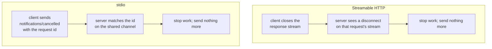

# 3.3 — Standing up is how you cancel

## One-line answer

Cancellation is the one place where the two transports genuinely differ: on Streamable HTTP closing
the request's response stream **is** the cancellation, while on stdio — where there is only one shared
channel and nothing to close — the client must send an explicit `notifications/cancelled`.

## The story

You are in the barber's chair and your phone goes.

You listen for four seconds, say *"I have to go"*, take the cape off, and stand up. Nothing else is
required. You do not have to explain, and he does not have to agree. Your absence from the chair is
the entire message, and it is unambiguous — he is not going to keep cutting the air where your head
was.

Now the same afternoon, different arrangement. You did not go in; you sent a message that morning
asking him to keep four o'clock free. There is no chair to stand up from. If you want to cancel you
have to send another message saying so, and until you do, four o'clock is still yours and he is
turning other people away.

Same shop, same barber, same cancellation. In one case leaving the situation is the signal. In the
other there is no situation to leave, so the signal has to be sent as a separate thing.

## The idea in plain language

[3.2](3.2-handed-over-or-told-to-wait.md) established that on Streamable HTTP every request gets its
own response stream. That one fact hands cancellation over for free
(`https://modelcontextprotocol.io/specification/2026-07-28/basic/transports/streamable-http`, read
2026-09-04):

> *"Closing the SSE response stream **MUST** be treated by the server as cancellation of that request.
> Because each request has its own response stream, the transport-level disconnect is unambiguous."*

*Unambiguous* is the load-bearing word. There is exactly one request on that stream, so a disconnect
cannot mean anything else. The client does not have to name what it is cancelling, and the server does
not have to look anything up. It hangs up, and the thing it hung up on is the thing it cancelled.

stdio cannot do that, because
[2.1](../02-stdio/2.1-connecting-is-launching.md) gave it exactly one pair of streams for everything.
There is no per-request channel to close, and closing the shared one would end the entire server. So
stdio needs a message
(`https://modelcontextprotocol.io/specification/2026-07-28/basic/transports/stdio`, read 2026-09-04):

> *"To cancel an in-flight request, the client **MUST** send a `notifications/cancelled` notification
> referencing the request's ID. Because stdio is a single shared bidirectional channel, there is no
> per-request stream to close."*

And the transports overview says the same thing from above, which is the sentence worth memorising:

> *"Each binding defines how a client abandons an in-flight request: on stdio the client sends a
> `notifications/cancelled` notification; on Streamable HTTP it closes the request's response stream.
> The protocol-level rules are the same everywhere."*

There is a corollary that surprises people, and it is stated outright: over Streamable HTTP,
`notifications/cancelled` is **not** sent at all. The spec's own note says the only client-sent
notification in the core protocol *"is used only on the stdio transport; on Streamable HTTP, closing
the SSE response stream is itself the cancellation signal and no `notifications/cancelled` message is
expected."*

Both bindings then agree on what the server does about it. Cancellation is **cooperative**: the
server *SHOULD* stop as soon as practical and *MUST NOT* send any further messages for that request.
It is not a kill. Work already committed — a row written, an email sent, a payment made — stays done,
and no part of the protocol undoes it.

## Why Sutra needs it

Because Sutra will run tools that a user changes their mind about, and because a client that gives up
without telling anyone is a client that leaves work running.

The concrete case is a timeout. Day 44 writes `sutra/mcp/hardening.py` with `with_timeout`, and a
timeout is a cancellation the client decided on its own. Over HTTP that is easy and almost automatic:
the client stops reading, the socket closes, the server sees the disconnect. Over stdio it is not
automatic at all — the client that abandons a request without sending `notifications/cancelled`
leaves the server working on something nobody will read, on the same machine, competing for the same
CPU as the retry that is about to be sent.

There is also a design consequence for tomorrow. When Day 34's server grows a tool that does real
work, "what happens if the caller goes away" becomes a question that tool has to answer. The right
answer is usually to check for cancellation between units of work rather than in the middle of one,
and the reason it is *usually* is the cooperative rule above.

## The mechanism



The stdio message, written out, because it is one you will read in a log:

```python
cancel = {
    "jsonrpc": "2.0",
    "method": "notifications/cancelled",
    "params": {"requestId": 7, "reason": "client timed out"},
}
sys.stdout.write(json.dumps(cancel) + "\n")
sys.stdout.flush()
```

**Line by line:**

- There is **no `id`** at the top level. That is what makes it a notification rather than a request: a
  notification is fire-and-forget, and the server never answers it. A cancellation that expected an
  acknowledgement would need to be cancellable itself.
- `params.requestId` names the request being abandoned. It refers to the `id` of the original
  message, which is why a client has to keep track of its own outstanding ids — over HTTP it does not
  need to, because the socket does the bookkeeping.
- `reason` is free text and optional. It costs nothing and it is the difference between a server log
  that says "cancelled" and one that says "cancelled: client timed out", which matters at three in
  the morning.
- The framing is [2.2](../02-stdio/2.2-one-message-per-line.md)'s: compact JSON, one newline, flush.
  A cancellation is a message like any other and the rules do not relax for it.
- Over Streamable HTTP you would send none of this. Closing the response is the message.

The HTTP side, from the client, is even shorter — and the point is what it does *not* contain:

```python
with urllib.request.urlopen(request, timeout=5) as response:
    for line in response:
        if is_final(line):
            break
```

**Line by line:**

- `with` on the response is what makes the cancellation happen. Leaving the block closes the socket,
  and closing the socket is the signal the server is required to treat as cancellation.
- `break` before the final record — abandoning the loop early — is a cancellation, whether you meant
  it as one or not. That is convenient and it is a trap: a client that stops reading because an
  exception was raised in the loop body has just cancelled a request it might have wanted to keep.
- `timeout=5` on `urlopen` is a read timeout. When it fires, the socket closes, and the server sees a
  cancellation it was never told about in words.
- There is no cancel call, no request id, and no message. That is the whole design.

The lab's fake endpoint has the SSE side of this already: `_stream` writes its records and then sets
`close_connection = True`. Close the reader early instead and the server's `wfile.write` is what
fails — which, in a real server, is exactly the signal it converts into "stop working".

## When it breaks

The break that costs money is the one with no error text at all: a client that abandons an HTTP
request by raising, catching, and moving on, without ever closing the response. The socket stays open
because the response object is still referenced, the server keeps working, and the client has already
retried. Now two copies of the same tool call are running, and this is where cooperative cancellation
stops being an abstract phrase — if the tool is not idempotent, the second copy is a second row, a
second email, a second charge.

Over stdio the equivalent mistake produces something you *can* see. A client that gives up on a
request and never sends `notifications/cancelled` will still be reading the shared channel when the
answer finally arrives, and the SDK has nowhere to put it. The session's request table no longer has
that id, so the reply is a response to nothing. Nothing crashes; a message is dropped, and the only
trace is that the server did work that was never used.

The third break is on the server side and it is the one to check for in any server you did not write:
a server that keeps sending after it has been cancelled. The rule is a **MUST NOT** —
*"Servers SHOULD stop work on a cancelled request as soon as practical and MUST NOT send any further
messages for it."* Over stdio a server that ignores it writes a response for a cancelled id onto the
shared channel, and the client, which has moved on, treats it as an unmatched reply. Over HTTP it
writes to a closed socket and gets a broken pipe, which at least fails loudly:

```text
ConnectionResetError: [WinError 10054] An existing connection was forcibly closed by the remote host
```

That is the server discovering the cancellation the hard way, and a well-written one turns it into a
stop rather than a crash.

## In production

**What a professional writes instead:** cancellation is not written by hand at all — it is a timeout
policy in one place, applied to every MCP call, that closes the response and records why. Day 44's
`with_timeout` is that place. What a professional does write by hand is the *idempotency* question
for each tool, because that is what decides whether the retry after the cancellation is safe, and no
transport can answer it for you.

**What degrades at scale:** abandoned work. Cancellation is cooperative, so under load a server can
accumulate requests whose clients left, all still holding CPU and database connections. The
observable symptom is a server that is busy while its request rate is falling, and the fix is
structural: check for cancellation between units of work, and prefer a task handle
(Day 36) for anything that runs long enough for a client to give up on it.

**The failure mode that only appears with real traffic:** the timeout stampede. A slow dependency
makes every call exceed the client timeout at once, every client cancels, every client retries, and
the server is now serving twice the load — half of it for nobody. This is why a retry policy needs a
ceiling and a backoff, and why `with_timeout` and `with_retries` are one file rather than two
unrelated helpers.

**The review comment a senior engineer leaves:** *"the stdio path here just stops awaiting the
response on a timeout. That leaves the server working on a request nobody will read, on the same box,
while we retry it. Send `notifications/cancelled` with the request id and a reason — over HTTP we get
this for free by closing the stream, and it is easy to forget that stdio does not."*

**The interview question:** *"how does a client cancel an in-flight MCP call?"* This is a good
question precisely because the answer is different per transport, and most people give one half:
*"It depends on the binding, and that is the only place the two transports really differ. Over
Streamable HTTP each request has its own response stream, so closing it is the cancellation — the
disconnect is unambiguous and no message is sent. Over stdio there is only one shared channel and
nothing per-request to close, so the client MUST send a `notifications/cancelled` notification
carrying the request id. Both are cooperative: the server SHOULD stop as soon as practical and MUST
NOT send anything more for that request, but whatever it already did stays done. So the real question
behind cancellation is always idempotency, because a cancel is usually followed by a retry."*

## Check yourself

```bash
uv run python days/day-33-client-and-transports/lab/http_shape.py
```

Then change the `post` helper to `break` out of the response loop after the first line, run it again,
and read the endpoint's access log on stderr. You have cancelled a request without sending anything.

**Out loud, without scrolling up:** say why closing a stream is unambiguous on Streamable HTTP and
impossible on stdio, and say what a cancellation does *not* undo.

**Next:** [3.4 — What a URL costs](3.4-what-a-url-costs.md).
