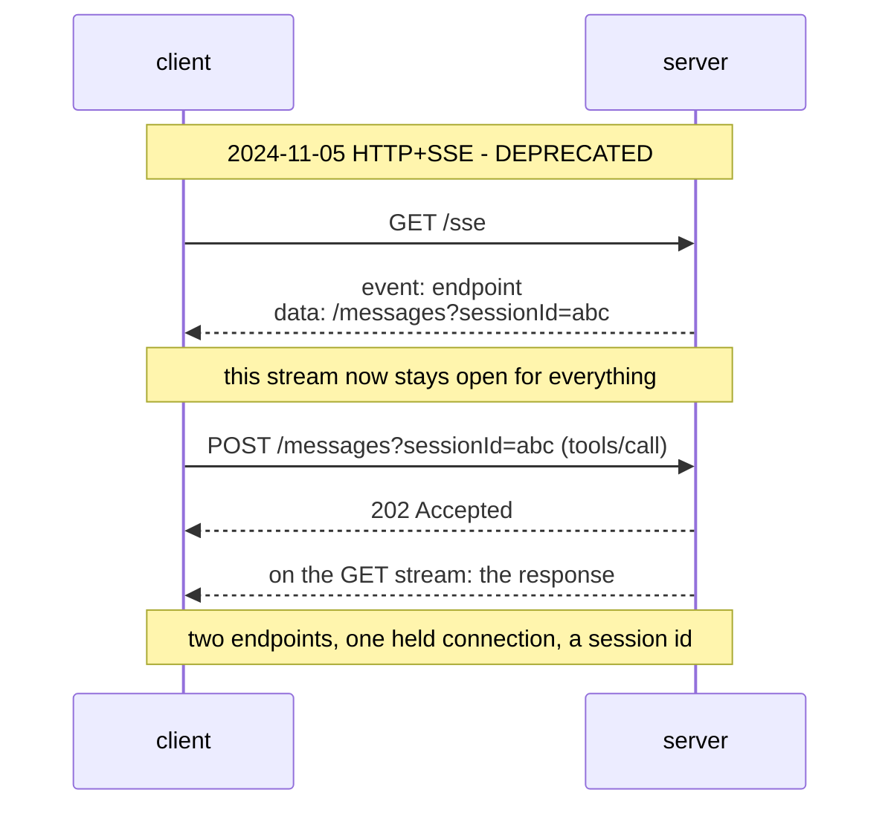

# 4.2 — 🅿️ The route with a withdrawal date

## One-line answer

The 2024-11-05 HTTP+SSE transport — a long-lived GET stream plus a separate POST endpoint — has been
**Deprecated** since revision `2025-03-26` and is eligible for removal, so Sutra learns to
**recognise** it and never builds on it: this part is parked, and parked means interview-ready and
deliberately unbuilt.

## The story

The 27 still runs. It is on the timetable at the stop, the shelter has been repainted, and the driver
is the same one as always.

The council voted in March to withdraw it. There was a notice in the paper and a consultation that
eleven people went to. The route is not cancelled — cancelling it takes another vote, and a date, and
somebody has to organise the replacement — so for now nothing has changed at all. The bus comes at
twenty past.

Two people use that stop. One of them has been getting the 27 for years and will find out it is gone
on the morning it is gone, and will be annoyed for a week and then take the 41. The other one is
about to sign a lease on a flat because it is four minutes from that stop.

There is nothing wrong with taking the 27 today. There is something badly wrong with signing a
two-year lease on the strength of it, and the difference between those two people is not information
— they both could have read the notice — it is that only one of them was making a decision that
outlives the bus.

## The idea in plain language

Before Streamable HTTP there was a different HTTP transport, and it worked in a shape that is worth
knowing because you will meet it in code and in tutorials. In the `2024-11-05` revision:

- the client opened a **GET** request that stayed open as a long-lived SSE stream;
- the server's very first event on that stream was an `endpoint` event naming a **second** URL;
- the client sent every message as a POST to that second URL;
- every server-to-client message came back down the one long-lived GET stream.

Two endpoints, one of them held open for the life of the connection. Read that list next to
[3.1](../03-streamable-http/3.1-one-endpoint-one-trip.md) and every difference is a thing the current
revision deliberately removed: one endpoint instead of two, request-scoped streams instead of a
standing one, nothing held open between messages.

Its status is not a rumour. It is a row in a registry
(`https://modelcontextprotocol.io/specification/2026-07-28/deprecated`, read 2026-09-04), and the
warning box on the transport page says the same thing in prose:

> *"**Deprecated**: The HTTP+SSE transport from protocol version 2024-11-05 has been deprecated since
> protocol version `2025-03-26` and is classified as Deprecated under the feature lifecycle policy
> (SEP-2596). New implementations **SHOULD NOT** adopt it; existing implementations **SHOULD**
> migrate to Streamable HTTP. It is eligible for removal in a future revision."*

The registry row gives the schedule: deprecated in `2025-03-26`, migration path Streamable HTTP,
earliest removal *"Three months after SEP-2596 reaches Final"*. Compare that with the other rows —
Roots, Sampling, Logging and Dynamic Client Registration all read *"First revision released on or
after 2027-07-28"*, a full twelve months. HTTP+SSE has the shortest clock on the page, because it has
been deprecated the longest.

**Deprecated is a state with a definition**, not a word of disapproval. The registry says it plainly:

> *"A Deprecated feature remains part of the specification but is scheduled for removal: new
> implementations **SHOULD NOT** adopt it, and existing implementations **SHOULD** migrate before the
> feature's earliest removal."*

So it still works, it is still specified, and there is a date after which it may stop existing. Taking
the 27 today is fine. Signing the lease is not.

## Why Sutra needs it

Because Sutra will meet it in exactly two places, and neither of them is a place where you build on
it.

The first is **an audit**. Day 45 audits every server Sutra depends on, and "which transport does it
speak" is one of the questions. A server whose documentation tells you to open a GET stream and wait
for an `endpoint` event is a server on the deprecated transport, and that is a finding with a date
attached rather than an outright refusal: it works now, it has a removal clock, and depending on it is
a decision somebody should make on purpose.

The second is **a tutorial**. This is
[Day 32's 5.1](../../../day-32-mcp-stateless-core/parts/05-failure-lab/5.1-the-tutorial-from-four-months-ago.md)
arriving again in a new place. Any MCP article written in 2024 or early 2025 will show you
`sse_client(url)`, it will work when you paste it, and it will be teaching you a transport with a
withdrawal notice on it. The tell is in the first step: **if the first thing the client does is open a
GET, you are reading history.**

What Sutra does not do is build anything on it. There is no lab that connects over SSE, no
`connect_sse` in `sutra/mcp/client.py`, and no fallback path. That is what the 🅿️ marker means in this
curriculum: awareness-level, interview-ready, deliberately not built.

## The mechanism

The old shape, drawn once so you can recognise it:



Three things in that diagram are each independently gone in `2026-07-28`: the second endpoint, the
held stream, and the `sessionId`.

The transport is still in your virtual environment, and that is the point of the day's check:

```bash
uv run python days/day-33-client-and-transports/lab/legacy_sse.py; echo "exit: $?"
```

**Line by line:**

- The script imports `mcp.client.sse` and `google.adk.tools.mcp_tool` and asks each of them what it
  still exposes. It sends no traffic and calls no model.
- `hasattr(sdk_sse, "sse_client")` tests the MCP SDK's own legacy client function.
- `"SseConnectionParams" in adk_mcp.__all__` tests the ADK's exported connection-parameter class, the
  third one beside `StdioConnectionParams` and `StreamableHTTPConnectionParams`.
- It **exits 1 when it finds them**, which makes it an eval that can go RED (Principle 11). Its red is
  informational rather than a bug — you are not going to delete these from someone else's package —
  and it is the honest state of the world today.

```text
mcp           : 1.29.1
google-adk    : 2.7.1
live transports : ['stdio', 'streamable_http']
legacy still importable : ['mcp.client.sse.sse_client', 'google.adk.tools.mcp_tool.SseConnectionParams']
deprecated since : 2025-03-26 (SEP-2596); earliest removal: three months after SEP-2596 is Final
exit: 1
```

Both libraries still ship it. Neither warns at import. `SseConnectionParams` sits in the same
`__all__` as the two live ones, with a docstring that says nothing about deprecation, and its own
`sse_read_timeout` default — so a reader picking a class from an autocomplete list has three equally
plausible-looking options and one of them has a removal clock.

Detection, if you ever have to write it, is the specification's own procedure and is worth reading for
what it says about robustness:

> *"Attempt to POST a request to the server URL, with an `Accept` header as defined above. If it
> succeeds, the client can assume this is a server supporting the new Streamable HTTP transport. If it
> fails with HTTP status code `400 Bad Request`, `404 Not Found`, or `405 Method Not Allowed` **and**
> the response body is not a recognized modern JSON-RPC error [...] issue a GET request to the server
> URL, expecting that this will open an SSE stream and return an `endpoint` event as the first
> event."*

**Modern first, legacy only on a specific failure, and never on the status code alone.** That last
clause is the one that matters and it is the same rule as
[3.1](../03-streamable-http/3.1-one-endpoint-one-trip.md)'s: a modern server returns `400` for a
version mismatch and `404` with a JSON-RPC `-32601` for an unknown method, so a client that falls back
on the number will downgrade a perfectly current server the first time it sends a bad header.

## When it breaks

The break is not an error. It is a client that works today and stops working on a date somebody else
chooses. There is no exception to quote, because the code path that will fail has not failed yet.

What you *can* see today is the absence of any warning. Import the deprecated class and Python says
nothing:

```text
>>> from google.adk.tools.mcp_tool import SseConnectionParams
>>> SseConnectionParams.__doc__.splitlines()[0]
'Parameters for the MCP SSE connection.'
```

No `DeprecationWarning`, no note in the docstring's first line, no difference in how it appears in an
editor's autocomplete. The information that this transport has a withdrawal notice exists only on a
specification page you have to know to go and read, and `lab/legacy_sse.py` exists to move that
information into a command you can run.

The second break belongs to the audit. Point a modern client at a server that only speaks the old
transport and the POST fails with a status that is easy to misread:

```text
urllib.error.HTTPError: HTTP Error 405: Method Not Allowed
```

`405` on a POST is the old server saying "the URL you posted to is my SSE endpoint, not my message
endpoint". A `405` on a **GET** would be the current-revision server from
[3.1](../03-streamable-http/3.1-one-endpoint-one-trip.md) saying the opposite. Same number, opposite
meanings, and the only way to tell them apart is which verb you sent and what the body contains.

## In production

**What a professional writes instead:** nothing new on this transport, and a dated note wherever they
still consume it. If a dependency speaks only HTTP+SSE, that goes in the server record from
[4.1](4.1-the-same-errand-two-ways.md) as a field — `transport: http+sse (deprecated)` — with the
removal clock beside it, so it shows up in a report rather than in somebody's memory. A dependency
with a removal date and no owner is how a scheduled event becomes an incident.

**What degrades at scale:** the held stream, which is why it was deprecated at all. One long-lived GET
per client means every client occupies a connection for its whole lifetime, load balancers need
stickiness to keep the POST and the stream on the same instance, and a rolling deployment drops every
client at once. That is the same arithmetic
[Day 32's 2.2](../../../day-32-mcp-stateless-core/parts/02-the-reframe/2.2-three-instances-one-url.md)
did for sessions, and it is not a coincidence: sessions and the standing stream were removed by the
same reasoning.

**The failure mode that only appears with real traffic:** the silent fallback. A client with a
detection path can quietly downgrade a modern server to the legacy transport because of one
misconfigured header, and then behave in ways nobody is testing — a session id where there should be
none, a held connection where there should be none, and a set of failure modes the team believed they
had left behind. If you implement detection, log the decision at `INFO` every time, with the reason.

**The review comment a senior engineer leaves:** *"this uses `SseConnectionParams` because it was
first in the autocomplete list. That transport has been deprecated since the 2025-03-26 revision and
its earliest removal is the soonest of anything in the registry. Use `StreamableHTTPConnectionParams`
— it is the same number of lines — and if you genuinely need the old one for a third-party server, say
so in a comment with the server's name so the next audit finds it."*

**The interview question:** *"MCP had an older HTTP transport. What was it and what happened to it?"*
An answer with the mechanism and the governance in it: *"The 2024-11-05 HTTP+SSE transport: the client
opened a long-lived GET stream, the first event on it named a second URL, messages went as POSTs to
that second URL, and every reply came back down the held stream. It was deprecated in the 2025-03-26
revision in favour of Streamable HTTP, and it is in the spec's deprecated-features registry under
SEP-2596 with the earliest removal three months after that SEP goes Final — the shortest clock on the
page. The reason it went is the same reason sessions went: one held connection per client forces
sticky routing and dies on every deployment. I would recognise it in an audit and never build on it.
The thing I would actually flag is that both the MCP SDK and the ADK still export it with no
deprecation warning at import, so the only way to know is to have read the registry — which is why we
turned that into a check that runs."*

## Check yourself

```bash
uv run python days/day-33-client-and-transports/lab/legacy_sse.py; echo "exit: $?"
```

Then open `.venv/Lib/site-packages/google/adk/tools/mcp_tool/__init__.py` and find
`SseConnectionParams` in `__all__`, sitting between the two transports Sutra actually uses. Nothing in
that file marks it.

**Out loud, without scrolling up:** describe the old transport's two endpoints, and say what the first
step of a legacy tutorial looks like so you can spot one.

**Next:** [5.1 — 💥 The log line that ate the reply](../05-failure-lab/5.1-the-log-line-that-ate-the-reply.md).
