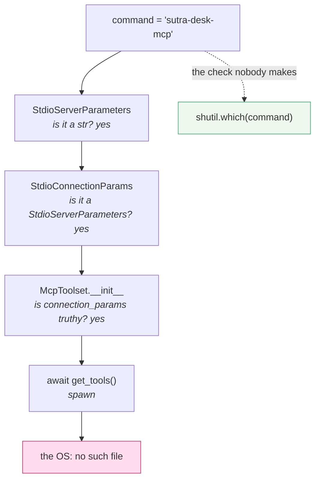

# 5.2 — 💥 The spanner that was not in the boot

## One-line answer

A `command` that is not on `PATH` is accepted silently by every layer that could have caught it, and
surfaces one layer too late as a `ConnectionError` wrapping an operating-system code that on Windows
does not even name the missing file.

## The story

The tyre goes on a road with no lights, at the point in the evening where it is properly dark.

This is fine, because there is a spare and a jack and a wheel brace in the boot under the floor panel,
and you have done this before. You get the panel up, get the jack out, get the spare out, and put your
hand in for the brace.

The brace is not there.

Everything else is. The jack is there, the spare is there, the little plastic cover for the towing eye
is there. The one thing that is a socket for the wheel nuts, which is the one thing you cannot
improvise, is not in the car, and you have no idea when it left. It might never have been there. You
bought the car second-hand and you checked the tyre pressure and the oil and you did not check the
boot for a brace, because the boot is not something you check — it is somewhere you keep things.

The car was fine for eleven months. Nothing about it was ever broken. The absence only became a
problem at the single moment it was needed, at night, on a road, and by then the shop is shut.

## The idea in plain language

[1.2](../01-the-connector/1.2-constructing-is-not-connecting.md) established the general rule:
constructing a toolset validates types and nothing else. This part is that rule at its most annoying,
because a bad `command` string has to travel through **four** layers before anybody objects, and each
one has a good reason not to.

- **`StdioServerParameters`** is a Pydantic model whose `command` field is typed `str`. Any string is
  a valid string. Validating that the command exists would make a data class do I/O, and would fail on
  a machine where the parameters are built and a different machine where they are used.
- **`StdioConnectionParams`** wraps it and adds a `timeout`. It has no more information than the model
  it wraps.
- **`McpToolset.__init__`** stores the parameters and creates a session manager. It connects to
  nothing, by design ([1.2](../01-the-connector/1.2-constructing-is-not-connecting.md)).
- **`get_tools()`** finally spawns the process, and the operating system says no.

Four layers of correct behaviour, one bad string, and the objection arrives from the fourth. That is
not a design flaw — every one of those decisions is right — but it means the error you read is
maximally far, in code and in time, from the character you typed wrongly.

The specific cruelty is what the message says. On Windows the failure is `[WinError 2] The system
cannot find the file specified`, and **it does not name the file**. You have the number 2, you have
the word "file", and the one thing that would end the investigation instantly — the string you got
wrong — is not in the message. On Linux the equivalent is
`FileNotFoundError: [Errno 2] No such file or directory: 'sutra-desk-mcp'`, which does name it, so
this failure is meaningfully harder to diagnose on one platform than the other.

## Why Sutra needs it

Because `connect_stdio` in `sutra/mcp/client.py` takes a command, and every real MCP deployment gets
this wrong at least once.

The realistic ways it happens are not typos. A server is documented as `npx -y @scope/server` and the
machine has no Node. A server is installed with `uv tool install` into a directory that is on your
shell's `PATH` and not on the one the service inherits. A container image is rebuilt from a slimmer
base and the binary is gone. A `README` names a command the project renamed two releases ago. In every
case the string in the configuration is exactly what somebody told you to write.

And it happens at the worst time. Because the failure is at first use rather than at startup
([1.2](../01-the-connector/1.2-constructing-is-not-connecting.md)), a deployment goes green, the
health check passes, and the first user's first question is what discovers it.

## The mechanism

Where the string gets checked, and where it does not:



The preflight is one line, and `lab/missing_command.py` makes it the first thing that runs:

```python
GHOST = "sutra-desk-mcp"

print(f"command       : {command}")
print(f"shutil.which  : {shutil.which(command)}")
```

**Line by line:**

- `GHOST` is a name the repository has never shipped. It is deliberately not a typo of anything, to
  make the point that this failure is usually a name somebody else gave you rather than a slip of the
  keyboard.
- `shutil.which(command)` performs exactly the resolution the operating system is about to perform:
  it walks `PATH`, honours `PATHEXT` on Windows so `foo` finds `foo.exe`, and returns the resolved
  absolute path or `None`.
- Printing the resolved path rather than a boolean is deliberate. `None` tells you it is missing;
  `C:\...\Scripts\python.exe` tells you *which* one was found, which is the answer to the much
  commoner and much more confusing case where the command exists and is the wrong one.
- The check costs a filesystem lookup and can run at startup, in a health check, and in a test. The
  failure it replaces costs a spawn attempt, a traceback and an evening.

Run both arms:

```bash
uv run python days/day-33-client-and-transports/lab/missing_command.py --real
uv run python days/day-33-client-and-transports/lab/missing_command.py
```

**Line by line:**

- `--real` uses `sys.executable` and the day's fake server: a command that certainly resolves.
- No flag uses `GHOST`.
- Both build the toolset identically. The only difference in the whole program is the contents of one
  string, which is the point being made.

## When it breaks

The good arm:

```text
command       : C:\Users\...\sutra\.venv\Scripts\python.exe
shutil.which  : C:\Users\...\sutra\.venv\Scripts\python.exe
constructed   : ok, nothing has been launched yet
tools         : ['desk_ping', 'desk_ticket_count', 'desk_wipe_tickets']
```

The bad arm, with the traceback trimmed to the frames that matter:

```text
Error on session runner task: [WinError 2] The system cannot find the file specified
Error on session runner task: [WinError 2] The system cannot find the file specified
command       : sutra-desk-mcp
shutil.which  : None
constructed   : ok, nothing has been launched yet
Traceback (most recent call last):
  File "...\mcp\os\win32\utilities.py", line 169, in create_windows_process
    process = await anyio.open_process(
...
  File "...\google\adk\tools\mcp_tool\mcp_session_manager.py", line 1053, in create_session
    raise ConnectionError(f'Failed to create MCP session: {e}') from e
ConnectionError: Failed to create MCP session: Failed to create MCP session: [WinError 2] The system cannot find the file specified
```

Five things in that output, each of which sends somebody somewhere unhelpful.

**`constructed   : ok, nothing has been launched yet` is printed by a doomed program.** Every layer
before the spawn accepted the string.

**The message is printed twice before the traceback even starts.** *"Error on session runner task"*
appears two times, because ADK's `retry_on_errors` decorator retries the session once — a sensible
policy for a flaky network and pure noise for a missing file, which will never become present between
two attempts.

**The exception is a `ConnectionError`.** Not `FileNotFoundError`, even though a file was not found.
An `except FileNotFoundError` around `get_tools()` catches nothing, and the exception type describes
which layer gave up rather than what went wrong.

**The message is doubled inside itself.** *"Failed to create MCP session: Failed to create MCP
session:"* — one wrapper wrapping another wrapper's text. The loudest part of the message is the part
furthest from the cause.

**And the file is not named.** `[WinError 2]` is the raw OS error for a missing executable. The one
string that would end the investigation is the one string that is absent, and the two lines above it
in your own output — `command` and `shutil.which  : None` — are the ones you had to add yourself.

The nastier cousin is a command that **does** resolve and is not a server. Change `GHOST` to `"npx"`,
which exists on this machine, and the failure moves:

```text
ConnectionError: Failed to create MCP session: Failed to create MCP session: timed out after 10.0s waiting for the session to become ready
```

The process started. It ran. It never answered `initialize`, so the connection died of the timeout
instead. `shutil.which` would have passed this one, which is the honest limit of a preflight: it can
tell you the command exists and it cannot tell you the command is an MCP server. The only thing that
can is running it — which is [2.1](../02-stdio/2.1-connecting-is-launching.md)'s advice to take the
exact command and arguments and run them in a terminal by hand.

## In production

**What a professional writes instead:** a `preflight()` in the client module that resolves every
configured command, reports the resolved path for each, and fails the process at startup with a
message naming the server and the string that did not resolve. It is called from application startup
and from the readiness probe, so a broken configuration is a deployment that does not go green rather
than a user's first question. The cost is one `shutil.which` per server.

**What degrades at scale:** the mismatch between environments. `PATH` differs between your shell, your
editor's terminal, a systemd unit, a Docker `ENTRYPOINT` and a CI runner, and a command that resolves
in four of them and not the fifth produces the most tedious kind of bug report. The stable fix is not
a longer `PATH` — it is an absolute path, or a command installed as a real dependency of the project
so its location is a property of the environment you built rather than of the one you are running in.

**The failure mode that only appears with real traffic:** the server that resolves and then fails to
start under load. `npx -y` fetches a package on a cold cache, and enough concurrent launches will push
some of them past the `timeout`. The message is the `timed out` one above, so it looks like a network
problem, and the number of successful launches makes it look intermittent. Nothing is broken. There
are simply too many launches, which is [2.1](../02-stdio/2.1-connecting-is-launching.md)'s scaling
argument arriving as an incident.

**The review comment a senior engineer leaves:** *"the server command comes from an environment
variable with no validation, and the failure path is a `ConnectionError` mid-turn that does not name
the command. Resolve it at startup and refuse to boot if it is missing — and log the resolved path,
not a boolean, because the next one of these will be the right name pointing at the wrong binary."*

**The interview question:** *"an MCP server command is missing. Describe what you see and what you
do."* The answer that shows you have actually hit it: *"You see nothing at construction — the
connection parameters are a Pydantic model and any string is a valid command. At the first
`get_tools()` you get a `ConnectionError`, not a `FileNotFoundError`, wrapping an OS error that on
Windows is `[WinError 2]` and does not name the file, with the message doubled because one wrapper
wrapped another. ADK also retries once, so you see it twice. The fix is not better error handling,
it is moving the check earlier: `shutil.which` on every configured command at startup, logging the
resolved path rather than a boolean, because the harder version of this bug is a command that resolves
to the wrong binary. And I would be clear about the limit — `which` cannot tell you the thing it found
speaks MCP. That one you find by running the exact command by hand and watching whether it sits there
waiting on stdin."*

## Check yourself

```bash
uv run python days/day-33-client-and-transports/lab/missing_command.py 2>&1 | head -5
```

Then set `GHOST` to the absolute path of a file that exists but is not executable — a `.md` in this
repository will do — and run it again. A third failure, a third message, and `shutil.which` is not
`None` this time.

**Out loud, without scrolling up:** name the four layers that accept a bad command without complaint,
and say what `shutil.which` can and cannot tell you.

**Next:** [6.1 — The connection you must not hold](../06-in-production/6.1-the-connection-you-must-not-hold.md).
