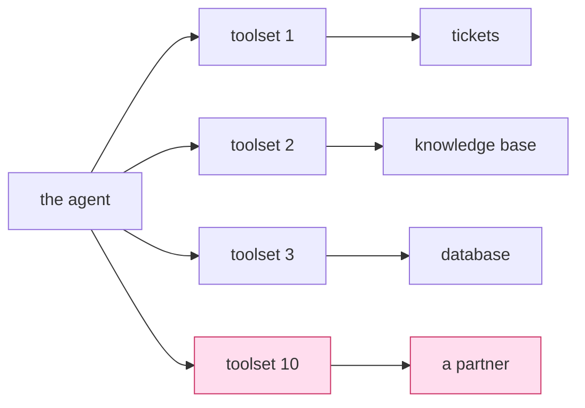

# 6.2 — Ten servers, ten clients

## One-line answer

One client per server is an isolation guarantee, not an implementation detail — so a host with ten
servers has ten independent failure domains, and the work of production MCP is making sure the tenth
one being broken does not stop the other nine.

## The story

The caretaker opens ten shutters every morning and he does them in the same order every day.

Nine of them are fine. The tenth, the one at the far end, has a lock that has been going for months:
you have to lift the shutter slightly while you turn, and if you get it wrong the key jams and you
have to work it back out. On a good day it costs him a moment. On a bad day it costs him five
minutes, and there is a small crowd waiting at the far end wondering why nothing has opened.

The thing that makes this worse than it needs to be is the order. He does them one to ten, so the bad
lock is last and everything else is open by the time he reaches it. When the new man does the round he
starts at the far end, because it is nearest the gate — and on a bad morning nothing in the building
opens until that one lock gives, including the nine shutters with nothing wrong with them.

Same ten shutters, same one bad lock, two completely different mornings. Nobody fixed anything and
nobody broke anything. The difference is entirely in whether one slow thing is allowed to hold up nine
fast ones.

## The idea in plain language

[Day 32's 1.2](../../../day-32-mcp-stateless-core/parts/01-the-socket/1.2-host-client-server.md)
stated the rule: one client per server, always. Talk to three servers and the host holds three
clients, with separate lifecycles, separate capabilities and separate failures.

Today that rule stops being a diagram and becomes an object count. Each `McpToolset` is one client,
which means each one is:

- **one connection or one child process** — memory, file handles, a slot in a pool
  ([1.5](../01-the-connector/1.5-somebody-has-to-give-it-back.md));
- **one `tools/list` round trip** per listing, or one cache entry with its own TTL
  ([1.3](../01-the-connector/1.3-before-the-model-sees-a-tool.md));
- **one allowlist** that somebody had to decide
  ([1.4](../01-the-connector/1.4-the-allowlist-is-an-argument.md));
- **one failure domain** that can be down, slow, or lying, independently of the others.

The first three are costs and they scale linearly, which is fine and predictable. The fourth is the
one that changes the shape of your code, because linear cost is a budget problem and an independent
failure domain is a design problem.

The design problem has a specific name and it is worth using it: **`get_tools()` is on the critical
path of every turn.** ADK asks each toolset in `tools=[...]` what it offers before the model is
called. Ten toolsets, ten listings, and the slowest of them sets the floor for how long the turn takes
— because a list of tools is not a partial thing. Either the model is told about a server's tools or
it is not.

Which leads to the decision this part exists to make you make: **when server ten is down, does the
agent answer with nine servers' tools, or does the turn fail?** Both are defensible. What is not
defensible is not having decided, because the default — an exception propagating out of a listing —
picks "the turn fails" for you, silently, on behalf of every server you ever add.

## Why Sutra needs it

Because Sutra ends this phase with several servers and the number only goes up.

By Day 45 the desk plausibly holds `sutra-mcp` for tickets and the knowledge base (Day 34), a database
server (Day 39), a partner or registry server from
[Day 32's 4.2](../../../day-32-mcp-stateless-core/parts/04-governance-and-registry/4.2-the-registry-queried-live.md),
and the agent-as-server from Day 42. That is four failure domains before anybody has asked for
anything unusual, and three of them are outside this repository.

`sutra/mcp/client.py` is where the plural lives. Its three functions are singular by design —
`connect_stdio`, `connect_http`, `list_tools` each deal with one server — and the `TODO(me)` in the
hub asks you to decide what sits above them: a registry of server records, how they are built, whether
they are listed concurrently, and what happens when one of them will not answer. Days 40, 44 and 45
all assume that decision exists.

## The mechanism

Ten clients, one host, and the property that makes them independent:



No arrow joins two servers, and none joins two toolsets. The red pair can fail entirely without the
others knowing, which is the guarantee — and the same isolation means nothing shares a cache, a
connection pool or a retry budget either.

The listing, done the way that respects it:

```python
import asyncio


async def list_all(toolsets: dict[str, McpToolset]) -> dict[str, list[str] | None]:
    """Tool names per server, concurrently. A server that fails contributes None."""

    async def one(name: str, toolset: McpToolset) -> tuple[str, list[str] | None]:
        try:
            return name, [tool.name for tool in await toolset.get_tools()]
        except Exception:
            log.exception("mcp.list_tools failed", extra={"server": name})
            return name, None

    pairs = await asyncio.gather(*(one(n, ts) for n, ts in toolsets.items()))
    return dict(pairs)
```

**Line by line:**

- `asyncio.gather` runs the listings **concurrently**, so ten servers cost the slowest one rather than
  the sum of ten. Sequentially, ten servers at a fifth of a second each is two seconds before the
  model has been asked anything; concurrently it is a fifth of a second.
- The servers are a `dict[str, McpToolset]` keyed by a name you chose, not a list. Every log line,
  every metric and every error in this system needs to say *which server*, and a positional index in a
  list is not an answer anybody can act on.
- `except Exception` here is the one place in this curriculum where a broad catch is right, and it is
  right for a reason worth stating: the alternative is that one server's failure removes nine
  servers' tools from the turn. Principle 10 says errors surface — and they do, in the
  `log.exception` line, with the server named. What does not happen is the error deciding the fate of
  unrelated work.
- Returning `None` rather than `[]` matters. An empty list means "this server offers no tools", which
  is a real and different state from "this server did not answer". Collapsing the two makes an outage
  indistinguishable from a configuration change.
- `gather` without `return_exceptions=True` is correct here **because** each task already catches its
  own. If the inner `try` were removed, one failure would cancel the gather and you would be back
  where you started.
- What this function deliberately does not do is decide what happens next. It reports; the caller
  decides whether a `None` is tolerable. That is the decision from the previous section, kept in one
  place instead of scattered.

## When it breaks

The break is the default, and the default is sequential and fail-fast. Attach ten toolsets to an
agent, let the framework list them one after another, and the two failures arrive together.

**The slow one sets the floor.** Every turn waits for the slowest listing, every time, including turns
where the model was never going to use that server. With `tool_list_cache_ttl_seconds` unset
([1.3](../01-the-connector/1.3-before-the-model-sees-a-tool.md)) that is a full round trip per server
per turn, and the arithmetic is unforgiving: the cost is per turn, not per conversation.

**The broken one takes everything.** A server whose command is missing raises the `ConnectionError`
from [5.2](../05-failure-lab/5.2-the-spanner-not-in-the-boot.md), and if that propagates out of the
listing, the turn fails:

```text
ConnectionError: Failed to create MCP session: Failed to create MCP session: [WinError 2] The system cannot find the file specified
```

Nine healthy servers, one bad string in configuration, and the agent can do nothing at all. The user's
experience is total, and the message names none of the ten.

There is a third break that only shows up once several servers are real, and it is not a failure of
any of them. Two servers advertise a tool with the same name — `search`, or `query`, or `get_status`
— and after the per-toolset sort in
[1.3](../01-the-connector/1.3-before-the-model-sees-a-tool.md) the model is looking at two identical
names with different descriptions. Nothing errors. The model picks one, sometimes the wrong one, and
the symptom is an agent that is intermittently confused about which system it is talking to.
`tool_name_prefix` on `McpToolset` is the argument that fixes it, and it is the reason that argument
exists.

## In production

**What a professional writes instead:** a server registry — one record per server holding a name, the
transport, the command or URL, the allowlist, the cache TTL and who approved it — plus a builder that
turns records into toolsets and a listing function like the one above. Every log line and metric
carries the server name from that record. It is not a framework; it is a dictionary and two functions,
and it is the difference between "MCP is slow" and "server four is slow".

**What degrades at scale:** everything, linearly, which is manageable — and then one thing
non-linearly, which is not. The non-linear one is the tool list itself. Ten servers offering eight
tools each is eighty tool descriptions in the prompt on every turn, and
[Day 19](../../../day-19-context-engineering-selection/LESSON.md) already showed what a crowded
context costs in both tokens and accuracy. Beyond a certain point the answer is not a bigger allowlist
but choosing which servers are attached for *this* agent, which is why `tool_filter` accepts a
predicate that sees the context and not only a fixed list.

**The failure mode that only appears with real traffic:** the shared retry budget that is not shared.
Each toolset retries independently, so one server having a bad afternoon produces its own retries, its
own timeouts, and its own share of every turn's latency — and because the domains are isolated,
nothing in the system notices that one of ten is responsible for most of the wall clock. The counter
that makes this visible is per-server latency, and it does not exist unless somebody names the servers
first.

**The review comment a senior engineer leaves:** *"we now attach five toolsets and list them
sequentially with no error handling, so every turn costs the sum of five round trips and any one of
them being down is a total outage. Gather them, catch per server, and log which one failed — right
now an incident tells us 'MCP is broken' and we have to guess which of five."*

**The interview question:** *"you have ten MCP servers attached to one agent. What breaks first?"*
The answer that shows scale experience rather than a tutorial: *"Latency and blast radius, in that
order. MCP is one client per server, which is a real isolation guarantee — separate connections,
separate caches, separate failures — but listing tools is on the critical path of every turn, so
sequential listing makes every turn cost the sum of ten round trips and the slowest server sets the
floor. Gathering them concurrently fixes that. The bigger one is that a single failing server, by
default, raises out of the listing and takes the whole turn down, so nine healthy servers become
useless because of one bad command string. We catch per server, report a null rather than an empty
list so an outage is distinguishable from a server with no tools, and decide explicitly whether the
turn degrades or fails. And the thing nobody expects: at ten servers you start getting duplicate tool
names across servers, which does not error at all — the model just picks the wrong one — so tool name
prefixes stop being cosmetic."*

## Check yourself

```bash
uv run python days/day-33-client-and-transports/lab/leak.py
```

Two toolsets in one process, two independent servers, two separate `[fake-desk]` conversations in the
transcript. Trace which lines belong to which, and notice that neither could have interfered with the
other.

**Out loud, without scrolling up:** say what one client per server buys you and what it costs you at
ten servers, and give the decision that has to be made explicitly before the tenth server is added.

**Next:** back to the hub, [`LESSON.md`](../../LESSON.md), for the build brief — `sutra/mcp/client.py`
is yours to write, and its `TODO(me)` markers are the decisions this day has set up.
