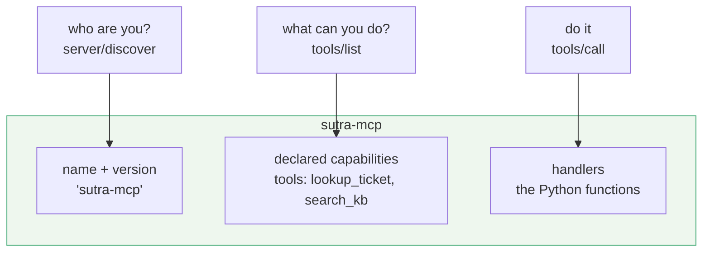

# 1.1 — Three things and no fourth

## One-line answer

An MCP server is exactly three things — a name it answers to, a list of what it can do, and the
code that does it — and the interesting part of that sentence is everything it leaves out.

## The story

A driving school opens two streets away from you.

There is a board over the door with the school's name on it and a licence number underneath, in
smaller type. Taped inside the window is a printed sheet: three courses, what each one covers, what
each one costs. Behind that, in the yard, are two cars and the instructors who drive them.

That is the whole business. Somebody walking past can read the board to know who they are dealing
with, read the sheet to know what is on offer, and walk in to actually get it. Three things, and
they map cleanly onto three questions a stranger has: *who are you*, *what do you do*, and *do it*.

Notice what is not there. There is no register at the door recording who came in on Tuesday, no
membership card you have to be issued before you are allowed to read the sheet, and nobody who has
to remember your face from last week for today's lesson to work. You could walk in for the first
time and be taught. You could send a friend instead of coming yourself, and the friend would be
taught the same thing.

If the school did keep such a register, and the lesson only worked because a particular receptionist
remembered you, then opening a second branch would break it — because the second branch has a
different receptionist and a different register.

## The idea in plain language

Three words first, because the rest of the day leans on all three.

An **MCP server** is a program that offers capabilities over the Model Context Protocol. It is not
a web server and it does not have to listen on a port; a server in this sense is a *role*, not a
deployment shape. A server can be a child process on your own laptop reading its own standard input.
[Day 32's 1.2](../../../day-32-mcp-stateless-core/parts/01-the-socket/1.2-host-client-server.md)
drew the three roles — host, client, server — and this day is spent entirely inside the third.

A **capability** is something the server declares it can do, in a form the caller can read without
being told by a human: tools, resources, prompts. Today you build only tools;
[Day 35](../../../day-35-resources-and-prompts/) adds the other two.

A **handler** is the code that runs when a request arrives. `lookup_ticket`'s handler is the Python
function that reads a dictionary and returns a string. It is the only part of a server that does
work; everything else is description.

Put those together and a server is:

| The driving school | An MCP server | What the caller does with it |
| --- | --- | --- |
| the board over the door | the server's **name** and version, reported as `serverInfo` | tells one server from another in a log, a menu, or an audit |
| the printed sheet in the window | the **declared capabilities**, and inside them the tool list | decides what it can ask for, before asking for anything |
| the cars and the instructors | the **handlers** | actually gets a ticket looked up |

And now the part that is easy to say and hard to internalise: **there is no fourth thing.** No
session store. No connection registry. No table of who has introduced themselves. A 2026-07-28
server is defined by what it *refuses* to keep as much as by what it offers, and the specification
says so in a single sentence
(`https://modelcontextprotocol.io/specification/2026-07-28/basic/index`, read 2026-09-04):

> *"The Model Context Protocol (MCP) is a **stateless protocol**: all the information needed to
> process a request is contained in the request itself. A server processes each request
> independently; no state should be inferred from previous requests, even those on the same
> connection or stream."*

That is the whole architecture of the thing you are about to write, stated before you write a line
of it.

## Why Sutra needs it

Because `sutra_mcp/` has been an empty package since Day 0, and today it stops being empty.

Sutra's two tools — `lookup_ticket` and `search_kb` — have been ordinary Python functions in
`sutra/loop.py` since Day 3. They work. Nothing outside Sutra's own process can call them. Today
they get a name over the door and a sheet in the window, and from tonight any MCP host on your
machine can ask Sutra's ticket archive a question without importing a single line of Sutra's code.

The three-things framing is also the reason six later days can share one file. Day 35 adds
resources and prompts, Day 36 adds long-running tasks, Day 37 adds authorisation, Day 41 adds
capability declarations, Day 42 exposes the whole desk agent and Day 43 makes it deployable. Every
one of those is *another capability declared on the same server object*, and none of them is a
fourth kind of thing. [1.2](1.2-a-server-you-build-not-one-that-runs.md) is where that shape gets
built, and [1.4](1.4-the-shape-later-days-register-into.md) is where it is laid out as files.

## The mechanism

Three things, and the request that touches all of them:



Three questions, three answers, and nothing in the picture remembers that the three arrived
together. A client may ask only the third.

In code, the smallest server that is genuinely a server:

```python
# days/day-34-building-sutra-mcp-tools/lab/serve.py  (extract)
from mcp.server.fastmcp import FastMCP

server = FastMCP(
    "sutra-mcp",
    instructions="Read-only access to the Sutra support desk's ticket archive "
    "and knowledge base. Look a ticket up first, then search the "
    "knowledge base with the symptom words from its body.",
    stateless_http=True,
)


@server.tool()
def lookup_ticket(ticket_id: str) -> str:
    """Fetch the full text of one support ticket by its id."""
    return TICKETS.get(ticket_id.strip(), f"No ticket with id {ticket_id!r}.")
```

**Line by line:**

- `from mcp.server.fastmcp import FastMCP` — `FastMCP` is the SDK's ergonomic server class, and it
  is the one that exists in the version this repository pins. Read out of
  `.venv/Lib/site-packages/mcp/server/fastmcp/__init__.py` on 2026-09-04, where `__all__` is
  `["FastMCP", "Context", "Image", "Audio", "Icon"]`. There is a lower-level `Server` underneath it,
  exported from `mcp.server`, and nothing in this day needs it: `FastMCP` is a thin layer over that
  class and every method you call passes straight through.
- `FastMCP("sutra-mcp", ...)` — the first positional argument is the name, and it is the board over
  the door. [1.3](1.3-the-name-is-an-identity.md) is entirely about why that string is harder to
  change than it looks.
- `instructions=` — free-text guidance the server returns to a client that asks who it is. It is
  advice for the model on the other side, not for a human reading your repository, so it says *use
  the ticket first, then the knowledge base* rather than *this is the Sutra MCP server*.
- `stateless_http=True` — in `mcp==1.29.1` statelessness is still a constructor flag, because this
  SDK was written against the revision before the one that made it the architecture. Passing it is
  how you write today's server in the shape tomorrow's protocol assumes.
  [5.3](../05-lifecycle/5.3-building-for-the-revision-you-are-not-on.md) is the whole story of that
  gap.
- `@server.tool()` — the decorator that turns a plain function into a declared capability. It reads
  the type hints and the docstring and writes the JSON Schema for you, which is
  [2.2](../02-function-to-declaration/2.2-the-schema-is-all-they-get.md)'s subject.
- The function body is unchanged from `sutra/loop.py`. That is the point of the day and it is worth
  saying out loud: **crossing the boundary did not change the work.** It changed who may ask for it.
- **Zero model calls.** Building a server object costs nothing; it does not even open a socket.

## When it breaks

The break at this level is importing the wrong thing, and the error is unhelpfully generic:

```text
Traceback (most recent call last):
  File "<string>", line 1, in <module>
ImportError: cannot import name 'MCPServer' from 'mcp.server' (C:\...\mcp\server\__init__.py)
```

`MCPServer` is the class name used by the 2.x line of the SDK, published after this repository's pin
was made. It does not exist in `mcp==1.29.1`. Anything written against the newer SDK will fail on
this exact line, and the fix is not to invent a shim: it is to know which SDK you have. One command
answers it:

```bash
uv run python -c "import mcp; from importlib.metadata import version; print(version('mcp'))"
```

That printed `1.29.1` on 2026-09-04. The class you import is `FastMCP`, from
`mcp.server.fastmcp`, and every listing in this day is written against it.

## In production

**What a professional writes instead:** the same three things, with the fourth one absent on
purpose and a comment saying so. A real server module names its identity once, registers its
capabilities in one function per capability kind, and holds no module-level mutable state. If you
find a dictionary at module level that a handler writes to, you have grown a session by accident,
and [Day 32's 3.4](../../../day-32-mcp-stateless-core/parts/03-headers-and-caches/3.4-state-that-travels-in-the-payload.md)
already explained what that costs when you run more than one copy.

**What changes at scale:** nothing about these three things, and that is the property you are buying.
Three copies of a server whose entire definition is a name, a declaration and some pure handlers are
indistinguishable to a caller, so a dispatcher can send any request to any of them. The moment a
fourth thing appears, that stops being true and you are back to pinning callers to instances.

**The failure mode that only appears with real traffic:** a handler that caches "for performance" —
a dictionary keyed by ticket id, filled on first read. On one instance it is a speed-up. On three
instances behind one address it is three different views of the archive, and the bug reports say
*"the ticket updates sometimes and sometimes not"*, which is the hardest sentence in support to act
on.

**The review comment a senior engineer leaves:** *"this module has a `_last_caller` dict at the top
and a handler that writes to it. That is a session with no name. Delete it, or put whatever it is
holding into the tool's arguments so the next request carries its own context."*

**The interview question:** *"what is an MCP server, minimally?"* The honest answer: *"a name, a set
of declared capabilities, and handlers — and under the 2026-07-28 revision, deliberately nothing
else. The specification says the protocol is stateless and no state may be inferred from previous
requests, so the server has no session store and no connection registry. That is what lets three
copies of it stand behind one address and answer each other's traffic. If I found per-caller state
in one, I would treat it as a scaling bug, not a feature."*

## Check yourself

```bash
uv run python -c "from mcp.server.fastmcp import FastMCP; s = FastMCP('sutra-mcp'); print(s.name)"
```

It prints `sutra-mcp` and exits. Nothing listened on a port, nothing was launched, and no request
was answered — you built the object, that is all.

**Out loud, without scrolling up:** name the three things an MCP server is, and say what the fourth
thing would be and why the 2026-07-28 revision refuses it.

**Next:** [1.2 — A server you build, not one that runs](1.2-a-server-you-build-not-one-that-runs.md).
