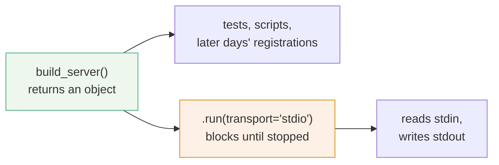

# 1.2 — A server you build, not one that runs

## One-line answer

Building a server and starting a server are two separate acts, so `build_server()` returns a fully
configured object that has not listened to anything — which is what lets every test, every later
day and every deployment shape pick it up and do something different with it.

## The story

The generator arrives in the yard on a Thursday.

Two people bolt it to a concrete pad, run the cable into the house, connect the earth, fill the
tank and hang the manual on a nail. Then they go home. The generator has not made one watt of
electricity and nothing is wrong: it is installed.

The first Saturday of every month you go out and press the start button. It runs for a quarter of
an hour, the lights stay on, and you switch it off again. On the day the power actually goes, a
neighbour who does not know your house presses the same button and gets the same result.

Now imagine it had been sold differently — the delivery van drops it, it starts the moment it
touches the ground, and the only way to have one in your yard is to have one running. You could
never check the oil. You could never test it on a quiet Saturday. You could not have a spare in
the shed, because a spare would be roaring away in the shed. Every sensible thing you do with a
generator depends on the fact that owning one and running one are two different states.

## The idea in plain language

A **constructor** is code that assembles an object and hands it back. `FastMCP("sutra-mcp")` is a
constructor call: it makes an object in memory that knows its own name and holds a registry of the
tools you attach to it. It opens no file, binds no port, and speaks to nobody.

A **transport** is the channel a server actually talks over. Day 33 met the two live ones —
[stdio](../../../day-33-client-and-transports/parts/02-stdio/2.1-connecting-is-launching.md), where
the server is a child process reading its own standard input, and Streamable HTTP, where it answers
POSTs at one URL. Choosing a transport and beginning to read from it is **starting** the server, and
it is a completely different act from building one.

The convention this day uses everywhere is a function named `build_server()`:

- it takes no arguments and returns the configured server object;
- it is safe to call in a test, in a script, in another server, and twice in one process;
- it never blocks, never reads standard input, and never prints anything.

Starting happens in exactly one place — the bottom of the module, under a guard that only fires
when the file is run as a program:

```python
if __name__ == "__main__":
    build_server().run(transport="stdio")
```

**Line by line:**

- `if __name__ == "__main__":` — Python sets `__name__` to `"__main__"` in the file you launched and
  to the module's dotted name in every file you *imported*. So this branch runs when a host launches
  your server and does not run when a test imports it. Without the guard, `import sutra_mcp.server`
  would block forever inside somebody's test suite, reading standard input that nobody is writing to.
- `build_server()` — the object is assembled here, at start time, not at import time. Nothing about
  the server exists before this line runs, which is why importing the module is cheap and quiet.
- `.run(transport="stdio")` — the one call that turns a configured object into a running process.
  It does not return until the server stops.

## Why Sutra needs it

Because eight files across seven days all want the same server object and every one of them wants
something different done with it.

- The lab scripts in this day — `schema.py`, `drive.py`, `cacheable.py`, `both.py` — call
  `build_server()` and inspect the result. None of them starts a server, and none of them can
  afford to.
- Days 35, 36, 37, 41 and 42 add capabilities by registering into the object *after* it is built.
  [1.4](1.4-the-shape-later-days-register-into.md) lays that out.
- Day 43 needs the built object handed to a web framework instead of to `run()`, because a deployed
  server is started by the platform, not by your `if __name__` block.
- The day's own gate, `lab/gate.py`, imports `build_server` and asks the object questions. A server
  that could only be started could only be tested by launching a process and talking to it over a
  pipe, which is a slow, flaky test for a fast, certain question.

If `build_server()` started the server, every one of those would be impossible in the same way the
running generator is impossible to check the oil on.

## The mechanism

Two functions, and only one of them blocks:



Here is the whole of `lab/serve.py`'s structure, with the bodies left out so the shape is visible:

```python
# days/day-34-building-sutra-mcp-tools/lab/serve.py  (structure)
from mcp.server.fastmcp import FastMCP

TICKETS = {...}
KB = {...}


def build_server() -> FastMCP:
    """Return a configured server. Building one must never start one."""
    server = FastMCP("sutra-mcp", instructions="...", stateless_http=True)
    register_tools(server)
    return server


def register_tools(server: FastMCP) -> None:
    """Attach this module's tools to a server."""
    ...


if __name__ == "__main__":
    build_server().run(transport="stdio")
```

**Line by line:**

- `def build_server() -> FastMCP:` — no arguments. Anything the server needs to know is either a
  module constant or something a later day will pass to `register_*`. A `build_server(port=…)`
  signature is a small mistake with a long tail: it drags deployment concerns into the one function
  that six other days want to call.
- `-> FastMCP` — the return type is the object, not `None`. A `build_server()` that returns nothing
  is a `start_server()` with a misleading name.
- `register_tools(server)` — building is where registration happens, so the object that comes back
  is complete. A caller never has to remember a second step.
- `return server` — the last line, and the only line that matters to a caller.
- `if __name__ == "__main__":` — the guard. Everything above it is importable; this one line is not.
- `.run(transport="stdio")` — read from the SDK on 2026-09-04:
  `run(self, transport: Literal["stdio", "sse", "streamable-http"] = "stdio", mount_path: str | None = None) -> None`,
  whose docstring says *"Note this is a synchronous function."* Inside, `stdio` becomes
  `anyio.run(self.run_stdio_async)`. It is a blocking call that owns the thread.

And here is what "building costs nothing" means, measured rather than asserted:

```bash
uv run python -c "
from mcp.server.fastmcp import FastMCP
a = FastMCP('sutra-mcp')
b = FastMCP('sutra-mcp')
print(a is b, a.name, b.name)
"
```

**Line by line:**

- Two constructor calls in one process, both succeeding. If building a server acquired anything —
  a port, a lock, standard input — the second call would fail or the first would be broken.
- `a is b` prints `False`: they are two independent objects with the same name. Nothing global was
  touched.
- **Zero model calls, zero network, no process launched.**

That printed `False sutra-mcp sutra-mcp` on 2026-09-04.

## When it breaks

The break is calling `run()` somewhere that is already running, which is what happens the first
time you try to start a server from inside an `async def` — a test, a notebook cell, a web
framework's startup hook:

```text
  File "...\days\day-34-building-sutra-mcp-tools\lab\_tmp_t1.py", line 7, in main
    build_server().run(transport="stdio")
  File "...\.venv\Lib\site-packages\mcp\server\fastmcp\server.py", line 300, in run
    anyio.run(self.run_stdio_async)
  File "...\.venv\Lib\site-packages\anyio\_core\_eventloop.py", line 62, in run
    raise RuntimeError(f"Already running {asynclib_name} in this thread")
RuntimeError: Already running asyncio in this thread
```

Read the middle frame, because it is the one that explains the message. `run()` is not asynchronous;
it *starts* an event loop with `anyio.run(...)`. A thread may only have one, so calling it from
inside a coroutine is asking for a second one.

The fix is never to wrap it. It is to use the asynchronous entry point instead —
`await server.run_stdio_async()` — or, far more often, to realise you did not want to start a
server at all: you wanted the built object, and `build_server()` already gave it to you.

The second break has no error text at all, which is why it is worse. Move `build_server().run(...)`
out from under the `if __name__` guard and to the module's top level. Now `import sutra_mcp.server`
blocks forever. Your test suite hangs on collection with no failure, no traceback and no output,
and the only clue is that it never finishes. `lab/gate.py` checks the quiet half of this by
importing your module in a subprocess and failing if anything was written to standard output.

## In production

**What a professional writes instead:** exactly this, plus a factory that takes its configuration
as arguments — `build_server(settings: Settings) -> FastMCP` — once there is configuration worth
passing. The rule that survives is that the function returns and does not block. In a deployed
service the `if __name__` block is usually dead code: the platform imports your module and calls
something else entirely, which only works because building is separable.

**What degrades at scale:** nothing about building, and that is the property. Because the object is
cheap and independent, a process can hold one per tenant, a test suite can build a hundred, and a
deployment can build one per worker. The moment `build_server()` acquires a shared resource — opens
a database connection, binds a port, reads a file handle — those three things stop being free and
you have quietly made the constructor a lifecycle.

**The failure mode that only appears with real traffic:** a `build_server()` that does real work at
build time, such as loading a large index, called once per request by a framework that treats it as
a request handler factory. In development there is one request and it is fast. In production the
same code loads the index thousands of times, memory climbs, and the profile blames a function
nobody thought was on the hot path.

**The review comment a senior engineer leaves:** *"`server.run()` is at module scope. That means
importing this file starts a server, so anything that imports it — a test, a linter that imports to
check symbols, another module that only wanted `TICKETS` — hangs with no error. Put it under
`if __name__ == '__main__':` and keep `build_server()` as the only thing anyone imports."*

**The interview question:** *"why does your server module have a `build_server()` function instead
of just constructing the server at the top?"* The honest answer: *"because construction and startup
are different lifecycles and only one of them blocks. Building returns an object that tests and
later modules can inspect and register into; starting takes over the thread and owns standard
input. Keeping them apart means importing the module is free and quiet, and it means the deployed
version can hand the built object to a web framework rather than to `run()`. It also removes a
whole class of bug where importing a file accidentally starts a process."*

## Check yourself

```bash
uv run python days/day-34-building-sutra-mcp-tools/lab/schema.py
```

That script imports `build_server` from `serve.py` and prints both tool declarations. Find the
`if __name__ == "__main__":` line in `serve.py` and say why running `schema.py` did not start a
server even though it imported the file that can start one.

**Out loud, without scrolling up:** name the two acts this part separates, say which one blocks, and
say what happens to a test suite that imports a module whose `run()` call is at the top level.

**Next:** [1.3 — The name is an identity](1.3-the-name-is-an-identity.md).
